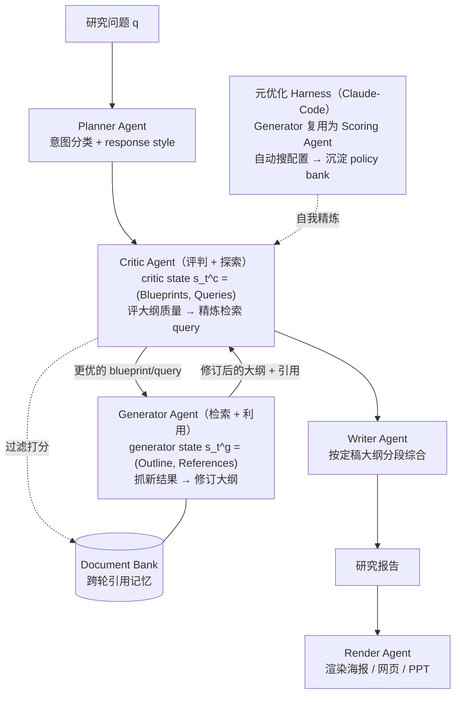

# AgentDisCo（小红书）：把开放式深研拆成"探索 vs 利用"的解耦 + 对抗协作

**📄 [AgentDisCo: Towards Disentanglement and Collaboration in Open-ended Deep Research Agents](https://arxiv.org/abs/2605.11732)**

2026-04（v2 2026-06）· 小红书 Xiaohongshu Inc. · [项目主页](https://agentdisco-project.github.io/)

**一句话**：小红书提出的开放式深研框架，把通常揉进一个模块的"搜什么（探索）"和"怎么把搜到的写成报告（利用）"显式拆成 **Critic / Generator 两个会对抗又协作的 agent**，再用一层 **Claude-Code 驱动的元优化 harness** 自动调 agent 配置、沉淀可复用的 policy bank——不训练底座，纯在强通用模型上做编排与自优化。

::: details 📖 论文原文 Abstract（英文）
Open-ended deep research agents have emerged as a promising paradigm for autonomously performing comprehensive information gathering and synthesis. However, existing approaches typically integrate information **exploration** and **exploitation** into a single unified module—such as an outline generator or a report generator—thereby limiting their flexibility and optimization potential. In this paper, we introduce **AgentDisCo**, a novel **Dis**entangled and **Co**llaborative agentic architecture that formulates deep research as an adversarial optimization problem between information exploration and exploitation. Specifically, a **critic agent** is optimized to evaluate and critique the generated outlines (serving as information exploitation states) and subsequently **refine the search queries (serving as information exploration states)**, while a **generator agent** is optimized to retrieve updated search results based on the refined search queries (serving as information exploration states) and accordingly **update the generated outlines (serving as information exploitation states)**. The resulting outline, progressively refined through iterative adversarial optimization, is subsequently delivered to a downstream report writer module. The above agentic workflow can be optimized through either handcrafted or automatically discovered design strategies by constructing a **meta-optimization harness** over the adversarial optimization loop, where the generator agent originally tasked with producing target outlines is repurposed as a scoring agent. Concretely, powerful code-generation agents—such as Claude-Code or Codex—are employed to systematically explore the space of agent configurations and automatically construct a **policy bank**, a structured repository of reusable and composable design strategies. We evaluate AgentDisCo on three widely adopted deep research benchmarks—DeepResearchBench, DeepConsult, and DeepResearchGym—with Gemini-2.5-Pro as our base model, demonstrating performance comparable to or surpassing that of leading closed-source deep research agents. Furthermore, we introduce **GALA** (**G**eneral **AI** **L**ife **A**ssistants), a novel benchmark constructed via an agentic workflow that automatically mines latent deep research interests from users' historical browsing behavior. We further develop a **rendering agent** capable of transforming structured research reports into visually rich (rednote-style) poster presentations, and construct a product demonstration—"AutoResearch Your Interest". We publicly release our benchmark, code, demo, and evaluation harness.
:::

**相关**：[Deep Research 总览](/agent/deep-research/) · [STORM / Co-STORM](/agent/deep-research/storm) · [Step-DeepResearch](/agent/deep-research/step-deepresearch) · [Tongyi DeepResearch](/agent/deep-research/tongyi-deepresearch) · [DR-Rubric](/agent/deep-research/dr-rubric) · [多智能体](/agent/multi-agent)

> 图源：Jin et al.（小红书）, *AgentDisCo: Towards Disentanglement and Collaboration in Open-ended Deep Research Agents*（arXiv:2605.11732）Figure 1——三种深研范式对比，(c) 为 AgentDisCo 的解耦+协作设计（用于学习注解，版权归原作者）。

## 动机与创新点：search query 与 outline 被揉成一团，AgentDisCo 把"探索 vs 利用"解耦

大多数开放式 deep research agent 把"**去发现新信息**"和"**把已有信息组织成报告**"塞进同一个模块、由同一个循环顺手做掉——要么是"大纲生成器顺带产搜索 query"（上图 a），要么是"报告生成器顺带产搜索 query"（上图 b）。AgentDisCo 指出这是一个**结构性瓶颈**："existing deep research agents entangle **information exploitation**—the generation of structured outlines or reports—with **information exploration**—the planning and generation of search queries—into a single, undifferentiated module, fundamentally lacking any guarantee of informational incrementality"。揉在一起带来两个具体问题：

- **探索（exploration）** 关心"还缺什么、该往哪搜"——目标是把信息覆盖面铺开、补上知识缺口，要**发散**。
- **利用（exploitation）** 关心"现有材料怎么剪裁、组织成有论点的好报告"——目标是收敛、求质量，要**收敛**。

这两件事优化方向天然冲突；揉在一起时 agent 往往要么搜得多但组织乱、要么报告顺但覆盖浅，且很难针对性调优。第二个痛点是**反馈信号缺失**：现有大纲迭代循环让 LLM 反复精炼大纲却"without explicit optimization objectives"，模型不知道大纲哪块够好、哪块该补，于是"oscillates between over-revision and under-revision without convergence"——在过度修订与修订不足之间反复横跳、不收敛。

AgentDisCo 的核心主张是：**把探索与利用解耦成独立组件，让它们以对抗 + 协作的方式互相校正**。关键的工程取舍是——**迭代优化作用在中间的"大纲（outline）"上，而不是最终报告上**，因为"outline-level representations offer greater structural flexibility and are more amenable to effective context management"（大纲层粒度更灵活、更好做上下文管理）。

**关键创新**：

- **解耦 + 协作的双 agent 架构**：把深研建模为探索与利用之间的**对抗优化问题**，由 **Critic agent（评判+探索）** 和 **Generator agent（检索+利用）** 在一个动态 critic-generator 循环里交替更新，逐步把大纲推向"覆盖全、有依据、结构清"。
- **自进化的元优化 harness**：在对抗循环外套一层 **meta-optimization harness**，把原本产大纲的 generator **复用成打分 agent（scoring agent）**，用 **Claude-Code** 这类代码生成 agent 系统性搜索 agent 配置，自动沉淀一个可复用的 **policy bank**——把"调 agent"本身也变成可自动化、可积累的过程，几乎不要人工。
- **面向真实生活需求的 GALA 基准**：现有基准（DeepResearchBench/DeepConsult/DeepResearchGym）扎堆在学术、金融咨询等专业域；GALA 从 1 万+ 小红书活跃用户的浏览/评论历史里**挖掘潜在深研兴趣**，主题分布偏家居、旅行、美妆等真实生活场景，填补"日常信息需求"评测的空白。
- **多模态渲染 agent + 产品落地**：配一个把结构化报告转成小红书风格海报/网页/PPT 的 render agent，并做出端到端产品 demo **"AutoResearch Your Interest"**（自动研究你感兴趣的话题）。

## 方法：双 agent 协作 MDP + 元优化 harness + policy bank

整套系统是一条流水线：**Planner（意图分类） → Critic/Generator 对抗优化大纲 → Writer 综合成稿 → Render 渲染海报**。下图给出从"挖用户兴趣 → 出报告 → 出海报"的全貌——这也是 GALA 基准与 "AutoResearch Your Interest" 产品的底座。

> 图源：Jin et al.（小红书）, *AgentDisCo*（arXiv:2605.11732）Figure 2——全流程架构与应用：从挖掘用户潜在深研需求到产出报告与海报（用于学习注解，版权归原作者）。

### 把深研建模为"探索 vs 利用"的双 agent 协作 MDP

AgentDisCo 把这套解耦交互**形式化为一个双 agent 协作 MDP**：

$$\mathcal{M} = \langle \mathcal{S}^c, \mathcal{S}^g, \mathcal{A}^c, \mathcal{A}^g, \mathcal{P}, \mathcal{R}, T \rangle$$

时刻 $t$ 的联合状态 $s_t = (s_t^c, s_t^g)$ 由两半组成，对应被解耦的两件事：

- **Generator state（信息利用态）** $s_t^g = (O_t, R_t)$：当前**大纲 $O_t$** 加上挂在它身上的**引用集合 $R_t$**——这是"已经组织好的成果"。
- **Critic state（信息探索态）** $s_t^c = (B_t, Q_t)$：一组 **blueprints $B_t$** 加上配套的**搜索 query $Q_t$**。每条 blueprint "specifies a key point that the final report should cover"（指定报告该覆盖的一个要点），每个要点都配一串"dedicated to filling its information gap"的检索 query——blueprint 把"还缺什么"显式写出来，让检索严格对齐报告的预期范围。

**两个 agent 顺序行动、critic 先动**。系统初始化 $s_0^g = (\varnothing, \varnothing)$（空大纲、空文档池），critic 仅看 query $q$ 做粗分解、产出初始 blueprint 集 $s_0^c \sim \pi^c(\cdot \mid q, \varnothing, \varnothing)$。此后每轮：

$$s_t^c \sim \pi^c(\cdot \mid q, s_{t-1}^g, s_{t-1}^c) \quad\text{（critic 评当前大纲完整性、出新 blueprint）}$$
$$s_t^g \sim \pi^g(\cdot \mid q, s_{t-1}^g, s_t^c) \quad\text{（generator 执行 query、抓证据、修订大纲与引用）}$$

环境转移是**确定性**的——"each agent's output directly instantiates the corresponding component of the next joint state"，所以轨迹里全部随机性都来自两个 agent 的策略本身。一条交互轨迹 $\tau = \{q, s_0^c, s_0^g, s_1^c, s_1^g, \cdots\}$ 的似然可写成 critic 策略 × generator 策略的连乘（论文 Eq. 2），并进一步把"策略"与"退化的环境转移"拆开，**显式标出可以注入学习信号的位置**。

**对抗但对齐：minimax 式协作。** 两个 agent 每一轮的角色"functionally adversarial, jointly forming a minimax-style yet cooperative loop"：critic $\pi^c$ 对抗性地"探"——挖 generator 当前大纲的缺漏、提新 blueprint，把探索往外推；generator $\pi^g$ 防御性地"收"——用新证据扩展并夯实大纲，把利用往里收。为把这两个**局部对抗**的角色统一到一个**全局目标**下，二者共享一个**协作奖励** $\mathcal{R}(s_t^g, a_t^g)$，量化"更新后的大纲对下游 writer / render 有多好用"：critic 在 $t+1$ 轮收到 generator 产物 $(O_t, R_t)$ 作输入、给出评分作奖励。这样大纲就在"被批评 → 补检 → 修订 → 再被批评"中沿覆盖度、事实依据、结构连贯三个轴逐步收敛。

> 举例：研究问题"2020–2050 日本老年人口及其在衣食住行上的消费潜力"。第 0 轮 critic 看到空大纲、打分 0；第 1 轮它发现"住房"那节欠发达，于是产出一批专门针对"老年人住房消费"的 blueprint + 精炼 query；generator 据此补检、把"住房"节填进大纲，同时 document bank 保留第 0 轮已验证的引用。两个 agent 就这样靠交换 blueprint 共同演化，而不是一个压着另一个。

### Critic / Generator 的协同细节：blueprint 只增不删 + Document Bank 管引用

**blueprint 只许扩、不许删。** 为防止多轮优化里丢信息，每新一轮都加两条连续性约束：① 大纲里已有的引用集 $R_t$ **全部带进下一轮**，保证已验证证据始终可用；② "the underlying blueprint is only permitted to be modified or expanded"——blueprint 只能改写或扩充，**不鼓励删除已有要点**，从而保住前几轮搭好的结构骨架。每次调 critic（精炼 query/blueprint）和 generator（精炼大纲）都显式以上一轮的具体产物为条件，"optimization proceeds incrementally rather than restarting from scratch"。

**Document Bank：跨轮的引用记忆与降噪层。** 多轮优化的一个老大难是引用管理——天真策略要么过早丢掉好证据、要么把过期冗余内容塞爆上下文窗口。AgentDisCo 引入一个轻量的 **document bank**：critic 一产出搜索 query，它就把检索回来的文档"parses each retrieved document into fine-grained evidence snippets, scores documents in parallel for relevance, summarizes their content, and extracts key evidence triples"，低分文档在送进 generator 前就被过滤掉。于是 document bank 既把搜索结果压成结构化、可直接引用的记忆，又"shields the generator agent from contextual noise and redundancy"，替 generator 挡掉噪声。

### Planner Agent：先把 query 分到对的意图通道

工业平台上的深研 query 五花八门，AgentDisCo 先用一个 **planner agent** 把每条进来的 query 分到两大类、十个细粒度意图：

- **information seeking（信息搜寻）**：fact query / status & progress / news & information / deep exploration / resource locating；
- **decision making（决策）**：comparison & selection / recommendations & suggestions / how-to guide / travel planning / purchase decision。

除了类别标签，planner 还**推断一个 response style**（预期回答风格），下传去 conditioning 下游 critic 与 generator。planner 用 Gemini-2.5-Pro 实例化。形式上记 $P \sim \pi_{\text{Planner}}(q)$，且把 $P$ 当作附在 query 上的补充说明 $q = [P; q]$；在 harness 优化模式下，$P$ 还会额外塞进代码生成 agent 给出的指令（如"该怎么造 query、搜索引擎超参怎么选"）。

### 元优化 Harness 与 policy bank：用 Claude-Code 自动调 agent

AgentDisCo 的第二层创新是回答"**谁来设计这套 agent 配置**"。手工调 prompt/流程可解释但"offering interpretability but limited scalability"（可解释、但难规模化）；它转而在对抗循环外套一层**元优化 harness**，让系统自己探索、精炼自己的优化策略。

> 图源：Jin et al.（小红书）, *AgentDisCo*（arXiv:2605.11732）Figure 3——harness 优化：generator 复用为 scoring agent，自动优化搜索 query（用于学习注解，版权归原作者）。

机制有三个落点：

- **Generator → Scoring Agent 的角色复用**：harness 不引入新模型组件，而是把原本产大纲的 generator 重新指派成一个 **score agent**，去分析返回的搜索结果、给 critic 的 query 精炼喂反馈。因为搜索 query 是按 blueprint 成组的，"evaluating individual results in isolation is insufficient"，于是设计四条聚合准则——**completeness（完整性）/ diversity（多样性）/ search coverage（覆盖度）/ internal correlation（内部相关性）**——逐条结果打分后再聚合成整组的统计分布，给 critic 一个"检索质量的全局视图"。
- **聚焦优化"造 query"这一最难环节**：作者的核心判断是"LLMs excel at extracting and summarizing information, but are comparatively weaker at generating effective search queries"——LLM 抽取/总结很强，但跨异构检索源造好 query 偏弱。所以 harness **只优化 critic 的搜索 query 生成**，把大纲组织、writer 优化留给未来工作。
- **policy bank：可复用策略的自动沉淀。** 一个值得注意的**涌现行为**——只给一句极简提示"you are allowed to store and retrieve traces to evolve"，Claude-Code agent 就自发搭起一个 policy bank，记录并复用历史轨迹（critic 状态、generator 状态、上述准则分）。形式上 $p(\tau)$ 多了"从 policy bank 检索 $\mu^r$"和"写回 policy bank $\mu^w$"两步（论文 Eq. 3）：检索用一个简单的 **BM25 检索器**实现、由 Claude-Code 自动接好，每步新轨迹再写回，bank 随优化持续进化。

> 举例：某次优化里 Claude-Code 发现"给老龄消费类 query 加上'2024 报告/统计年鉴'这类时间+权威限定词能显著抬高 search coverage 分"，就把这条"(search query 模板, 高分)"轨迹存进 policy bank；下次遇到相似研究任务，BM25 直接召回这条策略复用，省掉重新试错——"调 agent"被沉淀成了可积累的资产。

### Writer Agent 与 Render Agent：定稿大纲 → 报告 → 海报

**Writer Agent。** 因为 document bank 已经把无关内容滤掉、且大纲天生结构化，writer 把"大纲+引用"切成一串**自包含的 chunk**，把长文写作拆成一系列"attention-focused subtasks"。每节不是一次性硬写，而是一个 **intra-sectional reasoning cycle**：writer 以前面已生成的 chunk 为条件、连贯地续写，超越浅层摘要、做真正的综合。最终产出 Markdown 报告，"every cited reference is accompanied by its corresponding URL"（每条引用都附 URL、可追溯），并额外以 planner 给的 response style 为条件，保证贴合用户意图。

**Render Agent。** 考虑到"清晰、直观、好看的界面"对落地很关键，render agent 把结构化报告转成**小红书风格海报 / 幻灯片 / HTML 网页**。它先用 information extractor 抽出关键信息点（并把 blueprint、response style 当辅助输入），再走两条可插拔模板的渲染单元——**HTML-Rendering Unit**（用 Gemini-2.5-Pro 当 web composer 出网页）或 **Slides-Rendering Unit**（用 Gemini-3-Pro-Image 出幻灯片图）。这条线撑起了产品 demo "AutoResearch Your Interest"。

## 实验结果：三个报告质量基准 + 自建 GALA

AgentDisCo 默认以 **Gemini-2.5-Pro** 为底座，并报告三个变体：原版、**w/ Harness**（开元优化）、以及换更强底座 **Claude-Opus-4.6**；另在 GALA 上加 **w/ Rednote**（用小红书搜索源）等检索源变体。注意三个公开基准衡量的都是**报告写作质量**（结构、覆盖、论证、引用），与 BrowseComp/GAIA 那类"找深埋信息"的浏览基准侧重不同。

### GALA：从用户浏览历史里"挖"出来的真实生活深研基准

现有基准扎堆专业域：DeepResearchBench 偏"科技"（26.8%），DeepConsult 极度集中在"金融商业"（85.3%），DeepResearchGym 也以"金融商业 20%、科技 15%"为主。GALA 走的是另一条路：

- 从小红书 1 万+ 高活用户的浏览/评论/点击历史里，用一个 agentic workflow **挖掘潜在深研兴趣**并合成结构化 query；从 26 万候选里经"Gemini-3-Pro 自动评审（自然度/小红书知识不可或缺性/真实合理性）+ 人工复核"筛出 **100 条高质量 query**，分到 DeepResearchBench 的 22 个主题。
- 主题分布显著偏向**真实生活**：家居 Home & Hobbies **25%**、旅行 Travel **18%**、美妆 Fashion & Beauty **18%**、教育就业 12%——正好补上既有基准缺的日常信息需求。
- 评测用 **RACE** 指标（动态维度加权 + 参照报告 pairwise 打分，judge 用 Gemini-3-Flash），不采用 DeepResearchBench 的 FACT 指标，因为引用网页"many become inaccessible (e.g., 404)"、不利复现。

> 图源：Jin et al.（小红书）, *AgentDisCo*（arXiv:2605.11732）Figure 6——GALA 与既有基准的主题分布对比，GALA 显著偏向生活向主题（用于学习注解，版权归原作者）。

### Benchmark 表现（以原文为准）

**DeepResearch Bench（RACE 报告质量 + FACT 引用，judge=Gemini-2.5-Pro）**：

| 系统 | RACE Overall | Comp. | Insight | Inst. | Read. | 引用准确率 C.acc |
| --- | --- | --- | --- | --- | --- | --- |
| **AgentDisCo（Claude-Opus-4.6）** | **54.02** | 53.38 | **56.65** | 53.11 | 51.53 | **93.56** |
| **AgentDisCo w/ Harness（Gemini-2.5-Pro）** | 52.11 | 51.89 | 53.43 | 51.87 | 50.45 | 89.55 |
| **AgentDisCo（Gemini-2.5-Pro）** | 51.44 | 51.23 | 52.49 | 51.57 | 50.39 | 89.06 |
| Gemini-2.5-Pro-Deepresearch | 49.71 | 49.51 | 49.45 | 50.12 | 50.00 | 78.30 |
| OpenAI-Deepresearch | 46.45 | 46.46 | 43.73 | 49.39 | 47.22 | 75.01 |
| Claude-Research | 45.00 | 45.34 | 42.79 | 47.58 | 44.66 | — |
| Kimi-Research | 44.64 | 44.96 | 41.97 | 47.14 | 45.59 | — |
| Doubao-Research | 44.34 | 44.84 | 40.56 | 47.95 | 44.69 | 52.86 |
| Langchain-Open-Deep-Research | 43.44 | 42.97 | 39.17 | 48.09 | 45.22 | — |

- **解耦带来的增益主要在"实质内容"而非"文笔"**：AgentDisCo（Gemini）在 insight/comprehensiveness/instruction 上比 Gemini-2.5-Pro-Deepresearch 涨得多（52.49 vs 49.45 等），readability 涨幅相对温和——印证优势来自"更有依据、更结构化的内容"，而非更顺的表面文字。引用准确率 89.06 比同底座的 Gemini-deepresearch（78.30）高 10+ 点，说明它偏好**可靠相关的证据**而非堆引用数。
- **harness 稳定加成**：w/ Harness 把 Gemini 版从 51.44 抬到 52.11，全维度一致小涨，引用准确率 89.06→89.55。
- **换强底座可扩展**：Claude-Opus-4.6 版冲到 54.02，insight 56.65、引用准确率 93.56 全场最高。

**DeepConsult（对 OpenAI-Deepresearch 的 pairwise，judge=GPT-4.1-mini）& DeepResearchGym（judge=GPT-4.1-mini）**：

| 系统 | DeepConsult 胜率 | DeepConsult Overall | DeepResearchGym Overall |
| --- | --- | --- | --- |
| **AgentDisCo（Claude-Opus-4.6）** | **65.88** | **7.06** | **97.54** |
| **AgentDisCo w/ Harness（Gemini-2.5-Pro）** | 56.86 | 6.86 | 96.21 |
| **AgentDisCo（Gemini-2.5-Pro）** | 53.26 | 6.75 | 95.63 |
| Gemini-2.5-pro-deepresearch | 61.27 | 6.70 | 96.02 |
| Openai-deepresearch | 0.00（基准自身） | 5.00 | 91.27 |
| Doubao-research | 29.95 | 5.42 | 84.46 |
| Claude-research | 25.00 | 4.60 | 80.25 |

- DeepResearchGym 上 AgentDisCo 在 Depth/Breadth 上拿到近满分（多处 100.00），印证"迭代研究流程确实扩了报告的深度与覆盖"；harness 进一步把 95.63→96.21。Claude 版 97.54 最高。
- DeepConsult 上 Gemini 版胜率（53.26）虽略低于 Gemini-deepresearch 的 61.27，但平均质量分更高（6.75 vs 6.70）；harness 把胜率抬到 56.86、Claude 版到 65.88。

**GALA（RACE，judge=Gemini-3-Flash，以 AgentDisCo/Gemini 输出为参照系故记 50.00）**：

| 系统 | RACE Overall | Comp. | Insight | Inst. | Read. |
| --- | --- | --- | --- | --- | --- |
| **AgentDisCo w/ Rednote & Harness（Gemini-2.5-Pro）** | **51.90** | **51.61** | **53.44** | **51.78** | 50.67 |
| AgentDisCo w/ Rednote（Gemini-2.5-Pro） | 51.02 | 50.88 | 51.11 | 51.25 | **50.95** |
| AgentDisCo w/ Rednote & Google（Gemini-2.5-Pro） | 50.95 | 51.21 | 50.44 | 50.78 | 49.79 |
| AgentDisCo w/ Harness（Gemini-2.5-Pro） | 50.58 | 50.41 | 51.24 | 50.16 | 49.85 |
| AgentDisCo（Gemini-2.5-Pro，参照） | 50.00 | 50.00 | 50.00 | 50.00 | 50.00 |
| Doubao-Research（2026-04） | 49.82 | 50.87 | 47.42 | 50.65 | 50.86 |
| Qwen-Research（2026-04） | 46.69 | 45.38 | 45.36 | 47.23 | 49.56 |
| OpenAI o3-DeepResearch（2026-04） | 45.88 | 45.37 | 42.88 | 48.04 | 47.72 |

- **小红书搜索源在生活向任务上更对味**：w/ Rednote 把 readability 抬到全场最高（50.95），叠加 harness 后 overall 升到 51.90、在 comprehensiveness/insight/instruction 三项第一。作者点出一个反直觉发现：**w/ Rednote & Google 联合检索反而不如只用 Rednote**——Google 拓宽了覆盖却引入"less user-oriented evidence"、增加过滤负担、拉低 readability，说明"对生活向深研，检索源的领域相关性比检索广度更重要"。
- **harness 优化与端到端表现一致**：harness 内部的中间指标 **Search Coverage** 随优化轮数 0→10→20 从 62.50→79.25→82.05 稳步上升，端到端 overall 同步 51.41→51.82→52.11——说明"提升 query 覆盖质量"这个可优化的中间目标确实通向更好的最终报告。

> 看榜须知：这些分数口径、时点（多为 2026-04）、judge 模型、检索/工具配置各异，且 GALA 以 AgentDisCo 自身输出为参照锚，**跨系统直接比绝对值意义有限**，当作"同期强底座深研 agent 的报告质量量级参照"即可。

## 在 Deep Research 谱系里的位置

- **vs STORM / Co-STORM**：两者都偏"组织长报告"，但 [STORM](/agent/deep-research/storm) 靠多视角提问做 pre-writing，AgentDisCo 则把探索/利用**显式解耦**成 Critic/Generator 两 agent，并加一层**代码生成（Claude-Code）的元优化**自动调 agent + 沉淀 policy bank，自动化程度更高。
- **vs 训练侧深研（Step-DeepResearch / Tongyi / REDSearcher）**：[Step-DeepResearch](/agent/deep-research/step-deepresearch)、[Tongyi DeepResearch](/agent/deep-research/tongyi-deepresearch)、[REDSearcher](/agent/deep-research/redsearcher) 是**从训练侧**把 ~30B 模型压成长程搜索/深研模型；AgentDisCo 走的是**互补的另一极**——不训底座，在强通用模型（Gemini-2.5-Pro / Claude-Opus-4.6）之上做 agent 编排与自优化，"从编排侧造系统"。有意思的是同为小红书系，[REDSearcher](/agent/deep-research/redsearcher) 训模型、AgentDisCo 调编排，可对照阅读。
- **vs DR-Rubric / Step 的 Rubrics Judger**：AgentDisCo 的 score agent（completeness/diversity/coverage/correlation 四准则）与 [DR-Rubric](/agent/deep-research/dr-rubric)、[Step-DeepResearch](/agent/deep-research/step-deepresearch) 的 checklist Judger 思路相通——开放式深研越来越靠"多维准则/打分 agent"来提供细粒度反馈，而非单一总分；差异在 AgentDisCo 把这套打分用作 harness 的中间优化信号去**自动调 query**，而非 RL 的终端奖励。
- **多 agent 协作的一个具体实例**：Critic/Generator 互评、角色互换（generator 复用为 scoring agent）的机制，是 [多智能体](/agent/multi-agent) 思想在深研场景的落点。整体定位与"国产/开源深研竞赛"背景见 [Deep Research 总览](/agent/deep-research/)。
