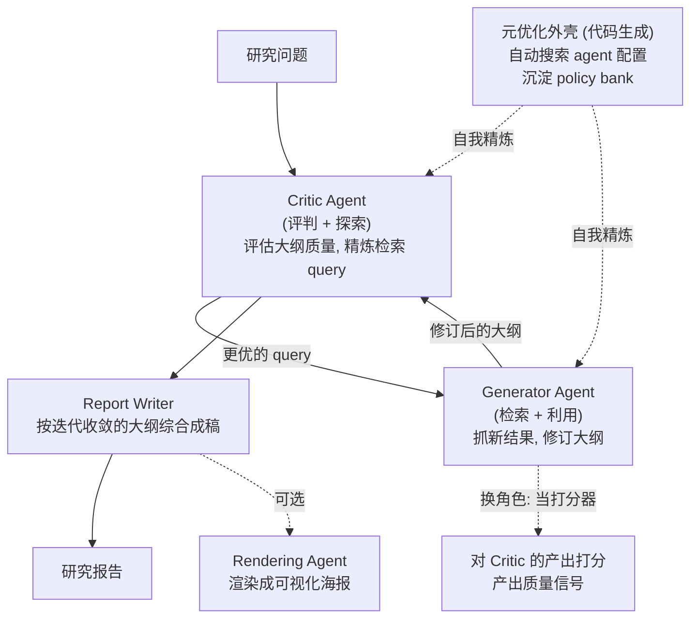

# AgentDisCo：开放式深研 agent 的"解耦 + 协作"

> **一句话**：AgentDisCo（Disentanglement and Collaboration）把开放式 deep research 重新建模为**信息「探索（exploration）」与「利用（exploitation）」之间的对抗优化问题**，将通常被揉进一个模块里的"搜什么"和"怎么用搜到的内容"显式拆开，交给 **Critic / Generator 两个会互相博弈、还会换角色互评**的 agent 协作完成；再用一个**代码生成的元优化（meta-optimization）外壳**自动搜索 agent 配置、沉淀出可复用的"策略库（policy bank）"，在多个深研报告基准上做到与领先闭源系统相当或更优。
> 提出年份：2026（arXiv:2605.11732，v1 2026-05；v2 2026-06）· 作者：Jiarui Jin, Zexuan Yan, Shijian Wang, Wenxiang Jiao, Yuan Lu（机构以原文为准）· 评测主模型：Gemini-2.5-Pro
> 前置阅读：[Deep Research 总览](/agent/deep-research/) · [多智能体](/agent/multi-agent) · [STORM / Co-STORM](/agent/deep-research/storm)

## 问题：探索与利用被揉成一团

大多数 deep research agent 把"**去发现新信息**"和"**把已有信息组织成报告**"塞进同一个模块、由同一个循环顺手做掉。AgentDisCo 指出这是结构性缺陷：

- **探索（exploration）** 关心"还缺什么、该往哪搜"——目标是把信息覆盖面铺开、补上知识缺口。
- **利用（exploitation）** 关心"现有材料怎么剪裁、组织成有论点的好报告"——目标是收敛、求质量。

这两件事的优化方向天然冲突：一个要发散、一个要收敛。揉在一起时，agent 往往要么搜得多但组织乱，要么报告顺但覆盖浅，且很难针对性调优。AgentDisCo 的核心主张是：**把探索与利用解耦成独立组件，再让它们以对抗 + 协作的方式互相校正**，研究质量与适应性都会更好。

## 框架拆解

### ① Critic / Generator：解耦后的两个角色，还会互相换位

- **Critic Agent（评判方，偏探索）**：评估当前**大纲（outline）**的质量、找出薄弱与缺口，并据此**精炼检索 query**——它负责"这版还不够好、应该再去搜这些"。
- **Generator Agent（生成方，偏利用）**：根据精炼后的 query**抓取新结果并修订大纲**——它负责"把搜到的材料吸收进结构里"。
- **角色互换产生监督信号**：Generator 之后会被**复用为打分 agent（scoring agent）**，反过来评估 Critic 的产出、生成质量信号。这种"你评我、我再评你"的对抗-协作闭环，让两方在没有人工标注的情况下互相提供训练/筛选信号，是"DisCo"里 **Co（collaboration）** 的落点。

两者交替迭代，大纲在"被批评 → 补检 → 修订 → 再被批评"中逐步收敛，最后交给 **Report Writer** 按定稿大纲综合成长报告；还可选地接一个 **Rendering Agent** 把报告渲染成可视化海报。

### ② 元优化外壳与 policy bank：用代码生成自动调 agent

AgentDisCo 的第二层创新在"**谁来设计这套 agent 配置**"。它不靠人手工调 prompt 和流程，而是用**代码生成 agent（含 Claude-Code 一类）作为元优化（meta-optimization）外壳**，系统性地探索不同的 agent 配置，并把行之有效的设计沉淀成一个**策略库（policy bank）**——一个结构化、可复用的"设计策略仓库"。后续任务可以直接从 policy bank 取用已验证的策略，从而在**极少人工干预**下持续自我精炼。这把"调 agent"本身也变成了一个可自动化、可积累的过程。

### ③ GALA：从用户浏览历史里"挖"研究需求的新基准

为了让评测更贴近真实使用，作者提出 **GALA（General AI Life Assistants）** 基准：**从用户的历史浏览行为里挖掘潜在的研究兴趣**，据此构造研究任务——相比"出题人凭空命题"，GALA 更能反映"真实用户其实想深研什么"。论文还基于此做了一个端到端产品演示 **AutoResearch Your Interest**（自动研究你感兴趣的话题）。

## 评测与表现（以原文为准）

AgentDisCo 用 **Gemini-2.5-Pro** 作为底座，在三个**面向报告质量**的深研基准上评测：

| 基准 | 侧重 |
| --- | --- |
| **DeepResearchBench** | 深度研究综合能力 |
| **DeepConsult** | 咨询/顾问式长报告质量 |
| **DeepResearchGym** | 深研任务环境化评测 |

论文报告其表现**与领先闭源深研系统相当、甚至更优**（具体分数以 arXiv 原文表格为准）。注意这三个基准衡量的是**报告写作质量**（结构、覆盖、论证、引用），与 BrowseComp/GAIA 那类"找深埋信息"的浏览基准侧重不同——AgentDisCo 属于**偏"综合成稿"一端**的深研工作。

## 在 Deep Research 谱系里的位置

- **vs STORM / Co-STORM**：两者都偏"组织长报告"，但 [STORM](/agent/deep-research/storm) 靠多视角提问做 pre-writing，AgentDisCo 则把探索/利用**显式解耦**并加一层**代码生成的元优化**自动调 agent，自动化程度更高。
- **vs 训练侧深研（Tongyi / REDSearcher）**：[Tongyi DeepResearch](/agent/deep-research/tongyi-deepresearch)、[REDSearcher](/agent/deep-research/redsearcher) 是**从训练侧**造一个长程搜索模型；AgentDisCo 不训练底座，而是在**强通用模型（Gemini-2.5-Pro）之上做 agent 编排与自优化**，与那条线互补。
- **多 agent 协作**：其 Critic/Generator 互评、角色互换的机制，是 [多智能体](/agent/multi-agent) 思想在深研场景的一个具体实例。整体定位见 [Deep Research 总览](/agent/deep-research/)。

## 参考文献

- Jiarui Jin, Zexuan Yan, Shijian Wang, Wenxiang Jiao, Yuan Lu. *AgentDisCo: Towards Disentanglement and Collaboration in Open-ended Deep Research Agents.* arXiv:2605.11732, 2026-05（v2 2026-06）. <https://arxiv.org/abs/2605.11732>
- 评测基准：DeepResearchBench、DeepConsult、DeepResearchGym；新基准 GALA（General AI Life Assistants）
