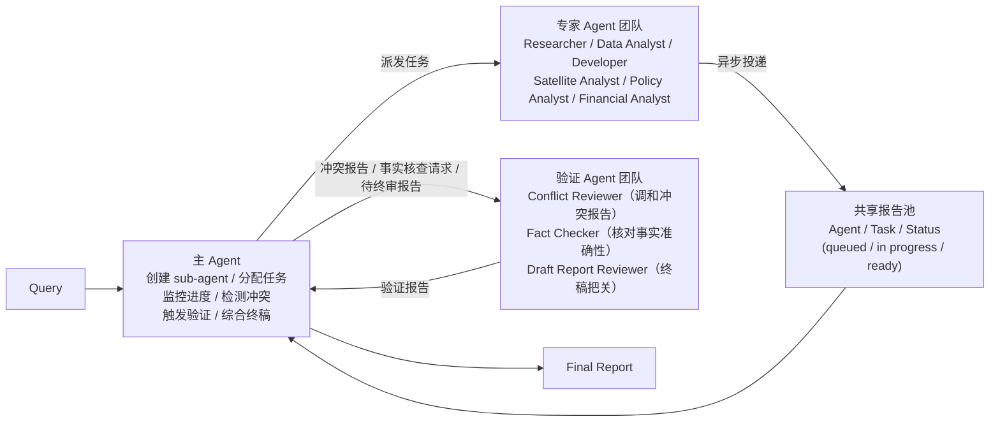
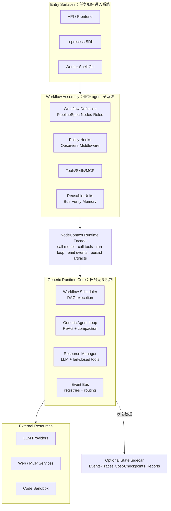
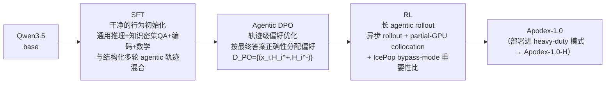

# Apodex-1.0（Apodex Team）：验证是 Agent 团队的内在行为，AgentOS 统一托管深研/编码/证明三类 heavy-duty 任务

**📄 [Apodex-1.0: A Verification-Centric Agent Team for Discoverative Intelligence](https://github.com/ApodexAI)**

约 2026-06（技术报告未标注具体发布日期，据参考文献推断——引用了多篇 2026-05 前后的工作，如 arXiv:2605.16217、2602.04879）· Apodex Team · [在线服务](https://www.apodex.ai) · [API 平台](https://platform.apodex.ai) · [代码](https://github.com/ApodexAI) · [模型权重](https://huggingface.co/collections/apodex/apodex-1)

**一句话**：单 agent 的 ReAct 循环有"范式级天花板"——上下文越用越挤、探索分支互相污染、唯一的验证手段（自我反思）随轮次增多而失效，无论换多大的底座模型都在几百步左右饱和；Apodex-1.0 认为可靠性不该来自参数记忆，而要来自"发现式智能（discoverative intelligence）"——通过主动介入外部世界来推理，并在给出答案前用**外部的、独立的 agent** 核查这次介入。训练出的模型单独跑是标准 ReAct agent（Apodex-1.0），部署进异步"agent 团队"（sub-agent 分工检索/验证、报告汇入共享证据池、全局验证者对证据图推理出最终答案）则成为旗舰 heavy-duty 求解器 Apodex-1.0-H，在 BrowseComp、BrowseComp-ZH、HLE-text、DeepSearchQA 等深研基准上刷新开闭源 SOTA，并把同一套"验证中心"设计延伸到编码与数学证明。

::: details 📖 论文原文 Abstract（英文）
We present **Apodex-1.0**, a verification-centric model for deep research. The trained model alone, Apodex-1.0, runs as a standard tool-using ReAct agent. Deploying it in our *heavy-duty mode*—an asynchronous agent team in which sub-agents specialize in retrieval and verification, route their reports through a shared evidence pool, and feed a global verifier that reasons over the assembled evidence graph to produce the final answer—yields **Apodex-1.0-H**, our flagship heavy-duty solver. Under the hood, a high-quality data pipeline and a three-stage post-training recipe (SFT, agentic DPO, RL) substantially raise the deep-research capability of the Qwen3.5 base while preserving its general knowledge, coding, reasoning, and instruction-following capabilities. Apodex-1.0-H sets a new state of the art across both open and closed-source models on deep-research benchmarks—BrowseComp, BrowseComp-ZH, HLE-text, DeepSearchQA, FrontierScience-Olympiad and FrontierScience-Research. Every claim in the final report it produces is backed by an explicit evidence chain and independently audited before delivery. We open-source **Apodex-1.0-mini** (35B-A3B) alongside three smaller variants (0.8B, 2B, 4B); remarkably, the 4B variant outperforms every open-source 30B-class model on deep-research tasks.
:::

**相关**：[Deep Research 总览](/agent/deep-research/) · [MiroThinker（MiroMind）](/agent/deep-research/mirothinker) · [MiroThinker-1.7 & H1](/agent/deep-research/mirothinker-h1) · [Marco DeepResearch](/agent/deep-research/marco-deepresearch) · [Rubric 化评测与训练](/eval/rubrics)

> 图源：Apodex Team, *Apodex-1.0: A Verification-Centric Agent Team for Discoverative Intelligence* Figure 1——Apodex-1.0 系列与前沿模型的六基准对比（用于学习注解，版权归原作者）。

## 动机与创新点：ReAct 单 agent 有"范式级天花板"，可靠性必须来自"外部核查"而非更大的模型

论文开篇给出一个尖锐判断：

> The hardest research problems an agent encounters today are not bounded by model capacity but by what the model is allowed to interact with.

长程研究任务共享一个结构性特征——单次前向传播不够用，单个上下文窗口装不下全部工作；它们需要把推理与检索、工具使用、验证交织在一起，在数百步、多条并行探索分支上持续进行。论文认为这种可靠性**不能只靠模型的参数记忆**，而必须来自"**发现式智能（discoverative intelligence）**"——通过与外部世界的主动交互来推理，并在给出答案前把这次交互拿来**核查自身**。

主流的 ReAct 范式——单 agent 在一个上下文窗口里跑 think–act–observe 循环——存在一个"**范式级天花板**"：

> The loop lengthens, the context becomes congested, exploration branches contaminate one another, and the only available verification mechanism—self-reflection—degrades with each additional turn. Empirically, a ReAct agent saturates after a few hundred steps regardless of the underlying model. Scaling parameters or context further does not lift this ceiling; it sits below them.

也就是说，无论换多大的底座、给多长的上下文，单 agent ReAct 都会在几百步左右触顶——瓶颈不在模型规模，而在**架构本身**。Apodex 的解法是把框架撑大，三个联合设计的组件叠在一起：

**关键创新**：

- **自我验证是 agent 团队的内在能力，而非提示词工程**：验证被派给一个**独立**的 agent——有自己的上下文、prompt、工具集，而不是让生成者换个身份自己审自己。论文指出"多样性"本身有结构性上限——若局限在单一 agent 内，多条并行推理路径仍共享同一个 prompt、同一套工具、同一份累积上下文、同一种参数偏置，底层推理器一旦有系统性错误，每条并行路径都会继承它。**可靠的验证必须是真正外部的（genuinely *external*）**。具体落地为一个由**冲突审查者（conflict reviewer）、事实核查员（fact checker）、终稿审阅者（draft-report reviewer）**组成的验证团队，三者并行工作，而非一条串行的自我修正循环。
- **异步协作，用共享"报告池"取代同步轮次**：sub-agent 独立产生、独立返回，把输出投进一个带状态标记（`queued`/`in progress`/`ready`）的共享报告池；主 agent 按自己的节奏读取池子状态，报告一就绪就派发下游工作（验证、综合、或衍生新的 sub-agent），不必等最慢的一路跑完。副作用是**故障隔离**自然发生——单个 sub-agent 卡住或失败，其余团队成员不受影响；报告池记录下每个发现、每条裁决、每次人工介入，构成系统的因果主线，让结论**可审计、可追溯、可复盘**。
- **Agent 级别的规模化，是与"模型规模/上下文长度"并列的第三条 scaling 曲线**：一个 agent 团队能把认知负荷分摊到多个各自独占上下文的 sub-agent 上——实际部署中，这套架构在单个任务内协调多达 **150 个 sub-agent、执行超过 15,000 步**，比单 agent 的饱和点（几百步）高出两个数量级。这不是"更大模型跑在更大集群上"的常规 scaling law，而是**扩展 agent 数量这个全新的轴**。
- **Heavy-duty 模式：agent 团队之上再叠一层 scaling**——对最难的任务，让**多个 agent 团队并行跑**（数学场景下则是多轮迭代尝试），再由一个**全局验证者（global verifier）**对它们的联合输出做推理。heavy-duty 模式之于 agent 团队，恰如 agent 团队之于单 agent。全局验证者在三个领域实例化出不同的推理原语：深研场景下是**证据图上的推理**，编码场景下是**因果证据对比**，数学证明场景下是**生成-验证-修订循环**。
- **AgentOS：一个对任务一无所知的任务无关运行时**——workflow、工具、skill、可复用组件全部作为插件，通过一个狭窄的"node context" facade 接入内核；五类扩展点（工具/MCP server/skill/组件/workflow）都不需要改动内核代码就能接入，同一个内核二进制上已跑通十几种生产级 workflow（深研、编码、形式化证明、heavy-duty 推理等）。
- **专门的能力保留（capability-preservation）数据流**：深研专用数据与"保留通用知识/编码/推理/指令遵循能力"的数据分两路构建，三阶段后训练（SFT→agentic DPO→RL）叠加后，Qwen3.5 底座的通用能力基本不掉点，深研能力却大幅提升。

## 方法：agent 团队三性质 + 三领域 heavy-duty 验证 + AgentOS 任务无关运行时 + 三阶段后训练

### Agent 团队：自我验证、异步协作、Agent 级 scaling 三性质

Apodex 的深研系统被组织成一个 **agent 团队**：一个编排者（主 agent）拆解用户查询、动态派生专门化的 sub-agent，异步收集它们的报告，并在综合最终答案前把工作派发给一个专门的验证团队去核对已汇总的证据。团队围绕每个具体问题临时组建，而非配置成一条固定流水线。

- **自我验证（Self-Verification）**：长链推理的经典失败模式是"单条轨迹过早押注一个假设、并在此后不断为这个假设找补"。维持多条推理路径能暴露这类错误——多路径一致提升置信度，分歧暴露不确定性，矛盾能标出单条链自己发现不了的错误。但论文强调"多样性若被局限在单一 agent 内部就有结构性天花板"，因为并行路径仍共享同一推理器的系统性偏差；**验证必须真正外部化**。落地为三个专门角色：**冲突审查者**调和两个及以上专家 sub-agent 之间矛盾的报告，判断哪个论断证据更充分，解决不了的分歧显式标注出来；**事实核查员**用新鲜证据独立核对具体事实性论断，且核查者独立于最初提出该论断的 sub-agent；**终稿审阅者**在报告交付用户前，从整体上检查引用覆盖度、论断与证据是否对齐、逻辑是否连贯。
- **异步协作（Asynchronous Coordination）**：同步式多 agent 设计里，每一轮都要等最慢的 sub-agent，逼验证陷入两难——要么阻塞探索，要么在时间压力下被跳过。共享报告池消除了这个瓶颈：sub-agent 独立产出、独立返回，主 agent 按自己的节奏读取状态表、按报告就绪的顺序派发验证/综合/继续派生 sub-agent 等下游工作；一路慢、一路快互不干扰，单个 sub-agent 卡死或失败时，团队其余部分照常推进——**容错是架构的结构性结果，而非显式机制**。报告池记录下每个发现、每条裁决、每次用户介入，构成系统的因果主线，让结论可审计、可追溯、可分叉（forkable）。
- **Agent 级别的 scaling（Agent-Level Scaling）**：让验证获得自由的同一套架构，也天然让并行化成为默认行为——一个需要跨三个来源追踪五条独立线索的研究问题，可以由五个 sub-agent 同时推进，这种并发是团队结构内生的，而非事后叠加的优化。论文强调这**不是常规意义上"更大模型、更大集群"的 scaling law，而是完全不同的一条轴——扩展 agent 数量**；实际部署中该架构在单任务内协调多达 **150 个 sub-agent、执行超过 15,000 步**，两个数量级超出单 agent 的饱和点。驱动这条曲线的团队行为——sub-agent 派生、验证派发、异步协作——不是包裹在被动模型外面的框架，而是**模型通过训练原生学会的一种推理方式**（详见后文训练流水线）。

> 图源：Apodex Team, *Apodex-1.0* Figure 2——Apodex agent 团队：主 agent、专家 sub-agent 团队、验证 agent 团队三者的异步协作（用于学习注解，版权归原作者）。

### Heavy-Duty Verification：同一套"多团队并行 + 全局验证者"配方，在深研/编码/数学三个领域各自实例化

第 3 节的 agent 团队本身已经是一条测试时 scaling 轴：一个编排者下有多个专门化 sub-agent 在飞行中接受验证团队核查。对最难的负载，论文在这之上再加一条 scaling 轴——**heavy-duty 模式**：Apodex 并行跑**多个 agent 团队**（数学场景下是多轮迭代尝试），再让一个**全局验证者**对它们的联合输出做推理。全局验证者在不同领域实例化出不同的推理原语：

- **深研验证：证据推理（Evidence Reasoning）**。真实研究任务的答案不是一个待打分的单一对象，而是许多必须跨来源拼合在一起的证据碎片——一条不被支持或自相矛盾的证据就能推翻整体。论文指出常见基线做法——按一致性或聚合分数在候选答案间挑选——会退化成"计数或取平均"，白白丢弃了产生这些答案的证据本身，且这种做法一旦独立团队开始重复发现相同结论就会饱和，而非去补齐遗漏的部分。Apodex 把全局验证重新定义为"**对一张共享的证据-论断图做基于证据的推理**"：多个并行 agent 团队完成探索后，全局验证者把全部收集到的证据组装成一张元图，节点是原子发现与待定论断，边记录支持与矛盾关系；验证者据此对整张图推理，权衡每条论断承载的支持与矛盾、并结合来源多样性判断佐证强度。最终答案里每条论断都能溯源回图中的某个节点，保持输出可审计。关键在于**验证者推理的对象是"已组装好的图"，而不是"产出这张图的团队规模"**——同一套权重从单个探索者到大规模并行团队都能直接套用，无需改动。这一验证推理行为是**训练学出来的，而非提示词凑出来的**：论文把全局验证任务加进 Apodex 的 RL 训练数据，数据准备与训练流程沿用 Argus（arXiv:2605.16217）。
- **编码验证：因果证据对比（Causal-Evidence Comparison）**。候选补丁可能通过任务自带的可见测试、读起来语义合理、agent 自己也宣称成功，却依然没有从因果上真正修好底层 bug——论文称这种失败模式为 **"pseudo-correctness"（伪正确性）**。默认的 LLM 验证方式——让裁判判断两个候选"哪个看起来更好"或打一个绝对质量分——在编码任务上会失灵，因为**感知质量与真实正确性可能任意背离**：一个用 `try/except` 掩盖 bug 的补丁可能读起来比正确修复更"干净"，一个编造成功消息的 agent 可能比真正跑过复现步骤的 agent 听起来更自信。Heavy-duty 模式下，Apodex 并行跑多个编码 agent 团队，并对它们的候选做**因果证据对比**：全局验证者挑选**证据上最有力支持、最不可能是伪正确**的那条轨迹或补丁，问题从"哪个候选看起来更好"转变为"**哪个候选最可能真正因果地解决了任务**"。编码质量被拆解成三条独立打分的 rubric 轴，各自针对一种伪正确性模式：**Comprehension**（候选是否识别出真实问题，而非在表面特征上做模式匹配）、**Causality**（方案是否在完整输入分布上、而非可见的一小段切片上解决了根因）、**Empirical Grounding**（所声称的正确性是否有可观测执行结果支撑，而非仅凭断言）。
- **数学验证：生成-验证-修订（Generate–Verify–Revise, GVR）**。数学证明是验证的一个尖锐试金石——一个证明只有在每一步都被证成时才算正确，纯粹的"只看答案对不对"的基准完全漏过这一点。与深研或编码不同，数学证明更受益于**迭代式打磨**而非多团队并行：每一次新尝试都可以由对上一次弱点的显式诊断来引导。Apodex 的数学配方是 **GVR**——模型先写出一份完整证明；一个**自评分器**（同一个模型，只给问题陈述与候选证明）给出 0–7 分与一段书面点评；模型再依据上一次尝试与这份点评写一份新证明，循环最多 $K$ 轮，提交得分最高的那次尝试。一个刻意的设计选择是：**循环内的评分器从不看参考答案或评分细则**——泄漏其中任何一个都会把评分器变成一个"oracle"，从而虚增表观分数；GVR 与朴素 best-of-$K$ 采样的真正区别在于评分器给出的**书面反馈**，而不只是标量分数——每次新尝试都由对上一次弱点的明确诊断来引导，而不是无方向的重复采样。

三个领域共享同一条架构配方：**多次尝试**（深研与编码是并行、数学是串行）**+ 一个领域特定的全局验证者**叠加其上。加上第 3 节的飞行中验证团队，这实现了摘要里的核心承诺：Apodex-1.0-H 产出的最终报告里，每条论断都有显式证据链支撑，交付前经过独立审计。

### AgentOS：任务无关运行时，workflow 作为插件挂载

第 3 节的 agent 团队与第 4 节的 heavy-duty 验证机制都需要一个运行时——一个能跨众多并发 sub-agent 调度工作、管理上下文、执行工具、记录发生过什么、并强制执行操作边界的系统。Apodex-1.0（标准 ReAct agent）与 Apodex-1.0-H（完整 heavy-duty 模式）都是托管在这同一个运行时上的**workflow**，共享同一个内核二进制，只有各自的插件配置不同。

论文指出这一层最主要的失效模式是**"运行时-workflow 耦合"**：如果每个任务把自己的循环、状态模型、权限规则、追踪与终止逻辑都嵌进引擎里，那么新增一个 benchmark、工具、agent 拓扑或验证策略都会变成内核里的一个特殊分支——引擎逐渐固化成一堆任务专属分支的集合，新应用需要几周的内核手术，而不是一个文件夹的新代码。

内核提供任务无关的执行机制——调度、模型与工具路由、事件流、检查点、追踪、成本记账、权限校验、可复用 agent 组件——而**workflow 作为插件加载**，负责提供任务专属策略：如何组织这次运行、用哪些角色和 prompt、哪些工具可见、哪些 observer/middleware 生效、最终答案如何被评判。同一个内核之上已生产化跑通十几种 workflow：Apodex-1.0 与 Apodex-1.0-H 两种深研 workflow、编码 agent 变体、形式化证明写作、heavy-duty 推理等。Workflow 策略活在运行时 facade 之上，任务无关的执行机制活在其下；新增一个应用是一个插件代码文件夹，而不是打给内核的一个补丁。

内核与 workflow 之间只通过一个狭窄的 facade——**node context**——通信：workflow 的每个节点都通过它调用模型、调用工具、跑通用 agent 循环、发出事件、持久化产物、触达系统其余部分。facade 刻意保持窄小，论文明确拒绝为个别 workflow 添加方法，因为每次这类扩展都会变成内核未来的负担。五类扩展点总结为：

| 扩展点 | 如何添加 | 示例 |
| --- | --- | --- |
| Tool | 注册到工具表的一个装饰函数 | `web_search`、`bash` |
| MCP server | `mcpServers` 配置里的一条记录 | `github` |
| Skill | 一个含 `SKILL.md` 的文件夹（描述、允许的工具、prompt） | `verification`、`finance` |
| Component | 一个可复用的组合单元 | `memory`、`write-audit cycle` |
| Workflow | 一个 `PipelineSpec` 加一个 `register()` 钩子 | `deep research`、`SWE`、`proof` |

没有一类扩展需要改动内核，同一个内核二进制运行我们写过的每一个 workflow。工作流本身声明控制流为一个由运行时编译调度的有向无环图：典型套路是"最小脚手架、内部自由"——少数强制性节点在宏观上保证运行的边界（如开头的 clarify 节点、一个 verification gate、总产出最终答案的 report 节点），中间夹一个自由跑开放式推理循环的重节点（可自由选工具、派生并行 sub-agent、重新规划）。以 Apodex-1.0-H 底层的深研 workflow 为例，这一脚手架落地为 **clarify → solve → verify → report** 的流程，其中 verification gate 会在引用覆盖率、平均置信度、争议论断占比、或未解决论断数量未达阈值时把流程打回 solve 节点重跑。

> 图源：Apodex Team, *Apodex-1.0* Figure 3——AgentOS 总览：任务无关执行内核与作为插件挂载的 workflow（用于学习注解，版权归原作者）。

### 训练数据：证据扎根的深研数据 + 能力保留数据

Apodex 的后训练数据服务两个目的——**教会**模型定义深研的长程搜索-验证行为，同时**保留**它从 Qwen3.5 继承的通用知识、编码、推理、指令遵循能力。据此构建两条互补数据流：

**深研数据**（三条设计原则）：
- **证据扎根的知识抽取**：每条原子论断都必须能溯源到一个可引用的出处，抽取范围限定在学术论文、技术报告等研究文献，连同源段落、文献出处、方法论/时间限定词一并保留成 `(entity, statement)` 对——形成的知识记忆库比网络规模语料更小，但在可引用的研究级事实上密度显著更高。
- **联合推理与检索的随机游走合成**：问题通过在陈述空间上做结构化随机游走合成，偏向跨越多篇论文边界的多跳轨迹；每次游走产出一个问题和它访问过的有序陈述链——即 ground-truth 证据路径，跨度 3–10 步。每一步里，一个推理子步骤解读已有证据并判断还缺什么，一个检索子步骤据此获取下一条证据——两种能力交替进行：发现重塑计划，演化的计划决定下一次查询。
- **模型在环过滤实现难度校准**：只有当跨能力档位的一组模型给出有意义分布（至少一个模型失败、至少一个成功，排除平凡题与病态题）时，问题才被保留；过滤器联合评估完整的"推理+检索"流程，剔除纯推理或单次查询就能解决的题目——留存下来的问题正好卡在当前模型能力的前沿，迫使两种能力必须被同时调用。

**能力保留数据**（两条互补数据流）：
- **通用知识与指令遵循**：沿三个轴强制广度——学科广度覆盖 STEM/人文/社科/医学/法律/专业知识，并对底座模型最弱的学科按诊断结果显式配额；语言广度把中英文都当作一等公民、原生采集而非翻译得来；格式广度统一混合多种答案呈现模板，防止过拟合某一种评测格式。SFT 与 RL 阶段都叠加了专门的指令遵循监督，涵盖格式/长度/关键词/组合约束等多种类型。
- **编码 agent 监督**：编码数据流由执行结果把关而非单纯堆量——每条候选轨迹只有当其环境可重建、其规格与可执行的评测 harness 一致、其终态结果可通过对应检查项验证时才被采纳，确保训练信号可靠。数据混合结合了真实软件变更（暴露真实的依赖、接口、多文件交互）与受控任务合成（补齐欠代表的行为与难度区间、变化执行 harness 以引出不同的反馈时延与恢复模式），最终配比在难度、交互时域、失败模式上保持均衡，重点补足"任务需要非平凡推理但反馈可执行、可验证"的区域。

### 训练流水线：SFT → Agentic DPO → RL（异步 rollout + partial-GPU collocation + IcePop bypass-mode 重要性比）

训练流水线把 Qwen3.5 变成 Apodex-1.0——一个原生具备长程搜索与自我验证能力、同时保留继承通用能力的模型；部署 Apodex-1.0 进 heavy-duty 模式得到 Apodex-1.0-H。三阶段后训练配方为：

- **SFT——干净的行为初始化**：SFT 单独无法教会后续阶段要瞄准的长程搜索-验证行为，但没有它，后续任何阶段都无法从一个没见过 assistant 侧对话格式的模型里恢复过来。这一阶段刻意"浅"——只对齐输出格式、强化推理与指令遵循、为 agentic 先验打底——把长程行为明确留给后面的 DPO 与 RL 阶段去教。数据混合了通用推理/知识密集型 QA/编码/数学的 prompt-response 样例与包含交织推理步骤/工具调用/工具观测的结构化多轮 agentic 轨迹，全部转换成统一对话格式，工具观测作为输入上下文的一部分、只有 assistant 侧 token 计入损失，用标准自回归似然优化。
- **Agentic DPO——轨迹级判断**：SFT 针对每个 prompt 只优化单一示范，因此无法表达"一条谨慎 agent 的轨迹比一条草率 agent 的轨迹更好"这种轨迹级判断。RL 之前先用 **Direct Preference Optimization** 在成对数据集 $\mathcal{D}_{\text{PO}} = \{(x_i, H_i^+, H_i^-)\}_{i=1}^M$ 上补上这一环，其中 $H_i^{\pm}$ 是完整的 agentic 轨迹（推理、工具动作、观测、最终答案）。偏好由**最终答案正确性**分配，而非人工设计的结构性启发规则（规划模板、步数、工具使用模式）——不同任务因而可以自由采用不同的合法策略。一个轨迹级过滤器会剔除存在严重重复、截断、工具调用错误、或任一侧输出无效的轨迹，目标函数是相对一个冻结参考模型的标准 DPO loss。
- **RL——长 agentic rollout 上的强化学习**：在 DPO 对齐过的轨迹基础上，最后一个阶段用 RL 在长 agentic rollout 上微调模型。RL 训练栈针对**基础设施**与**算法**两个决定端到端效率与稳定性的轴协同设计：
  - **基础设施轴**：跟随 ROLL Flash，用**全异步 rollout**——单个持久化 rollout worker 通过 SGLang router 分发 prompt，训练器一旦凑够每个 prompt 所需的样本数就消费这组样本，掉队者继续被服务；一个重试缓冲区跨权重版本保留部分完成的组，可配置的绕过概率允许新 prompt 抢占缓冲区排空以避免工具调用故障造成的饥饿。**partial-GPU collocation（hybrid-collocate）**：把一个 Ray placement group 划分成专职推理 GPU 的远程池与在训练 GPU 上按需实例化引擎的 collocate 池——collocate 引擎在训练期间通过 SGLang 的显存释放机制被卸载、只在 rollout 尾声按需加载，充分利用了训练与推理之间原本被浪费的空闲窗口。
  - **算法轴**：单个 rollout 组内 token 可能来自多达三个策略版本，朴素重要性比 $r_t = \pi_\theta(y_t|s_t) / \pi_{\text{infer}}(y_t|s_t)$ 会出现重尾——在 MoE 模型上尤其严重，少量路由差异就会放大逐 token 对数概率差、极少数 $r \gg 1$ 的 token 就足以拖垮一次更新。**Bypass-mode** 直接复用推理引擎自带的对数概率作为分母，而非用标准 PPO 那样对每条 rollout 序列重新做一次前向传播来算"旧"对数概率快照：

$$r_t = \exp\big(\log \pi_\theta^{\text{current}}(y_t) - \log \pi^{\text{rollout}}(y_t)\big)$$

    在 Qwen3.5-35B-A3B agentic 配置上把训练步耗时缩短 5–15%（随回复长度变化）。为控制由此产生的重尾，进一步施加 **IcePop 双向掩码**：

$$M(r_t) = r_t \cdot \mathbf{1}[r_t \in [\alpha,\beta]], \quad \alpha=0.5,\ \beta=5.0$$

    把区间外的 token 完全清零。论文强调"掩码（而非截断重要性采样，即封顶比值）才是长 MoE rollout 上真正起作用的那味料"，并监控两个诊断量——IcePop 掩码触发比例（持续偏高说明该收紧异步程度而非放宽区间）与 $r_t$ 的分布。基础设施与算法两个轴是协同设计的：collocation 让每条 rollout 里非平凡的一部分变成 off-policy，而算法上的这一修正保证梯度在这种漂移下依然表现良好。

## 实验结果：Apodex-1.0-H 在公开深研榜单上刷新开闭源 SOTA，且编码/数学/通用能力不掉点

### 深研基准：搜索类与科学类均刷新 SOTA

评测覆盖 Humanity's Last Exam（文本子集）、BrowseComp、BrowseComp-ZH、DeepSearchQA、FrontierScience-Olympiad、FrontierScience-Research、SuperChem 七个公开深研基准，统一用 LLM-as-a-Judge，ReAct 模式下 $T_{\max}=600$、Agent Team 模式下主 agent 与每个 sub-agent 各自 $T_{\max}=100$、上下文 256K，且屏蔽了对基准托管网站的直接访问以降低数据污染风险。

**搜索类基准（Table 2，以原文为准）**

| 模型 | BrowseComp | BrowseComp-ZH | DeepSearchQA | HLE（文本，含工具） |
| --- | --- | --- | --- | --- |
| DeepSeek-V4-Pro-Max | 83.4 | – | – | 48.2 |
| Kimi-K2.6 | 86.3 | – | 92.5 | 54.0 |
| Seed-2.0-Pro | 77.3 | 82.4 | 77.4 | 54.2 |
| Muse Spark | – | – | 74.8 | 58.4 |
| OpenAI-GPT-5.5 | 84.4 | – | – | 52.2 |
| OpenAI-GPT-5.5-pro | 90.1 | – | – | 57.2 |
| Gemini-3.1-Pro | 85.9 | – | 81.9 | 51.4 |
| Claude-Opus-4.8 | 84.3 | – | 93.1 | 57.9 |
| Apodex-1.0-mini | 71.5 | 80.6 | 82.2 | 46.8 |
| Apodex-1.0 | 75.5 | 82.6 | 84.6 | 49.0 |
| **Apodex-1.0-H** | **90.3** | **84.1** | **94.4** | **60.8** |

**科学类基准（Table 3，以原文为准）**

| 模型 | FrontierScience-Research | FrontierScience-Olympiad | SuperChem |
| --- | --- | --- | --- |
| Seed-2.0-Pro | 25.0 | 74.0 | 53.0 |
| Muse Spark | 38.3 | – | – |
| OpenAI-GPT-5.2 | 25.2 | 75.0 | 58.0 |
| OpenAI-GPT-5.4 | 33.0 | – | – |
| OpenAI-GPT-5.4-pro | 36.7 | – | – |
| Gemini-3.0-Pro | 15.0 | 73.0 | 63.2 |
| Gemini-3.1-Pro | 23.3 | – | – |
| Claude-Opus-4.5 | 21.7 | 71.0 | 43.2 |
| Apodex-1.0-mini | 25.0 | 77.2 | 61.4 |
| Apodex-1.0 | 28.3 | 80.3 | 69.0 |
| **Apodex-1.0-H** | **46.7** | **87.4** | **74.2** |

**Apodex-1.0-H 在公开深研套件上刷新开闭源 SOTA**：搜索类基准里，BrowseComp（90.3，微弱领先 GPT-5.5-pro 的 90.1）、BrowseComp-ZH（84.1）、DeepSearchQA（94.4，领先 Claude-Opus-4.8 的 93.1）、文本版 HLE（60.8）均是最高分；科学类基准的领先幅度更大——FrontierScience-Research（46.7 vs 次优 Muse Spark 的 38.3）、FrontierScience-Olympiad（87.4 vs GPT-5.2 的 75.0）、SuperChem（74.2 vs Gemini-3.0-Pro 的 63.2），领先幅度普遍在 8–12 个绝对百分点。

**Heavy-duty 模式的边际贡献**：在 Apodex 家族内部对比可量化 heavy-duty 模式带来的提升——BrowseComp 上，base 版 Apodex-1.0 是 75.5，heavy-duty 模式抬升 **+14.8** 分；FrontierScience-Research 上提升 **+18.4**（28.3 → 46.7）。即便不开 heavy-duty 模式，仅 35B-A3B 的 Apodex-1.0-mini 也已经能在 BrowseComp-ZH（80.6）、DeepSearchQA（82.2）、FrontierScience-Olympiad（77.2）上比肩中档闭源系统，说明相当一部分深研能力活在**训练出来的模型本身**里，而不只是靠测试时扩展堆出来的。

**Apodex-1.0 Smol 系列**：额外用深研 SFT 数据训练一系列更小模型（0.8B/2B/4B），发现**小模型仅靠高质量 SFT 数据就能获得可观的深研能力**——4B 变体的 BrowseComp/BrowseComp-ZH 分数分别为 48.8/63.5，超过 30B 档所有对比的开源模型（Table 4，含 Tongyi DeepResearch-30B 的 43.4/46.7、OpenSeeker-v2-30B-SFT 的 46.0/58.1）——印证了"有效的数据构造能大幅提升紧凑模型的研究能力"这一论点。

### 通用能力保留：编码/数学/推理/指令遵循/长上下文基本不掉点

在 MMLU-Pro/MMLU-Redux/C-Eval（通用知识）、SuperGPQA/GPQA-Diamond（科学推理）、AIME 2026/HMMT Feb 25（数学推理）、IFEval/IFBench（指令遵循）、AA-LCR/LongBench v2（长上下文）这套通用能力基准上，Apodex-1.0-mini 与其对应规模的 Qwen3.5-35B-A3B 底座逐项对比基本在 1 分以内，Apodex-1.0（397B-A17B）相对 Qwen3.5-397B-A17B 底座在 HMMT Feb 25、C-Eval、MMLU-Pro、IFEval 上反而更高，仅在 GPQA-Diamond、IFBench、SuperGPQA、LongBench v2 上略有落后——说明面向 agentic 深研的后训练配方基本保留了底座的通用知识、推理与指令遵循能力，而非以牺牲它们为代价换取深研分数。

**编码能力（Table 6）**：35B-A3B 档，Apodex-1.0-mini 相对 Qwen3.5-35B-A3B 底座在 SWE-bench Verified 上从 69.2 提到 71.5、LiveCodeBench v6 从 74.6 提到 77.8，Terminal-Bench v2 基本持平；397B-A17B 档，Apodex-1.0 在 SWE-bench Verified 上与底座持平（76.5 vs 76.4），其余两项略有小幅落后；加上 heavy-duty 模式后 Apodex-1.0-H 在三项上全面提升（SWE-bench Verified 79.0、Terminal-Bench v2 58.4、LiveCodeBench v6 85.1）。论文指出编码基准上**选择质量而非模型规模才是主导杠杆**——35B-A3B 规模的 Apodex-1.0-mini 在 heavy-duty 模式下的 LiveCodeBench v6 表现已能匹配无验证器的 397B-A17B 大模型，参数量相差约一个数量级。

**数学证明能力（Table 7，IMO-ProofBench）**：GVR 循环（10 次迭代）带来的提升在 Advanced（新颖 IMO-Hard 难度）子集上最明显——从 base 版 Apodex-1.0 的 12.38 分提升到 Apodex-1.0-H 的 34.29 分，近乎三倍；Basic 子集从 49.05 提升到 80.48（+31.4 绝对分，+64% 相对提升）；60 题总分从 30.71 提升到 57.38，相对提升 87%——是全篇报告里单一系统内部提升幅度最大的一项。

### 内部评测：Hard Deep Research（41 条专家撰写查询）

为补充公开检索类基准，论文自建 **Hard Deep Research**——41 条要求多源检索、多步推理、证据综合的查询，覆盖地理与空间推理、学术引用与奖项、体育娱乐、市场金融、科学医学等十个内容领域，每条查询的答案是可程序化核验的单一实体、Top-k 列表、可枚举集合或结构化推导，部分查询还设置了"硬负例"——提及指定的错误项会被倒扣分，抑制穷举式乱猜。

| 模型 | Pos.（%）↑ | Zero（%）↓ | Neg.（%）↓ | Average↑ |
| --- | --- | --- | --- | --- |
| Qwen3.6-Plus | 24.4 | 61.0 | 14.6 | -1.4 |
| MiniMax-M2.7 | 58.5 | 29.3 | 12.2 | 17.0 |
| GLM-5.1 | 63.4 | 31.7 | 4.9 | 40.1 |
| Gemini-3.1-Pro | 68.3 | 26.8 | 4.9 | 40.8 |
| OpenAI-GPT-5.4 | 70.7 | 22.0 | 7.3 | 41.3 |
| Claude-Opus-4.7 | 75.6 | 17.1 | 7.3 | 44.0 |
| Apodex-1.0-mini | 73.2 | 24.4 | 2.4 | 49.8 |
| Apodex-1.0 | 75.6 | 22.0 | 2.4 | 52.9 |
| **Apodex-1.0-H** | **85.4** | **14.6** | **0.0** | **63.6** |

Apodex 家族占据前三名，即便最小的 Apodex-1.0-mini 也排第三、超过最强商业基线 Claude-Opus-4.7。论文分析这一优势不仅来自检索到更多正确条目，还来自**对硬负例惩罚的鲁棒性**——Apodex 系列的净负分比例远低于基线，反映其能准确识别相关条目、同时规避虚假条目。两个案例研究提供了直观佐证：一是从"品牌名含'zy'、申请方名含'tech'、通过一条未点名的加速通道首次获批"这类隐晦线索反推出具体药物批准编号与日期的任务，六个基线里四个给出错误或空答案（GPT 自信报出错误药物、MiniMax/GLM 干脆不给答案），只有 Apodex 三档模型与另两个最强基线（Claude-Opus-4.7、Gemini-3.1-Pro）拿到满分；二是"在严格定义边界下枚举因政府正式驱逐令而流亡的诺贝尔文学奖得主"这一任务，Apodex 三档模型都精确给出唯一合法的三人名单且零错报，而多数基线因把"自我流亡/被迫离境"与"正式驱逐令"混为一谈而过度枚举，被扣分扣到负数。

## 在 Deep Research 谱系里的位置

- **vs [MiroThinker-1.7 & H1](/agent/deep-research/mirothinker-h1)（MiroMind，同样主打"验证中心的 heavy-duty 模式"）**：这是本文与 Deep Research 谱系里最值得对照的一组——两篇论文几乎同时提出高度相似的核心构型：都用异步 sub-agent 团队做探索、都在其上叠一层"heavy-duty"全局验证来处理最难的负载。但两者**完全独立开发、互不引用**——Apodex 全文未出现任何 "Miro" 相关文字，是一次显著的**趋同设计（convergent design）**而非相互借鉴。差异点在于覆盖面：Apodex 把"验证中心"的架构统一延伸到**深研、编码、数学证明三个领域**（分别对应证据图推理、因果证据对比、生成-验证-修订三种验证原语），并配了一个任务无关的 AgentOS 运行时把它们统一托管；MiroThinker-H1 的验证机制细节及是否跨领域复用，见 [MiroThinker-1.7 & H1 专页](/agent/deep-research/mirothinker-h1)对照阅读。
- **vs [MiroThinker v1.0](/agent/deep-research/mirothinker)（同门前作，"交互式 scaling"）**：MiroThinker v1.0 把"model / context / **interactive** scaling"并列为三条 scaling 轴，核心是单 agent 在强化学习下学会做更深、更频繁的 agent-环境交互；Apodex 提出的是另一条并列轴——**"agent 数量" scaling**（agent-level scaling），把认知负荷分摊到可并行的多个 sub-agent 上，而非让单个 agent 自己撑更长的交互链。两条轴分别在"单 agent 能扛多少轮交互"与"团队能并行铺开多少条探索路径"两个不同方向上突破 ReAct 的天花板，可对照阅读、也不互斥。
- **vs [Marco DeepResearch](/agent/deep-research/marco-deepresearch)（三层显式验证：数据合成/轨迹构造/测试时扩展）**：两者都以"验证"为核心卖点，但验证介入的位置不同——Marco DeepResearch 把验证嵌进**训练管线的三个阶段**（QA 数据合成的对抗性验证、轨迹构造的验证子 agent、测试时用模型自己当 verifier），本质上是"用验证净化训练数据与推理过程"；Apodex 的验证则首先是**架构性的**——一个独立于生成者、有自己上下文与工具的验证团队，是 agent 团队的内在能力，并进一步扩展成 heavy-duty 模式下按领域实例化的全局验证者，覆盖面从深研延伸到编码与数学证明，是"验证"这条设计主线在更大工程范围内的另一种落地方式。
- **与 [Rubric 化评测与训练](/eval/rubrics) 一脉相承的评测哲学**：Apodex 在编码验证里把"质量"拆解成 Comprehension / Causality / Empirical Grounding 三条独立评分的 rubric 轴，数学验证里用自评分器给出 0–7 分加书面点评而非单一标量——这与 DR-Rubric、QUEST、Co-ReAct 等工作"用结构化多准则表示取代单一标量/二元对错"的思路一致，尽管 Apodex 论文本身并未使用"rubric-based RL 奖励"这一框架去描述自己。
- 整体定位与"国产/开源刷榜竞赛"背景见 [Deep Research 总览](/agent/deep-research/)。
