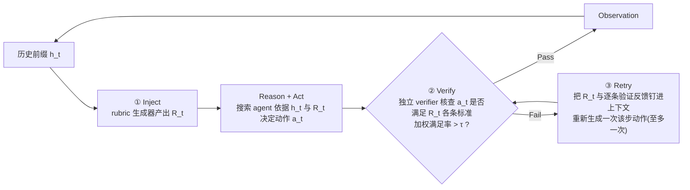

# Co-ReAct（阿里通义+清华）：训练好的 Rubric 当 ReAct 每一步的"协作者"而非事后打分器

**📄 [Co-ReAct: Rubrics as Step-Level Collaborators for ReAct Agents](https://arxiv.org/abs/2605.23590)**

2026-05 · 阿里通义（Qwen Applications Business Group）· 清华大学 · [代码](https://github.com/ZBWpro/Co-ReAct)

**一句话**：把 rubric 从"训练时的奖励/事后打分工具"改造成**推理时的步骤级行动指南**——用 GRPO 训练一个专门的 rubric 生成器，在 ReAct 每一步动作之前告诉 agent"下一步该满足什么"，动作执行前再验证、不达标就带着反馈重试；在 DeepResearchBench 与 SQA-CS-V2 上，Co-ReAct 稳定超过 ReAct 及 Self-Refine / Best-of-N / Step-Back / CRITIC 等推理时增强基线，训好的 rubric 生成器还能直接插进这些基线里做即插即用的正向增益。

::: details 📖 论文原文 Abstract（英文）
ReAct-style agents for search-intensive, multi-step reasoning tasks rely largely on their own internal judgment to decide what evidence to seek, which reasoning or action step to take next, and when to stop. In current systems, these decisions are driven largely by the agent's own internal judgment. This self-direction can be brittle. Agents may reissue near-duplicate queries, stop before sufficient evidence has been gathered, or rely on a narrow set of sources even when the question would benefit from comparison across multiple perspectives. The resulting trajectories can therefore become shallow, redundant, or misaligned with the specific demands of the current step. What is missing is an external, verifiable specification of what the next step should accomplish: a step-level signal that tells the agent, at a particular branching point in a particular trajectory, what fine-grained requirements the next action should satisfy. Prior work has explored rubrics as external quality signals, but existing uses are mostly evaluative rather than action-guiding: rubrics typically serve as training-time rewards or post-hoc evaluators of completed outputs, and in deep-research settings they are often coarse-grained and report-level rather than step-level. We introduce Co-ReAct, a rubric-guided action-selection framework that uses rubrics as step-level guidance during inference. At each decision step, Co-ReAct injects a rubric into the agent's context to guide the next Reason-or-Act decision, specifying what the agent should target in evidence seeking, search, reasoning, or self-evaluation. To make this guidance reliable, we train a dedicated rubric generator with GRPO. Unlike prior pairwise or binary preference formulations, our objective optimizes a list-wise Spearman rank-correlation reward against multi-judge expert consensus rankings, encouraging rubrics that are discriminative rather than merely plausible. On DeepResearchBench and SQA-CS-V2, Co-ReAct consistently improves over ReAct and representative test-time compute baselines across search agents built on both 8B/14B open-source and frontier closed-source base models. The trained rubric generator can also serve as a drop-in component that improves these baselines without changing their underlying decision mechanisms. Our code is publicly available at https://github.com/ZBWpro/Co-ReAct.
:::

**相关**：[Deep Research 总览](/agent/deep-research/) · [DR-Rubric](/agent/deep-research/dr-rubric) · [QUEST](/agent/deep-research/quest) · [Tongyi DeepResearch](/agent/deep-research/tongyi-deepresearch) · [REDSearcher](/agent/deep-research/redsearcher)

> 图源：Kang et al., *Co-ReAct: Rubrics as Step-Level Collaborators for ReAct Agents*（arXiv:2605.23590）Figure 1——Co-ReAct 数据收集、训练、推理三阶段总览（用于学习注解，版权归原作者）。

## 动机与创新点：rubric 一直被当"评委"，从没被训练成"每一步该干什么"的指南

ReAct 范式下的深研 agent，靠反复决定"该找什么证据、下一步做什么动作、什么时候该停"来完成搜索。论文指出，**这些决策目前几乎完全由 agent 自己的内部判断驱动**，而这种"自我指导"很脆弱：agent 可能重复发出近乎重复的查询、在证据还不够时就提前收尾、或者只依赖单一视角的一小撮来源——即便问题本可以从多角度对比中受益。产生的轨迹因此容易变得**浅薄、冗余、或者跟当前这一步的具体需求脱节**。论文认为，真正缺的是一个**外部的、可验证的"下一步该完成什么"的规格说明**：在某条具体轨迹的某个分支点上，明确告诉 agent 下一步动作要满足哪些细粒度要求。

Rubric（评分细则）看起来是天然的候选——它用一小组可核验的标准表达"质量"是什么。但论文观察到一个此前被忽视的现状：**现有 rubric 相关工作几乎都把 rubric 当成评估对象，而不是指导信号**。具体来说：

- 通用 LLM 对齐里，rubric 常被用作训练时奖励、裁判模板、或对**已完成输出**的事后评估器；
- 深研场景里，rubric 通常定义在**最终报告**这一层级，核查"答案是否全面、引用是否充分、是否忠于证据"——这些用法回答的问题是"一个已经产出的输出该得多少分"，而**不回答**"agent 在推理过程中面对当前这一步、具体该满足什么要求"这个问题。

论文指出，把 rubric 用在"指导下一步做什么"这个规定性角色上，**不是简单地在 prompt 里挂一张通用检查清单**就够了，还要满足三个条件：

1. **必须是步骤级的**：要指定下一步动作该覆盖什么，而不是最终报告该包含什么；
2. **必须以当前部分轨迹为条件**：因为"正确的下一步"取决于 agent 已经尝试过什么、已经找到了什么证据；
3. **必须是有区分度的**：rubric 偏好的动作要真的比它打压的动作更好——论文的消融实验显示，这一条至关重要：**一个不可靠的 rubric 不只是"没帮上忙"，注入 agent 上下文后，未经训练的 rubric 反而会主动误导搜索过程、拖累表现**。

据此，论文提出 **Co-ReAct**——名字体现 rubric 作为"步骤级协作者（co-llaborator）"的定位：动作执行前，它明确下一步的细粒度要求；动作执行后，它又提供验证与反馈的依据。

**关键创新**：

- **把 rubric 从"评估对象"重新定位为"行动选择信号"**：不再作为训练管线消费的评判对象，而是 agent 在推理时直接消费的、规定性的步骤级信号——据作者所知，Co-ReAct 是第一个在 ReAct 深研 agent 里为这一角色训练 rubric 的系统。
- **listwise GRPO 训练 rubric 生成器**：不同于依赖成对偏好或二元 accept/reject 标签的先前 rubric 学习方法，用一个奖励多个候选动作排序与多裁判专家共识排序之间**秩相关性**的目标来训练——这让学到的 rubric 天生就是有区分度的，而不只是"听起来合理"。
- **实证证明持续有效且可迁移**：Co-ReAct 在多个基准、多种 agent 底座（8B/14B 开源与前沿闭源模型）、多种推理时增强基线上都稳定提升；把同一个训好的 rubric 插入现有方法还能带来正向迁移，说明步骤级 rubric 指导与当前的推理时增强技术是互补的，而非竞争关系。

## 方法：三阶段——收集分支点偏好数据 → listwise GRPO 训 rubric 生成器 → 推理时 inject-verify-retry

### 阶段一：从真实 ReAct 轨迹收集分支点偏好数据

设 $q$ 为一条深研 query。一条 ReAct 轨迹是交替的动作与观测序列 $(a_1,o_1,a_2,o_2,\dots)$，记 $h_t=(a_1,o_1,\dots,a_{t-1},o_{t-1})$ 为到第 $t$ 步的轨迹前缀。从一个深研 query 池出发，在每条 query 上跑一个搜索 agent 得到完整 ReAct 轨迹；在每个工具调用步 $t$，把 pair $(q,h_t)$ 视为一个**分支点（branching point）**，并收集一组 $k$ 个候选下一步动作 $\mathcal{A}_t=\{a_t^{(1)},\dots,a_t^{(k)}\}$。

**保证候选集多样化**：为避免候选集里全是近乎重复的动作，在每个分支点用**三个不同规模的 ReAct agent**（Qwen3-8B、Qwen3-14B、Qwen3-32B）在四个温度 $\{0.1,0.4,0.7,1.0\}$ 下各生成一次续写，共 12 条候选——混合模型规模与温度能拓宽搜索策略与表面形式的多样性。去掉完全重复的候选后，用基于 BM25 相似度（在 tokenized 动作字符串上）的 **Maximal Marginal Relevance** 选出 $k=4$ 个足够多样的动作；已经给出最终答案、或候选去重后不足 $k$ 个的分支点则被丢弃。

**多裁判专家共识排序**：每个分支点 $(q,h_t,\mathcal{A}_t)$ 都要配一个作为监督目标的专家共识排序 $\sigma_t^\star$。论文指出单一 LLM 做逐点打分很脆弱——逐点分数在不同 prompt 间难以校准，单个模型的特异偏好会成为所有监督数据共享的偏差。因此采用**listwise、多裁判**协议：四个候选被随机打乱顺序并重新标记为中性标识符 $\{X,Y,Z,W\}$ 以去除位置偏差，交给来自不同模型家族的 $J=3$ 个前沿 LLM 裁判（**Claude 4.5 Sonnet、Gemini 2.5 Pro、GPT-5**）；每个裁判返回对整个候选集的**完整排序**（而非标量分数）。排序通过 **Borda count** 聚合——每个候选在各裁判处的排名位置相加成一个总分，对总分排序即得 $\sigma_t^\star$。listwise 判断上的 Borda 聚合尊重每个裁判的完整排序，且对单个裁判是离群值的情况稳健。只保留至少两个裁判给出有效、可解析排序的分支点。

**沿轨迹深度扩展**：连续深度的分支点沿**同一条轨迹主干**收集——在深度 $t$ 得到专家排序 $\sigma_t^\star$ 后，只把**排名最高**的动作 $a_t^\star$ 及其观测 $o_t^\star$ 提交进历史，再在得到的前缀 $h_{t+1}$ 上重新采样一批新的候选集 $\mathcal{A}_{t+1}$，如此沿单条轨迹逐步往深处推进。

### 阶段二：用 listwise GRPO 训练 rubric 生成器

把 rubric 生成器形式化为一个自回归策略 $\pi_\theta(R \mid q, h_t)$，输出一个 rubric $R$：一份简短的加权标准清单，规定一个好的下一步动作应该覆盖什么。**一个 rubric 只有能在同一分支点上区分好动作与坏动作时才有用**；一份"听起来很合理"但诱导出的排序与专家共识毫不相关的 rubric 是没用的。因此，论文把一份被采样出的 rubric 的奖励，定义为**它在 $\mathcal{A}_t$ 上诱导出的排序、与专家共识排序 $\sigma_t^\star$ 之间的秩相关性**。

**Rubric 诱导排序**：给定 rubric $R$ 与候选动作 $a\in\mathcal{A}_t$，一个独立的评估 LLM 读入 $(q,h_t,a,R)$，返回该动作满足的 rubric 标准的加权占比分数；把这些分数降序排列即得到 rubric 诱导排序 $\widehat\sigma_t(R)$。

**Listwise Spearman 奖励**：主奖励是 $\widehat\sigma_t(R)$ 与 $\sigma_t^\star$ 之间的 Spearman 秩相关系数，重新缩放到 $[0,1]$：

$$r_{\text{rank}}(R) = \frac{1}{2}\left(\rho(\widehat\sigma_t(R), \sigma_t^\star) + 1\right), \qquad \rho(\sigma_a,\sigma_b) = 1 - \frac{6\sum_{i=1}^n (\sigma_a(i)-\sigma_b(i))^2}{n(n^2-1)}$$

其中 $\sigma_a(i),\sigma_b(i)$ 是候选 $i$ 在两个排序下的名次（$n=|\mathcal{A}_t|$）。**反相关的排序得 0，随机排序期望得 0.5，完全一致得 1**——一份"听起来很合理"但无法按专家顺序排出候选的 rubric，得到的奖励不会超过随机水平，这正是"discriminative rather than merely plausible"（有区分度而非只是听起来合理）这一设计初衷的直接体现。

**总奖励**：把 $r_{\text{rank}}$ 与两个轻量整形项结合——**原子性奖励** $r_{\text{atom}}$（鼓励每条标准只核查一个可验证的具体事实）与**格式奖励** $r_{\text{fmt}}$（强制符合预期 schema）：

$$r(R) = w_1\, r_{\text{rank}}(R) + w_2\, r_{\text{atom}}(R) + w_3\, r_{\text{fmt}}(R), \quad w_1 \gg w_2, w_3$$

即秩相关信号主导学习，整形项只用来打磨 rubric 的表述方式，不喧宾夺主。

**GRPO 优化**：用 **Group Relative Policy Optimization** 优化 $\pi_\theta$。对每个分支点，从当前策略 $\pi_{\theta_{old}}$ 采样一组 $G$ 个 rubric $\{R_1,\dots,R_G\}$，计算奖励 $\{r(R_i)\}_{i=1}^G$，用标准的裁剪代理目标更新策略：

$$\mathcal{L}(\theta) = -\frac{1}{G}\sum_{i=1}^G \min\left(\omega_i \hat A_i,\ \text{clip}(\omega_i, 1-\epsilon, 1+\epsilon)\hat A_i\right) + \beta\,\mathbb{KL}[\pi_\theta \| \pi_{ref}]$$

其中 $\omega_i = \pi_\theta(R_i|q,h_t)/\pi_{\theta_{old}}(R_i|q,h_t)$ 是重要性比，优势在组内归一化：$\hat A_i = \frac{r(R_i)-\text{mean}(\{r(R_j)\}_{j=1}^G)}{\text{std}(\{r(R_j)\}_{j=1}^G)}$。这一阶段的产出是训好的生成器 $\pi_\theta^\star$，推理时接收任意 $(q,h_t)$，输出面向下一步搜索动作的 rubric。

### 阶段三：推理时的 Inject-Verify-Retry 循环——把 ReAct 三元组扩展为五元组

推理时用 $\pi_\theta^\star$ 驱动一个 rubric 引导的 ReAct 循环，把 ReAct 原本的三元组 (Reason, Act, Observe) 扩展为五元组 **(Rubric, Reason, Act, Verify, Observe)**。在带历史 $h_t$ 的每个工具调用步，Co-ReAct 执行三项操作：

1. **Inject（注入）**：rubric 生成器产出 $R_t \sim \pi_\theta^\star(\cdot \mid q, h_t)$，作为"下一步动作该覆盖什么"的显式规格追加进 agent 上下文；搜索 agent 随后在 $h_t$ 与 $R_t$ 共同条件下决定下一步动作 $a_t$。
2. **Verify（验证）**：动作执行**之前**，一个独立的 verifier LLM 读入 $(q,h_t,a_t,R_t)$，逐条核查 $R_t$ 里的标准是否被提议的动作满足，返回逐条verdict。当满足标准的加权占比超过阈值 $\tau$ 时，该步通过验证。
3. **Retry（重试）**：若该步未通过验证，agent 会被要求**用同一个 rubric $R_t$**、并把 verifier 逐条给出的反馈钉在上下文里，重新规划该步一次，从而能直接针对失败的标准做出修正；重试后的步骤替换掉失败的原步骤，**每步至多发起一次重试**以控制计算量。

rubric 生成器、搜索 agent、verifier 三者各司其职、角色分明，因此训好的 rubric 也可以脱离这套完整循环单独使用——只需把 $R_t$ 注入某个基线方法的上下文，跳过 verify-retry 环节，让该基线自己原有的决策机制去消费这份 rubric（详见下文的即插即用可移植性研究）。

## 实验结果：稳定超过四类推理时增强基线，三项设计缺一不可

### 评测设置

- **数据集**：**DeepResearchBench（DRB）**——中英文研究型问题，要求多轮网页搜索与带引用的长篇报告生成，按 **RACE** 协议评测 comprehensiveness / insight / instruction following / readability；**SQA-CS-V2**——需要搜索与引用支撑综合的科学问题，评估聚焦事实完整性（ingredient recall、answer precision）与引用质量（citation recall、precision）。
- **Agent 架构与工具集**：统一走两阶段流水线——搜索 agent 通过 ReAct 循环收集证据，答案 agent 依据完整轨迹综合出带引用的报告。搜索 agent 可用三类工具：学术搜索、Google 搜索、网页浏览。各方法的差异**只在于搜索 agent 如何决定下一步调用什么、要不要重试**，工具集与答案 agent 在各方法间保持一致，从而把比较严格限定在"决策质量"上。
- **对比方法**：**Self-Refine**（每步做迭代自我批评，agent 自判输出不够好时重试）、**Best-of-N**（$N=4$，温度 0.7 采样多条轨迹，用外部评分模型选最优，答案生成用贪心解码）、**Step-Back**（每次动作前先给出一个更高层的抽象视角引导更广的推理）、**CRITIC**（每步动作后跑一次验证性搜索、生成有依据的反馈供重试）、**Co-ReAct（本文）**。
- **实现细节**：用 **Qwen3-8B** 与 **Qwen3-14B** 作搜索 agent（vLLM，贪心解码）；rubric 生成器从 Qwen3-14B 初始化，在取自 **DR-Tulu** 训练 query 的分支点数据上用 GRPO 训练，专家排序来自三裁判委员会（Claude 4.5 Sonnet、Gemini 2.5 Pro、GPT-5）按 Borda count 聚合。为把搜索质量与写作能力剥离开，所有方法共用同一个答案改写模型 **Qwen3-235B**；评测都采用各基准的官方设定，DRB 用官方 RACE 协议（Gemini 当裁判）打分，SQA-CS-V2 用其官方评测脚本（同样 Gemini 当裁判）打分。

### 主结果（Table 1，以原文为准）

| Model | Method | DRB Comp. | DRB Ins. | DRB IF | DRB Read. | **DRB Avg.** | SQA IR | SQA AP | SQA CR | SQA CP | **SQA Avg.** |
| --- | --- | --- | --- | --- | --- | --- | --- | --- | --- | --- | --- |
| Qwen3-8B | ReAct | 30.13 | 27.42 | 40.58 | 37.82 | 33.18 | 49.01 | 76.74 | 71.29 | 93.98 | 72.76 |
| Qwen3-8B | Self-Refine | 30.71 | 27.66 | **41.44** | 38.25 | 33.71 | 50.25 | 77.07 | 72.71 | **96.70** | 74.18 |
| Qwen3-8B | Best-of-N | 30.19 | 26.82 | 40.90 | 38.62 | 33.27 | 45.77 | 75.66 | 67.93 | 90.98 | 70.08 |
| Qwen3-8B | Step-Back | 28.40 | 25.97 | 39.50 | 37.95 | 32.05 | 43.02 | **81.08** | 66.24 | 85.65 | 69.00 |
| Qwen3-8B | CRITIC | 30.25 | 27.45 | 41.03 | 37.93 | 33.37 | 50.56 | 74.93 | 68.77 | 92.50 | 71.69 |
| Qwen3-8B | **Co-ReAct** | **31.48** | **28.18** | 41.19 | **39.26** | **34.01** | **50.91** | 79.99 | **73.45** | 94.84 | **74.80** |
| Qwen3-14B | ReAct | 31.25 | 28.29 | 41.44 | 39.39 | 34.23 | 48.23 | 73.43 | 71.58 | **97.67** | 72.73 |
| Qwen3-14B | Self-Refine | 31.37 | 28.64 | 41.17 | 38.83 | 34.24 | 49.72 | 77.69 | 71.81 | 97.65 | 74.22 |
| Qwen3-14B | Best-of-N | 30.34 | 27.04 | 40.74 | 37.99 | 33.19 | 44.98 | 78.40 | 69.25 | 90.61 | 70.81 |
| Qwen3-14B | Step-Back | 27.93 | 25.55 | 39.39 | 37.58 | 31.69 | 43.61 | **82.19** | 62.31 | 84.65 | 68.19 |
| Qwen3-14B | CRITIC | 32.53 | 30.35 | 42.64 | 40.17 | 35.64 | 50.63 | 75.96 | 71.63 | 95.36 | 73.40 |
| Qwen3-14B | **Co-ReAct** | **34.63** | **31.76** | **43.50** | **40.52** | **36.92** | **57.62** | 75.29 | **73.82** | 97.48 | **76.05** |

**(1) Co-ReAct 在两个基准、两种规模上都拿到最好的 Global Average**，验证了 rubric 引导的搜索能稳定产出更高质量的轨迹。Qwen3-8B 上比最强基线 Self-Refine 高出 DRB 上 0.89%、SQA 上 0.84%；换到 Qwen3-14B，增益进一步放大——比 ReAct 高 DRB 上 7.86%、SQA 上 4.56%，分别超过第二名 CRITIC（DRB）3.59% 与 Self-Refine（SQA）2.47%。

**(2) Self-Refine 与 CRITIC 是最有竞争力的基线**：二者都基于"发现并纠正欠佳动作"这一与 Co-ReAct 相通的直觉，但都依赖**搜索 agent 自己诊断质量缺口**；Co-ReAct 则把这个过程交给一个专门的、RL 训练出的 rubric 生成器，产出更有针对性的指导。

**(3) Best-of-N 与 Step-Back 在 SQA 上持续表现不佳**：Best-of-N 平均产出更短的轨迹（3.0 次工具调用 vs ReAct 的 5.2，见下方 Table 3）——因为一旦出现看似合理的答案，候选就倾向于停止，而得分最高的候选往往正是这些更短、探索不充分的运行；Step-Back 的抽象视角把 agent 从细粒度检索上引开——尽管它在 SQA 上拿到了最高的 Answer Precision（81.08 / 82.19），说明"抽象化"是在用召回率换精确率。

**(4) 从 8B 到 14B 的 scaling 行为显示清晰趋势**：Co-ReAct 相对 ReAct 的增益，DRB 上从 2.50% 涨到 7.86%、SQA 上从 2.80% 涨到 4.56%，说明**更强的 agent 能更好地利用结构化的 rubric 指导**。14B 上最大的单项提升出现在 Ingredient Recall（+19.5%），说明 rubric 尤其能帮 agent 覆盖更多关键信息点。

### 消融：listwise 训练、RL 优化、验证机制缺一不可

在 SQA-CS-V2（Qwen3-8B 搜索 agent）上逐项拆解 Co-ReAct 的贡献（Table 2）：

| 方法 | RL 训练 | Verify | Global Avg. |
| --- | --- | --- | --- |
| w/o Co-ReAct（即标准 ReAct） | ✗ | ✗ | 72.76 |
| w/o RL Rubric（未训练底座直接生成 rubric） | ✗ | ✓ | 72.44 |
| w/o Listwise（换成 pairwise GRPO） | Pairwise | ✓ | 74.04 |
| w/o Verification（去掉 verify-retry） | ✓ | ✗ | 74.08 |
| **Co-ReAct（Full）** | ✓ | ✓ | **74.80** |

- **w/o RL Rubric（72.44）**：把 RL 训练出的生成器换成未经训练的底座模型，表现**跌到比 ReAct 还低**——直接印证了"rubric 质量至关重要"：**校准不佳的 rubric 不是没帮上忙，而是主动误导 agent**而非引导它。
- **w/o Listwise（74.04）**：把 listwise 换成 pairwise GRPO 会降低表现，因为 listwise Spearman 优化能在**完整排序**上提供比两两比较更丰富的梯度信号。
- **w/o Verification（74.08）**：去掉 verify-and-retry 让 Global Average 下降 0.96%；verification 步骤能捕获 **21.4%** 未满足 rubric 标准的工具调用并触发针对性重试（详见下文"搜索行为分析"）。

**三项组件都是必要的**：listwise 训练、RL 优化、验证机制中任意一项被移除或替换，性能都会下降，说明 Co-ReAct 的增益不是来自单一某个设计，而是三者共同作用的结果。

### 泛化到商业闭源模型

为验证 Co-ReAct 这套范式本身（而非某个特定训练细节）在闭源场景下是否依然有效，论文进一步把一个**仅靠 prompt、不做 GRPO 微调**的 Co-ReAct 变体应用到 **Gemini 3.1 Pro** 上评测 DRB——此时 Gemini 同时充当搜索 agent、答案生成器、以及 rubric/验证反馈的生成者（无需微调）：

> 图源：Kang et al., *Co-ReAct*（arXiv:2605.23590）Figure 2——纯 prompt（无 GRPO 微调）Co-ReAct 变体在 Gemini 3.1 Pro 上的 DRB 各子指标表现（用于学习注解，版权归原作者）。

Co-ReAct 达到 **37.13** 的 Overall RACE，比 ReAct 提升 4.44%、比最强基线 Step-Back 提升 3.89%。而其余所有推理时增强方法（Self-Refine、Best-of-N、CRITIC）在这个已经很强的模型上都**未能超过 ReAct**，说明当底座 agent 本身已经足够强时，自我修正与重采样这类技巧的边际收益在递减——但 Co-ReAct 的 rubric 引导范式依然有效，暗示其增益来源与"多试几次/自我批评"是不同机制。

### 搜索行为分析：更精准的查询，而非更多的查询量

Table 3（SQA-CS-V2，Qwen3-8B 搜索 agent）对比了各方法的搜索行为：

| Method | Tool Calls | Links | Citations | Utils |
| --- | --- | --- | --- | --- |
| ReAct | 5.2 | 12.7 | 11.2 | 0.88 |
| Self-Refine | 4.3 | 16.6 | 15.1 | 0.91 |
| Best-of-N | 3.0 | 9.7 | 8.2 | 0.85 |
| Step-Back | 4.1 | 10.5 | 9.1 | 0.87 |
| CRITIC | 5.0 | 14.2 | 12.8 | 0.90 |
| **Co-ReAct** | **6.5** | **19.3** | **18.6** | **0.96** |

Co-ReAct 平均 6.5 次工具调用、19.3 条链接——相比 ReAct 的 5.2 / 12.7，**检索文档量增加约 52%，而工具调用只多了约 25%**，说明 rubric 引导 agent 发出更有针对性的查询，而不只是单纯堆砌搜索量。CRITIC 的工具调用数量相当（5.0），但检索到的链接更少（14.2），暗示它的验证性搜索更多是在核对已有结果，而非发现新结果。Co-ReAct 还产出了最大的独立引用来源池（18.6），相比 ReAct（11.2）有约 66% 的相对提升，超过所有基线。尽管检索到的链接最多，Co-ReAct 依然拿到了最高的利用率（Utils 0.96，对比其余方法的 0.88–0.91）——作者将其归因于 rubric 生成更贴合当前步骤的查询，把 agent 引向更相关、更有用的证据。

**验证机制校准良好**：在整个 SQA 评测集上，Co-ReAct 一共执行了 743 个 rubric 引导的步骤（每题 7.4 次），其中 159 次（21.4%）未通过验证并触发重试。这个比例在质量与效率之间取得了平衡——从"只注入不验证"（74.08）到完整 Co-ReAct（74.80）的提升，证实了这些重试确实有意义地改善了搜索质量。

### 即插即用可移植性研究：训好的 rubric 能直接插进别的方法里

论文测试训好的 rubric 生成器能否脱离 Co-ReAct 循环单独复用——把 14B 的 rubric 生成器作为一个即插即用的上下文信号，注入 Best-of-N、Step-Back、CRITIC 三个基线，同时**关闭 verify-and-retry**、其余组件保持不变，按 Table 1 同样的协议在 DRB 与 SQA 上评测。

结果显示：**在全部六个（方法 × 基准）组合里，注入 rubric 都带来了正向迁移**——增益最大的是原本最弱的方法 Step-Back，最小的增益出现在 CRITIC 上（因为它内置的工具交互式批评本就与 rubric 信号有所重叠）。这说明训好的 rubric **是对现有推理时计算技术的补充，而非替代**，可以作为即插即用组件叠加在它们之上。

### 案例研究：一次重试如何纠正一个事实错误

论文用 SQA-CS-V2 里一道关于 DepthCrafter 的具体问题做案例研究：ReAct 与 Co-ReAct 前两步动作一致；到第三步 $a_3$，rubric 引导 Co-ReAct 打开对应的 arXiv 页面，而不是再发一次零碎的关键词查询。初次尝试因为工具选择不当、消歧不足而未通过验证，触发了一次带 `browse_webpage` 的重试。这一次被纠正的动作，直接产出了 ReAct 版本答错的第三条答案要点——具体展示了步骤级 rubric 如何转化为具体的事实性改进。

## 局限性（原文自述）

- **方法的适用范围**：Co-ReAct 是一种 ReAct 范式内的增强——它架在一个固定的搜索策略之上，通过额外的推理时计算提升步骤级决策质量，**不重新训练底层 agent**。因此论文对比的是其他 ReAct 增强方法（Self-Refine、Best-of-N、Step-Back、CRITIC），而**不与 Search-R1、R1-Searcher 这类端到端 RL 训练的搜索 agent 对比**——那是正交的一条工作线。即插即用研究也只验证了"ReAct 增强方法家族"内部的可组合性；训好的 rubric 能否叠加在 RL 训练过的搜索 agent 之上，论文明确留作未来工作的开放问题。
- **评测规模与裁判方式**：评测依赖 LLM 裁判（DRB 与 SQA 用 Gemini，rubric 训练阶段用三模型委员会），这类 LLM-as-judge 方法继承了已知的失效模式，例如冗长偏好（verbosity bias）。

## 在 Deep Research 谱系里的位置

- **vs DR-Rubric（把"造 RL 奖励 rubric"当深研任务）**：两者都把 rubric 当作深研 agent 训练/推理里的核心机制，但角色不同——DR-Rubric 面向的是**RL 训练阶段的奖励构造**（agentic 检索挖证据→蒸馏成原子可验证约束→GRPO）；Co-ReAct 面向的是**推理时的步骤级行动指导**（rubric 生成器与搜索 agent 分离、各司其职，rubric 只在推理时被注入）。二者可以看作"rubric 驱动深研"这条路线在训练侧与推理侧的两个变体。
- **vs QUEST（统一 rubric 树）**：QUEST 用 rubric 树做**数据合成**——把任务约束层级分解成可自动核验的叶节点，为 SFT/RL 提供细粒度训练信号；Co-ReAct 的 rubric 则完全不参与数据合成，而是**推理时按需生成、即时消费**的步骤级指南。两者都拒绝"单一标量分数/二元对错"的简单监督，转而用结构化的多准则表示，但落地场景（训练数据 vs 推理指导）互不重叠，可对照阅读。
- **vs Self-Refine / CRITIC 这类推理时增强方法**：这些方法都依赖 agent（或工具交互式批评）**自己诊断质量缺口**；Co-ReAct 把这一环节交给一个专门用 RL 训练、以秩相关性为目标校准过的 rubric 生成器，实验显示这种"外包给专门训练过的组件"比"自我诊断"更有效，且二者并非互斥——训好的 rubric 插入这些方法后仍能带来正向迁移。
- 整体定位与"国产/开源刷榜竞赛"背景见 [Deep Research 总览](/agent/deep-research/)。
