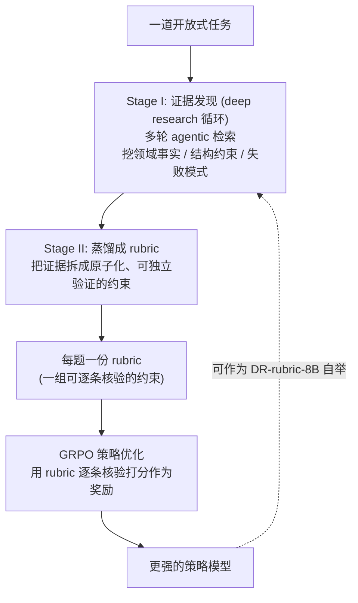

# DR-Rubric：把"深度研究"当成生成 RL 奖励 rubric 的方法

> **一句话**：DR-Rubric（Deep Research as Rubric）解决的是"**开放式推理与长文生成任务没有可靠自动验证信号、RL 不好给奖励**"的问题——它不再让人手写或让模型一把生成评分 rubric，而是**把"造 rubric"本身当成一个 deep research 任务**：用多轮 agentic 检索去挖掘领域事实、结构约束与典型失败模式，再蒸馏成一条条**原子化、可独立验证的约束**，作为 **GRPO** 的奖励信号来训练策略。它还能让小模型（DR-rubric-8B）在**不依赖前沿大模型**的情况下自举出可用的 rubric。
> 提出年份：2026（arXiv:2606.01091，2026-05-31）· 作者：Wangyi Mei, Zhouhong Gu, Yao Hu, Jiaqing Liang, Deqing Yang 等（复旦大学 / 小红书等团队，机构以原文为准）· 开源：meiotoufa/DR-Rubric
> 前置阅读：[Deep Research 总览](/agent/deep-research/) · [奖励模型](/rlhf/reward-model) · [GRPO](/rlhf/grpo) · [LLM-as-judge](/eval/llm-as-judge)

## 问题：开放式任务没有可靠的奖励信号

用 RL 训模型，前提是**能给每条回答打一个可信的分**。在有标准答案的任务上（数学、代码）这很容易——对就是对。但**开放式推理与长文生成**（写研究报告、回答专家级问题、给咨询建议）没有唯一正确答案，于是业界常用 **rubric（评分量表）**：把"什么是好回答"拆成若干条评分维度，逐条核对、加权成分。

问题在于 rubric 怎么来：

- **人工手写**：质量高但昂贵、难规模化，且写 rubric 的人未必覆盖得了每道题特有的、知识密集的细节。
- **让模型一把生成**：便宜，但常常**只给出泛泛的通用维度**（"是否清晰""是否全面"），**漏掉任务特定、需要专业知识才想得到的关键点**——比如某个医学问题里"有没有提到某个禁忌证"这种只有查过资料才知道该考的点。

**核心洞察**：要写出好 rubric，本身就需要"先去把这道题的领域知识、约束和坑研究一遍"——这不正是 deep research 干的事吗？于是论文提出：**把 rubric 的构造，重新表述成一个研究问题（reframe rubric construction as a research problem），用 agentic search 去系统性地发现外部知识**。

## 方法：两阶段的 DR-Rubric

### Stage I：把"研究这道题"做成 agentic 检索循环

针对每个任务，DR-Rubric 跑一段**多轮 agentic 搜索**（就是标准的 deep research 循环：搜 → 读 → 反思补检），目标不是回答问题，而是**为"如何评判这道题的答案"收集证据**：

- **领域事实（domain facts）**：这道题正确答案应当涉及的关键知识点；
- **结构约束（structural constraints）**：好回答在结构/格式/覆盖面上应满足的要求；
- **失败模式（failure modes）**：这类题常见的错法、易漏点、易被混淆处。

### Stage II：蒸馏成"原子化、可独立验证的约束"

把 Stage I 挖到的证据，蒸馏成一组 **atomic, independently verifiable constraints**——每条约束都小、具体、可单独判定真假（例如"是否引用了 X 指南""是否区分了 A 与 B 两种情况"）。这种原子化设计正是奖励信号好用的关键：**逐条 0/1 核验、再聚合**，比一个含糊的整体评分更稳、更抗噪，天然契合 RL 的需求。

### 用 GRPO 把 rubric 变成策略优化的奖励

得到 rubric 后，用 **[GRPO](/rlhf/grpo)（Group Relative Policy Optimization，组相对策略优化）** 训练策略：对同一问题采样一组回答，用 rubric 逐条核验给每个回答打分作为奖励，再用组内相对优势更新策略——无需单独训 value 网络，对这种"逐条核验聚合"出来的奖励尤其合适。本质上，DR-Rubric 是给 **rubric-based RL** 补上了"**rubric 从哪来、且要够专业**"这一最难的前置环节。

### 自举：让小模型也能造 rubric

论文一个值得注意的结果是 **DR-rubric-8B**——一个 8B 模型，在**不借助前沿大模型**的情况下，靠上述流程**自举（bootstrap）**出可用的 rubric。实验显示自举 rubric 会**逐轮变好**，在**第三轮迭代**达到整体最优。这意味着这套方法不必依赖昂贵的闭源大模型当"出题/评分老师"，可低成本自我增强。

## 评测与表现（以原文为准）

论文在 **6 个基准**上评测，横跨"agentic 研究类"与"专家推理类"两端，包括 **GPQA、MMLU-Pro、DeepResearchBench、ResearchQA、HealthBench** 等（具体清单与分数以 arXiv 原文为准）。关键结论：

- 仅用 **1K–3K 条训练样本**就能取得有竞争力的表现，数据效率高；
- 自举 rubric 逐轮改进，**第三轮**整体最优；
- 不同来源的 rubric 各有所长：论文观察到 **GPT-5 生成的 rubric 在覆盖广度上更强、Gemini 的 rubric 在两类任务上更均衡**——说明 rubric 的"出身"会系统性影响下游策略的偏向。

## 在 Deep Research 谱系里的位置

DR-Rubric 与本章其他工作的**角度不同**，值得单独标注：

- **它不是又一个"会写报告的深研 agent"**，而是**把 deep research 这套"自主检索—综合知识"的能力，用作 RL 的奖励工程工具**——研究的对象是"如何评判"，产物是 rubric，不是报告。
- **vs [LLM-as-judge](/eval/llm-as-judge)**：LLM-as-judge 是让强模型当裁判直接打分，容易带通用偏置、漏专业点；DR-Rubric 先**研究**出任务特定的可验证约束再打分，更细、更抗噪，且把裁判标准显式化、可核查。
- **vs [奖励模型](/rlhf/reward-model)**：传统 RM 学一个标量打分器；DR-Rubric 走"**可解释的原子约束核验**"路线，奖励来自一条条能被独立验证的规则，而非一个黑盒分数。
- 因此把它放在 Deep Research 章，是因为它**复用并扩展了深研的核心机制（agentic search + 综合）**，把这套能力外溢到了 RL 训练侧。整体定位见 [Deep Research 总览](/agent/deep-research/)。

## 参考文献

- Wangyi Mei, Zhouhong Gu, Zhenhan Bai, Yin Cai, Lefan Zhang, Zhenxin Ding, Bo Chen, Yan Gao, Yi Wu, Yao Hu, Jiaqing Liang, Deqing Yang. *Deep Research as Rubric for Reinforcement Learning.* arXiv:2606.01091, 2026-05-31. <https://arxiv.org/abs/2606.01091>
- 代码：<https://github.com/meiotoufa/DR-Rubric>
- 相关：DeepSeekMath, *GRPO*；rubric-based RL / LLM-as-judge 相关工作；GPQA、MMLU-Pro、DeepResearchBench、ResearchQA、HealthBench 等基准原文
