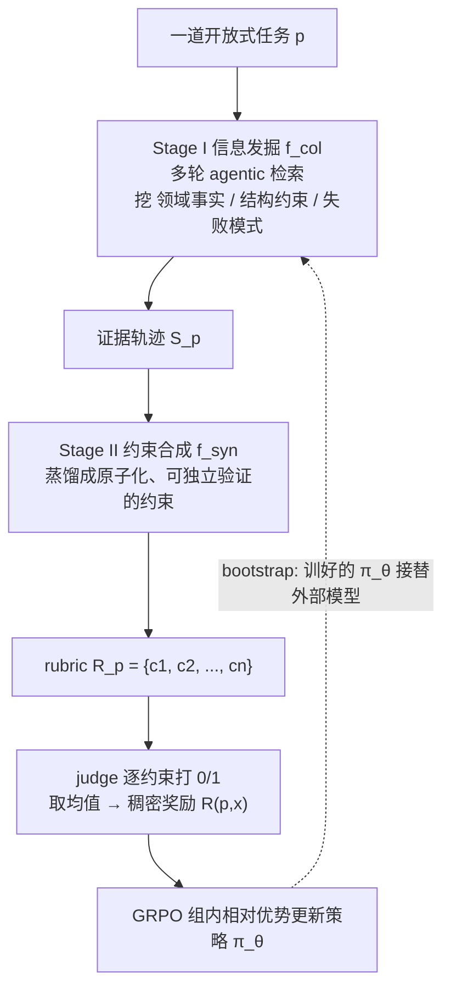

# DR-Rubric（复旦 / 小红书）：把"造 RL 奖励 rubric"重写成一个深度研究任务

**📄 [Deep Research as Rubric for Reinforcement Learning](https://arxiv.org/abs/2606.01091)**

2026-05 · 复旦大学 / 小红书 / 北京邮电大学 · [代码](https://github.com/meiotoufa/DR-Rubric)

**一句话**：把"给开放式任务写评分 rubric"本身当成一个 deep research 任务——用多轮 agentic 检索去挖领域事实、结构约束与失败模式，再蒸馏成一条条原子化、可独立核验的约束，喂给 GRPO 当奖励；还能让 8B 模型在不依赖前沿大模型的情况下**自举（bootstrap）**出自己的 rubric。

::: details 📖 论文原文 Abstract（英文）
Open-ended reasoning and long-form generation tasks lack reliable automatic verification signals for reward-based policy optimization. Rubrics offer a promising alternative, but existing approaches treat them as given artifacts—either hand-crafted or prompt-generated—and often miss the task-specific, knowledge-intensive dimensions that matter most, distorting the reward signal. Our key observation is that *rubric construction is itself a research problem*: identifying what makes a response correct or insightful requires discovering and synthesizing external knowledge. We propose **Deep Research as Rubric (DR-rubric)**, a two-stage framework for constructing such rubrics. Stage I elicits domain facts, structural constraints, and failure modes through iterative multi-turn agentic search; Stage II distills this evidence into atomic, independently verifiable constraints for GRPO-based policy optimization. Because the model under training can serve as its own rubric generator, DR-rubric-8B supports *bootstrap rubric generation* without frontier-model assistance. We evaluate on 6 benchmarks spanning agentic research and expert reasoning. Experiments show that DR-Rubric achieves strong competitive performance with only 1K–3K training instances, where GPT-5-generated rubrics particularly benefit breadth coverage on agentic tasks, Gemini-generated rubrics yield the most balanced performance across agentic and expert reasoning tasks, and bootstrap rubrics exhibit a specialization-to-rebalancing evolution achieving the best overall performance at the third iteration. Results demonstrate that reframing rubric construction from static evaluation templates into an evidence-driven research process yields more scalable, fine-grained reward signals for open-ended tasks.
:::

**相关**：[Deep Research 总览](/agent/deep-research/) · [Step-DeepResearch](/agent/deep-research/step-deepresearch) · [奖励模型](/rlhf/reward-model) · [GRPO](/rlhf/grpo) · [LLM-as-judge](/eval/llm-as-judge)

> 图源：Mei et al.（复旦/小红书）, *Deep Research as Rubric for Reinforcement Learning*（arXiv:2606.01091）Figure 1——DR-Rubric 整体框架：证据发掘 + 约束合成 + GRPO 训练 + bootstrap 自循环（用于学习注解，版权归原作者）。

## 动机与创新点：开放式任务没有可靠奖励，而"写好 rubric"本身就是 deep research

用 RL 训模型，前提是**能给每条回答打一个可信的分**。数学、代码这类有标准答案的任务上"对就是对"，很容易给奖励；但**开放式推理与长文生成**（写研究报告、回答专家级问题、给医学/咨询建议）没有唯一正确答案。业界常用 **rubric（评分量表）**——把"什么是好回答"拆成若干评分维度，逐条核对、加权成分——来补这个洞，作者称之为"把整体质量判断分解成细粒度、可解释的维度"。

问题在于 **rubric 从哪来**。论文把现有做法归为两类，且都有硬伤：

- **人工手写**：质量高、权威性强，但"labor-intensive ... clearly lacks long-term scalability and maintainability"，难以应对海量、多样的训练分布；写 rubric 的人也未必覆盖得了每道题特有的知识密集细节。
- **让模型一把生成（prompt-based）**：便宜可扩展，但"confines rubric quality to the model's internal parametric priors"——只能评到表层的文本连贯与清晰度，**漏掉任务特定、需专业知识才想得到的关键约束**。结果就是自动生成的 rubric 总在堆"是否清晰/是否全面/是否相关"这种通用维度。

**核心洞察**就一句话：

> Our key observation is that *rubric construction is itself a research problem*.

要判断"一个回答对某道题而言算不算正确、全面、有洞见"，本身就需要**先去发现、收集、综合外部知识**——这恰恰是 deep research 干的事。于是论文把 rubric 构造**重写成一个证据驱动的研究过程（reframes rubric construction as a two-stage, evidence-driven process）**，让一个 agentic research 模型对每道题先"研究一遍"，再把研究所得蒸馏成评分标准。

**关键创新**：

- **把"造 rubric"当 deep research**：不再让人或模型凭先验直接写量表，而是用多轮 agentic 检索为"如何评判这道题"显式收集证据（领域事实 / 结构约束 / 失败模式），再蒸馏成评分标准——criteria 来自外部事实而非预训练里的参数偏置。
- **两阶段框架 = 信息发掘 + 约束合成**：Stage I 产出 evidence trace $\mathcal{S}_p$，Stage II 把它蒸馏成一组**原子化、可独立验证的约束** $\mathcal{R}_p$，逐条 0/1 核验后聚合成稠密奖励，天然契合 GRPO。
- **Bootstrap 自举 rubric 生成**：训练中的策略模型本身可以充当 rubric 生成器，**DR-Rubric-8B 不依赖 GPT-5/Gemini 等前沿模型也能自造 rubric**，并随迭代变好——揭示出一条"专业化 → 再平衡（specialization-to-rebalancing）"的非单调演化轨迹。
- **数据效率极高 + 可解释**：仅 **1K–3K** 条 RL 样本就有竞争力（对比基线动辄 16K/25K/90K）；奖励来自一条条能被独立验证的规则，而非黑盒标量分。
- **过度自举有预警**：发现"奖励极化（reward polarization）"可在性能崩塌前一整轮预测出来，给出一条可操作的停机准则。

## 方法：两阶段 rubric 构造 + GRPO 奖励 + bootstrap 自循环

整套框架由三块串成：**自动 rubric 生成**（§3.1）、**带 rubric 的强化学习**（§3.2）、**bootstrap rubric 生成**（§3.3）。先看全景：

### Stage I：信息发掘——把"研究这道题"做成 agentic 检索循环

针对每个 query $p$，先跑一段**多轮 agentic 搜索**（标准 deep research 循环：query 制定 → 取证 → 反思补检），由生成模型 $m_{gen}$ 驱动、给定外部工具集 $\mathcal{T}$ 和最大交互预算 $k$，产出一条**证据轨迹（evidence trace）**：

$$\mathcal{S}_p = f_{col}(p, \mathcal{T}, k;\ m_{gen})$$

注意目标**不是回答问题，而是为"如何评判这道题的答案"收集证据**，包含三类内容：

- **领域事实（domain facts）**：正确答案应当涉及的关键知识点；
- **结构约束（structural constraints）**：好回答在结构 / 格式 / 覆盖面上应满足的要求；
- **失败模式（failure modes）**：这类题常见的错法、易漏点、易被混淆处。

论文强调它与普通 RAG 有两点本质不同：其一，目标是 **"requirement discovery rather than answer production"**——探索的是"什么会约束评判"而非"什么能直接解题"；其二，迭代结构让后面的检索建立在前面发现之上（"later queries build on earlier findings"），最终的 $\mathcal{S}_p$ 是一座连接"任务提示"与"评分标准"的显式中间表示。预算 $k$ 给检索轮数封顶，控制采集成本。

> 举例：对 query「每天推荐摄入多少糖？」，agent 不会去查一个数字了事，而是分头搜出三条证据——WHO 建议「游离糖 <10% 总能量」、「added sugar ≠ total sugar 需澄清」、「应给可操作的日常摄入指引」——这三条恰好对应后面 rubric 里的 Accuracy / Clarity / Guidance 三个维度。

### Stage II：约束合成——蒸馏成"原子化、可独立验证的约束"

一个**原子约束（atomic constraint）** $c$ 被定义为"不可再分的单一评判标准"。rubric 就是为 $p$ 量身定制的一组原子约束：

$$\mathcal{R}_p = \{c_1, c_2, \ldots, c_n\}$$

约束合成把非结构化的证据轨迹 $\mathcal{S}_p$ 蒸馏成这种形式，并用 $n_{max}$ 给 rubric 规模封顶，"防止过大的约束集带来冗余与噪声"：

$$\mathcal{R}_p = f_{syn}(\mathcal{S}_p, n_{max};\ m_{gen})$$

每条约束用自然语言写成**肯定式要求**或**否定式要求**两种之一，二者放在同一约束集里、不分类别也不差异加权，"只在语言形式上有别"：

> *affirmative requirement* ("the response should cover at least two efficient attention methods") or a *negation requirement* ("the response should not claim that standard attention is $O(n\log n)$").

原子化是这套奖励好用的关键：每条约束都小、具体、可单独判真假，于是能**逐条 0/1 核验、再聚合**，比一个含糊的整体评分更稠密、更抗噪、更契合 RL。论文还特别点出——约束**不是凭空启发式写的，而是可追溯到 $\mathcal{S}_p$ 里的具体证据元素**（"traceable to specific elements in $\mathcal{S}_p$"），这保证评分标准锚在外部事实上，而不是预训练里积累的参数偏置。

### 用 GRPO 把 rubric 变成策略优化的奖励

拿到 $\mathcal{R}_p$ 后，把它转成稠密奖励来优化策略模型 $\pi_\theta$，分两步：

**① 奖励计算。** judge 模型 $m_{judge}$ 对每条约束 $c$ 独立给一个离散判定 $J_c(x;\ m_{judge}) \in \{0, 1\}$（回答 $x$ 是否满足该约束），最终奖励取所有约束分的算术平均：

$$R(p, x) = \frac{1}{|\mathcal{R}_p|}\sum_{c\in\mathcal{R}_p} J_c(x;\ m_{judge})$$

这样"把多维质量评估摊到一条条原子标准上，而非给一个整体分"——回答靠选择性满足约束拿到**部分信用（partial credit）**，奖励比任务级二值反馈更稠密、更有信息量，且每个分量都对应一条可解释、源自 $\mathcal{S}_p$ 的要求。

**② 策略更新。** 用 **[GRPO](/rlhf/grpo)（Group Relative Policy Optimization）**：对同一 query $p$ 从当前策略采样 $G$ 条回答 $\{x_1, \ldots, x_G\}$，组内归一化奖励直接当优势估计，免去单独训 value 网络、也消除了跨 query 的奖励尺度差异：

$$A_i = \frac{R(p, x_i) - \mathrm{mean}(\{R(p, x_j)\}_{j=1}^G)}{\mathrm{std}(\{R(p, x_j)\}_{j=1}^G)}$$

再加一个 token 级 KL 近似把 $\pi_\theta$ 拴在参考模型 $\pi_{ref}$ 附近，防止跑飞：

$$\mathrm{KL}_{prac}(x_i) = \frac{1}{|x_i|}\sum_{j=1}^{|x_i|}\bigl(\log \pi_\theta(x_{i,j}\mid p, x_{i,<j}) - \log \pi_{ref}(x_{i,j}\mid p, x_{i,<j})\bigr)$$

最终目标函数是带裁剪的概率比目标加 KL 罚（$\epsilon$ 控裁剪范围、$\beta$ 控 KL 罚系数）：

$$\mathcal{L}(\theta) = \frac{1}{G}\sum_{i=1}^{G}\left(\min\left(\frac{\pi_\theta(x_i\mid p)}{\pi_{\theta_{old}}(x_i\mid p)}A_i,\ \mathrm{clip}\left(\frac{\pi_\theta(x_i\mid p)}{\pi_{\theta_{old}}(x_i\mid p)}, 1-\epsilon, 1+\epsilon\right)A_i\right) - \beta\cdot\mathrm{KL}_{prac}(x_i)\right)$$

本质上，DR-Rubric 是给 **rubric-based RL** 补上了"**rubric 从哪来、且要够专业**"这一最难的前置环节——奖励工程的重心从"怎么用 rubric"前移到了"怎么造 rubric"。

### Bootstrap：让小模型接替前沿大模型，自己造 rubric

Stage I 的 $m_{gen}$ 通常是 GPT-5 / Gemini 这类强外部模型，"持续调用闭源大模型成本高、限制可扩展性"。Bootstrap 的思路是**切断这个依赖**：随着策略 $\pi_\theta$ 自身推理能力变强，它逐渐有资格接管 rubric 生成的活。第 $t$ 轮里，当前策略 $\pi_{\theta_t}$ 直接顶替 $m_{gen}$ 去做证据收集与约束合成，为新 query 造定制 rubric：

$$\mathcal{R}_{p,t} = f_{syn}\bigl(f_{col}(p, \mathcal{T}, k;\ \pi_{\theta_t}),\ n_{max};\ \pi_{\theta_t}\bigr)$$

这组自造 rubric 再当奖励源，驱动下一轮策略更新，形成一个自改进递归：

$$\pi_{\theta_{t+1}} = \mathrm{GRPO}(\pi_{\theta_t},\ \mathcal{R}_{p,t})$$

"as $\pi_{\theta_t}$ improves, its generated rubrics also improve in quality"——策略越强、它给出的 rubric 越精准、对下一轮的监督信号越好。论文实测这个环**非单调**：第一步（BS-1）自造 rubric 因为"贴近模型自身能力边界、施加更强优化压力"，先把专家推理顶到很高（GPQA 57.0、MMLU 84.0），但同时触发**向推理的能力专业化、牺牲了 agentic 任务**；后续迭代再逐步"再平衡"修复这种失衡——到 **BS-3** 不靠任何外部模型就追平/超过 GPT-5 辅助的专家推理质量（MMLU-Pro 78.0、MMLU 85.3）。

> 图源：Mei et al.（复旦/小红书）, *Deep Research as Rubric for Reinforcement Learning*（arXiv:2606.01091）Figure 3——Bootstrap 的性能与 rubric 结构演化，呈"专业化→再平衡"的非单调轨迹（用于学习注解，版权归原作者）。

## 实验结果：6 基准、仅 1K–3K 样本，三类 rubric 各擅胜场

### 评测设置

在 **6 个基准**上评测，横跨两端：**agentic 研究类**——ResearchQA、DeepResearchBench（DRBench）、LocalSearchBench；**专家推理类**——GPQA、MMLU-Pro、MMLU。所有评测用统一的 mock 检索后端保证可复现（附录验证了与真实 web 检索的一致性）。被训模型统一从 **Qwen3-8B-SFT**（在 1K ReAct 格式轨迹上微调、用于对齐多轮工具调用格式）出发，再用 GRPO 在每步 1K 实例上做 rubric 奖励优化；group size $G=4$、clip $\epsilon=0.28$、KL 系数 $\beta=0.001$、学习率 $5\times10^{-6}$、16×H800。三个变体只差 rubric 来源：**Gemini 生成 / GPT-5 生成 / bootstrap（BS-1~3）**。

### Benchmark 表现（以原文为准）

主表对比 DR-Rubric-8B 与 SFT、web-agent RL、outcome-based RL 等基线（同样基于 Qwen3-8B-SFT）：

| 方法 | 训练量 | ResearchQA | DRBench | LocalSearch | GPQA | MMLU-Pro | MMLU |
| --- | --- | --- | --- | --- | --- | --- | --- |
| Qwen3-8B-SFT | SFT 1K | 69.9 | 39.4 | 36.0 | 50.8 | 73.8 | 81.8 |
| Search-R1-7B | RL 90K | 63.1 | 33.6 | 34.2 | 39.0 | 68.0 | 78.0 |
| DR-Tulu-RL-8B | SFT+RL 25K | 67.1 | 35.5 | 36.5 | 44.0 | 69.0 | 79.0 |
| WebExplorer-8B | SFT+RL 25K | 66.1 | 37.3 | 36.8 | 56.0 | 71.5 | 83.8 |
| **DR-Rubric-8B（Gemini）** | **SFT+RL 1K** | 71.7 | 41.5 | **40.0** | **57.3** | 75.0 | 83.8 |
| **DR-Rubric-8B（GPT-5）** | **SFT+RL 1K** | **73.7** | **43.0** | 37.1 | 54.0 | 74.8 | 80.3 |
| **DR-Rubric-8B（BS-3）** | **SFT+RL 3K** | 72.4 | 39.5 | 36.4 | 55.8 | **78.0** | **85.3** |

关键结论：

- **数据效率碾压**：GPT-5/Gemini 变体各只用 **1K** RL 实例、BS-3 用 **3K**，却全面超过用 16K（DR-Tulu-SFT）、25K（DR-Tulu-RL、WebExplorer）、90K（Search-R1）的基线。论文一句话点题——**"Better reward structure beats larger trajectory supervision"**（更好的奖励结构胜过更大的轨迹监督），即增益来自 rubric 质量而非监督规模。
- **三类 rubric 分工互补**：**GPT-5 重广度**——ResearchQA 73.7（+3.8）、DRBench 43.0（+3.2）领跑 agentic，因其 rubric 维度多、覆盖广；**Gemini 最均衡**——LocalSearch 40.0、GPQA 57.3 两端最佳，"agentic 与 expert 全面兼顾"；**bootstrap 重深度**——BS-3 拿下 MMLU-Pro 78.0、MMLU 85.3，把通用推理推到最高。
- **能力外溢到专家推理**：rubric-based RL 的收益不止于 agentic 检索，还迁移到了 GPQA/MMLU 等纯推理基准。
- **可放大到更大模型**：把同一 bootstrap 流水线套到 Qwen3-14B、Qwen3-30B-A3B 上同样稳定超过同规模基线（含 DeepSeek-R1-Distill-Qwen-14B、WebThinker-R1-14B、Tongyi-DeepResearch-30B-A3B），说明框架不限于 8B。

> 图源：Mei et al.（复旦/小红书）, *Deep Research as Rubric for Reinforcement Learning*（arXiv:2606.01091）Figure 2——训练效率，DR-Rubric 用远少的数据取得更强结果（用于学习注解，版权归原作者）。

### rubric 来源消融与 bootstrap 稳定性

固定其余因素（Qwen3-8B-SFT + GRPO + 原子 rubric 奖励）、只换 rubric 来源做消融，论文还挖出几条值得记的观察：

- **"协议对齐"≠"最优奖励"**：benchmark-native rubric（直接取测试集自身评分标准，与测试协议天然对齐）拿到不错的 agentic 分（ResearchQA 73.2、DRBench 42.6），但**不是上界**——GPT-5/Gemini/bootstrap 在多个基准上都超过它。结构粗、覆盖维度有限、约束粒度不当，即使"对齐协议"仍可能是次优学习信号。
- **内在 rubric 质量解释下游差异**（1000 条/来源）：GPT-5 rubric 平均 **6.50 维 / 24.39 约束**、每约束仅 4.8 词但 96.4% 可验证、98.8% 带数值/公式——"多轴 + 短而可验证"正是它覆盖广的根源；benchmark-native 只有 2.81 维 / 8.90 约束。bootstrap 则**朝相反方向演化**：维度从 4.68 降到 3.61、约束变长（14.7→23.6→21.7 词）、可验证率从 3.8% 跳到 41.7% 再饱和——这种结构漂移直接解释了"专业化→再平衡"的非单调表现。
- **过度自举有崩溃风险，但可预警**：把 bootstrap 故意推到 BS-4/BS-5 当压力测试，30B-A3B 上 agentic 分从 51.3 崩到 22.7、BS-5 梯度死亡。作者用**奖励极化（reward polarization，极端分 0 或 ≥0.99 的占比）**作早警信号——它在性能崩塌**前一整轮**越过阈值，给出停机准则 $\tau_n = \max(0.15,\ 2P_{n-1})$，$P_n > \tau_n$ 即停。结论是 **2–3 轮 bootstrap 收益最大**，再往后"reward hacking"会主导。

> 图源：Mei et al.（复旦/小红书）, *Deep Research as Rubric for Reinforcement Learning*（arXiv:2606.01091）Figure 4——奖励极化在下游崩溃前一轮越过停机阈值（30B-A3B，BS-4/5 为压力测试非选用模型）（用于学习注解，版权归原作者）。

> 看榜须知：这些分数的口径、mock 检索后端、judge 配置、test-time 设置各异，**跨系统直接比绝对值意义有限**；当作"同期 8B 档 rubric-RL 数据效率与能力分布的量级参照"即可。

## 在 Deep Research 谱系里的位置

DR-Rubric 与本章其他工作的**角度不同**，值得单独标注：

- **它不是又一个"会写报告的深研 agent"**，而是**把 deep research 这套"自主检索—综合知识"的能力，用作 RL 的奖励工程工具**——研究的对象是"如何评判"，产物是 rubric，不是报告。它把深研机制从"产出端"挪到了"训练端"。
- **vs [Step-DeepResearch](/agent/deep-research/step-deepresearch) 的 Rubrics Judger**：两者高度相通——Step 同样把"开放式报告好不好"拆成原子化、可验证的 checklist rubric 当 RL 奖励，也同样要解决"rubric 从哪来"。差异在落点：Step 用"两步逆向合成 + 非对称二值化"批量造 (任务, rubric) 来训一个 32B 深研模型；DR-Rubric 则把 rubric 构造显式做成 agentic 检索过程，并进一步走到"**让被训模型自己 bootstrap 出 rubric**"。可对照阅读——开放式深研越来越靠"多维 rubric/checklist"而非单一分数，是这一代工作的共识。
- **vs [LLM-as-judge](/eval/llm-as-judge)**：LLM-as-judge 让强模型当裁判直接打分，容易带通用偏置、漏专业点；DR-Rubric 先**研究**出任务特定的可验证约束再逐条核验，更细、更抗噪，且把裁判标准显式化、可核查。
- **vs [奖励模型](/rlhf/reward-model)**：传统 RM 学一个黑盒标量打分器；DR-Rubric 走"**可解释的原子约束核验**"路线，奖励来自一条条能被独立验证的规则。自改进维度上，它与自我对弈式 RM 也不同——self-improvement 类方法的反馈多是标量/偏好/原则级，"告诉模型回答好不好，但不说该满足什么任务特定标准"，DR-Rubric 自举出的恰是**结构化、约束级**的评分规范。
- 因此把它放在 Deep Research 章，是因为它**复用并扩展了深研的核心机制（agentic search + 综合）**，把这套能力外溢到了 RL 训练侧。整体定位见 [Deep Research 总览](/agent/deep-research/)。
