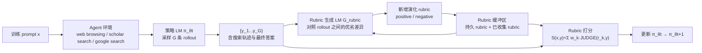
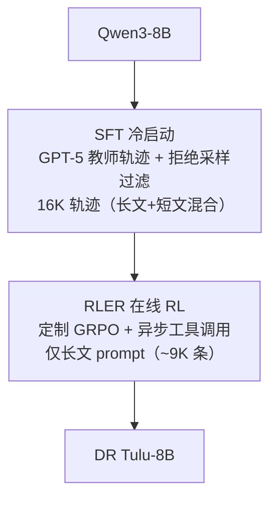

# DR Tulu（华盛顿大学 / AI2）：Rubric 跟着策略模型共同进化，训出首个开源长文深度研究模型

**📄 [DR Tulu: Reinforcement Learning with Evolving Rubrics for Deep Research](https://arxiv.org/abs/2511.19399)**

2025-11 · 华盛顿大学 · Allen Institute for AI（AI2）· CMU · MIT 等 · [代码](https://github.com/rlresearch/dr-tulu)

**一句话**：现有开源深研 agent 大多只在"有标准答案"的短文 QA 上用可验证奖励做 RL，训出来的能力很难迁移到真正开放式的长文报告任务；DR Tulu 提出 **RLER（Reinforcement Learning with Evolving Rubrics）**——让评分 rubric 在训练过程中随策略模型的 rollout 持续演化，靠检索证据核事实、靠同批候选回答互相对照发现优劣与作弊——训出的 8B 模型在四个长文深研基准上平均反超最强开源基线 15.6 分，逼平甚至反超 OpenAI Deep Research，单次查询成本却只有其千分之一。

::: details 📖 论文原文 Abstract（英文）
Deep research agents perform multi-step research to produce long-form, well-attributed answers. However, most open deep research agents are trained on easily verifiable short-form QA tasks via reinforcement learning with verifiable rewards, which does not extend to realistic long-form tasks. We address this with **Reinforcement Learning with Evolving Rubrics (RLER)**, where rubrics are constructed and maintained to *co-evolve* with the policy model during training. This allows the rubrics to incorporate newly explored information from search and contrasting model responses, enabling better fact checking and more discriminative on-policy feedback. Using RLER, we develop **Deep Research Tulu (DR Tulu-8B)**, the first open model that is directly trained for open-ended, long-form deep research. Across four long-form deep research benchmarks in science, healthcare, and general domains, DR Tulu substantially outperforms existing open deep research agents (by 15.6% over Tongyi DR on average) and matches or exceeds proprietary deep research systems (by 0.7% over OpenAI DR on average), while being significantly smaller and cheaper per query (1000× cheaper than OpenAI DR per query).
:::

**相关**：[Deep Research 总览](/agent/deep-research/) · [Tongyi DeepResearch](/agent/deep-research/tongyi-deepresearch) · [QUEST](/agent/deep-research/quest) · [DR-Rubric](/agent/deep-research/dr-rubric) · [Co-ReAct](/agent/deep-research/co-react) · [Rubric 化评测与训练](/eval/rubrics)

> 图源：Shao et al., *DR Tulu: Reinforcement Learning with Evolving Rubrics for Deep Research*（arXiv:2511.19399）Figure 1——性能与推理成本的帕累托对比（用于学习注解，版权归原作者）。

## 动机与创新点：可验证奖励训不出长文深研，rubric 又长期困于"人工手写"或"闭卷生成"

深研（DR）agent 要靠规划、搜索、跨源综合来产出有据可查的长文答案。作者指出现有开源 DR agent 分两类，都不满足"直接为开放式长文训练"这一需求：

- **训练无关（training-free）**：用现成模型配手写 prompt，能力上限被底座模型锁死。
- **RLVR（可验证奖励 RL）**：在**搜索密集但受限于短文**的问答任务上训练——如 Search-R1、ASearcher 一类工作，優化目标是"答案是否精确匹配 gold answer"。

RLVR 训练之所以难以直接扩展到开放式长文任务，根子在于**可靠奖励信号本身就难定义**：

> The desiderata for good responses are often under-specified ... and therefore hard to fully capture with static, pre-defined evaluation criteria. Moreover, accurate assessment often requires access to extensive and up-to-date external information beyond a model's parametric knowledge.

Rubric（把"什么是好回答"拆成一组可核验的加权标准）看似是天然解法，但论文观察到现有 rubric 训练方法普遍依赖两条腿走不远的路：**要么靠人工专家书写并迭代打磨 rubric，要么假设训练时能拿到参考答案**——这两条都无法规模化到海量、持续变化的长文深研数据分布。而自动生成又面临两个具体难点：

- **长文问题本身欠约束**：同一个开放式问题可能有多种同样合理的"好答案"形态，一套固定的小规模评分标准不足以覆盖。
- **深研任务知识密集**：判断一个论断对不对，往往需要接入模型参数之外、且在不断更新的外部知识；一个**闭卷、静态**的 LM 生成 rubric——不接触任何检索证据——"容易漏掉证据、放过细微错误，还容易被 reward hacking 钻空子"（*closed-book static LM-generated rubrics risk missing evidence, subtle errors, and are vulnerable to reward hacking*）。

**关键创新**：

- **RLER（Reinforcement Learning with Evolving Rubrics）**：让 rubric 具备三个特性——**实例特定（instance-specific）**、**扎根外部知识（grounded in external knowledge）**、且**与策略模型共同进化（co-evolve with the policy model）**，而非训练前一次性生成、训练中一成不变。
- **给 rubric 生成器"特权信息"制造生成-验证 gap**：一是**多路搜索 rollout 检索到的外部知识**，用来核实事实；二是**同一 prompt 下多条独立采样的模型回答**，提供可对照的相对优劣信号——rubric 生成器看到的信息比被评估的策略模型本身更多，这个信息差正是 rubric 能"抓得住"策略漏洞的来源。
- **正/负两类演化 rubric**：正向 rubric 捕捉当前策略已经探索到、但尚未被现有 rubric 池覆盖的优点或新知识；负向 rubric 则总结从批量回答里观察到的**共性作弊行为**（如逐字照抄检索内容以刷高引用精度），显式压制 reward hacking。
- **rubric 缓冲区管理**：按"判别力"（rubric 在同批 rollout 打分上的方差）筛选、合并、排序，把无区分度（零方差）的 rubric 剔除，只保留固定数量、方差最高的 rubric，防止 rubric 池随训练无限膨胀。
- **DR Tulu-8B**：首个**端到端**针对开放式长文深研训练的开源模型（SFT 冷启动 + RLER RL），配套开源全套基础设施 `dr-agent-lib`，并自建面向临床遗传学的评测集 **GeneticDiseasesQA**。

## 方法：搜索增强的演化 rubric + rubric 缓冲区管理 + SFT 冷启动/RL 训练配方

### RLER 总览：rollout → 生成新 rubric → 打分更新策略 → 更新 rubric 池

RLER 的核心循环围绕一个不断迭代的"rubric 池"展开。给定训练 prompt $x$，rubric 池 $\mathcal{R}_x = \mathcal{R}_x^{\text{persist}} \cup \mathcal{R}_x^{\text{active}}$ 由**持久 rubric**（训练前生成，全程不变）与**当前活跃的演化 rubric**共同组成。

在每一步，对 prompt $x$ 及其对应的一组回答 $\{y_i\}_{i=1}^G$（$G$ 为 rollout 数），把 prompt、全部采样回答（含搜索上下文与最终答案）、以及既有 rubric 池 $\mathcal{R}_x$ 一起喂给 rubric 生成 LM $\mathcal{G}_{\text{rubric}}$，得到一组**演化 rubric** $\mathcal{R}_x^{\text{new}} = \mathcal{G}_{\text{rubric}}(x, \{y_i\}_{i=1}^G, \mathcal{R}_x)$。具体要求 LM 生成两类 rubric：

- **正向 rubric（positive）**：捕捉当前策略展现出的优点，或者已被探索到、但还未被 $\mathcal{R}_x$ 覆盖的新知识/相关信息；
- **负向 rubric（negative）**：总结在这批回答里观察到的共性不良行为——如"逐字复制检索内容以刷高引用精度"这类 reward hacking，可被识别并压制。

> 图 2 里的具体例子：三条同批 rollout 里，$y_1$ 说"T 细胞抑制巨噬细胞 TNF-α（经 STAT3 激活）"，$y_2$ 说"系统性 IL-6 并未升高、未观察到细胞因子释放综合征"，$y_3$ 则声称"一个抗炎信号反而增加了促炎信号"。生成器据此产出 $r_1$（正向，肯定 $y_1$ 提到 STAT3 激活这一细节）、$r_2$（正向，肯定 $y_2$ 的细胞因子释放综合征判断）、$r_3$（负向，判定 $y_3$ 关于抗炎信号增加促炎信号的说法系"错误论断"）——正是靠**同批候选互相对照**才发现了这类需要被压制的错误。

> 图源：Shao et al., *DR Tulu*（arXiv:2511.19399）Figure 2——RLER 训练循环：rollout 采样 → rubric 演化生成 → rubric 打分 → 策略更新（用于学习注解，版权归原作者）。

### 初始化：用搜索结果生成持久 rubric

训练开始前，先为每个训练 prompt $x$ 建一个**定制化的 rubric 缓冲区**。具体做法：对 $x$ 执行 $\text{SEARCH}(x)$，用网络搜索 API 检索到相关文档，再把这些检索文档与问题 $x$ 一起喂给 rubric 生成 LM $\mathcal{G}_{\text{rubric}}$，产出一组**持久 rubric** $\mathcal{R}_x^{\text{persist}} = \{R_1, R_2, \ldots, R_{K_s}\}$，在全程 RL 训练中始终保留、不被淘汰——这批 rubric 的作用是把"该问题客观应该覆盖哪些事实"这层基础判据先钉死，避免后续演化 rubric 全部聚焦在策略当前表现上而丢失广度。

### Rubric 打分公式

对问题 $x$ 与其 rubric 集合 $\mathcal{R}_x = \{(r_{x,k}, w_{x,k})\}_{k=1}^K$（$r_{x,k}$ 是第 $k$ 条 rubric 条目，$w_{x,k} \in \mathbb{R}$ 是其权重），最终响应 $y$ 的评分为：

$$S(x,y) = \frac{\sum_{k=1}^K w_{x,k}\, \text{JUDGE}(r_{x,k}, y)}{\sum_{k: w_{x,k}>0} w_{x,k}}$$

每条 rubric 由一个 judge LM 独立打分，输出 $\{0, 0.5, 1\}$ 中的一个值，衡量 $y$ 对该条 rubric 的满足程度。作者强调用 rubric 当奖励的关键优势在于：**rubric 的条目具体、定义明确，天然降低了 judge 模型自身偏置的影响，使不同 LLM-as-judge 跑次之间的打分更一致、更可比**。

### Rubric 缓冲区管理：按判别力筛选、去重、限量

没有约束的话，rubric 数量会随训练线性增长。为维持一个**紧凑但信息量高**的集合，论文设计了一套按**判别力（discriminative power）**筛选、合并、排序的缓冲区管理策略：

1. 每轮 GRPO rollout 后，用当前活跃 rubric 给全部 $\{y_i\}_{i=1}^G$ 打分，得到每条 rubric 在这批回答上的打分；
2. **零方差的 rubric 直接移除**——所有回答在这条 rubric 上打分一致，说明它对当前策略毫无区分力；
3. 对剩余 rubric 按打分的**标准差降序排列**，只保留标准差最高的 **$K_{\max}$** 条，控制评测成本的同时保留最有信息量的判据。

除了 rubric 本身的奖励，论文还引入三项**辅助奖励**——格式（format）、搜索（search）、引用（citation）——分别鼓励正确的输出格式、有效使用搜索工具、以及生成有高质量引用支撑相关论断的回答（细节见论文附录 D.5）。

### DR Tulu 训练配方：`dr-agent-lib` 基础设施 + SFT 冷启动 + RLER 在线 RL

在 RLER 之上，作者从 **Qwen3-8B** 出发训练 DR Tulu-8B，动作空间定义为 `{think, tool, answer, cite}`：模型每步采样一个动作，若属于 `{think, answer, cite}` 就把输出追加进上下文；若是 `tool`，则执行工具调用、把返回结果追加进上下文，循环直到选择 `answer` 产出最终答案。

**Agent 基础设施 `dr-agent-lib`**：一个可扩展、面向搜索/浏览的 agent 库，三个核心特性——(i) 统一的、基于 MCP 的工具后端，整合本地与 API 两类网络搜索/浏览工具；(ii) 高并发后端，含全局缓存与异步进程锁，支撑限速感知的高效工具调用；(iii) 轻量可组合的 prompt 层，可细粒度控制搜索工作流与配置。训练时实现的自动搜索工作流包含三个工具：`google_search`（query → 网页摘要片段）、`web_browse`（URL → 抓取网页正文）、`paper_search`（query → 论文段落）。

**SFT 冷启动**：目标是从教师模型蒸馏常见搜索模式，为初始模型打底、加速后续 RL 收敛。Prompt 兼顾长文与短文两类：

- 长文 query 来自 **SearchArena** 与 **OpenScholar** 的真实用户提问（分别覆盖通用领域与科学领域），并用一个 LM 对每条 prompt 按 1–5 分打分做质量过滤；
- 短文 query 取自 HotpotQA、TaskCraft、WebWalker-Silver、MegaScience 等既有数据集，并补充受 PopQA 启发的高难合成 prompt。

对每条 prompt，指导 **GPT-5** 生成包含模拟推理、工具使用与最终答案的完整轨迹（system prompt 里指定前述自动搜索工作流），再做两道拒绝采样过滤：(i) 只保留符合预期"工具调用+答案"格式的轨迹；(ii) 对短文 prompt，剔除最终答案与 gold answer 不匹配的轨迹。最终得到 **16K** 条 SFT 轨迹。

**在线 RL：异步工具调用的定制版 GRPO**。RL 阶段只针对长文问题训练：沿用与 SFT 相同的 LM 过滤流程，从 SearchArena 与 OpenScholar 收集约 **5K** 条 prompt，再加约 **4K** 条来自 **RaR** 的 prompt 以增加多样性（RaR 的 prompt 训练时直接用数据集自带的 rubric 初始化，而非重新做搜索式生成，但仍保留训练中演化 rubric 的机制）。RL 基于 **GRPO**（Open-Instruct 实现）的定制版本，结合 token 级 loss、1-step 异步训练、工具输出屏蔽（tool output masking）与样本打包（sample packing）以提升效率；并采用**异步工具调用**——工具请求在 rollout 生成过程中一触发即被派发，而不必等待整批完成，减少长程工具交互场景下的流水线阻塞。

## 实验结果：四个长文基准平均超最强开源基线 15.6 分，成本仅闭源系统千分之一

### 评测设置

- **四个长文、开放式基准**：**HealthBench**（医疗健康）、**ResearchQA**、**AstaBench-ScholarQA-CS2（SQAv2）**（科学文献综合）、**DeepResearchBench（DRB）**（通用领域深研）。均要求长文回答，用人工撰写或人工核验过的 rubric，按官方协议评测。
- **三类基线**：① **开源深研模型**——ASearcher-7B、WebThinker-32B、Search-R1-7B、WebExplorer-8B、Tongyi DeepResearch-30B-A3B（这些模型的训练主要针对短文 QA，长文任务上只是喂入官方评测 prompt、要求输出报告式回答）；② **固定流水线深研**——WebThinker-32B（report 模式）、Ai2 ScholarQA（用固定推理时流水线接现成 LM，跑其官方实现的默认/推荐设置）；③ **闭源深研**——OpenAI Deep Research、Perplexity Sonar（reasoning）、Claude-Sonnet Search、Gemini 3 Pro + Search。

### 主结果（Table 1，以原文为准）

| 分组 | 系统 | SQAv2 | HealthBench | ResearchQA | DRB | Average |
| --- | --- | --- | --- | --- | --- | --- |
| 闭源深研 | Claude-Sonnet Search | – | – | 64.3 | 34.5 | – |
| 闭源深研 | Perplexity-Sonar（High） | – | – | 69.1 | 40.7 | – |
| 闭源深研 | Perplexity Deep Research | 67.3 | – | 75.3 | 42.3 | – |
| 闭源深研 | Gemini Deep Research | – | – | 68.5 | 48.8 | – |
| 闭源深研 | Gemini 3 Pro + Search | 69.8 | 38.0 | 74.3 | 46.3 | 57.0 |
| 闭源深研 | GPT-5 + Our Search | 61.1 | 31.1 | 62.8 | 50.3 | 51.3 |
| 闭源深研 | GPT-5 + Search | 74.8 | 59.5 | 78.2 | 50.7 | 65.8 |
| 闭源深研 | OpenAI Deep Research | 79.6 | 53.8 | 79.2 | 46.9 | 64.9 |
| Naive RAG | Qwen3-8B | 40.4 | 16.5 | 56.1 | 33.3 | 36.5 |
| Naive RAG | QwQ-32B | 41.9 | 24.5 | 60.9 | 40.3 | 41.9 |
| 开源深研模型 | Search-R1-7B | 22.2 | -0.1 | 27.9 | 9.5 | 14.9 |
| 开源深研模型 | ASearcher-Web-7B | 26.9 | -13.0 | 19.4 | 7.8 | 10.3 |
| 开源深研模型 | WebExplorer-8B | 42.5 | 33.7 | 64.8 | 36.7 | 44.4 |
| 开源深研模型 | WebThinker-32B-DPO | 32.9 | 11.1 | 48.6 | 23.3 | 28.9 |
| 开源深研模型 | Tongyi DeepResearch-30B-A3B | 46.5 | 46.2 | 66.7 | 40.6 | 50.0 |
| 固定流水线深研 | WebThinker QwQ-32B（report） | 45.2 | 36.5 | 72.8 | 37.9 | 48.1 |
| 固定流水线深研 | WebThinker-32B-DPO（report） | 46.7 | 39.4 | 74.2 | 40.6 | 50.2 |
| 固定流水线深研 | Ai2 ScholarQA - Claude Sonnet | 87.7 | 32.0 | 75.0 | 36.1 | 57.7 |
| **开源深研（本文）** | Qwen3-8B + Our Search | 57.2 | 5.9 | 46.3 | 18.2 | 31.9 |
| **开源深研（本文）** | DR Tulu-8B（SFT） | 72.3 | 38.1 | 68.5 | 39.0 | 53.9 |
| **开源深研（本文）** | **DR Tulu-8B（RL）** | **88.3** | **52.8** | **75.7** | **45.4** | **65.6** |

（HealthBench 允许负分，因为其 rubric 含惩罚性负向条目；* 号数据为原基准作者自报、† 号为在 100 条子集上评测，均以原文为准）

**DR Tulu-8B 在长文任务上超过全部开源深研模型**：RL 版本平均分 65.6，比此前最强开源基线 Tongyi DeepResearch-30B 高 **15.6 分**。以短文任务为主要训练目标的模型（Search-R1、ASearcher）在真实报告长度的生成任务上表现很差，且现有开源基线普遍缺乏引用能力，导致 SQAv2（尤其看重引用质量）上得分极低。

**DR Tulu-8B 也超过开源固定流水线深研系统**：WebThinker-32B 用重度工程化的 report 模式推理，相比默认模式提升 +21.3 分，但每个基准仍不敌 DR Tulu-8B，尽管其骨架模型达 32B；Ai2 ScholarQA 用闭源 Claude Sonnet 底座、专为科学文献综合设计，在 SQAv2 上具竞争力，但 HealthBench 与 DRB 上落后，平均分更低。

**DR Tulu-8B 匹配或超越闭源深研系统**：在 SQAv2 上取得所有系统里的最强表现；在其余长文基准上匹配或超过多数闭源深研系统——超过 Claude Sonnet Search、Perplexity Sonar（高推理档）、Perplexity Deep Research，与 OpenAI Deep Research 总体相当。作者也观察到 GPT-5 + Search 与 Gemini 3 Pro + Search 在部分数据集上优于对应的"深研变体"，说明底座模型能力本身仍对结果有重要影响，但**一个仅 8B 的开源模型能与这些更大规模的专有系统打平甚至反超**，证明了训练配方本身的有效性。

### 成本：比闭源系统便宜三个数量级，比同类开源模型也更省

DR Tulu-8B 单次查询成本 **仅算工具 API 时 $0.00008**，加上通过 OpenRouter 计的 LM 推理成本（按 Qwen3-8B 定价）也只有 **$0.0018**；相比之下 OpenAI Deep Research 在 SQAv2 上单次查询约 **$1.80**，Ai2 ScholarQA（Claude Sonnet）约 **$1.30**——DR Tulu-8B 比 OpenAI Deep Research 便宜约 **1000 倍**。它也比其他开源深研模型更省：Tongyi Deep Research 约 $0.03/query，WebThinker 约 $0.003/query（report 模式 $0.015/query）。这个成本优势来自**自适应的工具调用**：在 SQAv2 上 DR Tulu-8B 90% 的时间使用免费的 `paper_search`；在覆盖更广泛通用主题的 DRB 上，则约 55% 的时间转而依赖 web 搜索与浏览，说明模型学会了**按任务性质切换搜索工具**，而不是像先前工作那样死绑一种检索方式。

### 应用案例：GeneticDiseasesQA——致病基因变异的临床深研

为在真实、专家驱动的深研任务上评估 DR Tulu，作者与医学专家合作，聚焦**临床遗传学中的致病变异解读**，构建了 **GeneticDiseasesQA**——覆盖 **24 个致病基因变异**的 **47 道专家撰写问题**，要求模型从生物数据库、研究文献、病例报告等异构证据源里聚合信息，聚焦分子后果、疾病机制、治疗证据三类内容，产出长文、带引用的报告。评测按四个维度打分：**Final Answer**（专家标注事实的覆盖率）、**Evidence Support**（引用是否被原文完整支持）、**Evidence Quality**（是否给出所需类型的支持性证据）、**Evidence Synthesis**（是否给出跨多来源关系的综合陈述）。

> 图源：Shao et al., *DR Tulu*（arXiv:2511.19399）Figure 3——GeneticDiseasesQA 上多系统的四维度对比（用于学习注解，版权归原作者）。

结果显示 DR Tulu-8B 在**全部指标上大幅超过 Qwen3-8B 基线**，并在 **Final Answer 正确性**上超过 Ai2 ScholarQA；虽然 GPT-5 与 Gemini 系统在 Final Answer 分数上更高，DR Tulu-8B 在 **Evidence Support / Evidence Quality / Evidence Synthesis** 上都保持竞争力，凸显其在**跨源可靠推理**上的相对优势。这一结果表明 DR Tulu-8B 能有效泛化到未见过的、真实专家领域深研任务。

### 短文 QA 泛化：只用长文数据做 RL，短文能力反而继续提升

尽管 RLER 训练目标只针对长文，但 SFT 混合数据里刻意保留了需要搜索的短文可验证 QA 任务，用来考察是否会牺牲简洁问答能力。评测集为 **SimpleQA**、**WebWalkerQA**、**2Wiki**（各随机采 1000 题，GPT-4.1 当 judge 报告 Pass@1）：

| | SimpleQA | 2Wiki | WebWalker | Avg. |
| --- | --- | --- | --- | --- |
| Qwen3-8B（Naive RAG） | 52.6 | 18.9 | 8.8 | 26.8 |
| QwQ-32B（Naive RAG） | 57.2 | 34.2 | 10.1 | 33.8 |
| Qwen3-8B + Our Search | 70.5 | 44.0 | 27.9 | 47.5 |
| DR Tulu-8B（SFT） | 75.5 | 66.5 | 31.9 | 58.0 |
| DR Tulu-8B（RL） | 75.9 | 68.9 | 39.0 | 61.3 |

SFT 阶段相比 Qwen3-8B + Our Search 基线已有明显提升，验证了 SFT 数据对短文 QA 同样有效；更值得注意的是，**尽管 RL 只用长文 prompt 训练、显式优化长文生成，DR Tulu（RL）依然在短文 QA 上进一步提升**，平均分再涨 3.3 点——说明 RLER 训练学到的能力具有跨任务（长文↔短文）的泛化性，而非过拟合于某一种输出形态。

### 消融分析

- **SFT 需要长短文混合监督，但长文任务收益递减**：去掉长文数据会显著拉低所有长文基准表现；去掉短文数据则长文表现基本不变，但明显拖累 2Wiki 等短文任务——说明短文监督主要起"保底通用能力"的作用，单靠它无法支撑开放式深研。
- **RL 受益于更强的 SFT 起点与更长训练**：直接从 Qwen3（无 SFT）开始 RL，相比无训练基线大幅提升，但仍不及哪怕只用 5% 全量 SFT 数据做冷启动；扩大 SFT 数据规模能进一步提升 RL 起点；延长 RL 训练步数也很关键——部分评测（如 DRB）起初看似已经饱和，继续训练后仍有提升。
- **演化 rubric 比"只用初始 rubric"更好**：把 evolving rubric 从流程里去掉、只保留最初的搜索式静态 rubric，平均性能最多下降 2 个百分点，且**随训练推进差距会进一步拉大**——因为演化 rubric 能持续捕捉策略新探索到的知识，静态 rubric 做不到。
- **RLER 不依赖强闭源 judge**：把 GPT-4.1 / GPT-4.1-mini 换成与初始策略同源的 **Qwen3-8B** 同时充当 rubric 生成器与 judge，训练 1000 步后，开放 judge 版本仍比 SFT checkpoint 提升 **+4.4** 分，只比 GPT-judge 配置（+5.7）低 1.3 分——说明 RLER 的收益**不是靠蒸馏更强的专有模型**，这套方法在没有强模型可用时依然可迁移。
- **搜索式 rubric 优于闭卷 rubric**：在同一个中间 SFT checkpoint 上，对比"通用 rubric"（简单 prompt+LM judge 打分，无 rubric 结构）、"闭卷 rubric"（不接触任何检索信息生成）、"搜索式 rubric"（接入初始检索结果生成）三种静态 rubric 做 500 步 RL，搜索式 rubric 全面优于另外两种——再次印证"rubric 必须扎根外部知识"这一设计前提。

## 在 Deep Research 谱系里的位置

- **vs Tongyi DeepResearch / REDSearcher / Marco DeepResearch / Step-DeepResearch（RLVR 训练、单答案可验证奖励）**：这些工作虽然最终产品也支持长文报告，但训练阶段的 RL 奖励几乎全部锚定在"搜索密集但答案唯一可精确匹配"的短文 QA 数据上，长文能力更多靠 SFT 阶段的格式/风格数据、或推理时的 prompt 工程撑起来。DR Tulu 的核心差异是**直接在开放式长文任务上做 RL**，用 RLER 解决"长文奖励怎么定义"这个前置难题，是这条路线上第一个把 RL 奖励信号本身建在长文、非唯一答案任务上的开源工作。
- **vs DR-Rubric（复旦/小红书，把"造 rubric"本身当深研任务）**：两者都用 rubric 驱动深研训练的奖励，但解决的子问题不同——DR-Rubric 关注**如何一次性构造出一份高质量 rubric**（把 rubric 构造重写成一次 agentic 深度搜索），产出后交给 GRPO 训练消费；RLER 关注的是 **rubric 要不要变、怎么随训练变**，靠"多路 rollout 对照 + 检索证据"持续新增/淘汰 rubric 条目，本质上是给同一类"rubric 驱动 RL"路线补上了"训练时动态维护"这一环，二者可以看作互补而非竞争的设计点。
- **vs QUEST（OSU NLP，统一 rubric 树做数据合成）**：QUEST 把 rubric 树嵌进**全合成任务的数据生成管线**，叶节点在数据合成阶段就被自动核验、之后基本保持静态；DR Tulu 的 rubric 则是在**真实（非全合成）长文 query** 上、随策略训练**逐步演化**——QUEST 论文本身也把 DR Tulu 列为对比基线，指出其"rubric 覆盖 report synthesis / citation grounding 但不支持任务合成"，两者在"rubric 从哪来"这一问题上分别走了"合成数据+静态树"与"真实数据+动态演化"两条路，详见 [QUEST 专页](/agent/deep-research/quest)。
- **vs Co-ReAct（阿里通义+清华，rubric 当推理时步骤级指导）**：Co-ReAct 的 rubric 完全不参与训练奖励，而是**推理时**注入 ReAct 每一步、指导下一步该做什么；DR Tulu 的 rubric 则纯粹作为**训练阶段的 RL 奖励信号**，不参与推理。两者是"rubric 驱动深研"这条大方向在训练侧与推理侧的两个几乎不重叠的落点，可对照阅读。
- 整体定位与"国产/开源刷榜竞赛"背景见 [Deep Research 总览](/agent/deep-research/)。
