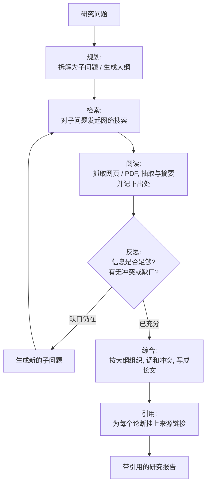
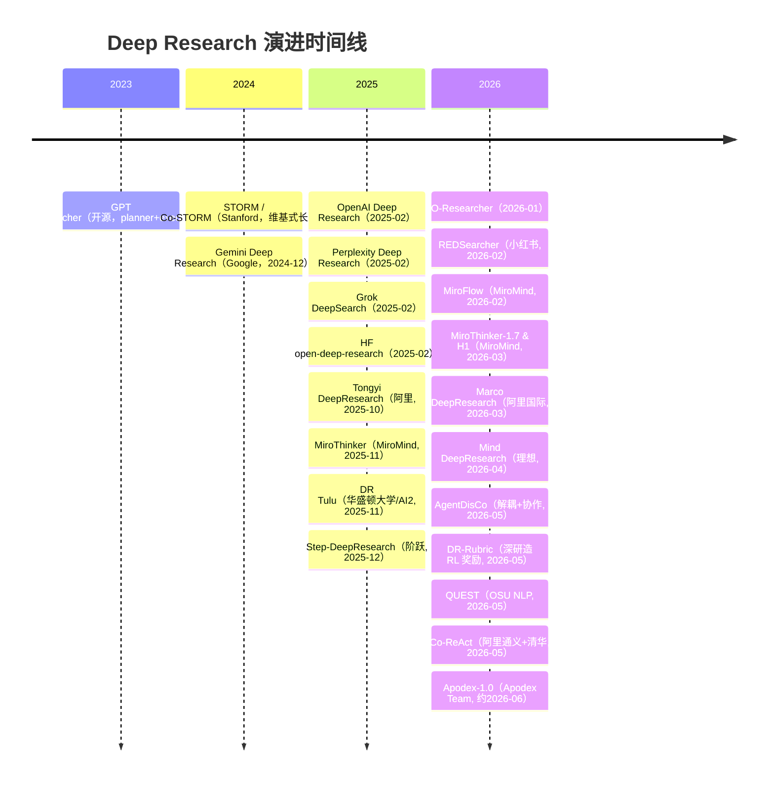

# Deep Research（深度研究 Agent）总览

> **一句话**：Deep Research 指一类自治 agent——给一个研究型问题，它自主完成"规划 → 多步网络检索 → 阅读 → 反思补检 → 综合 → 带引用成稿"的迭代循环，产出一篇可核查的长篇报告；它不是一次性的联网问答，而是把"做研究"本身当成一段可以跑几分钟到几十分钟的 agent 轨迹。代表性起点是 OpenAI Deep Research（2025-02）与 Google Gemini Deep Research（2024-12），开源侧有 GPT Researcher、HF open-deep-research（2025-02）、Stanford STORM（2024）等。

> 前置阅读：[Agent 总览](/agent/)、[工具使用](/agent/tool-use)、[多智能体](/agent/multi-agent)；与检索增强的边界见 [Skills vs RAG/微调](/skills/vs-rag-finetune)；训练这类浏览 agent 的 RL 见 [Web 长程导航 Agent 的 RL](/agent/agentic-rl/web-agent-rl)。

## 定义与能力边界

"Deep Research" 这个词在 2024 年底到 2025 年初被几家厂商几乎同时采用，所指大体一致：用户给一个**开放式、需要综合多个来源**的问题（"对比近三年三家云厂商的推理芯片路线""调研某疾病的最新一线疗法及证据等级"），agent 自主决定**搜什么、读什么、还缺什么、何时收尾**，最后交一篇结构化、带行内引用的报告。

它的能力边界由三件事划定：

- **要做的是"综合"，不是"查一条事实"**。单条事实（"某公司 CEO 是谁"）用普通联网问答即可；Deep Research 的价值在于需要交叉比对几十上百个网页、调和相互冲突的说法、并组织成有论点的长文。
- **它会自己规划和迭代**。不是固定 retrieve-then-read 一遍，而是边读边发现知识缺口、再生成新的子问题去补检，循环若干轮。
- **它产出带引用的可核查报告**，而非一段无出处的回答——引用是 Deep Research 区别于普通"会上网的聊天"的核心契约（尽管引用可靠性本身仍是开放问题，见下）。

## 典型 agent 循环

绝大多数 Deep Research 系统（无论闭源开源）都收敛到同一套迭代范式：先规划，再"检索—阅读—反思"循环若干轮，最后综合成稿并附引用。

各家的差异主要在三处：循环由**单 agent 自反思**驱动（GPT Researcher、HF open-deep-research）还是由**supervisor 派发多个并行子 agent**（LangChain open_deep_research、多数产品）；浏览是**纯文本网页**还是**带视觉的真实浏览器**；以及背后模型是否经过**针对浏览与推理的专门训练**（OpenAI Deep Research 即在 o 系列上专门优化）。

## 与 RAG / 普通联网问答的区别

|  | 普通 RAG / 联网问答 | Deep Research |
| --- | --- | --- |
| 检索次数 | 通常一轮（retrieve → read → answer） | 多轮迭代，边读边补检 |
| 是否自带规划 | 一般没有 | 有，先拆子问题/列大纲 |
| 反思补检 | 无 | 有，发现缺口再搜 |
| 输出形态 | 一段答案 | 结构化长报告 + 行内引用 |
| 耗时 | 秒级 | 数分钟到数十分钟 |
| 失败模式 | 检索没命中就答不好 | 长程轨迹任一步跑偏都会累积偏差 |

简言之：RAG 是"取一次资料来答"，Deep Research 是"像研究员一样反复查证再成稿"。Deep Research 通常**内部就包含 RAG**（每一轮检索-阅读就是一次 RAG），但在外面套了规划与反思的 agent 循环。

## 演进时间线

## 分类对比大表

| 名称 | 年份 | 闭源/开源 | 机构 | 一句话 | 链接 |
| --- | --- | --- | --- | --- | --- |
| GPT Researcher | 2023-07 | 开源 | Assaf Elovic（社区） | planner+execution 双 agent，可接任意 LLM，深研模式约 5 分钟/篇 | [GitHub](https://github.com/assafelovic/gpt-researcher) |
| STORM / Co-STORM | 2024 | 开源 | Stanford OVAL | 写维基式长文：先做 pre-writing 研究列大纲，再带引用成稿（Co-STORM 2024-09） | [详情](/agent/deep-research/storm) ·[GitHub](https://github.com/stanford-oval/storm) |
| Gemini Deep Research | 2024-12 | 闭源/产品 | Google | 2024-12 发布，先出研究计划给用户确认再执行 | [官博](https://blog.google/products/gemini/google-gemini-deep-research/) |
| OpenAI Deep Research | 2025-02 | 闭源/产品 | OpenAI | 在 o 系列上专门优化浏览与推理，2025-02 发布，HLE 26.6% | [详情](/agent/deep-research/openai-deep-research) ·[官博](https://openai.com/index/introducing-deep-research/) |
| Perplexity Deep Research | 2025-02 | 闭源/产品 | Perplexity | 2025-02 发布，主打快（多数任务 3 分钟内），HLE 21.1% | [官博](https://www.perplexity.ai/hub/blog/introducing-perplexity-deep-research) |
| Grok DeepSearch | 2025-02 | 闭源/产品 | xAI | 随 Grok 3（2025-02）推出，能整合 X 实时数据、调和冲突说法 | [发布](https://x.com/xai/status/1892400134178164775) |
| open-deep-research（HF） | 2025-02 | 开源 | Hugging Face | 24 小时复现 OpenAI 版，基于 smolagents 的 code agent，GAIA 验证集 55% | [详情](/agent/deep-research/open-deep-research) ·[官博](https://huggingface.co/blog/open-deep-research) |
| open_deep_research（LangChain） | 2025 | 开源 | LangChain | 基于 LangGraph 的 supervisor 架构，派发并行子 agent | [GitHub](https://github.com/langchain-ai/open_deep_research) |
| **Tongyi DeepResearch** | 2025-10 | 开源 | 阿里 Tongyi Lab | 30B-A3B MoE，agentic mid/post-training，开源刷榜标杆（BrowseComp 43.4 / HLE 32.9 / GAIA 70.9，以技术报告为准） | [详情](/agent/deep-research/tongyi-deepresearch) ·[arXiv](https://arxiv.org/abs/2510.24701) |
| **DR Tulu** | 2025-11 | 开源 | 华盛顿大学 · AI2 · CMU · MIT | 提出 RLER：rubric 训练中跟策略共同演化（检索证据核事实+多候选对照抓作弊），8B 直接为开放式长文深研训练，四个长文基准均分反超开源基线 15.6 分、逼平 OpenAI DR，成本仅其千分之一 | [详情](/agent/deep-research/dr-tulu) ·[arXiv](https://arxiv.org/abs/2511.19399) |
| **Step-DeepResearch** | 2025-12 | 论文 | 阶跃星辰 StepFun | 32B 单 agent ReAct，原子能力数据合成 + mid-training→SFT→RL 三阶段 + checklist Judger，ResearchRubrics 61.42（单 agent 第一），自建中文 ADR-Bench，单篇约 0.5 RMB | [详情](/agent/deep-research/step-deepresearch) ·[arXiv](https://arxiv.org/abs/2512.20491) |
| **MiroThinker** | 2025-11 | 开源 | MiroMind | 提出"交互伸缩"（interactive scaling）：与模型规模、上下文长度并列的第三条 scaling 轴，256K 上下文单任务最多 600 次工具调用，72B 在 GAIA 上以相同工具集反超 GPT-5-high（以原文为准） | [详情](/agent/deep-research/mirothinker) ·[arXiv](https://arxiv.org/abs/2511.11793) |
| **REDSearcher** | 2026-02 | 开源 | 小红书 RED · HIT · SJTU | 针对轨迹/奖励稀疏，低成本统一训练长程搜索 agent，含多模态版（BrowseComp 57.4 / GAIA 80.1，以原文为准） | [详情](/agent/deep-research/redsearcher) ·[arXiv](https://arxiv.org/abs/2602.14234) |
| **MiroFlow** | 2026-02 | 开源 | MiroMind | 高鲁棒开源深研**框架**（agent graph 编排 + 可选深推理模式），配套 MiroThinker 模型使用 | [arXiv](https://arxiv.org/abs/2602.22808) |
| **MiroThinker-1.7 & H1** | 2026-03 | 开源 | MiroMind | MiroThinker 续作：mid-training 强化"原子"agentic 能力（1.7）+ 局部/全局双层验证的 heavy-duty 模式（H1），BrowseComp 88.2 / GAIA 88.5 刷新 SOTA，且步数更少（以原文为准） | [详情](/agent/deep-research/mirothinker-h1) ·[arXiv](https://arxiv.org/abs/2603.15726) |
| **Marco DeepResearch** | 2026-03 | 论文 | 阿里国际 AIDC | verification-centric：数据合成 / 轨迹 / test-time 三层验证，8B 逼近/超越多个 30B agent（BrowseComp-ZH 47.1 / xBench-DS-2505 82.0，以原文为准） | [详情](/agent/deep-research/marco-deepresearch) ·[arXiv](https://arxiv.org/abs/2603.28376) |
| **O-Researcher** | 2026-01 | 开源 | 学术团队 | 多 agent 蒸馏 + agentic RL，不依赖闭源数据/模型即达有竞争力的深研成绩 | [arXiv](https://arxiv.org/abs/2601.03743) |
| **Mind DeepResearch** | 2026-04 | 论文 | 理想汽车 | 约 30B，规划/深搜/报告三 agent + SFT→Search-RL→Report-RL→偏好对齐四阶段，已落地理想产品 | [详情](/agent/deep-research/mind-deepresearch) ·[arXiv](https://arxiv.org/abs/2604.14518) |
| **AgentDisCo** | 2026-05 | 论文 | Jin 等 | 把深研建模为探索 vs 利用的对抗优化：Critic/Generator 解耦协作 + 代码生成元优化沉淀 policy bank，多个报告基准对标闭源 | [详情](/agent/deep-research/agentdisco) ·[arXiv](https://arxiv.org/abs/2605.11732) |
| **DR-Rubric** | 2026-05 | 开源 | 复旦 / 小红书等 | 把"造 RL 奖励 rubric"当成深研任务：agentic 检索挖证据→蒸馏成原子可验证约束→GRPO，小模型可自举 | [详情](/agent/deep-research/dr-rubric) ·[arXiv](https://arxiv.org/abs/2606.01091) |
| **QUEST** | 2026-05 | 开源 | OSU NLP · Amazon AGI | 统一 rubric 树同时合成事实检索/引用落地/报告综合三类数据 + 上下文压缩，8K 合成任务训 2B–35B 家族，35B 逼近/超越闭源（DRB 48.2 vs OpenAI-DR 47.0，以原文为准） | [详情](/agent/deep-research/quest) ·[arXiv](https://arxiv.org/abs/2605.24218) |
| **Co-ReAct** | 2026-05 | 开源 | 阿里通义 · 清华 | 把 rubric 从"训练/事后打分"改造成 ReAct 推理时的步骤级指导：listwise GRPO 训 rubric 生成器 + inject-verify-retry 五元组循环，训好的 rubric 可即插即用迁移到其他推理时增强方法 | [详情](/agent/deep-research/co-react) ·[arXiv](https://arxiv.org/abs/2605.23590) |
| **Apodex-1.0** | 约2026-06 | 开源 | Apodex Team | 独立收敛出与 MiroThinker-H1 高度相似的"验证中心 heavy-duty agent 团队"设计（互不引用）：异步 sub-agent 团队 + 共享证据池 + 全局验证者，并把同一范式延伸到编码与数学证明；BrowseComp 90.3 / DeepSearchQA 94.4（以原文为准） | [详情](/agent/deep-research/apodex) ·[GitHub](https://github.com/ApodexAI) |

## 国产与开源的刷榜竞赛（2025–2026）

2025 下半年到 2026 年，Deep Research 从"几家产品发布"演变为一场**公开榜单上的硬碰硬**，主战场是 **BrowseComp / BrowseComp-ZH**（深度浏览找信息）、**HLE**（高难知识）、**GAIA**（通用助理）、**xbench-DeepSearch / WebWalkerQA / FRAMES** 等。这一波最有代表性的、**有论文且刷出高分**的工作几乎都来自国内大厂与开源社区：

- **Tongyi DeepResearch**（阿里 Tongyi Lab，[arXiv:2510.24701](https://arxiv.org/abs/2510.24701)）：30B-A3B MoE，用 **agentic mid-training + agentic post-training** 端到端训练 + 全自动数据合成管线，把开源深研 agent 拉到与 OpenAI Deep Research 同档；报告 BrowseComp 43.4 / BrowseComp-ZH 46.7 / HLE 32.9 / GAIA 70.9 / xbench-DeepSearch 75.0（以技术报告为准）。**详见 [Tongyi DeepResearch 专页](/agent/deep-research/tongyi-deepresearch)**。
- **DR Tulu**（华盛顿大学 · AI2 · CMU · MIT，[arXiv:2511.19399](https://arxiv.org/abs/2511.19399)）：指出现有开源深研 RL 训练大多锚定在"可验证短文 QA"、难以迁移到开放式长文，提出 **RLER（Reinforcement Learning with Evolving Rubrics）**——用检索证据+多候选回答对照给 rubric 生成器"特权信息"，让评分标准随策略训练持续演化并压制 reward hacking；8B 模型在 SQAv2/HealthBench/ResearchQA/DeepResearchBench 四个长文基准均分反超此前最强开源基线 Tongyi DR 15.6 分、逼平甚至反超 OpenAI Deep Research，单次查询成本仅其千分之一。另配套开源 `dr-agent-lib` 基础设施与临床遗传学评测集 GeneticDiseasesQA。**详见 [DR Tulu 专页](/agent/deep-research/dr-tulu)**。
- **Step-DeepResearch**（阶跃星辰 StepFun，[arXiv:2512.20491](https://arxiv.org/abs/2512.20491)）：提出 **"search ≠ research"**，把深研拆成四类**原子能力**分别造数据，用 **agentic mid-training（32K→128K）→ SFT → PPO** 三阶段在 **32B（Qwen2.5-32B-Base）单 agent ReAct** 上训练，并用 **checklist 式 Rubrics Judger** 当 RL 奖励；ResearchRubrics（Scale AI）报告 **61.42**——**单 agent 类第一、总榜仅次于 Gemini DeepResearch、超过 OpenAI DeepResearch**，且单篇成本约 0.5 RMB（不到顶级商用的 1/10）。另自建中文场景基准 **ADR-Bench**（110 条 query，通用 70 + 金融法律 40，人评 + rubric 双轨）。**详见 [Step-DeepResearch 专页](/agent/deep-research/step-deepresearch)**。
- **REDSearcher**（小红书 RED × 哈工大 × 上交，[arXiv:2602.14234](https://arxiv.org/abs/2602.14234)）：直击"高质量搜索轨迹与奖励信号极度稀疏"的瓶颈，用**复杂任务合成（图拓扑 + 证据分散）+ 两阶段 mid-training + SFT/Agentic RL** 的低成本统一流水线，并在本地千万级文档闭库里做 rollout 省成本；30B-A3B 报告 BrowseComp 57.4 / GAIA 80.1（以原文为准），并扩展出多模态 REDSearcher-MM。**详见 [REDSearcher 专页](/agent/deep-research/redsearcher)**。
- **MiroThinker**（MiroMind，[arXiv:2511.11793](https://arxiv.org/abs/2511.11793)）：提出**交互伸缩（interactive scaling）**——与模型规模、上下文长度并列的第三条独立 scaling 轴，用 RL 训练模型撑起更深更频繁的 agent-环境交互，配合"近因式上下文保留"把 256K 上下文用在刀刃上，单任务最多支持 600 次工具调用；72B 版本在 GAIA 上以相同工具集反超 GPT-5-high，在 BrowseComp-ZH / HLE 上刷新开源纪录。**详见 [MiroThinker 专页](/agent/deep-research/mirothinker)**。配套的 **MiroFlow**（[arXiv:2602.22808](https://arxiv.org/abs/2602.22808)）是高鲁棒的开源深研**框架**（agent graph 编排 + 可选深推理模式）。
- **MiroThinker-1.7 & H1**（MiroMind，[arXiv:2603.15726](https://arxiv.org/abs/2603.15726)）：MiroThinker 的直接续作，指出"交互越长不等于越好"——1.7 先用 agentic mid-training 强化规划/推理/工具调用等"原子"能力，H1 再叠加**局部（步骤级）+ 全局（轨迹级）双层验证**的 heavy-duty 推理模式；BrowseComp 88.2 / BrowseComp-ZH 84.4 / GAIA 88.5 全面刷新 SOTA，且验证机制让"步数更少、正确率更高"同时成立（BrowseComp 难例子集上仅加局部验证器就让步数降到约 1/6、Pass@1 提升 26.4 分）。**详见 [MiroThinker-1.7 & H1 专页](/agent/deep-research/mirothinker-h1)**。
- **Mind DeepResearch**（理想汽车，[arXiv:2604.14518](https://arxiv.org/abs/2604.14518)）：约 30B，把深研拆成**规划 / 深搜 / 报告三 agent**，用 **SFT 冷启动 → Search-RL → Report-RL → 偏好对齐**四阶段分别打磨搜索与写报告能力，并自建 500 条中文 query 的多维 rubric 基准 MindDR Bench；已落地理想自家产品。报告 BrowseComp 42.8 / BrowseComp-ZH 45.7 / xbench-DS 75.0（以原文为准）。**详见 [Mind DeepResearch 专页](/agent/deep-research/mind-deepresearch)**。
- **Marco DeepResearch**（阿里国际 AIDC，[arXiv:2603.28376](https://arxiv.org/abs/2603.28376)）：把**验证（verification）**贯穿数据合成、轨迹构造、test-time 三层——让 agent 自己当 verifier，抑制误差在各阶段向下游传播，主打"高效深研"；仅 8B 规模就在多个基准逼近甚至超越 30B 级 agent（如 Tongyi DeepResearch-30B）。**详见 [Marco DeepResearch 专页](/agent/deep-research/marco-deepresearch)**。
- **O-Researcher**（[arXiv:2601.03743](https://arxiv.org/abs/2601.03743)）：用**多 agent 蒸馏 + agentic RL** 的两阶段训练，让多种规模的开源模型在深研榜上取得有竞争力的成绩，且不依赖闭源数据/模型。
- **QUEST**（OSU NLP · Amazon AGI，[arXiv:2605.24218](https://arxiv.org/abs/2605.24218)）：用**统一 rubric 树**全自动合成"事实检索 / 引用落地 / 报告综合"三类任务的可验证训练数据 + 内置上下文压缩机制，仅 8K 合成任务训出 2B–35B 开源家族；35B 在八个基准上打平甚至超过 OpenAI DeepResearch，是同期开源 agent 里综合表现最好的一个，且模型/数据/合成脚本/训练代码全部开源。**详见 [QUEST 专页](/agent/deep-research/quest)**。
- **Co-ReAct**（阿里通义 · 清华，[arXiv:2605.23590](https://arxiv.org/abs/2605.23590)）：不再把 rubric 当训练时奖励或事后打分器，而是用 **listwise GRPO** 训一个 rubric 生成器，在 ReAct 每个分支点**推理时**注入步骤级指导，动作执行前再验证、不达标就带反馈重试（三元组扩展为五元组）；在 DeepResearchBench / SQA-CS-V2 上稳定超过 Self-Refine / Best-of-N / Step-Back / CRITIC，训好的 rubric 还能即插即用迁移到这些基线上。**详见 [Co-ReAct 专页](/agent/deep-research/co-react)**。
- **Apodex-1.0**（Apodex Team，无 arXiv，技术报告）：与 MiroThinker-H1 几乎同期、完全独立地收敛到高度相似的设计——单 agent ReAct 有"范式级天花板"（几百步后饱和，扩大模型/上下文也无法突破），于是用**异步 agent 团队**（sub-agent 分工检索/验证、共享报告池、全局验证者对证据图推理）替代单纯的自我反思；heavy-duty 模式让多个 agent 团队并行、把同一验证范式延伸到编码（因果证据对比）与数学证明（生成-验证-修订），并用任务无关的 **AgentOS** 运行时统一托管；报告 BrowseComp 90.3 / DeepSearchQA 94.4 / FrontierScience-Research 46.7（以原文为准），4B 开源变体即超过所有开源 30B 级模型。**详见 [Apodex-1.0 专页](/agent/deep-research/apodex)**。

> 看榜须知：这些分数来自各自论文/技术报告，**口径、时点、工具配置、test-time scaling（如 Heavy Mode / 并行子 agent）各不相同**，跨系统直接比绝对值意义有限；榜单（尤其 BrowseComp-ZH、xbench-DeepSearch）也在快速迭代。把它们当作"同一时期开源深研能力的量级参照"，而非精确排名。

## 评测与现状

这类系统主要在三个 benchmark 上比拼：

- **GAIA**（arXiv:2311.12983，2023-11，Meta 等）：466 道"对人简单、对 AI 难"的真实任务，需要推理、多模态、网页浏览与工具使用。HF open-deep-research 在验证集做到约 55%（pass@1），其官博引用 OpenAI Deep Research 约 67% 的平均分作对照。
- **Humanity's Last Exam（HLE）**：跨百余学科的高难度知识题。OpenAI Deep Research 官方报告 26.6%，Perplexity Deep Research 报告 21.1%——这些是各家自报数，口径与时点不同，横向比要谨慎。
- **BrowseComp**（arXiv:2504.12516，2025-04，OpenAI）：1266 道需要"持续翻找、信息深埋"的浏览题，答案短小易于自动判分，专门衡量 agent 在网上"刨"信息的能力。

现状与局限（这也是当前最值得警惕的部分）：

- **幻觉与引用不可靠**：报告读起来很权威，但论断未必真由其所挂引用支持，存在"挂了链接却对不上原文"或过度外推的情况；引用的存在 ≠ 引用的正确。
- **来源质量参差**：agent 难以稳定区分权威来源与营销/低质内容，容易把片面或过时信息写进结论。
- **成本与时延**：一篇报告动辄几分钟到几十分钟、调用大量检索与长上下文推理；开源方案（如 GPT Researcher 自报 o3-mini 下约 $0.4/篇）相对可控，但产品级深研仍偏贵。
- **可复现性差**：网页内容随时间变化、搜索结果不确定，同一问题两次跑结果可能不同，给评测和审计带来困难。

实践建议：把 Deep Research 当成**会列出处的初稿研究助手**而非终审，重要结论务必顺着引用回查原文。

## 参考链接

- OpenAI, *Introducing deep research*（2025-02）：<https://openai.com/index/introducing-deep-research/>
- Google, *Gemini Deep Research*：<https://blog.google/products/gemini/google-gemini-deep-research/>
- Perplexity, *Introducing Perplexity Deep Research*（2025-02）：<https://www.perplexity.ai/hub/blog/introducing-perplexity-deep-research>
- Hugging Face, *Open-source DeepResearch*（2025-02）：<https://huggingface.co/blog/open-deep-research>
- GPT Researcher（GitHub）：<https://github.com/assafelovic/gpt-researcher>
- LangChain open_deep_research（GitHub）：<https://github.com/langchain-ai/open_deep_research>
- Stanford STORM（GitHub）：<https://github.com/stanford-oval/storm>
- Mialon et al., *GAIA: a benchmark for General AI Assistants*（arXiv:2311.12983, 2023-11）
- Wei et al., *BrowseComp*（arXiv:2504.12516, 2025-04）
- Tongyi DeepResearch Team, *Tongyi DeepResearch Technical Report*（arXiv:2510.24701, 2025-10）·[GitHub](https://github.com/Alibaba-NLP/DeepResearch)
- Shao et al., *DR Tulu: Reinforcement Learning with Evolving Rubrics for Deep Research*（arXiv:2511.19399, 2025-11）·[GitHub](https://github.com/rlresearch/dr-tulu)
- StepFun Agent-Team, *Step-DeepResearch Technical Report*（arXiv:2512.20491, 2025-12）·[GitHub](https://github.com/stepfun-ai/StepDeepResearch)
- *REDSearcher: A Scalable and Cost-Efficient Framework for Long-Horizon Search Agents*（arXiv:2602.14234, 2026-02）·[GitHub](https://github.com/RedSearchAgent/REDSearcher)
- *MiroFlow: Towards High-Performance and Robust Open-Source Agent Framework for General Deep Research Tasks*（arXiv:2602.22808, 2026-02）
- MiroMind Team, *MiroThinker: Pushing the Performance Boundaries of Open-Source Research Agents via Model, Context, and Interactive Scaling*（arXiv:2511.11793, 2025-11）·[GitHub](https://github.com/MiroMindAI/MiroThinker)
- MiroMind Team, *MiroThinker-1.7 & H1: Towards Heavy-Duty Research Agents via Verification*（arXiv:2603.15726, 2026-03）·[GitHub](https://github.com/MiroMindAI/MiroThinker)
- *Marco DeepResearch: Unlocking Efficient Deep Research Agents via Verification-Centric Design*（arXiv:2603.28376, 2026-03）·[GitHub](https://github.com/AIDC-AI/Marco-DeepResearch)
- *O-Researcher: An Open Ended Deep Research Model via Multi-Agent Distillation and Agentic RL*（arXiv:2601.03743, 2026-01）
- *Mind DeepResearch Technical Report*（理想汽车，arXiv:2604.14518, 2026-04）
- *AgentDisCo: Towards Disentanglement and Collaboration in Open-ended Deep Research Agents*（arXiv:2605.11732, 2026-05）
- *Deep Research as Rubric for Reinforcement Learning（DR-Rubric）*（arXiv:2606.01091, 2026-05）·[GitHub](https://github.com/meiotoufa/DR-Rubric)
- Xie et al., *QUEST: Training Frontier Deep Research Agents with Fully Synthetic Tasks*（arXiv:2605.24218, 2026-05）·[GitHub](https://github.com/OSU-NLP-Group/QUEST)
- Kang et al., *Co-ReAct: Rubrics as Step-Level Collaborators for ReAct Agents*（arXiv:2605.23590, 2026-05）·[GitHub](https://github.com/ZBWpro/Co-ReAct)
- Apodex Team, *Apodex-1.0: A Verification-Centric Agent Team for Discoverative Intelligence*（技术报告，无 arXiv，约2026-06）·[GitHub](https://github.com/ApodexAI)
