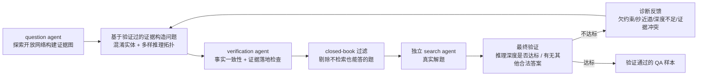

# Marco DeepResearch（阿里国际）：数据合成/轨迹构造/推理三层验证驱动的 8B 高效深研 agent

**📄 [Marco DeepResearch: Unlocking Efficient Deep Research Agents via Verification-Centric Design](https://arxiv.org/abs/2603.28376)**

2026-03 · 阿里国际数字商业（Alibaba International Digital Commerce） · [代码](https://github.com/AIDC-AI/Marco-DeepResearch)

**一句话**：把"显式验证"贯穿深研 agent 的三个阶段——QA 数据合成、轨迹构造、测试时推理——用 Qwen3-8B 训出的 Marco DeepResearch 在多个高难基准上超过同规模 8B agent，在 600 次工具调用预算下甚至逼近或超过若干 30B 规模的深研 agent（如 Tongyi DeepResearch-30B）。

::: details 📖 论文原文 Abstract（英文）
Deep research agents autonomously conduct open-ended investigations, integrating complex information retrieval with multi-step reasoning across diverse sources to solve real-world problems. To sustain this capability on long-horizon tasks, reliable verification is critical during both training and inference. A major bottleneck in existing paradigms stems from the lack of explicit verification mechanisms in QA data synthesis, trajectory construction, and test-time scaling. Errors introduced at each stage propagate downstream and degrade the overall agent performance. To address this, we present Marco DeepResearch, a deep research agent optimized with a verification-centric framework design at three levels: (1) QA Data Synthesis: We introduce verification mechanisms to graph-based and agent-based QA synthesis to control question difficulty while ensuring answers are unique and correct; (2) Trajectory Construction: We design a verification-driven trajectory synthesis method that injects explicit verification patterns into training trajectories; and (3) Test-time scaling: We use Marco DeepResearch itself as a verifier at inference time and effectively improve performance on challenging questions. Extensive experimental results demonstrate that our proposed Marco DeepResearch agent significantly outperforms 8B-scale deep research agents on most challenging benchmarks, such as BrowseComp and BrowseComp-ZH. Crucially, under a maximum budget of 600 tool calls, Marco DeepResearch even surpasses or approaches several 30B-scale agents, like Tongyi DeepResearch-30B.
:::

**相关**：[Deep Research 总览](/agent/deep-research/) · [Tongyi DeepResearch](/agent/deep-research/tongyi-deepresearch) · [Step-DeepResearch](/agent/deep-research/step-deepresearch) · [Mind DeepResearch](/agent/deep-research/mind-deepresearch) · [REDSearcher](/agent/deep-research/redsearcher) · [DR-Rubric](/agent/deep-research/dr-rubric) · [Rubric 化评测与训练](/eval/rubrics)

> 图源：Zhu et al., *Marco DeepResearch: Unlocking Efficient Deep Research Agents via Verification-Centric Design*（arXiv:2603.28376）Figure 1——8B 规模 Marco DeepResearch 在四个基准上对 ≤8B / ≈30B / 基础模型三档基线的表现（用于学习注解，版权归原作者）。

## 动机与创新点：三层显式验证，堵住"数据合成 → 轨迹构造 → 推理"的误差传播链

深研 agent 的训练管线通常分三段：先合成 QA 数据、再合成训练轨迹、最后靠训好的模型在推理时多轮试错。论文指出，**现有工作在这三段里都缺一个"显式验证"环节**，导致错误逐段累积、层层放大：

- **QA 数据合成**：主流做法要么走 graph-based 多跳 QA（在知识图谱上游走取样），要么走 agent-based 网页探索合成；两者共同的痛点是**为了提高难度而做实体混淆（entity obfuscation）**——这是最常用的手段，但"往往导致答案非唯一或错误"（entity obfuscation—the most widely adopted technique in existing pipelines—often yields non-unique or incorrect answers），把带噪声甚至错误的 ground truth 喂给下游训练，训练因此变得有偏且不稳定。
- **轨迹构造**：目前主流仍是靠强教师模型直接生成能"一步到底"命中正确答案的 ReAct 轨迹，但这类轨迹"通常缺乏验证"（these trajectories usually lack verification），训出来的模型倾向于**过早接受低质量的初步结果、放弃探索更优路径**（accept early low-quality results, under-explore high-value alternatives）。
- **测试时扩展**：现有系统在推理阶段普遍靠"多加几轮交互 / 多加点计算预算"来做 test-time scaling，但**对中间步骤和最终答案都缺乏显式验证**，导致错误状态和错误结论会一路不受阻拦地传播下去，agent 会**接受早期错误而不是触发"由 verifier 引导的行为"来有效利用额外算力**（accept early errors rather than triggering verifier-guided behaviors to effectively scale test-time compute）。

针对这三个环节，论文提出对应的三项改进，构成 Marco DeepResearch 的核心设计：

**关键创新**：

- **Verified Data Synthesis（验证式数据合成）**：给 graph-based 与 agent-based 两条 QA 合成管线都装上显式验证机制，在控制难度的同时保证答案唯一且正确。
- **Verification-Driven Trajectory Construction（验证驱动的轨迹构造）**：引入专门的 verifier agent，用网页搜索工具对子任务结果与最终答案做独立验证，把"显式验证模式"注入单 agent 与多 agent 两类训练轨迹。
- **Verifier-Guided Test-Time Scaling（验证者引导的测试时扩展）**：推理阶段直接用 Marco DeepResearch 自己当 verifier，结合"Discard All"上下文管理策略，在受控计算预算下更有效地利用额外推理轮次。
- **以 8B 打 30B**：三层验证叠加后，仅 Qwen3-8B 规模的 Marco DeepResearch 就能在多个高难基准上逼近甚至超越 30B 规模的深研 agent，验证了"用验证换效率"而非"靠堆参数"的路线。

## 方法：验证式数据合成 + 验证驱动的轨迹构造 + 验证者引导的测试时扩展

三层验证设计一以贯之，分别作用在训练前（数据）、训练中（轨迹）、推理时（测试时扩展）：

> 图源：Zhu et al., *Marco DeepResearch*（arXiv:2603.28376）Figure 2——本文验证中心式设计的整体框架（用于学习注解，版权归原作者）。

### 验证式数据合成：graph-based 对抗验证 + agent-based 生成-执行-验证闭环

**Graph-Based Synthesis with Adversarial Verification（图谱合成 + 对抗验证）**

论文提出一套统一范式——**"答案优先的逆向构造 + 对抗验证"（answer-first reverse construction with adversarial verification）**，组织成一个迭代循环：

1. **答案实体采样**：在知识图谱上按结构与内容约束采样答案实体（如中等连接度、有充分文档证据、前驱节点合法），确保任务必须走多跳推理，同时避开可以靠常识抄近道的平凡问题。
2. **结构化属性画像**：对每个采样到的答案实体，用前沿模型抽取一份覆盖**空间、时间、数值、类别、实体关系**五个维度的结构化属性画像，作为后续"受控混淆"与出题的候选约束。
3. **反向路径搜索**：从答案实体出发反向搜索中间证据节点（图结构搜索 + 内容关键词匹配互补），再用强 LLM 挑出 4–8 个高质量、多样化的中间节点，拼成一条稳健的多跳推理链。
4. **对抗性答案唯一性验证**（核心步骤）：这是一个 **Generator / Attacker / Analyzer** 三角色的迭代过程——Generator 先从属性画像里初始化 2–3 条混淆约束；Attacker 搜索满足当前所有约束、但**不是**目标答案的反例实体；若找不到反例且约束数已过最小阈值，循环收敛；否则 Analyzer 补充新的判别性约束，交还 Attacker 继续。该循环最多跑 10 轮，其收敛性遵循一条单调性原理：**每一轮都至少新增一条约束，且每条新约束都至少削减一部分反例集合**，最终约束集就为目标答案提供了高置信度的唯一性保证。

收敛后再把约束转成自然语言多跳问题，并做泄漏检查以模糊掉关键实体；凡是有泄漏、或不搜索、不做一致性检查就能被前沿模型直接解出的样本，都从训练集里剔除。

**Agent-Based Web Exploration Synthesis（agent 网页探索合成）**

相比图谱合成，agent-based 方法能让数据更贴近真实场景、覆盖更广域，但也天然带来事实幻觉、答案歧义、"伪多跳"（一步捷径就能绕过的多跳问题）等失败模式。论文设计了一个**生成—执行—验证（Generation–Execution–Verification）**闭环来控制这些失败：

- **证据优先的问题构造**：question agent 不是"先想问题再找证据"，而是先探索开放网络建一张证据图，再从**已验证的证据**出发构造问题，并应用实体混淆与多样化推理拓扑（如收敛式、合取式约束）压低"一步捷径"被绕过的概率。
- **多阶段质量验证**：verification agent 先做事实一致性与证据落地检查；再用 closed-book 过滤器剔除不检索也能答对的题；剩下的候选交给一个**独立**的 search agent 去解，最终验证确认推理深度符合目标难度、且约束下没有其他合法答案。
- **诊断式迭代优化**：样本在任一阶段失败都不会被直接丢弃——verifier 给出结构化诊断反馈（如约束不足、走了捷径、深度不够、证据冲突），question agent 据此对证据选择、约束设计、问题结构做针对性修订，这个"诊断—修订"循环持续到样本同时满足**证据落地、答案唯一、经验难度达标**三个条件。

作者人工抽检了 100 条样本：不到 10% 存在明显的问答不匹配，其余样本有效但具有挑战性，验证了该管线能产出高质量、有难度的数据集。

### 验证驱动的轨迹构造：多 agent 验证子 agent + 失败轨迹的验证-反思重跑

单 agent ReAct 仍是当前深研系统主流的轨迹合成方案，但这条流水线通常**不显式验证中间关键结果**，导致早期步骤的错误会直接传播并累积、拉低最终表现。论文引入两套互补设计：

**多 agent 验证式合成（Multi-agent with Verification）**：设计一个**主 agent + 搜索子 agent + 验证子 agent**的三角色框架——主 agent 把复杂问题拆解为子任务并汇总子结果得到最终答案；搜索子 agent 逐个求解子任务；验证子 agent 则用网页工具对子任务输出与最终提议答案都做**独立的第三方校验**。一旦验证失败，对应步骤会被修订并重新执行，因此轨迹里显式记录了"验证驱动的纠错行为"。最终，这些多 agent 轨迹会被转换成单 agent ReAct 风格的轨迹用于训练——即训练时只需要单 agent 模型，但它学到的是多 agent 验证流程沉淀下来的验证式行为模式。

**失败轨迹上的验证-反思重跑（Verification-Reflection Re-rollout）**：对于最终答案不正确的轨迹，论文没有直接丢弃，而是调用一个 verifier agent 诊断失败原因、产出可执行的反馈；再基于这份反馈对失败轨迹做重新 rollout，把成功被"救回来"的轨迹也纳入训练集。

两套机制配合的一个共同前提是论文引用的先验观察：在"大海捞针"式的深搜任务里，**直接求解答案很难，但以问题（或子问题）为条件去验证答案相对可靠**（answer verification conditioned on the question is relatively reliable）——这也是为什么把 verifier 单独拉出来做专门训练是划算的。

### 验证者引导的测试时扩展：Discard All + Marco 自己当 verifier

现有深研 agent 的测试时扩展大多只是简单增加交互轮数或 rollout 预算，论文指出这种"盲目扩展"会**累积早期工具误差和噪声中间结论，反而降低长程搜索任务的可靠性**。为此提出 **Verifier-Guided Test-time Scaling**：把显式验证引入推理时扩展，并让 Marco DeepResearch 本身充当 verifier，配合 *Discard All* 的上下文管理策略，在固定的最大交互预算 $T_{\max}$ 下实现更有效的推理时扩展。

- **Discard All**：一旦触发预定义的退化信号（如达到最大步数、或已判定无法解题），就清空累积的工具调用历史与中间推理输出，只保留最初的查询和 system prompt，从一个全新的上下文重新开始。这个重置机制让 agent 能探索新的搜索路径，减少单条轨迹上错误沿途累积的问题。
- **Verifier-Guided Test-time Scaling**：每当 agent 产出一个候选答案，就用**基于规则的检查 + agent-as-judge**（用 Marco DeepResearch 自身当裁判）对其做校验。若 $t<T_{\max}$，agent 可以继续探索并提出新的候选答案，每个候选都被独立验证；当 $t=T_{\max}$ 或过程收敛，则对**全部候选**执行一次 **Joint Verify**（联合验证），生成该问题的最终答案。

两个组件互补：Discard All 通过重置退化的上下文提升轨迹质量，Verifier-Guided Test-time Scaling 提升答案质量；二者结合，在不改变模型参数的前提下实现更有效的测试时扩展，把难题上的推理时收益进一步放大。

### 训练流水线：SFT（token 级交叉熵 + loss mask）→ RL（GRPO + 两阶段 LLM-as-Judge 奖励）

训练分监督微调与强化学习两阶段。

**SFT**：用 token 级交叉熵训练，并施加 loss mask 使**只有 assistant 回复 token** 参与优化：

$$\mathcal{L}_{\text{SFT}}(\theta) = -\sum_{t=1}^{T} m_t \log P_\theta(x_t \mid x_{<t}), \quad m_t = \begin{cases}1, & t \in \mathcal{T}_{\text{assistant}} \\ 0, & t \in \mathcal{T}_{\text{instruction}} \cup \mathcal{T}_{\text{tool\_response}}\end{cases}$$

即指令内容与工具返回内容都被掩码掉，不计入损失。

**RL**：从 SFT checkpoint 出发，用 **GRPO**（Group Relative Policy Optimization）优化策略——对每个 query $q$，从旧策略 $\pi_{\theta_{\text{old}}}$ 采样一组 $G$ 条 rollout $\{o_i\}_{i=1}^G$，优化目标为

$$\mathcal{J}_{\text{GRPO}}(\theta) = \mathbb{E}\left[\frac{1}{G}\sum_{i=1}^G \min\left(r_i(\theta)\hat{A}_i, \text{clip}(r_i(\theta), 1-\epsilon, 1+\epsilon)\hat{A}_i\right) - \beta\,\mathbb{D}_{\text{KL}}[\pi_\theta \| \pi_{\text{ref}}]\right]$$

其中 $r_i(\theta) = \frac{\pi_\theta(o_i|q)}{\pi_{\theta_{\text{old}}}(o_i|q)}$ 是重要性采样比，相对优势由组内奖励归一化得到：$\hat{A}_i = \frac{r_i - \text{mean}(\{r_j\}_{j=1}^G)}{\text{std}(\{r_j\}_{j=1}^G)}$。

奖励采用 **outcome-based**（只看最终结果对不对）设计，并用一套**两阶段 LLM-as-Judge** 管线平衡奖励质量与算力成本：先由一个快速的主裁判（Qwen-Turbo-Latest）给所有样本打分，再把其中不确定或低置信度的样本升级交给一个更强的二级裁判（GPT-4.1）重新评估：

$$r(q, o) = \begin{cases}1, & \text{if } \mathcal{J}(o, a^*) = \text{correct} \\ 0, & \text{otherwise}\end{cases}$$

这里 $a^*$ 是参考答案，$\mathcal{J}(\cdot)$ 是裁判函数。这种"快裁判筛大多数、慢裁判兜底难例"的两级设计，让 RL 训练在保持奖励质量的同时控制住裁判成本。

## 实验结果：8B 逼近/超越 30B，验证机制逐项消融证实全部有效

### 评测设置

- **骨架与训练**：Qwen3-8B 为 backbone，用 **YaRN** 把上下文扩展到 **128K**；SFT 与 RL 在 **64 张 A100** 上用 **Megatron** 完成，配 Redis 缓存复用重复查询/网页、指数退避重试、异步非阻塞工具调用、与模型更新流水线化的异步奖励计算等系统优化。
- **推理配置**：遵循前作惯例，在**最大 600 次工具调用**的预算下评测；解码温度 0.7、top-*p* 0.95，最大生成长度 16,384 token。
- **六个深搜基准**：BrowseComp、BrowseComp-ZH（中文对照）、GAIA（text-only）、xBench-DeepSearch（2505 与 2510 两个 split）、WebWalkerQA、DeepSearchQA。
- **三组基线**：① 带工具的基础模型（GLM-4.7、Minimax-M2.1、DeepSeek-V3.2、Kimi-K2.5、Claude-4-Sonnet/4.5-Opus、OpenAI-o3、GPT-5 High、Gemini-3.0-Pro）；② ≥30B 的训练深研 agent（Tongyi DeepResearch-30B、WebSailor-v2、MiroThinker 系列、DeepMiner、OpenSeeker-30B-SFT、SMTL）；③ ≤8B 的训练深研 agent（MiroThinker-v1.0-8B、WebExplorer-8B-RL、AgentCPM-Explore-4B、RE-TRAC-4B）。
- **训练数据**：开源侧含 2WikiMultihopQA、BeerQA、ASearcher、DeepDive、QA-Expert-Multi-Hop-QA、REDSearcher；合成侧含自家电商业务数据 + 本文验证式管线合成的 1.2 万余条图谱/agent QA（另留出 2000 余条高质量 QA 专供 RL）。

### 主结果（Table 1，以原文为准）

| 分组 | 模型 | BrowseComp | BrowseComp-ZH | GAIA-text | WebWalkerQA | xBench-DS-2505 | xBench-DS-2510 | DeepSearchQA |
| --- | --- | --- | --- | --- | --- | --- | --- | --- |
| 基础模型+工具 | GLM-4.7 | 67.5 | 66.6 | 61.9 | – | 72.0 | 52.3 | – |
| 基础模型+工具 | Minimax-M2.1 | 62.0 | 47.8 | 64.3 | – | 68.7 | 43.0 | – |
| 基础模型+工具 | DeepSeek-V3.2 | 67.6 | 65.0 | 75.1 | – | 78.0 | 55.7 | 60.9 |
| 基础模型+工具 | Kimi-K2.5 | 74.9 | 62.3 | – | – | – | 46.0 | 77.1 |
| 基础模型+工具 | Claude-4-Sonnet | 12.2 | 29.1 | 68.3 | 61.7 | 64.6 | – | – |
| 基础模型+工具 | Claude-4.5-Opus | 67.8 | 62.4 | – | – | – | – | 80.0 |
| 基础模型+工具 | OpenAI-o3 | 49.7 | 58.1 | – | 71.7 | 67.0 | – | – |
| 基础模型+工具 | GPT-5 High | 54.9 | 65.0 | 76.4 | – | 77.8 | 75.0 | 79.0 |
| 基础模型+工具 | Gemini-3.0-Pro | 59.2 | 66.8 | – | – | – | 53.0 | 76.9 |
| 训练 agent ≥30B | MiroThinker-v1.7-mini | 67.9 | 72.3 | 80.3 | – | – | 57.2 | 67.9 |
| 训练 agent ≥30B | MiroThinker-v1.5-235B | 69.8 | 71.5 | 80.8 | – | 77.1 | – | – |
| 训练 agent ≥30B | MiroThinker-v1.5-30B | 56.1 | 66.8 | 72.0 | – | 73.1 | – | – |
| 训练 agent ≥30B | MiroThinker-v1.0-72B | 47.1 | 55.6 | 81.9 | 62.1 | 77.8 | – | – |
| 训练 agent ≥30B | MiroThinker-v1.0-30B | 41.2 | 47.8 | 73.5 | 61.0 | 70.6 | – | – |
| 训练 agent ≥30B | SMTL-30B-300 | 48.6 | – | 75.7 | 76.5 | 82.0 | – | – |
| 训练 agent ≥30B | Tongyi DeepResearch-30B | 43.4 | 46.7 | 70.9 | 72.2 | 75.0 | 55.0 | – |
| 训练 agent ≥30B | WebSailor-V2-30B | 35.3 | 44.1 | 74.1 | – | 73.7 | – | – |
| 训练 agent ≥30B | DeepMiner-32B-RL | 33.5 | 40.1 | 58.7 | – | 62.0 | – | – |
| 训练 agent ≥30B | OpenSeeker-30B-SFT | 29.5 | 48.4 | – | – | 74.0 | – | – |
| 训练 agent ≤8B | AgentCPM-Explore-4B | 24.1 | 29.1 | 63.9 | 68.1 | 70.0 | 34.0 | 32.8 |
| 训练 agent ≤8B | WebExplorer-8B-RL | 15.7 | 32.0 | 50.0 | 62.7 | 53.7 | 23.0 | 17.8 |
| 训练 agent ≤8B | RE-TRAC-4B | 30.0 | 36.1 | 70.4 | – | 74.0 | – | – |
| 训练 agent ≤8B | MiroThinker-v1.0-8B | 31.1 | 40.2 | 66.4 | 60.6 | 60.6 | 34.0 | 36.7 |
| **训练 agent ≤8B** | **Marco DeepResearch-8B（本文）** | **31.4** | **47.1** | **69.9** | **69.6** | **82.0** | **42.0** | 29.2 |

Marco DeepResearch-8B 在同规模档（≤8B）的探索密集型任务上全面领先，包括 BrowseComp（31.4）、BrowseComp-ZH（47.1）、WebWalkerQA（69.6）、xBench-DeepSearch 两个 split（82.0 / 42.0）；在剩余基准上也保持强竞争力，GAIA-text-only 上仅以 0.5 分之差落后 RE-TRAC-4B。更值得注意的是，Marco-DeepResearch-8B 在多个基准上**逼近甚至超过若干更大的 30B 级深研 agent**——如 BrowseComp-ZH（47.1 > Tongyi-DR-30B 的 46.7）、xBench-DS-2505（82.0 > Tongyi-DR-30B 的 75.0，甚至超过多数基础模型）。这验证了论文提出的 QA 数据合成、轨迹构造与测试时扩展三项方法的有效性，证明经过优化的 8B 模型能在复杂网页导航与信息检索任务上有效缩小与更大模型的差距。

### 消融：验证机制逐层证实收益

论文从数据统计、QA 验证效果、轨迹验证效果、RL 改进、测试时扩展消融、上下文窗口扩展六个角度做详细分析：

**数据统计分析**：与 REDSearcher、DeepDive、ASearcher 三个代表性深搜数据集相比，本文合成数据的 token 长度更长、工具调用轮数更多——更长的轨迹为跨步推理提供更密集的监督，更深的工具交互则让模型接触更真实的长程决策模式。在同一 ReAct 轨迹构造方法、同一前沿 agent 下，本文合成数据的**可直接作答率明显更低**（29.0% < 51.7%），说明数据分布更难。

**QA 数据验证的效果**（Table 2，图谱合成，BC-200-sample 为 BrowseComp 的 200 条随机子集）：

| QA 合成方式 | BC-200-sample | BC-ZH | GAIA | xBench-DS-2505 |
| --- | --- | --- | --- | --- |
| 无验证 | 14.2 | 24.5 | 55.3 | 67.0 |
| 有验证 | 13.8 | 26.8 | 57.6 | 68.3 |
| Δ 提升 | -0.4 | +2.3 | +1.7 | +1.3 |

引入对抗性唯一性验证后，除 BC-200-sample 小幅波动外，其余基准均有提升——过滤掉噪声与歧义样本，为下游轨迹构造和训练提供了更干净可靠的数据。

**验证驱动轨迹构造的消融**（Table 3）：单 agent ReAct 轨迹之外叠加多 agent 验证式轨迹，四个基准平均提升 **+2.03**，其中 GAIA 提升最大（+5.2），验证了"轨迹里显式带验证模式"的贡献。

**RL 阶段的提升**（Table 4）：相比 SFT checkpoint，RL 后在五个基准上都有一致提升，幅度从 +0.8 到 +6.7 不等，平均 +2.6，确认了在本文构造的高难 QA 数据上做 RL 能带来稳健的额外优化。

**测试时扩展的贡献**（Table 5，收益最大的一环）：

| 推理策略 | GAIA | xBench-DS-2505 | BC-200-sample | BC-ZH |
| --- | --- | --- | --- | --- |
| Marco DR (8B) SFT+RL | 61.2 | 75.0 | 17.3 | 29.3 |
| + Discard-all | 61.5 | 72.0 | 23.7 | 38.9 |
| + Discard-all + Verify | 69.9 | 82.0 | 32.3 | 47.1 |
| Δ vs baseline | +8.7 | +7.0 | +15.0 | +17.8 |

四个基准平均提升 **+12.1**，是本文三项设计里单项收益最大的一环，说明"用模型自己当 verifier + 上下文重置"能显著释放测试时扩展的潜力。

**训练上下文窗口扩展**（Table 6）：把 SFT 阶段的上下文从 64K 扩到 128K，BC-200-sample 与 BrowseComp-ZH 分别提升 +2.3 / +0.8（平均 +1.6），说明长上下文训练对需要大量工具调用和跨页证据聚合的深搜任务确有帮助。

> 看榜须知：以上分数均取自原论文，口径、评测时点、工具配置各不相同，跨系统直接比绝对值意义有限，适合作为同期"8B 档深研 agent 靠验证机制逼近 30B"这一趋势的量级参照。

## 在 Deep Research 谱系里的位置

- **vs Tongyi DeepResearch / MiroThinker / REDSearcher（≥30B 训练深研 agent）**：这些工作普遍靠更大参数量 + agentic mid/post-training 把开源深研拉到 SOTA 级；Marco DeepResearch 的差异化在于**刻意停在 8B**，靠"三层显式验证"（数据/轨迹/推理）去换效率，在多个基准上已能逼近甚至反超部分 30B 基线，是"用验证换规模"的一个具体例证。
- **vs Step-DeepResearch（32B 单 agent，三阶段训练）**：两者都强调"训练阶段的精细设计"而非单纯堆数据规模，但落点不同——Step-DeepResearch 把深研拆成规划/深搜/反思/报告四类**原子能力**分别造数据；Marco DeepResearch 则把验证机制系统性地铺在**数据合成、轨迹构造、测试时扩展**三个流水线节点上，且额外贡献了一套"用模型自己当 verifier"的测试时扩展方案。
- **vs DR-Rubric（把"造 RL 奖励 rubric"当深研任务）**：两者都体现"用 agent 自身能力去验证/评估 agent 输出"这一趋势——DR-Rubric 面向的是 RL **奖励信号**的构造，Marco DeepResearch 面向的是**QA 数据、轨迹、推理结果**本身的正确性核验，二者可以看作"验证驱动深研训练"这条路线在不同环节的两个变体。
- 整体定位与"国产/开源刷榜竞赛"背景见 [Deep Research 总览](/agent/deep-research/)。
