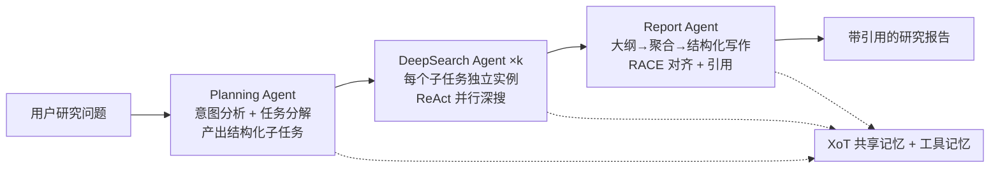
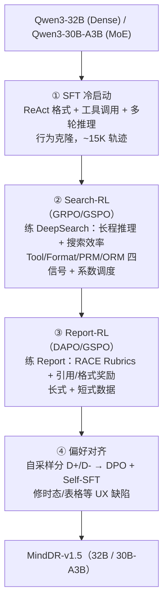

# Mind DeepResearch（理想 MindDR）：三 agent 协作 + 四阶段训练的高效深研

**📄 [Mind DeepResearch Technical Report](https://arxiv.org/abs/2604.14518)**

2026-04 · 理想汽车 MindDR Team（Li Auto Inc）· [榜单](https://huggingface.co/spaces/muset-ai/DeepResearch-Bench-Leaderboard)

**一句话**：理想汽车的 ~30B 深研框架——把深度研究在**推理侧拆成"规划 / 深搜 / 报告"三 agent 协作**、在**训练侧拆成"SFT 冷启动 → Search-RL → Report-RL → 偏好对齐"四阶段**，用替代昂贵 mid-training 的分阶段训练，把中等规模模型做到与更大基座掰手腕，并已上线理想自家智能助手。

::: details 📖 论文原文 Abstract（英文）
We present **Mind DeepResearch (MindDR)**, an efficient multi-agent deep research framework that achieves leading performance with only ~30B-parameter models through a meticulously designed data synthesis and multi-stage training pipeline. The core innovation of MindDR lies in a collaborative **three-agent architecture** (Planning Agent, DeepSearch Agent, and Report Agent) and a **four-stage agent-specialized training pipeline** comprising SFT cold-start, Search-RL, Report-RL and preference alignment. With this regime, MindDR demonstrates competitive performance even with ~30B-scale models. Specifically, MindDR achieves 45.7 on BrowseComp-ZH, 42.8 on BrowseComp, 46.5% on WideSearch, 75.0% on xbench-DS, and 52.5 on DeepResearch Bench, outperforming comparable-scale open-source agent systems and rivaling larger-scale models. MindDR has been deployed as an online product in Li Auto. Furthermore, we introduce **MindDR Bench**, a curated benchmark of 500 real-world Chinese queries from our internal product user interactions, evaluated through a comprehensive multi-dimensional rubric system rather than relying on a single RACE metric. On MindDR Bench, MindDR achieves a state-of-the-art score of 51.8.
:::

**相关**：[Deep Research 总览](/agent/deep-research/) · [Tongyi DeepResearch](/agent/deep-research/tongyi-deepresearch) · [REDSearcher](/agent/deep-research/redsearcher) · [Step-DeepResearch](/agent/deep-research/step-deepresearch) · [DR-Rubric](/agent/deep-research/dr-rubric) · [Web 长程导航 RL](/agent/agentic-rl/web-agent-rl)

> 图源：MindDR Team (Li Auto), *Mind DeepResearch Technical Report*（arXiv:2604.14518）Figure 1——MindDR 与主流深研系统的多基准对比，MindDR-1.5 为本文模型、MindDR-1.0 为上一代大规模 RFT 版（用于学习注解，版权归原作者）。

## 动机与创新点：search ≠ research，用小模型把"贵在哪"逐块拆掉做高效深研

MindDR 的核心追问写在引言里——

> *how to achieve leading performance and excellent user experience using a small-sized model through low-cost training and inference?*

作者指出当下 SOTA 深研系统普遍依赖 **>100B 的大基座**，再叠加昂贵的持续预训练（mid-training）注入领域知识与推理能力；推理时复杂研究任务又要长程推理与多步工具调用，**若不显式优化搜索效率**，模型会"把大量算力耗在边际收益很低的探索上"（exhaust substantial computational budgets on marginally relevant exploration），既抬高 token 消耗与时延，又会"通过过度的上下文累积稀释关键发现"。这与本章 [Tongyi DeepResearch](/agent/deep-research/tongyi-deepresearch)、小红书 [REDSearcher](/agent/deep-research/redsearcher)、阶跃 [Step-DeepResearch](/agent/deep-research/step-deepresearch) 同处一条战线——**不靠堆参数，靠"训练 + 架构"把一个约 30B 的模型压榨到深研 SOTA 级**。

MindDR 的破题方式是**把"贵"和"难"逐块拆开**：推理侧用三 agent 分解任务、隔离上下文；训练侧用四阶段课程，每阶段只攻一个能力前沿、配专属奖励与算法。它刻意**移除工业界常见的 mid-training 阶段**（往往要 >150B tokens），改用"SFT 冷启动 + 分块 RL + 偏好对齐"的分阶段设计——据论文，MindDR-1.5 仅用约 **1.03B 训练相关 token、6K GPU 卡时**，就超过上一代用 280K RFT 样本（≈3.6B token、15K 卡时）的 MindDR-1.0。

**关键创新**：

- **三 agent 协作架构 + XoT 共享记忆**：Planning / DeepSearch / Report 三个分工 agent 顺序协作，并用 **Extended Chain-of-Thought（XoT）记忆 + 工具记忆**把推理链跨 agent、跨工具调用串起来——区别于"单次模型调用内"的普通 CoT。
- **四阶段 agent 专属训练**：SFT 冷启动 → Search-RL（练深搜）→ Report-RL（练写报告）→ 偏好对齐（DPO + Self-SFT），由"奖励可处理性 / 能力依赖 / 数据效率"三原则推导而来，每阶段独立配奖励与优化算法。
- **轻量 step-level credit assignment**：Search-RL 用基于实体串匹配的 **PRM**（无需 LLM 推理）+ **阈值触发的奖励系数调度**，在无 critic、无指数级采样的前提下做细粒度 advantage 估计，显式优化检索准确率与搜索效率。
- **MoE 上的 GSPO/DAPO 取舍**：发现 GRPO 在 MoE 上因专家路由漂移而不稳，Search-RL/Report-RL 在 MoE 骨架上改用序列级重要性比的 **GSPO**，Dense 骨架上 Report-RL 用 **DAPO**。
- **MindDR Bench + 模块化评测**：500 条来自理想自家助手（Livis）真实日志的中文 query，不止看单一 RACE 总分，还把深研流水线拆成"推理轨迹 / 工具调用 / 大纲生成 / 报告生成"四个模块分别打过程指标。

## 方法：三 agent 推理架构 + KG 数据合成 + 四阶段训练流水线

MindDR 由两个紧耦合组件构成：编排多 agent 协作出报告的**推理流水线**，和逐层垫高各 agent 所需能力的**四阶段训练流水线**。

### 推理架构：三 agent 顺序协作 + XoT 跨 agent 记忆

MindDR 把深研循环落成三个分工明确、信息逐级向下传的 agent：

- **Planning Agent（规划）**：收到 query 后先做**意图分析**，把问题**分解成一组子任务**（structured subtask specification），决定"研究哪些方面、按什么顺序"，再把子任务派发给下游。
- **DeepSearch Agent（深搜）**：每个子任务被派给**一个独立的 DeepSearch 实例**，因此**多个子任务可并行执行**——这正是"推理侧解耦能提效、隔离上下文"的来源。每个实例跑 **ReAct 式 agent 循环**，迭代调用搜索工具做多源检索、证据整合与中间推理，直到判断"已收集到足够信息回答该子问题"。
- **Report Agent（报告）**：作为最终综合阶段，吃下完整任务规格与所有子报告，先生成**层级化大纲**，再做**全局信息聚合与结构化组织**，产出连贯、全面的 Markdown 报告；图 2 里把它细化为 `DRAFTING → OUTLINE → WRITING → POLISHING` 四态。它显式对齐 **RACE 评测框架**（全面性 / 洞察 / 指令遵循 / 可读性）与真实用户体验。

> 图源：MindDR Team (Li Auto), *Mind DeepResearch Technical Report*（arXiv:2604.14518）Figure 2——MindDR 三 agent 协作框架与 XoT/工具共享记忆（用于学习注解，版权归原作者）。

把三者粘起来的是**共享记忆机制**。关键创新是 **Extended Chain-of-Thought（XoT）记忆**：

> Unlike standard chain-of-thought prompting, which operates within a single model invocation, XoT memory **extends the reasoning trace across multiple agent interactions and tool calls**.

普通 CoT 只在"一次模型调用内"成立；XoT 把推理链**跨多个 agent 交互、跨多次工具调用**延展。DeepSearch 与 Report Agent 维护并追加到一个共享推理上下文，里面既有当前 agent 的思考，也有 **agent 之间的互联信息**；再配一个**工具记忆模块**记录与外部环境的交互。这样下游 agent（如 Report）能访问被检索信息的**完整出处（full provenance）**，让报告生成更忠实、更有据可依。

> 举例：DeepSearch #1 查"某车企 2024 财报毛利率"时把"数据来自财报第 18 页"写进 XoT/工具记忆；Report Agent 写到该数字时可直接回溯这条出处挂引用，而不必凭空复述。

### 数据合成：知识图谱反推多跳难题 + 真实 query 混合

训练信号主要来自一条 **KG-grounded 的多跳问题合成**管线（图 4 共四阶段：子图采样 → 多跳 QA 生成 → 条件混淆与合理性评估 → 推理有效性过滤）：

- **图谱构建与子图采样**：从**百度百科 + 英文维基 + 网页树**构建统一知识图谱，按实体-属性关系采样节点与路径。子图采样强制三条约束——**推理可达性**（reasoning reachability，每一跳都对应真实搜索环境里可检索/可验证的条件）、**路径必要性**（path necessity，掐掉中间节点与答案的直接关联，杜绝捷径，保证每一跳都贡献必要信息）、**结构独立性**（structural independence，多分支子图各分支语义与结构独立，避免跨分支关联降低组合复杂度）。三者共同保证子图"可推断、不可简化、可验证"。
- **多跳 QA 生成**：给定子图结构，让强 LLM 把**显式结构关系转成隐式的自然语言 QA**，并约束问题全面覆盖关键子图信息、紧绑解题路径与图结构。
- **条件混淆与合理性评估**：为提难度而**不降可解性**——把低价值属性与其它条件组合或替换成更具区分度的描述、弱化过于直白的线索逼模型"合成多个条件"，但要求混淆后语义与原文一致、并持续监控对答案唯一性的影响。
  > 举例：原本"X 公司 CEO 是谁"太直白，混淆成"那家在 2024 年发布了某款增程车型、总部位于北京的车企，其现任 CEO 是谁"——逼 agent 多跳定位再作答。
- **质量过滤**：先用**直答测试**剔除"无需多步推理就能答"的题；再做条件合理性 / 推理合理性过滤去掉逻辑矛盾或缺乏真实检索支撑的样本；最后 **QA 语义一致性过滤**结合自动打分 + 人工审计，只放高质量样本进训练集。

合成数据虽可控，但"知识图谱 query 的采样空间受语料覆盖约束、对稀有实体分布偏移、能力未必迁移到真实用法"。因此 MindDR **把 KG 合成 query 与真实用户 query 按校准比例混合**，在可控性与生态效度（ecological validity）间取平衡；其中一部分真实 query 进一步策展成 MindDR Bench。各阶段的具体数据：SFT 约 **12K 高质量轨迹**（KG 轨迹 60% / 真实场景 35% / 人标难例 5%）；Search-RL 约 **35K 合成 query**，并在生成时抽取**关键实体集 $\mathcal{E}=\{e_1,\dots,e_M\}$** 供 PRM 串匹配验证用；Report-RL 复用 SFT 轨迹语料，派生**长式**（含 query / 系统提示 / 上游检索数据 / 大纲 / RACE Rubrics / 参考报告）与**短式**（省去上游检索、参考报告新合成）两种格式以平衡保真度与数据效率。

### 训练流水线：为何分四阶段，每阶段攻什么

MindDR 不做端到端 RL，而把训练拆成四阶段课程，并明确给出三条设计原则：

- **奖励可处理性（reward tractability）**：端到端单一奖励要同时覆盖工具正确性、推理质量、报告连贯性、主观偏好，"必然稀疏且嘈杂、跨几十步做 credit assignment 不可解"；分阶段把它拆成每阶段稠密、定义良好的信号。
- **能力依赖（capability dependency）**："RL 探索需要 SFT 给的稳定格式遵循；报告质量受 Search-RL 的检索完整度制约；偏好对齐又预设前序阶段已产出功能正确的输出"——顺序即依赖链。
- **数据效率（data efficiency）**：每阶段只用为其目标能力策展的数据，免去昂贵的端到端轨迹标注。

> 图源：MindDR Team (Li Auto), *Mind DeepResearch Technical Report*（arXiv:2604.14518）Figure 3——四阶段训练流水线、动态数据合成与 AI-Infra（用于学习注解，版权归原作者）。

### 阶段①：SFT 冷启动——长上下文格式正确率当早停信号

SFT 提供"行为冷启动"，靠在专家轨迹上做**行为克隆**建立工具调用、ReAct 格式遵循、多轮推理三项基础能力。训练目标是标准自回归 loss（每步预测思考 $T_t$ 与动作 $A_t$，工具不在训练时执行、observation $O_t$ 作上下文输入）：

$$\mathcal{L}_{\text{SFT}}(\theta) = -\mathbb{E}_{(x,H)\sim\mathcal{D}_{\text{SFT}}}\left[\sum_{t=1}^{T_H} \log \pi_\theta(T_t, A_t \mid x, H_{<t})\right]$$

它"理论上优化 RL 策略梯度目标的一个下界、提供合理的初始策略分布"。难点在 **SFT 训练量与后续 RL 效果之间有反直觉的权衡**：训不够（20–40K 样本）长上下文格式遵循差、早期 RL 有效轨迹不足 30%；训过头（>200K 样本）虽近乎完美格式正确，但**过拟合专家轨迹表层模式、RL 采样高度同质、熵快速坍缩、梯度信号消失**。课程上用长度自适应安排：早期以 ~8K 短样本为主稳格式，逐步引入 32K–64K（约 30%）与 128K（约 15%）数据并做位置编码微调，把 **128K 上下文格式正确率从 72% 提到 94%**。

据此 MindDR 用**长上下文格式正确率**当早停指标：RL 时每 query 采 $G=8$ 条、至少需 2 条有效轨迹才能稳定估 group advantage；按二项分布，"≥2 次成功的概率 ≥0.95"要求格式错误率 $p\le 0.0253$。于是每 10K 步测 64K 与 128K 的格式错误率，当二者与训练 loss 都跌破阈值且**策略熵不低于中训练值的 90%** 时触发早停——通常落在 100K–150K 样本，取"能力与可塑性的最优平衡"。

### 阶段②：Search-RL——四信号奖励 + 阈值触发系数调度

Search-RL 在**真实工具环境**里在线 RL，专攻 DeepSearch Agent 的长程推理与搜索效率，把能力从"基本工具调用"渐进推到"复杂长程推理"，且**不设硬阶段边界**——靠动态调度奖励权重与数据难度，在单一连续训练过程里完成，规避硬分段带来的超参敏感与能力退化。基础算法是 **GRPO**：每个 query 采 $G$ 条轨迹算 group-relative advantage $\hat{A}(x,H_i)=R(x,H_i)-\frac{1}{G}\sum_j R(x,H_j)$。但作者发现 **GRPO 在 MoE 上不稳**——专家稀疏激活下，"旧策略采样轨迹激活的专家路径会与当前策略不一致，违反重要性采样假设、引入大梯度偏差"；试过 "Routing Replay" 强制激活同一批专家仍不稳，故 MoE 改用 **GSPO**，把重要性比从 token 级提到**序列级**并做长度归一化：

$$s_i(\theta) = \left(\frac{\pi_\theta(y_i\mid x)}{\pi_{\theta_{\text{old}}}(y_i\mid x)}\right)^{1/|y_i|} = \exp\left(\frac{1}{|y_i|}\sum_{t=1}^{|y_i|}\log\frac{\pi_\theta(y_{i,t}\mid x, y_{i,<t})}{\pi_{\theta_{\text{old}}}(y_{i,t}\mid x, y_{i,<t})}\right)$$

序列级比值"天然对局部专家路由变化做平均、压住 MoE 稀疏激活引起的比值抖动"，让 clip 约束稳定生效、避免搜索能力退化。

**四类奖励信号**（均由 LLM-as-Judge 3 模型二值打分、多数投票聚合）：

- **工具调用奖励** $r_{\text{tool}}(t)$：成功 +0.1；**连续失败** −0.2；**孤立失败** −0.1（用更强的负惩罚加速规避易错行为）。
- **格式奖励** $r_{\text{format}}(t)$：正确 +0.1、错误 −0.2。
- **过程奖励 PRM**：对关键实体集 $\mathcal{E}$ 做**串匹配**——某实体 $e_j$ 在任一步的推理 $T_t$ 或工具返回 $O_t$ 中出现即记一分，$R_{\text{PRM}}(H)=\frac{1}{M}\sum_{j=1}^{M}\hat{e}_j$。亮点是"**无需任何 LLM 推理来验证**，低成本可扩展、提供稳定的中间过程监督"。
- **结果奖励 ORM**：终答正确性 $R_{\text{ORM}}(H)\in\{0,1\}$，同样走 LLM-as-Judge 多数投票。

合成总奖励 $R(x,H)=\lambda_{\text{ORM}}R_{\text{ORM}}+\lambda_{\text{PRM}}R_{\text{PRM}}+\frac{1}{T}\sum_t[\lambda_{\text{tool}}r_{\text{tool}}(t)+\lambda_{\text{format}}r_{\text{format}}(t)]$，四系数和为 1、各在 $[0,0.5]$。**阈值触发调度**是核心：初始 $(\lambda_{\text{tool}},\lambda_{\text{format}},\lambda_{\text{PRM}},\lambda_{\text{ORM}})=(0.6,0.3,0.1,0.0)$，分三阶段推进——工具调用饱和后降 $\lambda_{\text{tool}}$、把权重转给 $\lambda_{\text{PRM}}$；格式稳定后降 $\lambda_{\text{format}}$；PRM 覆盖成熟后主导权移交 $\lambda_{\text{ORM}}$。这种"每个能力在其合适训练阶段才获得集中监督"的安排，呈现出从基础技能到深度推理的"**grokking**"式进阶（图 5）。配套的**动态数据**把难度采样调到让 ORM 准确率维持在 10%–50% 的"有效学习区"：低于 10% 任务太难、奖励稀疏，高于 50% 太易、收益递减。

> 图源：MindDR Team (Li Auto), *Mind DeepResearch Technical Report*（arXiv:2604.14518）Figure 5——Search-RL 的奖励分量、系数调度与总奖励曲线，动态调度显著优于固定系数（用于学习注解，版权归原作者）。

工程上 Search-RL 跑在 **Li-veRL**（扩展 veRL）上：做专家路由优化与负载均衡稳住 MoE 训练，配异步轨迹生成 / 异步工具调用拿到相对原生 veRL 的 **2.9× 加速**；所有工具走统一入口做流控、异常重试与结果缓存，把工具错误率压到 **<0.1%**。工具上模型可用三类检索——**内部知识检索**（自研搜索引擎 + 数百亿级高质量内部知识库，在汽车/科技/金融等公司相关域覆盖更好且降调用成本）、**外部网络检索**（按 query 内容与类目自动路由到 Sogou/Bing/Quark）、**学术文献检索**，外加网页爬取与文档处理做全文深读。

### 阶段③：Report-RL——RACE Rubrics 主奖励 + 引用/格式辅助奖励

Report-RL 专攻 Report Agent 的长文生成质量：用 **LLM-as-Judge 按结构化 RACE Rubrics**（全面性 / 可读性 / 洞察 / 指令遵循）打分作主奖励，再叠两个**可由规则检测**的辅助奖励（指导原则是：能用规则查的当 RL 辅助奖励，需整体 LLM 判断的留到偏好对齐阶段）：

- **引用奖励** $R_{\text{cite}}$：设 $n_{\text{gen}}$ 为生成报告引用数、$n_{\text{ref}}$ 为参考报告引用数、$n_{\text{valid}}$ 为有效引用数（描述与所引段落相关度超阈值 $\tau$）。引用充足且有效（$n_{\text{gen}}\ge 0.7 n_{\text{ref}}$ 且 $n_{\text{valid}}\ge 0.7 n_{\text{ref}}$）记 +0.1；充足但有效性差记 −0.1；引用不足记 −1（重罚）。
- **格式奖励** $R_{\text{format}}=-(v_{\text{tag}}+v_{\text{md}}+v_{\text{ref}})\in[-3,0]$：分别对应 `<final_answer>` 标签缺失、Markdown 格式错误（列表编号、表格渲染等）、引用格式错误三类二值违规独立惩罚。

总奖励 $R_{\text{Report}}=R_{\text{RACE}}+\lambda_c R_{\text{cite}}+\lambda_f R_{\text{format}}$。优化算法上，Dense 骨架用 **DAPO**——它相对 GRPO 有四项改进：**token 级策略梯度**（按总 token 数归一、消除跨长度梯度失衡）、**非对称裁剪**（$\varepsilon_{\text{low}}<\varepsilon_{\text{high}}$，给上行探索更大空间、抑制熵坍缩）、**去掉 KL 约束**（放开奖励空间探索）、**动态采样过滤**（丢掉全对或全错的 group 保证非平凡 advantage）。MoE 骨架同样因路由敏感而改用 **GSPO**。论文还指出 Report-RL 的核心难点"不是它能否提升报告质量（能），而是提升的同时**前序 DS 能力被保住多少**"——消融显示 GSPO/DAPO 这类序列级方法在"提报告质量"与"少回退搜索能力"间平衡最好，GRPO 则会造成明显更大的 DS 退化。

### 阶段④：偏好对齐——DPO 修硬伤 + Self-SFT 提表达

RL 奖励主要由可量化指标驱动，对"需要整体 LLM 判断、无法用简单规则定义"的体验问题无能为力——时态不一致、语气不自然、段落转折突兀、结论与检索内容不符等。偏好对齐阶段用**自采样**保持训练数据与模型自身分布一致：对每个输入采多份输出 $\{y_1,\dots,y_K\}$，经 **LLM-as-Judge + 规则检测**双信号加权打分，切成高质量集 $\mathcal{D}^+$ 与低质量集 $\mathcal{D}^-$。两个互补方法：

- **DPO**（偏好对比）：用 $(x,y^+,y^-)$ 对优化策略相对参考策略的对数概率边际，$\mathcal{L}_{\text{DPO}}(\theta)=-\mathbb{E}\left[\log\sigma\left(\beta\log\frac{\pi_\theta(y^+\mid x)}{\pi_{\text{ref}}(y^+\mid x)}-\beta\log\frac{\pi_\theta(y^-\mid x)}{\pi_{\text{ref}}(y^-\mid x)}\right)\right]$。专攻最结构化、最可客观判定的硬伤——用 **1.8K 时态数据 + 2.8K 表格修复数据**修时态错误与表格错误。
- **Self-SFT**（静态数据上的强化）：直接在 $\mathcal{D}^+$ 上微调，$\mathcal{L}_{\text{Self-SFT}}(\theta)=-\mathbb{E}_{(x,y^+)\sim\mathcal{D}^+}[\log\pi_\theta(y^+\mid x)]$，被理解为"**reinforcement on static data**"——用高质量自采样样本当监督信号、保留 on-policy 特性，但比在线 RL 成本更低、收敛更稳。用 **4.3K 高质量自采样报告**提连贯性与文体一致性。

两法都只用模型自己的样本造数据，**把分布调整约束在模型已有输出空间内**，避免策略被拉向未探索区域、破坏 SFT/RL 积累的搜索与写作能力。

## 实验结果：DS 五榜领跑同规模 + 自建 MindDR Bench 报告质量登顶

### MindDR Bench 与模块化评测

针对现有深研基准"中文真实 query 稀缺、且多依赖单一宏观 RACE 分、对长流程中间模块无细粒度反馈"两大缺口，MindDR 建 **MindDR Bench**：从理想智能助手 **Livis** 真实日志挖出 **500 条深研 query**，经"SOTA LLM 预筛 + 专家标注"两阶段混合过滤，覆盖**汽车、出行、科技、金融等 16 个领域**。配套提出 **MindDR Module Evaluation**——不止看内容 RACE，还把流水线拆成四个模块打过程指标：

| 评测模块 | 指标 | 评测项 |
| --- | --- | --- |
| 推理轨迹 Reasoning Trajectory | 思考效率 | 反思轮数 / 搜索 query 重复率 |
| 工具调用 Tool Call | 工具使用正确性 | 各工具使用占比 / 工具调用失败率 |
| 大纲生成 Outline Generation | 大纲逻辑正确性 | 大纲标题缺失率 / 目录层级错误数 |
| 报告生成 Report Generation | 内容逻辑正确性 | 时态错误率 / 有效格式表格率 |

### Benchmark 表现（以原文为准）

**DeepSearch 五榜（Table 2）**：MindDR 评了两个骨架——**MindDR-v1.5-30B-A3B**（Qwen3-30B-A3B MoE）与 **MindDR-v1.5-32B**（Qwen3-32B Dense），并与上一代 **MindDR-v1.0**（仅 RFT 训练）对比：

| 模型 | BrowseComp-ZH | BrowseComp | xbench-DS | GAIA-DS | WideSearch |
| --- | --- | --- | --- | --- | --- |
| **MindDR-v1.5-30B-A3B** | **45.7** | **42.8** | **75.0** | **70.9** | 44.0 |
| MindDR-v1.5-32B | 35.6 | 14.8 | 64.0 | 67.1 | **46.5** |
| MindDR-v1.0-32B | 28.4 | 18.6 | 13.3 | 50.3 | 41.3 |
| Tongyi-DR-30B-A3B | 43.2 | 40.7 | 69.0 | 68.9 | 41.7 |
| WebShaper-32B | 28.0 | 33.5 | 53.0 | 54.4 | 35.2 |
| MiroThinker-v1.5-30B-A3B | 31.9 | 30.4 | 5.0 | 23.3 | 37.9 |

- 在同规模开源 agent 系统里，MindDR-v1.5-30B-A3B 取得 BrowseComp-ZH / BrowseComp / xbench-DS / GAIA-DS **四项最佳**，MindDR-v1.5-32B 拿下 WideSearch——说明增益跨骨架泛化、非单点过拟合；整体"逼近或超过更强的基座式 baseline、明显优于同规模开源 agent"。

**报告类基准——MindDR Bench RACE（Table 3）**：

| 模型 | RACE | 全面性 | 洞察 | 指令遵循 | 可读性 | 引用准确 |
| --- | --- | --- | --- | --- | --- | --- |
| **MindDR-v1.5** | **51.77** | **52.17** | **51.77** | 50.55 | **52.18** | 80.25% |
| Gemini 3.1 | 49.65 | 49.83 | 50.75 | 49.32 | 46.89 | 77.20% |
| Gemini 2.5 Pro | 48.34 | 47.56 | 46.88 | 49.47 | 50.23 | 81.86% |
| MindDR-v1.0 | 44.33 | 44.72 | 39.49 | 47.58 | 47.66 | **82.14%** |
| Kimi | 45.20 | 46.08 | 40.60 | 47.94 | 47.53 | 75.01% |

- MindDR-v1.5 在 RACE 总分及全面性/洞察/可读性多维领跑、超过 Gemini 3.1/2.5 Pro；唯一"略逊"的是**引用准确率**——上一代 MindDR-v1.0 反而最高（82.14%），作者据此指出"报告质量优化与引用忠实度优化相关但不完全同向"。在公开 **DeepResearch Bench** 上（Figure 8）MindDR-v1.5 五维全部居首，对应 abstract 报的 **52.5** 总分。
- **效率（Figure 9）**：在 BrowseComp-ZH 上，MindDR-v1.5-30B-A3B 稳居"**Accurate & Efficient**"象限——在头部模型中**平均工具调用数与上下文 token 最省**，却拿最高分；在 16k–128k 上下文限制、8–64 工具调用限制下都保持领先。
- **消融**：Report-RL 长式 + 短式混合优于纯长式（RACE 48.82→50.60）；偏好对齐阶段 DPO 把**表格错误 2.70%→1.22%、时态错误 6.2%→2.0%**，Self-SFT 再把表达/逻辑问题率 1.8%→0.3% 并把 DeepResearch Bench 50.07→51.77；时态错误率（Table 8）MindDR-v1.5 **2.0% 为全场最低**（Kimi 3.2% / Gemini 10.2% / Doubao 14.0% / MindDR-v1.0 11.4%）。

> 一如本章惯例：这些分数口径、时点、工具配置、test-time 设置各异，**跨系统直接比绝对值意义有限**，当作"同期 30B 档深研能力的量级参照"即可。

## 在 Deep Research 谱系里的位置

- **vs Tongyi / REDSearcher / Step-DeepResearch**：四者都在 **~30B 档**走"专门训练深研 agent"。MindDR 的特色是 **(a) 推理侧三 agent 显式分工（规划/深搜/报告）+ XoT 跨 agent 共享记忆 + (b) 训练侧搜索/报告各自独立 RL（Search-RL / Report-RL）的四阶段流水线 + (c) 刻意移除 mid-training、用极低训练成本（~1.03B token、6K 卡时）见效**，且**已上线理想自家智能助手**。对照看 [Step-DeepResearch](/agent/deep-research/step-deepresearch)：它正相反，坚持**单 agent ReAct**、把四类"原子能力"内化进一个模型、用 agentic mid-training（32K→128K）→ SFT → PPO 三阶段——一个"分工多 agent + 砍掉 mid-training"，一个"单 agent + 保留 mid-training"，是同档位的两条对照路线。[Tongyi](/agent/deep-research/tongyi-deepresearch) 强调全自动数据合成 + agentic mid/post-training，[REDSearcher](/agent/deep-research/redsearcher) 强调任务难度形式化 + 本地闭库低成本 RL。
- **vs DR-Rubric / AgentDisCo**：MindDR 的 Report-RL 用 **RACE Rubrics** 作奖励、MindDR Bench 用多维 rubric 评分，与 [DR-Rubric](/agent/deep-research/dr-rubric)（把"造 RL 奖励 rubric"当深研任务）、Step 的 checklist Judger 思路一致——开放式深研越来越靠"多维 rubric/checklist"而非单一分数。[AgentDisCo](/agent/deep-research/agentdisco) 不训底座、在强通用模型上做 agent 编排，与 MindDR"从训练侧造模型"互补。
- **方法上的两个可迁移点**：① 用**实体串匹配 PRM**（无 LLM 推理）做廉价的 step-level 过程奖励，配**阈值触发的奖励系数调度**实现"grokking"式渐进，是低成本 agentic RL 的实用范式；② 发现 **GRPO 在 MoE 上因专家路由漂移而不稳、改用序列级 GSPO**，对所有在 MoE 上做 agentic RL 的工作都有参考价值。
- 整体定位与"国产/开源刷榜竞赛"背景见 [Deep Research 总览](/agent/deep-research/)。
