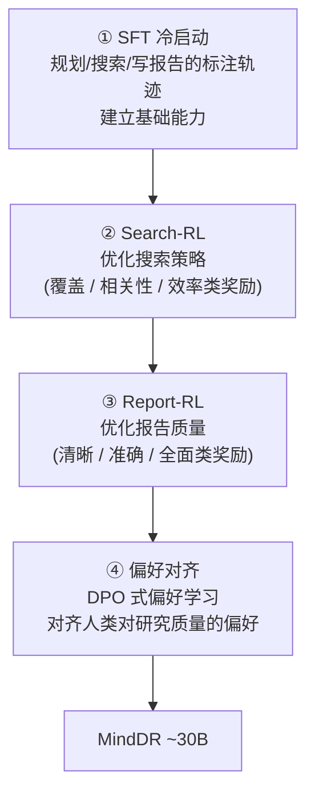

# Mind DeepResearch（理想 MindDR）：三 agent 协作 + 四阶段训练的高效深研

> **一句话**：Mind DeepResearch（MindDR，理想汽车 Li Auto）走"**小而精**"路线——用一个约 **30B** 规模的模型，配上**规划 / 深搜 / 报告三个 agent 顺序协作**的架构，以及 **SFT 冷启动 → Search-RL → Report-RL → 偏好对齐**的**四阶段训练**流水线，把开源深研做到"优于同规模开源系统、可与更大模型掰手腕"，并已落地到理想自家产品；同时提出基于 500 条真实中文 query、用多维 rubric 评分的 **MindDR Bench**。
> 提出年份：2026（arXiv:2604.14518，2026-04）· 机构：理想汽车 MindDR Team（Li Auto Inc）· 规模：约 30B
> 前置阅读：[Deep Research 总览](/agent/deep-research/) · [Tongyi DeepResearch](/agent/deep-research/tongyi-deepresearch) · [REDSearcher](/agent/deep-research/redsearcher) · [Web 长程导航 RL](/agent/agentic-rl/web-agent-rl)

## 定位：用小模型做高效深研

MindDR 的核心主张和阿里 [Tongyi DeepResearch](/agent/deep-research/tongyi-deepresearch)、小红书 [REDSearcher](/agent/deep-research/redsearcher) 同处一条战线——**不靠堆参数，而靠"训练 + 架构"把一个约 30B 的模型压榨到深研 SOTA 级**。它的差异点在于把"深度研究"显式拆成**三个分工明确的 agent**，并为每个环节设计**专门的 RL 阶段**分别打磨。

## 三 agent：规划 → 深搜 → 报告

MindDR 把深研循环落成三个顺序协作的 agent，信息逐级向下传：

- **Planning Agent（规划）**：把用户问题**拆解成子任务**，并生成对应的检索策略——决定"要研究哪些方面、按什么顺序搜"。
- **DeepSearch Agent（深搜）**：按规划**执行联网搜索与信息检索**，多轮抓取、读取、补检，是真正"刨信息"的部分。
- **Report Agent（报告）**：把搜集到的材料**综合成连贯、结构化的报告**，对清晰度、准确性、全面性负责。

这种显式分工的好处是**每个 agent 的能力可以被单独训练和优化**——这正是下面四阶段训练流水线的设计前提。

## 四阶段训练流水线

MindDR 不是一把 RL 到底，而是分四步把不同能力逐层垫高：

1. **SFT 冷启动（cold-start）**：用规划、搜索、写报告任务的标注轨迹做监督微调，先建立"会按这套流程走"的基础能力。
2. **Search-RL**：针对**搜索环节**做强化学习，用搜索特定的奖励（覆盖度 / 相关性 / 效率一类）优化"怎么搜更好"。
3. **Report-RL**：针对**报告环节**做强化学习，用报告质量奖励（清晰、准确、全面）优化"怎么写更好"。
4. **偏好对齐**：最后用 [DPO](/dpo/dpo) 式的偏好学习，对齐人类对"什么是好研究"的偏好。

这种**"搜索"与"报告"分开做 RL** 的设计，呼应了它把 agent 拆成深搜与报告两块的架构——每块各有各的奖励信号，避免把两个目标揉成一个含糊的总分。

## MindDR Bench：500 条真实中文 query + 多维 rubric

为评测贴近真实使用，MindDR 提出自家基准 **MindDR Bench**：基于 **500 条真实世界的中文用户 query**，**不用单一指标，而用多维 rubric** 打分（研究深度、事实准确性、报告连贯性等）。这与本章 [DR-Rubric](/agent/deep-research/dr-rubric)、[AgentDisCo](/agent/deep-research/agentdisco) 用 rubric / 报告质量基准评深研的思路一致——开放式深研越来越倾向"多维量表"而非"一个分数"。

## Benchmark 表现（以原文为准）

技术报告报告了约 30B 规模下的多榜结果（数字以 arXiv 原文为准）：

| 基准 | MindDR ~30B |
| --- | --- |
| BrowseComp-ZH | 45.7 |
| BrowseComp | 42.8 |
| WideSearch | 46.5 |
| xbench-DeepSearch | 75.0 |
| DeepResearch Bench | 52.5 |
| MindDR Bench | 51.8（自报 SOTA） |

论文称其**优于同规模开源 agent 系统、并可与更大规模模型抗衡**。一如本章惯例：这些分数口径、时点、工具配置各异，**跨系统直接比绝对值意义有限**，当作"同期 30B 档开源深研能力的量级参照"即可。

## 在 Deep Research 谱系里的位置

- **vs Tongyi DeepResearch / REDSearcher**：三者都在 **30B 档**走"专门训练长程搜索/深研 agent"的路线。MindDR 的特色是**三 agent 显式分工 + 搜索/报告各自独立 RL（Search-RL / Report-RL）**的四阶段流水线，且**已在理想自家产品落地**；REDSearcher 更强调"任务难度形式化 + 本地闭库低成本 RL"，Tongyi 强调"agentic mid/post-training + 全自动数据合成"。可对照阅读 [Tongyi](/agent/deep-research/tongyi-deepresearch) 与 [REDSearcher](/agent/deep-research/redsearcher)。
- **vs AgentDisCo / 开源框架**：[AgentDisCo](/agent/deep-research/agentdisco) 不训练底座、在强通用模型上做 agent 编排；MindDR 是**从训练侧**造模型，二者互补。
- 整体定位与"国产/开源刷榜竞赛"背景见 [Deep Research 总览](/agent/deep-research/)。

## 参考文献

- MindDR Team, Li Auto Inc. *Mind DeepResearch Technical Report.* arXiv:2604.14518, 2026-04. <https://arxiv.org/abs/2604.14518>
- 评测基准：BrowseComp / BrowseComp-ZH、WideSearch、xbench-DeepSearch、DeepResearch Bench，及自建 MindDR Bench（500 条中文 query，多维 rubric）
