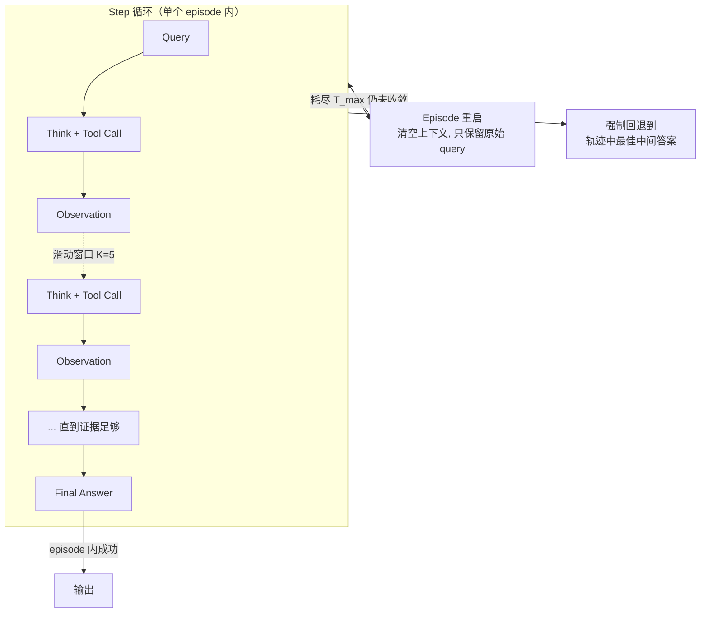
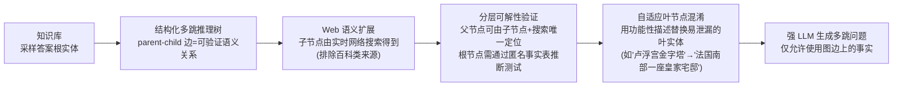
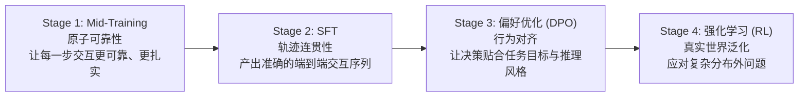

# MiroThinker-1.7 & H1（MiroMind）：局部+全局双层验证，把交互式 scaling 升级为"重型（heavy-duty）"深研 agent

**📄 [MiroThinker-1.7 & H1: Towards Heavy-Duty Research Agents via Verification](https://arxiv.org/abs/2603.15726)**

2026-03 · MiroMind Team · [MiroThinker 代码](https://github.com/MiroMindAI/MiroThinker) · [MiroFlow 代码](https://github.com/MiroMindAI/MiroFlow)

**一句话**：前作 [MiroThinker v1.0](/agent/deep-research/mirothinker) 证明"交互式 scaling"能提升深研 agent 能力，但没有回答"交互质量能不能被显式核验"这个问题；MiroThinker-1.7 先用 agentic mid-training 把每一步交互本身变得更可靠，再叠加 **MiroThinker-H1**——一套局部（步骤级）+ 全局（轨迹级）双层验证的"重型（heavy-duty）"推理模式——在 BrowseComp/BrowseComp-ZH/GAIA 等基准上刷新 SOTA，且验证机制带来的提升比单纯延长交互轨迹更大、更省步数。

::: details 📖 论文原文 Abstract（英文）
We present MiroThinker-1.7, a new research agent designed for complex long-horizon reasoning tasks. Building on this foundation, we further introduce MiroThinker-H1, which extends the agent with heavy-duty reasoning capabilities for more reliable multi-step problem solving. In particular, MiroThinker-1.7 improves the reliability of each interaction step through an agentic mid-training stage that emphasizes structured planning, contextual reasoning, and tool interaction. This enables more effective multi-step interaction and sustained reasoning across complex tasks. MiroThinker-H1 further incorporates verification directly into the reasoning process at both local and global levels. Intermediate reasoning decisions can be evaluated and refined during inference, while the overall reasoning trajectory is audited to ensure that final answers are supported by coherent chains of evidence. Across benchmarks covering open-web research, scientific reasoning, and financial analysis, MiroThinker-H1 achieves state-of-the-art performance on deep research tasks while maintaining strong results on specialized domains. We also release MiroThinker-1.7 and MiroThinker-1.7-mini as open-source models, providing competitive research-agent capabilities with significantly improved efficiency.
:::

**相关**：[Deep Research 总览](/agent/deep-research/) · [MiroThinker v1.0](/agent/deep-research/mirothinker) · [Apodex-1.0](/agent/deep-research/apodex) · [Tongyi DeepResearch](/agent/deep-research/tongyi-deepresearch) · [Step-DeepResearch](/agent/deep-research/step-deepresearch) · [DR Tulu](/agent/deep-research/dr-tulu)

> 图源：MiroMind Team, *MiroThinker-1.7 & H1: Towards Heavy-Duty Research Agents via Verification*（arXiv:2603.15726）Figure 1——六个基准上 MiroThinker 系列与 SOTA agent/基础模型的对比（用于学习注解，版权归原作者）。

## 动机与创新点：交互越长≠越好，真正缺的是"验证"这一环

[MiroThinker v1.0](/agent/deep-research/mirothinker) 提出把"交互频率/深度"当作模型规模、上下文长度之外的第三条 scaling 轴，用 RL 训练模型撑起更深更频繁的 agent-环境交互。但本文开篇就指出一个更根本的问题：

> Scaling the length of reasoning trajectories alone does not reliably improve performance. When intermediate steps are inaccurate or poorly grounded, longer interaction trajectories may instead accumulate noise, propagate errors, and ultimately degrade solution quality.

换句话说，交互式 scaling 本身不是免费的——如果每一步交互的质量没有保证，轨迹越长、噪声和错误反而累积得越多。论文把有效交互拆解为两个必要因素：

> Effective interaction depends on two key factors: (1) strong atomic agentic capabilities at each step, including planning, reasoning, and effective tool execution; and (2) verifiable mechanisms that allow the system to verify and refine reasoning trajectories during problem solving.

前者是"每一步做得对不对"，后者是"能不能在做的过程中核查、纠正"。MiroThinker v1.0 只回应了前者的一部分（靠交互式 scaling 让模型适应长交互），**几乎没有触及验证这一环**。这就是 MiroThinker-1.7 & H1 要补的缺口：

**关键创新**：

- **MiroThinker-1.7**：新增一个 agentic mid-training 阶段，专门强化"原子级"agentic 能力——规划、推理、工具调用、答案汇总——让每一步交互本身更可靠、更少积累噪声，从而用更少的交互轮次达到更高性能（"提升每一步质量"而非"单纯拉长轨迹"）。
- **MiroThinker-H1**：在 1.7 基础上引入**验证中心（verification-centric）的"重型（heavy-duty）"推理模式**，在**局部**和**全局**两个层级把验证直接嵌入推理过程——局部验证器（Local Verifier）实时评估、纠正中间推理步骤；全局验证器（Global Verifier）审计整条推理轨迹，确保最终答案有连贯证据链支撑。
- **双流水线 QA 合成**：Corpus-based Pipeline（延续 MiroThinker 1.0 的做法，高吞吐广覆盖）与新提出的 **WebHop Pipeline**（结构化推理树 + 网络语义扩展 + 分层可解性验证 + 自适应叶节点混淆）互补，前者管广度，后者管深度与难度可控性。
- **四阶段训练流水线**：Mid-training → SFT → 偏好优化（DPO）→ RL，逐阶段分别针对"原子可靠性 → 轨迹连贯性 → 行为对齐 → 真实世界泛化"四个目标。
- **同时开源三档模型**：MiroThinker-H1（旗舰重型系统）、MiroThinker-1.7、MiroThinker-1.7-mini，在 BrowseComp、GAIA 等多个基准上刷新 SOTA，且 1.7-mini 在效率上有显著优势。

## 方法：ReAct 双循环 + 双流水线数据合成 + 四阶段训练 + 局部/全局双重验证

### Agentic 工作流：外层 episode 循环 + 内层 step 循环，滑动窗口管理上下文

MiroThinker-1.7 在标准 ReAct 范式基础上扩展出一个**双循环架构**：外层 **episode 循环**负责轨迹级重启，内层 **step 循环**驱动单个 episode 内的推理、工具调用与观察。

在 episode $e$ 的第 $t$ 步，框架累积一份轨迹日志 $H_t^{(e)} = \{(T_1,A_1,O_1),\ldots,(T_{t-1},A_{t-1},O_{t-1})\}$（$T,A,O$ 分别是思考、动作、观察）。但 agent **并不直接对这份原始日志做推理**——一个上下文算子 $\Phi_t$ 把日志转换成一个满足 token 预算、同时保留关键信息的"有效上下文"。具体地，定义一个滑动窗口索引集 $S_t(K) = \{i \mid i \geq t-K\}$（只保留最近 $K$ 步），上下文算子对窗口内的观察做截断、对窗口外的观察直接置空：

$$\Phi_t(O_i) = \begin{cases}\text{Trunc}_L(O_i), & i \in S_t(K) \\ \varnothing, & \text{otherwise}\end{cases}$$

关键设计是：**完整的思考-动作轨迹全程保留，只对观察（工具返回内容）做窗口截断**——$C_t^{(e)} = \{(T_i, A_i, \Phi_t(O_i))\}_{i=1}^{t-1}$。作者的核心经验发现是：agent 在第 $t$ 步的决策主要依赖**近期**观察，保留久远的工具返回内容边际收益递减、却要付出显著的 token 成本；而保留全部思考-动作轨迹能让 agent 维持全局推理脉络、随时回溯此前的决策依据。实验里滑动窗口大小固定为 $K=5$。

外层 **episode 循环**处理轨迹级重启：若一个 episode 耗尽最大轮数预算 $T_{\max}$ 仍未产出有效答案（或持续出现最终答案格式错误），agent 就转入新 episode，**用原始 query 从零开始重新初始化**（$C_0^{(e)} = \{q\}, e>1$），彻底丢弃前一条轨迹的全部信息。这个"推倒重来"的设计避免了在一个已经退化的上下文里越陷越深，把 agent 的状态维持在 token 预算之内。在**最后一个** episode，agent 不再允许无限期地"等到攒够证据再答"——即便再次触达 $T_{\max}$，也会强制产出答案，回退到轨迹中抽取出的最佳中间答案，确保**永远不会因为"没想好"而彻底交白卷**。

工具接口按三类功能组织：**信息检索**（`google_search`、`scrape_and_extract_info`，后者走 Jina 等多级回退的抓取管线，再用轻量 LM 把网页内容蒸馏成聚焦证据，避免把整页原文塞进上下文）、**代码执行**（E2B 沙箱里的 `create_sandbox`/`run_command`/`run_python_code`）、**文件与数据传输**（沙箱与外部世界之间的双向文件搬运）。此外框架层面还做了两项工程加固：**工具调用纠错**（拦截并自动修正模型产生的路由错误、幻觉工具名、参数不匹配等畸形调用）与**基准污染防护**（主动屏蔽已知泄漏源，如托管了基准问题和标准答案的 HuggingFace 数据集页面，一旦发现新的泄漏域名即时加入全局黑名单）。

### 双流水线 QA 合成：Corpus-based 管广度，WebHop 管深度与难度可控性

延续 MiroThinker 1.0 的做法，**Corpus-based Pipeline** 从高度互联的语料（如 Wikipedia、OpenAlex）出发：为每个种子文档，沿内部超链接采样一个连通子图，抽取跨文档的事实性陈述，再提示一个强 LLM 把这些陈述合成为多跳 QA。这条管线吞吐高、覆盖广，能靠 prompt 驱动的多样化和实体混淆制造多样的问题形式与推理模式，**但难度控制是隐式的**——既没有对推理深度的结构化约束，也无法系统性地控制信息泄漏。

为补上这两个短板，本文提出 **WebHop Pipeline**：

- **结构化多跳图**：以答案实体为根构造有向推理树，每条边代表一个可验证的语义关系；树深度直接控制推理跳数，事实抽取被限制在父子边上，防止"抄近道"绕过预设的推理路径。
- **网络语义扩展**：为突破纯语料库的知识分布局限，通过实时网络搜索扩展推理图——根实体取自既有知识库以保证答案可核验，子节点则通过检索、筛选语义相关的网页得到，**刻意排除百科类来源**以引入真正新颖的知识，让合成数据更贴近推理时真实检索到的内容分布。
- **分层可解性验证**：在推理图的每一层都核验"既解出/不多余"——对每条父子关系，验证"给定子实体，能否把父实体的候选范围缩小到一个较小集合"（用一个搜索 agent 实测）；对根实体则施加更严格的标准，要求仅凭其一跳邻居就能唯一确定，验证方式是让一个 LLM 尝试从匿名化的事实表里反推出隐藏的根实体，反推成功则判定该样本泄漏、予以剔除。
- **自适应叶节点混淆**：最容易通过表层关联泄漏答案的叶实体（如"卢浮宫金字塔"直接联想到"卢浮宫"）会被替换成功能性描述（如"法国南部的一座皇家宅邸"），扩大合理候选指代的范围；每条替换描述都会被自动验证——若一个 LLM 仍能直接从描述反推出原实体，则该描述被拒绝并重新生成。
- **难度自适应过滤**：在生成阶段的控制之外，再用一批能力不同的搜索 agent 做事后过滤——能被弱 agent 解出的问题分配给较早的训练阶段（如 SFT），能扛住强 agent 的问题则留给更后期的阶段（如 RL），产出一份按难度分级的课程式训练语料。

### 四阶段训练：Mid-Training → SFT → 偏好优化（DPO）→ 强化学习（GRPO）

基于开源的 **Qwen3 MoE** 模型，MiroThinker-1.7 依次经历四个阶段：

**① Agentic Mid-training**：强化规划、推理、工具调用、答案汇总四类"原子"agentic 能力。数据分两类：**Agentic Planning Boosting**——构造大规模单轮规划语料，只给用户 query，让模型学会产出结构化计划与首个工具调用；用一个"分类感知的 planner-judge 过滤管线"把每道题归入典型类别（逻辑/数学、拼图式多跳检索、直接检索），再按类别专属标准剔除常见失败模式（逐字复制 query、过度受限的检索表述、过早猜实体、检索覆盖不足），并对知识密集型规划额外核验"提议的计划能否检索到解题所需的核心事实"，最多重采样 $K$ 次仍不合格就整条丢弃。**Agentic Reasoning and Summarization Sculpting**——不对整条轨迹做端到端监督，而是从多轮 agent 轨迹里挑出第 $k$ 步单独改写成高质量目标（依据该步角色，改写目标是步骤级推理如证据整合/工具使用决策，或是中间总结如把部分观察聚合成连贯答案），只对这个被改写的回合施加监督，让模型在"部分观察、动态演化的 agent 状态"下学会推理与总结，而不引入全轨迹监督里的噪声。训练目标是在单个目标回合 $y_k$ 上做 next-token 预测：

$$\mathcal{L}_{\text{mid}}(\theta) = -\mathbb{E}_{(C_{<k}, y_k)\sim\mathcal{D}_{\text{mid}}}[\log \pi_\theta(y_k \mid C_{<k})]$$

**② Agentic SFT**：让模型模仿专家轨迹以掌握结构化 agentic 行为。原始轨迹（即便来自强 LLM）常含重复内容、畸形工具调用、失败后不重试等问题，因此施加一套基于规则的过滤与清洗管线，训练目标是在多轮"用户提供 query+工具观察、assistant 产出思考+工具调用"的对话格式上最大化专家序列似然：

$$\mathcal{L}_{\text{SFT}}(\theta) = -\mathbb{E}_{(x,H)}\left[\sum_{t=1}^{T_H}\log\pi_\theta(T_t, A_t \mid x, H_{<t})\right]$$

**③ Agentic Preference Optimization**：用 **DPO** 从 SFT 模型收集的偏好数据里进一步改进决策能力。偏好对 $(H^+, H^-)$ 的排序标准有两条：(1) **纯以正确性为唯一排序信号**——不像部分前作依赖人工设计的启发式（固定规划长度、步数、推理模板）来定义偏好，这类硬约束会引入系统性偏置、限制跨任务跨域的泛化；(2) **轨迹完整性质量过滤**——要求被选轨迹含连贯推理、显式规划过程与正确最终答案，被拒轨迹也必须产出一个有效最终答案，并剔除有重复、截断或格式错误等表层问题的轨迹。训练目标是 DPO loss 加一个作用于偏好轨迹的辅助 SFT loss 以提升稳定性：

$$\mathcal{L}_{\text{DPO}} = -\log\sigma\big(\beta[(\log\pi_\theta(H^+|x)-\log\pi_\theta(H^-|x)) - (\log\pi_{\text{ref}}(H^+|x)-\log\pi_{\text{ref}}(H^-|x))]\big)$$
$$\mathcal{L}_{\text{PO}}(\theta) = \mathbb{E}[\mathcal{L}_{\text{DPO}}] + \lambda\,\mathcal{L}_{\text{SFT}}^{(+)}(\theta)$$

对 mini 版本还额外采用**偏好蒸馏**——不只从"被选-被拒"这一对二元信号里学，还引入一个更强模型给出的额外偏好指导，让小模型在贴近强模型偏好倾向的同时仍从偏好数据本身学习。

**④ Agentic Reinforcement Learning**：用 **GRPO**（纯在线，每批 rollout 只消耗一次策略梯度更新）做最后阶段的试错式自我提升。基础设施上，工程了一套跨多源 web 检索、页面级内容抽取与摘要的分布式环境，并部署一个专门的 LLM 式答案验证模块在严格延迟约束下裁决 agent 回答是否匹配参考答案；沿用并升级 MiroThinker 1.0 的**流式 rollout 加速**（worker 从共享队列按空闲抢任务，完成的轨迹存入缓冲区、攒满即触发训练），新增**优先级调度**以提升长尾 rollout 的完成优先级，避免难样本长期被排除、扭曲训练分布；引入**熵控制**机制——对负向 rollout 中低概率 token 施加针对性的 KL 惩罚，抑制这些 token 概率被持续压低导致的熵坍缩，维持训练稳定与探索水平。奖励函数为 $R(x,H) = \alpha_c R_{\text{correct}}(H) - \alpha_f R_{\text{format}}(H)$，GRPO 按组内均值计算相对优势 $\hat{A}_i = R(x,H_i) - \frac{1}{G}\sum_j R(x,H_j)$，并把熵控制直接整合进 token 级 KL 正则项，动态惩罚系数 $\beta_{\text{KL}}(t,H) = \beta_0 + \beta_{\text{ent}}\mathbb{I}(\hat{A}(x,H)<0 \land \log\pi_\theta(a_t|s_t)<\tau)$ 只对负向 rollout 里低概率 token 生效。

### 重型推理模式：局部验证器纠正每一步，全局验证器审计整条证据链

MiroThinker-H1 在 MiroThinker-1.7 之上叠加一套**验证中心的推理模式**，包含两个独立模块：

**局部验证器（Local Verifier）**：标准 ReAct 范式下，agent 天然倾向于沿着模型给出的最高概率路径往下走；在困难问题上，这种"概率偏置"会把 agent 引向习惯性的思维模式。局部验证器通过提示 agent **更彻底地探索、有选择地从环境收集反馈**来对抗这一点——鼓励 agent 真正搜索解空间，而不是让探索退化成对模型自身偏好的反复确认。

**全局验证器（Global Verifier）**：利用一个"长期被低估的事实"——**验证通常比生成更容易**（verification is often easier than generation），引入全局验证来组织已收集到的完整证据链。如果证据不充分，系统会要求 agent 重新采样或补全推理链，而不是仓促交出一个"半成品"答案；在可控的计算预算下，系统最终选择由**最完整、最可靠证据支撑**的那个答案。

两者在 Figure 2 里体现为：局部验证器嵌在每一步"Think + Tool Call"之后，做步骤级的实时核查与修正；全局验证器则在轨迹产出初步答案之后，对整条证据链做一次终审，决定是否需要回炉重新收集证据。

## 实验结果：BrowseComp/GAIA 双双刷新 SOTA，验证机制让"更少步数、更高分数"同时成立

### 评测设置

- **两类基准**：① **Agentic 基准**——评估多步网页浏览、信息检索与推理能力：HLE、BrowseComp、BrowseComp-ZH、GAIA、DeepSearchQA、WebWalkerQA、FRAMES、SEAL-0；② **专业领域基准**——评估特定领域的专家级推理：FrontierSci-Olympiad（科学推理）、SUPERChem（化学）、FinSearchComp（金融）、MedBrowseComp（医疗）。均采用 avg@k（k 因基准而异）汇报以降低 agent-环境交互中的随机性影响，GAIA/WebWalkerQA/DeepSearchQA/BrowseComp/BrowseComp-ZH 由 GPT-4.1 当裁判，HLE 遵循官方协议用 o3-mini 当裁判。
- **推理配置**：固定超参保证可复现——温度 1.0、top-p 0.95、上下文长度 256K token、最大生成长度 16,384 token；多数基准最大交互轮数 $T_{\max}=200$（BrowseComp/BrowseComp-ZH/DeepSearchQA 为 300），episode 重试上限 $R_{\max}=5$，滑动窗口 $K=5$。

### 主结果（Table 1，Agentic 基准，以原文为准）

| 模型 | BrowseComp | BrowseComp-ZH | HLE | GAIA | xbench-DeepSearch-2510 | SEAL-0 | DeepSearchQA |
| --- | --- | --- | --- | --- | --- | --- | --- |
| Qwen3.5-397B | 78.6 | 70.3 | 48.3 | – | – | 46.9 | – |
| Tongyi-DeepResearch-30B | 43.4 | 46.7 | 32.9 | 70.9 | 55.0 | – | – |
| GLM-5.0 | 75.9 | 72.7 | 50.4 | – | – | – | – |
| DeepSeek-V3.2 | 67.6 | 65.0 | 40.8 | – | – | – | – |
| Kimi-K2.5 | 78.4 | – | 50.2 | – | 46.0 | 57.4 | 77.1 |
| Seed-2.0-Pro | 77.3 | 82.4 | **54.2** | – | – | 49.5 | 77.4 |
| OpenAI-GPT-5 | 54.9 | 65.0 | 35.2 | 76.4 | **75.0** | 51.4 | 79.0 |
| OpenAI-GPT-5.4 | 82.7 | – | 52.1 | – | – | – | – |
| Gemini-3.0-Pro | 59.2 | 66.8 | 46.9 | – | 53.0 | 45.5 | 76.9 |
| Gemini-3.1-Pro | 85.9 | – | 51.4 | – | – | – | – |
| Claude-4.5-Opus | 67.8 | 62.4 | 43.2 | – | – | 47.7 | 80.0 |
| Claude-4.6-Opus | 84.0 | – | 53.1 | – | – | – | – |
| MiroThinker-1.7-mini | 67.9 | 72.3 | 36.4 | 80.3 | 57.2 | 48.2 | 67.9 |
| MiroThinker-1.7 | 74.0 | 75.3 | 42.9 | 82.7 | 62.0 | 53.0 | 72.1 |
| **MiroThinker-H1** | **88.2** | **84.4** | 47.7 | **88.5** | 72.0 | **61.3** | 80.6 |

**MiroThinker-H1 在 BrowseComp（88.2）与 BrowseComp-ZH（84.4）上超过 Gemini-3.1-Pro（85.9）、Claude-4.6-Opus（84.0）、Seed-2.0-Pro（82.4）等强商用 agent；在 GAIA 上以 88.5 刷新此前最强 OpenAI-GPT-5（76.4）纪录，领先 12.1 个百分点；在 SEAL-0 上以 61.3 拿到全部对比模型里的最好成绩**。值得一提的是 **MiroThinker-1.7-mini** 仅激活约 3B 参数，就在 BrowseComp-ZH 与 GAIA 上超过 GPT-5 与 DeepSeek-V3.2 这类更大规模的模型；MiroThinker-1.7 进一步全面缩小与最强专有系统的差距。

### 专业领域表现（Table 2，以原文为准）

| 模型 | FrontierSci-Olympiad | SUPERChem | FinSearchComp | MedBrowseComp |
| --- | --- | --- | --- | --- |
| Qwen3.5-397B | 60.6 | 49.6 | 60.8 | 47.9 |
| Seed-2.0-Pro | 74.0 | 53.0 | 70.2 | – |
| GPT-5.2-high | 77.1 | 58.0 | 73.8 | – |
| Claude-4.5-Opus | 71.4 | 43.2 | 66.2 | – |
| Gemini-3-Pro | 76.1 | **63.2** | 52.7 | – |
| Kimi-K2.5 | – | – | 67.8 | – |
| MiroThinker-1.7-mini | 67.9 | 36.8 | 62.6 | 48.2 |
| MiroThinker-1.7 | 71.5 | 42.1 | 67.9 | 54.2 |
| **MiroThinker-H1** | **79.0** | 51.3 | **73.9** | **56.5** |

MiroThinker-H1 在四个专业领域基准中的**三个**（FrontierSci-Olympiad、FinSearchComp、MedBrowseComp）上拿到全部对比模型里的最好成绩，在 SUPERChem 上也保持竞争力（仅落后 Gemini-3-Pro）——说明重型验证模式带来的收益不局限于通用网页检索任务，也能泛化到需要专家级领域推理的场景。

### 长文报告评测（Table 3，DeepResearchEval 协议，以原文为准）

| 模型 | Report | Factuality | Overall |
| --- | --- | --- | --- |
| Grok Deep Research | 57.4 | 58.0 | 57.7 |
| Doubao Deep Research | 65.8 | 65.8 | 65.8 |
| Claude-Opus-4.6 Research | 69.9 | 66.2 | 68.0 |
| GLM-5 Agent | 66.0 | 72.7 | 69.4 |
| Kimi-K2.5 Deep Research | 76.0 | 64.1 | 70.0 |
| Gemini-3.1-Pro Deep Research | 72.3 | 73.3 | 72.8 |
| ChatGPT-5.4 Deep Research | 76.4 | **85.5** | **81.0** |
| MiroThinker-1.7-mini | 75.4 | 78.4 | 76.9 |
| MiroThinker-1.7 | 76.5 | 78.5 | 77.5 |
| **MiroThinker-H1** | **76.8** | 79.1 | 78.0 |

在 50 条自动生成的深研 query 上用 DeepResearchEval 协议评测长文报告质量，MiroThinker-H1 在 **Report Quality** 维度上拿到全部对比系统里的最高分（76.8，略超 ChatGPT-5.4 Deep Research 的 76.4），在 **Factuality**（事实忠实度）上逼近 ChatGPT-5.4，综合表现是开源/自研系统里最强的一档——说明重型验证模式不仅帮基准题答得更准，也能提升长文生成的报告质量与可信度。

### 消融：交互式 scaling 需要更高质量的每一步，而非更长的轨迹

**MiroThinker-1.7-mini 用更少交互轮数拿到更高分**：对比 MiroThinker-1.5-30B 与 1.7-mini（同为约 30B 参数量级）在五个 agentic 基准上的表现（Figure 6），1.7-mini 平均性能提升 **16.7%**、平均交互轮数**减少约 43.0%**；在长程任务 HLE 上尤其明显——性能提升 17.4%，轮数减少 61.6%。这直接支撑了论文的核心假设：**有效的交互式 scaling 靠的是提升每一步的质量，而不是单纯拉长轨迹**；MiroThinker-1.7 引入的 mid-training 阶段（强化规划、推理、汇总）让每一步更可能推进解题，而非在原地积累噪声。

**局部验证器：用更少步数换更高正确率**（Table 4，BrowseComp 难例子集 295 题）：

| 模型 | Pass@1 | Δ | Steps | Δ |
| --- | --- | --- | --- | --- |
| MiroThinker-1.7 | 32.1 | – | 1185.2 | – |
| MiroThinker-H1（仅局部验证器） | 58.5 | **+26.4** | 210.8 | **-974.4** |

只加局部验证器就让交互步数降到约 1/6（1185.2 → 210.8），同时 Pass@1 提升 26.4 个百分点——作者强调"步数下降不是刻意的设计目标，而是局部验证的自然副产物"：局部验证提升了**每一步**的有效性，agent 不再需要靠暴力试错去弥补低质量的中间决策。且这一改善在难例子集上（+26.4）比在完整 BrowseComp 上（+14.2）更显著，说明局部验证器尤其擅长纠正复杂场景里的错误推理路径。

**全局验证器：搜索密集型与推理密集型任务上都带来一致提升**：BrowseComp 与 SEAL-0 分别提升 +14.2 与 +8.3 分——这两个基准都需要密集网络搜索或在嘈杂检索结果上做稳健推理，正是全局验证优势最大的场景；FrontierScience-Olympiad 与 HLE 分别提升 +7.5 与 +4.8 分——这两个基准要求复杂推理叠加精准检索，说明全局验证的收益不局限于搜索密集型设置，也能泛化到推理密集型任务。此外，BrowseComp 上的准确率随计算量呈对数线性增长（Figure 7）：默认 16× 计算预算下达到 85.9，进一步扩大到 64× 计算预算可提升到 88.2。

## 在 Deep Research 谱系里的位置

- **vs [MiroThinker v1.0](/agent/deep-research/mirothinker)（同一团队的前作）**：v1.0 首次把"交互式 scaling"确立为模型规模、上下文长度之外的第三条独立轴，用 RL 训练模型撑起更深更频繁的 agent-环境交互；但 v1.0 没有触及"交互质量能否被显式核验"这个问题。本文是直接的技术延续——1.7 先解决"每一步是否可靠"（agentic mid-training），H1 再解决"能否在推理时核验"（局部+全局验证），二者共同构成"交互式 scaling"从"能撑更长轨迹"到"轨迹本身可信"的自然升级路径。
- **vs [Apodex-1.0](/agent/deep-research/apodex)（独立团队，同期收敛到相似设计）**：Apodex-1.0 与 MiroThinker-H1 都提出了名为"heavy-duty"的推理/agent 团队模式，且核心思路高度相似——都是让验证机制成为一等公民、在生成之外专门配置验证角色。但经全文检索确认 Apodex-1.0 论文**完全没有引用或提及 MiroThinker**，两者应是相互独立、同期收敛到相似设计理念的平行工作，而非派生关系——这一"heavy-duty 验证中心"范式在同一时期被两个互不知情的团队各自发明，本身就说明"给深研 agent 补上验证环节"是当前这条技术路线上一个足够明显、几乎必然会被走到的方向。二者的具体实现差异（MiroThinker-H1 是单模型内的局部/全局双层验证 vs. Apodex-1.0 是异步多 agent 团队 + 共享证据池 + 全局验证器）值得对照阅读。
- **vs Tongyi DeepResearch / REDSearcher / Step-DeepResearch（agentic mid/post-training 路线）**：这些工作同样采用"agentic mid-training"强化基础能力，但重心多落在数据合成规模与 RL 训练稳定性上；MiroThinker-1.7 的 mid-training 更聚焦于"原子能力"的精细化拆解（规划/推理/工具调用/汇总分别设计监督信号），且额外叠加了 DPO 偏好优化阶段，训练流水线的阶段数（四段）比多数同类工作更长。
- **vs [DR Tulu](/agent/deep-research/dr-tulu)（rubric 驱动的长文奖励）**：两者都在"如何让深研 agent 的输出更可信"这一问题上做文章，但机制完全不同——DR Tulu 靠训练时与策略共同演化的 rubric 奖励来塑造长文回答质量；MiroThinker-H1 靠**推理时**的局部/全局验证器去审核中间步骤与最终证据链，不依赖训练阶段的奖励重塑。两者分别代表"训练侧塑造质量"与"推理侧核验质量"两条互补路径。
- 整体定位与"国产/开源刷榜竞赛"背景见 [Deep Research 总览](/agent/deep-research/)。
