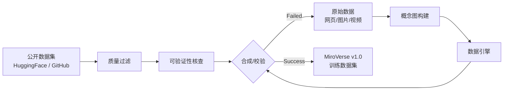

# MiroThinker（MiroMind）：交互伸缩（Interactive Scaling）——256K 上下文撑起单任务 600 次工具调用

**📄 [MiroThinker: Pushing the Performance Boundaries of Open-Source Research Agents via Model, Context, and Interactive Scaling](https://arxiv.org/abs/2511.11793)**

2025-11 · MiroMind Team · [代码](https://github.com/MiroMindAI/MiroThinker) · [在线体验](https://dr.miromind.ai)

**一句话**：开源深研 agent 长期只在"模型规模"和"上下文长度"两个维度上卷，MiroThinker 提出第三个维度——**交互伸缩（interactive scaling）**：专门训练模型在单个任务里撑住更深、更频繁的 agent-环境交互（最多 600 次工具调用），配合 256K 上下文与"近因保留"式上下文管理，让 8B/30B/72B 三档模型在 GAIA、HLE、BrowseComp、BrowseComp-ZH 等基准上刷新开源纪录，72B 版本在 GAIA 上甚至反超 GPT-5-high。

::: details 📖 论文原文 Abstract（英文）
We present MiroThinker v1.0, an open-source research agent designed to advance tool-augmented reasoning and information-seeking capabilities. Unlike previous agents that only scale up model size or context length, MiroThinker explores interaction scaling at the model level, systematically training the model to handle deeper and more frequent agent-environment interactions as a third dimension of performance improvement. Unlike LLM test-time scaling, which operates in isolation and risks degradation with longer reasoning chains, interactive scaling leverages environment feedback and external information acquisition to correct errors and refine trajectories. Through reinforcement learning, the model achieves efficient interaction scaling: with a 256K context window, it can perform up to 600 tool calls per task, enabling sustained multi-turn reasoning and complex real-world research workflows. Across four representative benchmarks—GAIA, HLE, BrowseComp, and BrowseComp-ZH—the 72B variant achieves up to 81.9%, 37.7%, 47.1%, and 55.6% accuracy respectively, surpassing previous open-source agents and approaching commercial counterparts such as GPT-5-high.
:::

**相关**：[Deep Research 总览](/agent/deep-research/) · [Tongyi DeepResearch](/agent/deep-research/tongyi-deepresearch) · [Step-DeepResearch](/agent/deep-research/step-deepresearch) · [MiroThinker-1.7 & H1（本文续作，加入验证机制）](/agent/deep-research/mirothinker-h1) · [Apodex-1.0（独立团队的收敛式设计）](/agent/deep-research/apodex)

> 图源：MiroMind Team, *MiroThinker: Pushing the Performance Boundaries of Open-Source Research Agents via Model, Context, and Interactive Scaling*（arXiv:2511.11793）Figure 1——六个基准上 MiroThinker 与各类基线的对比（用于学习注解，版权归原作者）。

## 动机与创新点：模型规模、上下文长度之外，还有一个被忽视的第三维度——交互深度

论文观察到，闭源系统（ChatGPT Agent、Claude Research）已经展示了接近人类水平的文献调研、比较分析与推理驱动的知识发现能力，但**保持闭源，制约了透明性、可复现性与社区驱动的创新**。开源社区虽在追赶，却分成两条不完整的路：

- **开放权重底座模型**（如部分 Qwen/DeepSeek 系列）内置了搜索、浏览、写代码等 agentic 能力，但**只发布模型权重，不提供端到端研究推理所需的完整工具套件与框架**；
- **专门的研究 agent 模型**（WebThinker、WebSailor、Tongyi DeepResearch 等）虽配了工具链，但**规模相对较小，上下文长度和交互深度都受限**，与领先商业研究 agent 之间仍有明显差距。

论文指出，这两条路都遗漏了同一件事：

> Unlike previous agents that only scale up model size or context length, MiroThinker explores interaction scaling at the model level.

以往提升 agent 能力几乎只有两个杠杆——**加大模型规模**、**拉长上下文窗口**——但这篇论文提出还存在第三个独立可伸缩的维度：**交互深度（interaction depth）**，即模型与环境之间"查了多少次、查得多深"。这与 LLM 的**测试时伸缩（test-time scaling）**有本质区别：

> Unlike LLM test-time scaling, which operates in isolation and risks degradation with longer reasoning chains, interactive scaling leverages environment feedback and external information acquisition to correct errors and refine trajectories.

测试时伸缩只是让模型自己"想更久"，链条一长反而容易退化；而交互伸缩让模型**真正走出去多查、多验证**，靠环境反馈和外部信息获取来主动纠错、修正轨迹，这是纯推理时延伸做不到的。

**关键创新**：

- **交互伸缩（interactive scaling）作为第三维度**：系统性地用 RL 训练模型处理更深、更频繁的 agent-环境交互，与模型规模、上下文长度并列成为提升研究能力的第三根支柱。
- **256K 上下文支撑单任务最多 600 次工具调用**：相比此前开源模型普遍不到 100 次的工具调用上限，是一次数量级的跃迁，靠"近因（recency）式上下文管理"把可用上下文压缩在合理范围内。
- **三档模型规模全开源**：8B / 30B / 72B 变体，覆盖不同算力预算，72B 版本多项基准逼近甚至超过 GPT-5-high 等闭源前沿系统。
- **可规模化的数据合成 + 三阶段训练**：MultiDocQA 多跳问答合成 + agentic 轨迹合成构成的 MiroVerse v1.0 数据集，配合 SFT → DPO → RL 三阶段训练配方。

## 方法：ReAct 单 agent + 近因式上下文管理 + 三阶段训练

### Agent 工作流：结构化工具接口 + 近因式上下文管理

MiroThinker v1.0 在标准 **ReAct** 范式下以单 agent 形式运作。给定查询 $q$，agent 维护轨迹 $H_t = \{(T_1,A_1,O_1),\ldots,(T_{t-1},A_{t-1},O_{t-1})\}$（思考、动作、观测三元组序列）。每一步，思考模型 $f_\theta$ 生成内部思考 $T_t = f_\theta(q, H_t)$，动作策略 $A_t = \pi_\theta(H_t, T_t)$ 输出一个结构化工具调用；环境执行该调用并返回观测 $O_t = \text{Tool}(A_t)$，追加进轨迹 $H_{t+1} = H_t \cup \{(T_t, A_t, O_t)\}$。循环持续到模型不再输出动作，进入总结阶段产出最终答案 $y = g_\theta(H_t)$。

**模块化工具接口**：三类工具——**执行环境**（Linux 沙箱：`create_sandbox`、`run_command`、`run_python_code`）、**文件管理**（`upload_file_from_local_to_sandbox`、`download_file_from_sandbox_to_local`、`download_file_from_internet_to_sandbox`，支持沙箱与外部世界间的双向数据流）、**信息检索**（`google_search` 返回结构化搜索结果；`scrape_and_extract_info` 内部用一个轻量 LLM，如 Qwen3-14B，按 agent 指定的抽取目标从网页/文档里筛出任务相关内容，而非整页塞进上下文）。为防止评测泄漏（如从 HuggingFace 直接搜到基准答案），这些工具**显式禁止访问 HuggingFace**。

**近因式上下文保留（Recency-Based Context Retention）**：标准 ReAct 会把所有工具输出都保留在消息历史里，导致上下文利用低效。论文的经验观察是——**模型后续动作主要依赖近期观测，而非久远的观测**。据此只保留最近 $K$ 条工具响应，给定保留预算 $K \in \mathbb{N}$，定义最近响应的下标集合：

$$S_t(K) = \{i \in \{1,\ldots,t-1\} \mid i \geq t-K\}$$

构造近因过滤后的历史 $\hat{H}_t$，把 $S_t(K)$ 之外的工具响应替换为空：

$$\hat{H}_t = \{(T_i, A_i, \hat{O}_i)\}_{i=1}^{t-1}, \quad \hat{O}_i \triangleq \begin{cases} O_i, & i \in S_t(K) \\ \varnothing, & \text{otherwise} \end{cases}$$

后续推理都在这份被过滤的历史上进行：$T_t = f_\theta(q,\hat{H}_t)$，$A_t = \pi_\theta(\hat{H}_t, T_t)$；收到新工具响应后再更新 $H_{t+1}$ 并重新应用保留规则 $\hat{H}_{t+1} = \text{Retain}_K(H_{t+1})$。这套策略**保留完整的思考与动作轨迹，只对久远的工具观测做遮蔽**，实测不会造成性能下降，反而腾出更多上下文空间用于交互伸缩。另外，对 `run_command`、`run_python_code` 这类可能产出超长输出的工具，论文还做**结果截断**：超过预定义长度限制的输出会被截断并追加 "[Result truncated]" 标记。

> 图源：MiroMind Team, *MiroThinker v1.0*（arXiv:2511.11793）Figure 2——agent 架构与近因式上下文管理机制（用于学习注解，版权归原作者）。

### 数据合成：MultiDocQA 多跳问答 + agentic 轨迹合成，共同构成 MiroVerse v1.0

**MultiDocQA 合成**：把互相关联的网页文档转化为复杂多跳问答对，流程分五步——① **文档语料构建**：从 Wikipedia、Common Crawl 与精选网络仓库里清洗文本、保留超链接结构；② **文档采样与图构建**：按类别均衡采样种子文档，沿其内部超链接递归扩展，构造一个连通的相关文档子图；③ **文档整合**：转成 Markdown 格式，剪掉指向子图之外的超链接，拼接成一篇跨主题但逻辑连贯的综合文章；④ **事实抽取**：识别每篇文档中连回种子主题的关键事实，优先选择**必须跨文档推理才能验证**的陈述；⑤ **约束混淆（Constraint Obfuscation）**：把抽取到的事实转写成需要更深推理才能解开的间接约束——时间/空间细节被泛化为更宽泛的类别（如"2023年3月15日"→"2020年代春季"；"巴黎"→"某个欧洲首都"），其他实体则通过关联属性做指代式模糊化；⑥ **问题生成**：提示一个 LLM 组合多条混淆约束、跨领域生成问题，确保答案无法靠模式匹配或单文档检索获得。

**Agentic 轨迹合成**：采用两类互补的 agent 范式——① **ReAct 单 agent**：迭代"思考-行动-观察"循环；② **MiroFlow 多 agent**（MiroMind 自研的高性能开源研究 agent 框架）：多个专职 agent 协同分工，产出带有分工协作与涌现集体推理特征的复杂轨迹。同时结合两种工具调用机制——传统的 **Function Calling** 与更灵活的 **MCP（Model Context Protocol）**，并调用多个前沿 LLM（GPT-OSS、DeepSeek-V3.1 等）驱动轨迹生成，获得风格多样、覆盖更广的训练数据，缓解单一模型偏置。

除自建数据外，还补充开源问答数据集（MuSiQue、HotpotQA、WebWalkerQA-Silver、MegaScience、TaskCraft 等）转化为 agentic 轨迹，并混入通用后训练语料（AM-Thinking-v1-Distilled、Nemotron-Post-Training-Dataset）以保留模型的通用对话与推理能力。

### 训练流水线：SFT（行为初始化）→ DPO（轨迹级偏好）→ RL（交互伸缩）

基于 **Qwen2.5 / Qwen3** 系列模型，MiroThinker 走三阶段训练：

**① Agentic SFT**：构造数据集 $\mathcal{D}_{\text{SFT}} = \{(x_i, H_i)\}_{i=1}^N$，每条实例把任务指令 $x_i$ 与专家轨迹 $H_i$（思考-动作-观测三元组序列）配对。即便用前沿 LLM 合成，原始轨迹仍常含明显噪声（response 内重复、跨 response 重复、无效工具调用），需经严格过滤与修复。每条轨迹被当作用户与助手之间的多轮对话——工具执行在训练时不真正发生，观测是预先记录好、作为上下文输入的：

$$\mathcal{L}_{\text{SFT}}(\theta) = -\mathbb{E}_{(x,H)}\left[\sum_{t=1}^{T_H} \log \pi_\theta(T_t, A_t \mid x, H_{<t})\right]$$

**② Agentic 偏好优化（DPO）**：用 DPO 精炼决策，构造成对偏好数据集 $\mathcal{D}_{\text{PO}} = \{(x_i, H_i^+, H_i^-)\}_{i=1}^M$。偏好判定遵循两条准则：(1) **正确 vs 错误、不强加固定模式**——只按最终答案是否正确来排序偏好，刻意避免用手工设计的启发式（预设规划长度、步数、推理结构）引入系统性偏置；(2) **质量控制：保证轨迹完整性**——被选中的样本要求推理轨迹连贯、含显式规划过程、最终答案正确；被拒绝的样本也必须产出一个有效的最终答案（不能是退化轨迹），并过滤掉重复、截断、格式错乱的样本。训练目标是 DPO 损失叠加一个作用于偏好轨迹的辅助 SFT 损失（增强稳定性、保持行为一致性）：

$$\mathcal{L}_{\text{DPO}}(x, H^+, H^-) = -\log\sigma\big(\beta[(\log\pi_\theta(H^+|x) - \log\pi_\theta(H^-|x)) - (\log\pi_{\text{ref}}(H^+|x) - \log\pi_{\text{ref}}(H^-|x))]\big)$$

$$\mathcal{L}_{\text{PO}}(\theta) = \mathbb{E}_{(x,H^+,H^-)}[\mathcal{L}_{\text{DPO}}(x,H^+,H^-)] + \lambda\, \mathcal{L}_{\text{SFT}}^{(+)}(\theta)$$

**③ Agentic RL（GRPO，实现交互伸缩）**：最后一阶段用 RL 让 agent 发现创造性解法、适应多样真实环境。采用 **GRPO**（Group Relative Policy Optimization）做完全在线策略训练——每批 rollout 恰好只用来更新策略一次。

- **环境搭建**：构建可支持数千并发 agentic rollout 的环境套件，覆盖实时多源搜索、网页抓取与摘要、Python 代码执行、Linux 虚拟机操作；并配一套稳健的 LLM 评分系统，低延迟地核验带噪声的 agent 预测与 ground-truth 答案是否一致。
- **流式 rollout 加速**：与数学/推理这类单轮 RL 任务不同，agentic RL 需要 LLM 与环境之间多轮来回，MiroThinker 又能与环境交互数百轮，导致完成时间严重长尾。论文实现了一种流式 rollout 机制——每个 agent worker 从任务队列里持续领取 prompt，直到收集够这一批次所需的完成轨迹；未完成的任务被推回队列供下一轮迭代，缓解长尾拖累整体吞吐。
- **奖励设计**：$R(x,H) = \alpha_c R_{\text{correct}}(H) - \alpha_f R_{\text{format}}(H)$——正确性奖励减去格式惩罚，系数 $\{\alpha_c,\alpha_f\}$ 用于平衡"持续探索新解法"与"遵循指令格式"。
- **轨迹筛选**：过滤掉噪声正确轨迹（连续 API 调用失败超过 5 次、对同一动作的冗余重试、过多环境超时）与琐碎错误轨迹（格式问题、动作重复循环、未经充分探索就过早终止），确保 RL 学习信号质量。
- **训练目标**：GRPO 对每个 prompt $x$ 采样一组 $G$ 条轨迹 $\{H_1,\ldots,H_G\}$，组内相对优势 $\hat{A}_i = R(x,H_i) - \frac{1}{G}\sum_{j=1}^G R(x,H_j)$；目标在最大化期望优势的同时用 KL 项约束策略不过度偏离参考策略：

$$\mathcal{L}_{\text{GRPO}}(\theta) = \mathbb{E}_{x\sim\mathcal{D}}\mathbb{E}_{H\sim\pi_\theta(\cdot|x)}\left[\hat{A}(x,H)\cdot\log\pi_\theta(H|x) - \beta_{\text{KL}}\cdot D_{\text{KL}}(\pi_\theta(\cdot|x)\|\pi_{\text{ref}}(\cdot|x))\right]$$

## 实验结果：72B 在 GAIA 上以相同工具集反超 GPT-5-high 2.5 分

### 评测设置

- **底座与规模**：以 Qwen2.5/Qwen3 初始化，发布 8B / 30B / 72B 三档。
- **评测协议**：简单 ReAct agent，温度 1.0、top-p 0.95、最大轮数 600、上下文 256K token、最大输出 16,384 token、上下文保留预算 $K=5$；高方差基准跑多次取平均（HLE/BrowseComp/BrowseComp-ZH/WebWalkerQA/FRAMES 取 avg@3，GAIA/xbench-DeepSearch/SEAL-0 取 avg@8）。为公平对比，HLE 用 2,158 条纯文本子集、GAIA 用 103 条纯文本子集。评测 judge：GAIA/WebWalkerQA/xbench-DeepSearch/BrowseComp/BrowseComp-ZH 用 gpt-4.1-2025-04-14，HLE 按官方设置用 o3-mini-2025-01-31。

### 主结果（Table 1，以原文为准）

| 分组 | 系统 | HLE | BrowseComp | BrowseComp-ZH | GAIA | xbench-DS | WebWalkerQA | FRAMES | SEAL-0 |
| --- | --- | --- | --- | --- | --- | --- | --- | --- | --- |
| 带工具基础模型 | GLM-4.6 | 30.4 | 45.1 | 49.5 | 71.9 | 70.0 | – | – | – |
| 带工具基础模型 | MiniMax-M2 | 31.8 | 44.0 | 48.5 | 75.7 | 72.0 | – | – | – |
| 带工具基础模型 | DeepSeek-V3.1 | 29.8 | 30.0 | 49.2 | 63.1 | 71.0 | 61.2 | 83.7 | – |
| 带工具基础模型 | OpenAI-o3 | 24.9 | 49.7 | 58.1 | – | 67.0 | 71.7 | 84.0 | 17.1 |
| 带工具基础模型 | GPT-5-high | 35.2 | 54.9 | 65.0 | 76.4 | 77.8 | – | – | 51.4 |
| 研究 Agent | OpenAI DeepResearch | 26.6 | 51.5 | 42.9 | 67.4 | – | – | – | – |
| 研究 Agent | ChatGPT-Agent | 41.6 | 68.9 | – | – | 69.0 | – | 78.8 | 36.0 |
| 研究 Agent | Tongyi DeepResearch-30B | 32.9 | 43.4 | 46.7 | 70.9 | 75.0 | 72.2 | 90.6 | – |
| **本文** | MiroThinker-v1.0-8B | 21.5±0.4 | 31.1±1.6 | 40.2±2.9 | 66.4±3.2 | 60.6±3.8 | 60.6±0.8 | 80.6±0.5 | 40.4±2.6 |
| **本文** | MiroThinker-v1.0-30B | 33.4±0.2 | 41.2±1.3 | 47.8±1.1 | 73.5±2.6 | 70.6±2.2 | 61.0±0.8 | 85.4±0.8 | 46.8±3.2 |
| **本文** | **MiroThinker-v1.0-72B** | **37.7±0.5** | **47.1±0.7** | **55.6±1.1** | **81.9±1.5** | **77.8±2.6** | 62.1±0.6 | 87.1±0.9 | 51.0±2.0 |

**MiroThinker 在 GAIA 上刷新 SOTA**：72B 版本 81.9%，比此前最强开源模型 MiniMax-M2（75.7%）高 6.2 分，**且以相同的 Python 与搜索工具集反超闭源前沿模型 GPT-5-high 2.5 分**。在 **BrowseComp-ZH**（55.6%，超 GLM-4.6 的 49.5% 达 6.1 分）与 **HLE**（37.7%，超 Tongyi DeepResearch 的 32.9% 达 4.8 分）上也刷新开源纪录，尤其在中文多语言研究任务上展现出扎实的鲁棒性。8B 与 30B 两档同样在各自规模级别取得 SOTA，让不同算力预算的用户都能用上强力深研模型。

### 交互伸缩现象：RL 让交互轨迹显著更长更深，直接换来 8–10 分的准确率提升

论文进一步分析 RL 如何重塑 agent-环境交互模式。对比 MiroThinker-v1.0-30B 的 SFT 版本与 RL 版本在 BrowseComp、BrowseComp-ZH、HLE、GAIA 四个基准上的"轮数分布"与"累积分布函数"：

> 图源：MiroMind Team, *MiroThinker v1.0*（arXiv:2511.11793）Figure 5——交互伸缩现象：RL 训练后交互轨迹显著变长变深（用于学习注解，版权归原作者）。

四个基准上，RL 调优后的模型都展现出比 SFT 版本**明显更长、更深**的交互轨迹——在可验证奖励的引导下，RL 让模型探索更详尽的解题路径，在下结论前系统性地尝试多种策略并验证中间结果。这一行为转变直接对应准确率提升，平均带来 **8–10 分**的增益。论文把"交互深度与性能正相关"这一稳定关系称为**交互伸缩**：随着工具增强交互的频率与深度增加，研究推理能力随之提升——这构成了继模型规模、上下文长度之后的第三个伸缩维度。

### 局限性（原文自述）

- **交互伸缩下的工具使用质量**：RL 调优模型调用外部工具的频率显著高于 SFT 模型，但其中一部分调用只带来边际或冗余贡献，说明伸缩提升了整体表现，但工具使用效率与动作质量仍需专门优化。
- **过长的思维链**：RL 倾向鼓励模型生成更长的推理链以提升准确率，可能导致冗长、重复、可读性下降的推理过程，拖慢任务完成速度。
- **语言混杂**：面对非英文输入（如中文查询），模型的内部推理或中间输出可能出现中英文混杂，导致中文场景下的次优表现。
- **沙箱能力有限**：模型尚未完全熟练掌握代码执行与文件管理工具，有时会生成导致沙箱超时的代码/命令，或用代码执行工具去做本可由专用网页抓取工具更高效完成的任务；对沙箱 ID 管理也不够熟悉，常忘记在调用相关操作前先初始化沙箱。

## 在 Deep Research 谱系里的位置

- **vs Tongyi DeepResearch / WebThinker / WebSailor（同期开源深研 agent）**：这些工作也走"agentic mid/post-training"路线提升开源深研能力，但普遍未把"交互深度"作为独立可控的伸缩轴显式建模——MiroThinker 的差异化在于**系统性验证交互深度本身就是一个可预测伸缩的维度**，并配套近因式上下文管理机制把这一维度真正落地到 256K 上下文、600 次工具调用的工程实现上。
- **vs [MiroThinker-1.7 & H1](/agent/deep-research/mirothinker-h1)（同团队直接续作）**：v1.0 建立了"交互伸缩"这一核心概念和三阶段训练配方，但**没有显式的验证机制**——轨迹再长，模型仍是自己一路走到底、自己给出最终答案。续作 MiroThinker-1.7 & H1 在此基础上引入 agentic mid-training 强化的规划/推理能力（1.7）与**验证中心式的 heavy-duty 模式**（H1，对推理过程做局部与全局两级评估优化），是"先把交互做深，再给交互过程加上验证"的自然延伸。
- **vs [Apodex-1.0](/agent/deep-research/apodex)（独立团队的收敛式设计）**：Apodex 与 MiroMind 并无隶属关系（全文未提及 MiroThinker/MiroMind），但同样在 2025 年末到 2026 年初这个时间窗口里，独立收敛到"给单 agent 长程轨迹叠加一层验证机制"这一设计方向——反映出"单纯拉长/加深单 agent 交互会遇到瓶颈，需要额外的验证/团队协作机制来兜底"正在成为深研 agent 领域的共识，而非某一家的独创判断。
- 整体定位与"国产/开源刷榜竞赛"背景见 [Deep Research 总览](/agent/deep-research/)。
