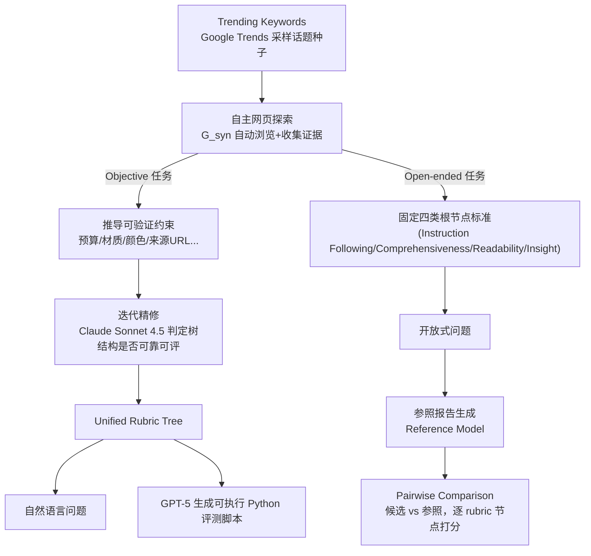

# QUEST（OSU NLP）：统一 rubric 树 + 上下文压缩，全合成数据训通用深研 agent 家族（2B–35B）

**📄 [QUEST: Training Frontier Deep Research Agents with Fully Synthetic Tasks](https://arxiv.org/abs/2605.24218)**

2026-05 · The Ohio State University · Amazon AGI SF Lab · [代码](https://github.com/OSU-NLP-Group/QUEST)

**一句话**：QUEST 是一个 2B–35B 的开源深研 agent 家族——用**统一 rubric 树**同时合成"事实检索 / 引用落地 / 报告综合"三类任务的可验证训练数据，配一套上下文压缩机制支撑长程推理；仅用 8000 条合成任务，35B 模型在八个深研基准上打平甚至超越 OpenAI DeepResearch 等闭源系统，是开源 agent 里的最佳综合表现。

::: details 📖 论文原文 Abstract（英文）
Deep research agents extend the role of search engines from retrieving keyword-matched pages to synthesizing knowledge, fundamentally changing how humans interact with information. However, frontier systems remain proprietary, while existing open agents often generalize poorly across different task types, leaving unclear how to train a broadly capable deep research agent. **We release QUEST, a family of open models (ranging from 2B to 35B) that serve as *general-purpose* deep research agents designed to handle a wide range of long-horizon search tasks, with strong capabilities in *fact seeking*, *citation grounding*, and *report synthesis*.** To build QUEST, we propose an effective training recipe combining mid-training, supervised fine-tuning, and reinforcement learning. Central to this recipe is a curated data synthesis pipeline based on unified rubric trees, which applies to different task types and enables synthesizing training data with verifiable rewards without human annotation. In addition, QUEST incorporates a built-in context management mechanism that enables effective long-horizon reasoning and knowledge synthesis. **Using only 8K synthesized tasks, QUEST approaches or even surpasses frontier closed-source agents across eight deep research benchmarks spanning diverse task types, and achieves the best overall performance among recent open-weight agents.** We released everything: models, data, and training scripts.
:::

**相关**：[Deep Research 总览](/agent/deep-research/) · [Tongyi DeepResearch](/agent/deep-research/tongyi-deepresearch) · [REDSearcher](/agent/deep-research/redsearcher) · [Marco DeepResearch](/agent/deep-research/marco-deepresearch) · [Step-DeepResearch](/agent/deep-research/step-deepresearch) · [Mind DeepResearch](/agent/deep-research/mind-deepresearch) · [Rubric 化评测与训练](/eval/rubrics)

> 图源：Xie et al., *QUEST: Training Frontier Deep Research Agents with Fully Synthetic Tasks*（arXiv:2605.24218）Figure 1——八个基准上 QUEST-35B 对闭源与开源基线的综合对比（用于学习注解，版权归原作者）。

## 动机与创新点：深研三大能力（事实检索/引用落地/报告综合）从未被同一套数据管线统一覆盖过

论文观察到，深研任务按"输出质量能否被客观核验"分成两种regime：**objective 任务**（答案可用外部证据核验）与 **open-ended 任务**（只能靠主观评判）。据此，作者归纳出深研 agent 需要同时具备的三种能力：

- **Fact seeking（事实检索）**：以 BrowseComp 为代表——通过多跳网页搜索定位一条具体、冷僻的信息，答案唯一且可核验。
- **Report synthesis（报告综合）**：以 DeepResearch Bench 为代表——给一个开放式任务，agent 要把多来源信息综合成一篇连贯、结构良好、可读的报告，评估主要靠**基于 rubric 的主观判断**（覆盖度/组织/清晰度），而非单一标准答案。
- **Citation grounding（引用落地）**：以 Mind2Web 2 为代表——objective 与 open-ended 任务共同要求的能力，agent 必须用可靠、时效、可验证的引用支撑自己的论断。

论文指出一个此前被忽视的现状：**现有深研 benchmark 与 agent 系统只孤立地评估或支持这三种能力中的一部分，没有任何前作在统一框架内同时覆盖三者**——比如 Tongyi-DR 靠"精确匹配"验证只覆盖 fact seeking / report synthesis，DR Tulu 靠 rubric 覆盖 report synthesis / citation grounding 却不支持任务合成，OpenResearcher 和 REDSearcher 都只覆盖 fact seeking。QUEST 要做的，就是设计一套**能同时喂养这三种能力**的统一数据合成与训练框架。

**关键创新**：

- **统一 rubric 树（Unified Rubric Tree）**：把 Mind2Web 2 提出的 rubric 树（约束的层级分解）**全自动合成化**——不再依赖人工撰写任务和评测脚本，而是让强模型自主浏览网页、推导可验证约束、组织成树，一套框架同时覆盖 objective 唯一答案任务、多解任务与完全开放式任务。
- **细粒度奖励**：rubric 树根节点的部分得分（而非二元对错）提供比"整题对/错"更精细的训练信号，反映预测在多大程度上满足底层约束。
- **内置上下文管理**：一个 Context Condenser 把累积的搜索历史压缩成结构化的 Context State（可信/不可信/待核实三类条目），让 agent 能在任意长的研究时域上推理而不爆上下文。
- **完整训练配方**：mid-training → SFT → RL 三阶段，且**只用 8000 条全合成任务**就在八个基准上逼近甚至超过 OpenAI DeepResearch 等闭源系统，是迄今开源深研 agent 里综合表现最好的一个。
- **全开源**：模型（2B–35B）、数据、合成脚本、训练代码全部公开——论文特别指出，同类工作里像 Tongyi-DR 数据/脚本/训练代码三者都不开源，REDSearcher 号称开源但权重当时未公开，QUEST 是少数"三者都开"的工作。

> 图源：Xie et al., *QUEST*（arXiv:2605.24218）Figure 2——深研 agent 训练配方对比，QUEST 是唯一同时覆盖三种能力并提供全开源可复现配方的工作（用于学习注解，版权归原作者）。

## 方法：统一 rubric 树数据合成 + 上下文压缩 + 三阶段训练

### 数据合成：一棵 rubric 树同时喂 objective 与 open-ended 任务

现有深研训练数据多是"复杂问题 + 单一可验证答案"（如"《麦田里的守望者》作者故居的建筑师是谁"），这种格式只适配 fact-seeking 型任务：它既不能泛化到需要**跨多源聚合、协调冲突信息**的报告类任务，又只能给强化学习提供二元对错奖励，浪费了深研任务里本可以更细粒度的评价信号（如来源可信度、洞察力）。为此，论文的核心设计是 **rubric 树**——Mind2Web 2 首先提出的"把一个合法答案应满足的约束做层级分解"的结构，但 Mind2Web 2 依赖人工撰写任务和人工精修的评测脚本；QUEST 把这套结构**全自动合成化**：

- **根节点**：整体得分，由其子节点聚合而来；
- **叶节点**：直接可验证的具体标准（如事实正确性、来源归属），通过自动化验证给出二元得分；
- **内部节点**：更高层的约束，递归分解为更细粒度的子节点，得分由子节点聚合。

这个设计天然解决了"以答案为中心的 QA 监督"的局限——用任务特定的约束取代唯一 ground-truth 答案，同一套框架就能同时容纳**唯一答案任务、多解任务、完全开放式任务**，且根节点的部分得分提供了比二元正确性更细粒度的训练信号。

**Objective 任务的构造**：先从 Google Trends 爬取的话题池里采样"热门关键词"作为下游合成的话题种子，兼顾话题相关性与时间多样性、贴近真实用户需求。对每组关键词，提示 $G_{syn}$（默认 Claude Sonnet 4.5）自主浏览网页、收集相关信息、从检索内容中推导一组可验证约束（如"预算 ≤ $200"“材质：木”“颜色：白”“来源 URL”），组织成 rubric 树。所有树都要经过**迭代精修与验证**以保证树结构正确、节点定义有效；由 Claude Sonnet 4.5 判定，无法收敛成一致、可靠评测结构的任务样本会被丢弃。得到 rubric 树后，先提示 $G_{syn}$ 把它翻译成自然语言问题，再用 **GPT-5** 生成对应的可执行 Python 评测脚本——脚本会对 agent 的响应逐个程序化核验每个 rubric 节点，计算最终得分，实现规模化的全自动评测。

**Open-ended 任务的构造**：基本流程与 objective 任务相同（关键词采样 + 自主网页探索），区别在于 rubric 的构造方式——不是完全任务特定的树，而是**固定根节点下的四个共享标准**（沿用 DeepResearch Bench 的设计）：**instruction following、comprehensiveness、readability、insight**；每个标准下的子节点则是 $G_{syn}$ 依据具体问题自适应生成的任务特定节点。打分聚合时，每个节点的权重也由 $G_{syn}$ 生成（生成三次取平均以提高稳定性）。

open-ended 任务的评测协议由三部分组成：**参照报告、基于 rubric 的裁判模型、pairwise 归一化规则**。给定一个任务，先提示 $G_{syn}$ 产出一份参照报告 $r_{ref}$；然后对每份候选报告 $r_{cand}$，裁判模型**同时**接收候选与参照报告——同时看两者能让裁判做出比独立打分更精细的质量区分。裁判对每个任务特定的 rubric 节点，给候选与参照报告各打一个 0–10 的连续分，分越高说明越满足该标准；节点分经 rubric 树聚合得到加权分 $J(r_{cand})$ 与 $J(r_{ref})$（均 $\in [0,1]$），最终得分定义为：

$$\text{Score} = \frac{J(r_{cand})}{J(r_{cand}) + J(r_{ref})}$$

分数高于 0.5 就意味着候选报告的质量已经超过参照报告。

> 举例：图 3 里两个具体样例——objective 任务"找出 2024 年美国两起致死的李斯特菌疫情，判断哪起更致命"，rubric 树把它分解成"疫情1（来源：Boar's Head 熟食，死亡数10）/疫情2（来源：queso fresco/cotija 奶酪，死亡数2）/对比结论（应指出 Boar's Head 更致命，并引用 10 vs 2 的死亡数作证据）"三支；open-ended 任务"评估苹果进军折叠屏手机，聚焦技术对比/采用门槛/定价/呈现方式"，则在 comprehensiveness/insight/instruction following/readability 四个固定根节点下各自长出任务特定的子标准（如"对比三星 Z Fold”“分析采用门槛”“讨论定价策略”“清晰的层级结构"）。

数据合成后还有严格的过滤：objective 任务从 1.7 万条初始生成，经 rubric 精修（8737）、rubric 树验证（6230）、剔除 Python 脚本有误的样本（5934）；open-ended 任务从 3000 条初始生成，经格式过滤（2856）、剔除不合格任务（2498）、剔除参照报告分数过低的任务（2227）——层层过滤保证进入训练集的都是高质量、可靠可评的任务。作者还找了 4 名计算机专业研究生人工核查 50 条抽样的 Python 评测脚本：仅 2 条存在不可执行问题，6 条存在 rubric 相关错误（如引入原任务未提及的冗余约束、只按字面内容核验而非核验内容真实性、未对"引用 URL 缺失"这种情况显式判负），其余大多数脚本能准确解释任务要求、忠实实现 rubric 规则并稳定运行。

### 上下文管理：把搜索历史压缩成"可信/不可信/待核实"三桶结构

深研 agent 要在产出最终答案前经过多轮搜索、阅读、修订，随着上下文窗口被原始搜索结果、访问过的网页、中间推理痕迹填满，agent 分辨"什么最重要"的能力开始退化。现有开源 agent 通常靠**限制轮数**或**依赖足够大的上下文窗口**来回避这个问题；QUEST 则采用一个结构化的上下文管理模块，把全部历史压缩成一份紧凑摘要，让 agent 能在任意长的时域上推理而不发生上下文溢出。

具体做法是用一个结构化 JSON 对象——**Context State**——存储 agent 的历史上下文，把已积累的知识组织成三个桶：

- **Trusted（可信）**：已根据 agent 推理轨迹核对过源 URL 的、可以直接复用而无需再验证的事实；
- **Untrusted（不可信）**：被其他来源反驳过的说法，并标注不可信的原因；
- **Uncertain（待核实）**：部分得到支持、仍需跟进的说法，每条都标注了该去访问的 URL 或该重跑的查询。

> 图源：Xie et al., *QUEST*（arXiv:2605.24218）Figure 4——上下文压缩机制：Trusted / Untrusted / Uncertain 三桶结构支撑长程推理（用于学习注解，版权归原作者）。

在 agent 执行轨迹的过程中，一旦上下文窗口用量超过阈值，就触发一次**Context Condenser**（一个模型 $G_{cond}$，默认用 GPT-5-mini）：它接收包含搜索查询与结果、已访问 URL 与内容、推理痕迹、以及此前已有摘要在内的完整原始历史，产出一份更新后的 Context State。压缩完成后，QUEST 在一个**全新的上下文窗口**里恢复运行，只带着这份更新后的 Context State；待核实条目会引导后续的搜索与验证动作，不可信条目被降权、除非进一步验证否则不会被主动复用。通过这种"复用已验证结论、无需冗余工具调用"的方式，结构化 Context State 支撑起长程研究任务里连贯、有引用支撑的知识综合。

这一设计和简单的 discard-all（清空重来）或 keep-last-N（只留最近 N 轮）相比，关键差异在于**区分"验证过的事实"与"投机性说法"、"已完成的子目标"与"待完成的子目标"**——discard-all 彻底重置认知状态，逼 agent 重新发现已验证过的事实、重新访问已读过的来源；keep-last-N 虽然保留了近期上下文，但对滚出保留窗口的信息完全"失明"，哪怕那条信息对任务至关重要。两种简单策略都会让 agent 丢失的不只是原始内容，还有"自己知道什么、怀疑什么、还需要找什么"这种结构化认知。

### 训练流水线：Mid-Training → SFT → RL

**轨迹收集**：用 **Tongyi DeepResearch** 作为教师模型 $G_{traj}$ 在合成任务集上跑出完整 agent 轨迹（open-ended 任务的最终报告由 GPT-5.2 润色）。给定一条训练 query，提示 $G_{traj}$ 求解并用该 query 的评测协议打分；若分数超过阈值 $\epsilon$（objective 任务 $\epsilon=1$，open-ended 任务 $\epsilon=0.475$），该轨迹保留作为 SFT 目标。对于 objective 任务里初次没达标的轨迹，采用**反思式重试**——把评测协议给出的细粒度错误结果作为提示中的 hint 注入，让 $G_{traj}$ 重新尝试；重试后达标就保留。此外，所有轨迹都会被标准化为**行内引用格式**：用 GPT-5-mini 依据推理痕迹与 Context State（记录了完整的访问网页历史与抽取信息）为每条事实性论断标注支持它的来源 URL，这也为 RL 阶段的 fact-checking 奖励打下输出结构基础。

**Mid-Training（两个辅助任务）**：让底座模型具备长上下文理解能力、并熟悉 Context State 结构，无需额外数据采集——① **Context Summarization**：给定长历史上下文，要求模型产出第 3 节所述格式的结构化 Context State JSON（监督目标就是数据合成时 GPT-5-mini 产出的摘要，直接复用）；② **Relevant Information Extraction**：给定一个原始 HTML 页面和抽取目标，要求模型产出一份过滤掉导航元素、广告、离题内容的目标相关摘要——这训练模型在长而嘈杂的上下文里做选择性关注，是有效做网页调研的前提能力，但在纯净语料上训练的模型里普遍缺失。

**SFT（会话级训练）**：给定一条完整训练轨迹，先把它转换成多个**会话级（session-level）**训练实例。一个 session 定义为两次连续上下文压缩事件之间的连续交互片段——具体来说，每个 session 包含从上一次 Context Condenser 触发之后到（不含）下一次压缩触发之前的全部 token。这样，每条完整轨迹会依据压缩触发次数被切成多个 session。这个设计让训练单元与推理时 agent 的"有效工作上下文"对齐，同时把峰值显存占用压到可控范围——只用 16 张 H100 就能训练超过 20 万 token 的长轨迹，这在按整条轨迹训练时是不可行的。

**RL（GRPO 风格，outcome-based）**：奖励结合 rubric 树奖励与 fact-checking 奖励。

- **Rubric-tree Reward** $s_{rubric}$：objective 任务直接用评测协议给出的分数；open-ended 任务的原始 pairwise 分数被离散化为几档奖励——高于 0.5 记 1.0；落在 $[0.475,0.5)$、$[0.45,0.475)$、$[0.425,0.45)$ 分别记 0.75/0.5/0.25；低于 0.425 记 0，既保留相对排序又降低对微小分数波动的敏感度。
- **Fact-checking Reward** $s_{fact}$：为鼓励 agent 靠行内引用把论断落实到可验证来源，先抽取每个回答里引用的事实-URL 对并去重，检索对应网页，用一个 LLM 裁判（GPT-5-mini）把每条引用标记为 *supported*、*unsupported* 或 *unknown*；$s_{fact}$ 是"有确定标签（supported 或 unsupported）"的引用里 supported 所占比例。

最终奖励：

$$R = 0.75 \cdot s_{rubric} + 0.25 \cdot \min(s_{fact}, s_{rubric})$$

其中 $\min$ 操作用 $s_{rubric}$ 给 fact-checking 项的贡献封顶——防止"引用来源都对但任务完成度差"的回答拿到虚高奖励，也让"回答本身完全错"的样本里 fact-checking 分量直接归零。奖励与优势传播沿用**会话级**训练策略：对每个输入 prompt 采样一组 rollout，每个 rollout $i$ 依据其完整回答计算一个标量奖励 $R_i$，该奖励赋给这个 rollout 派生出的所有 session；优势通过组内归一化计算：

$$A_i = \frac{R_i - \mu_g}{\sigma_g + \epsilon}$$

其中 $\mu_g,\sigma_g$ 是同组 $g$ 内**去重后的 unique rollout** 上计算的均值与标准差（同一 rollout 派生的多个 session 去重共享同一个优势值），再用标准 GRPO 目标优化策略（不含 KL 惩罚项）。

### 基础设施：搜索/访问双缓存 + 全异步 RL 流水线

训练与推理阶段，QUEST 配有一套实用工具集：**Google Search**（检索相关在线结果）、**Visit**（读取网页并依据抽取目标做摘要，摘要模型用 GPT-5-mini）、**Python Interpreter**（计算）、**Google Scholar**（访问学术文献）。规模化训练深研 agent 会引入超出常规 LLM 后训练的基础设施挑战——agent 要在数据合成、SFT 轨迹收集、RL rollout 全过程与真实网络内容交互，每一环都涉及成百上千次并行的搜索与网页访问，若不精心设计基础设施，这些外部调用会变得极其昂贵和缓慢。QUEST 通过一套**双缓存系统**拦截所有搜索/访问操作，在触达真实 API 前先查缓存：

- **搜索与学术缓存**：每条新搜索查询先做精确匹配查缓存；命中直接返回，未命中则用 **FAISS** 做基于余弦相似度的语义检索，找到足够相似的历史查询就复用其结果作代理；两者都未命中才真正调用 Serper 实时搜索 API，并把结果写回缓存供后续复用。
- **Visit 缓存**：更简单的精确匹配策略，每个 URL 按完整字符串做 key；命中直接返回存的页面内容，未命中才抓取真实页面并缓存，避免同一 URL 在不同训练轮次里被重复抓取。

RL 阶段基于 **VERL** 的全异步策略优化框架，作者进一步把**评测**也异步化——把耗时的任务特定评测函数下放给一个独立的 Ray actor 池执行。这一点对 rubric 树式评测尤其重要：不同于可以简单启发式判定的规则奖励，rubric 树评测需要对多个准则节点做结构化评估，实测平均评测耗时约 4 分钟、长尾case最高可达 30 分钟。为缓解这一瓶颈，一条轨迹生成后立即分发给评测池，训练进程持续从共享队列里拉取已评分样本，一旦积累够一个训练批次就异步触发模型更新——较慢的早期轨迹评测因此被自然吸收进后续训练步，不会阻塞更快、更近期的样本。为保证稳定训练，还引入了评测超时控制和"中断感知"的奖励处理，允许在飞行中的评测在参数同步期间被恢复或安全重发。整体设计减少了长尾 rollout 与长尾评测器带来的流水线气泡，提升 RL 训练效率。

## 实验结果：8K 合成任务训出的 35B 模型逼近/超越闭源 Deep Research

### 评测设置

- **训练骨架**：默认基座为 **Qwen3.5-35B-A3B**（多数现有开源深研 agent 也选约 30B 规模），得到 **QUEST-35B**；用同套配方在 **Qwen3-30B-A3B** 上复现得到 **QUEST-30B** 以做同规模公平对比。SFT 与 RL 共用 **8K** 条数据合成管线产出的实例。
- **八个基准**：六个 objective——**BrowseComp、Mind2Web 2、HLE-Text、BrowseComp-Plus、WideSearch、GAIA**（评测文本版）；两个 open-ended——**DeepResearch Bench（DRB）、LiveResearchBench（LRB）**。除 HLE 与 GAIA 用子集外，其余用官方全量测试集；BrowseComp 与 BrowseComp-Plus 遵循前作（Anthropic、Kimi、REDSearcher）采用 discard-all 上下文管理策略以便与闭源系统公平对比。
- **两组基线**：① 闭源前沿 agent——**OpenAI DeepResearch（OpenAI-DR）、GPT-5、Claude Opus 4.5、Gemini 3 Pro**；② 同规模开源 agent——**Tongyi DeepResearch（Qwen3-30B 底座）、OpenResearcher（Nemotron-3-Nano-30B-A3B 底座）、DR Tulu（Qwen3-8B 底座）**。REDSearcher 号称开源但实验期间权重未公开，故未纳入对比。

### 主结果（Table 3，以原文为准）

| 分组 | 模型 | BC | BC-Plus | M2W2 | WideSearch | HLE | GAIA | DRB | LRB |
| --- | --- | --- | --- | --- | --- | --- | --- | --- | --- |
| 闭源前沿 agent | GPT-5 | 59.9 | 71.7 | – | 54.0 | 35.2 | 76.4 | – | 73.1 |
| 闭源前沿 agent | Claude Opus 4.5 | **67.8** | **83.0** | – | **76.2** | 43.2 | – | 50.6 | – |
| 闭源前沿 agent | Gemini 3 Pro | 59.2 | – | – | 57.0 | **45.8** | – | 49.6 | – |
| 闭源前沿 agent | OpenAI-DR | 51.5 | – | 28.0 | – | 26.6 | 67.4 | 47.0 | – |
| 开源 agent | Tongyi-DR | 43.4 | 44.5 | 16.7 | 37.3 | 32.9 | 70.9 | 40.5 | 56.3 |
| 开源 agent | OpenResearcher | 26.3 | 54.8 | 14.8 | 19.2 | 19.6 | 64.1 | 35.4 | 61.3 |
| 开源 agent | DR Tulu | – | – | 1.6 | – | – | – | 43.4 | – |
| 开源 agent | QUEST-30B | 37.0 | 48.2 | 28.6 | 54.2 | 24.6 | 69.0 | 45.3 | **74.1** |
| **开源 agent** | **QUEST-35B** | 45.5 / 64.6* | 61.0 / 69.5* | **30.7** | 60.6 | 37.2 | **80.8** | 48.2 | 68.2 |

（* 号为遵循前作 discard-all 策略在全量测试集上评测的结果；BC/BC-Plus 两栏"未加*"为默认上下文管理即 Context Condenser 下的结果。）

**QUEST-35B 在开源 agent 里建立新的整体 SOTA**：几乎在所有评测基准上都刷新开源 agent 的最好成绩（对比同处约 30B 档的 Tongyi-DR、REDSearcher 等）。更关键的是，QUEST-35B 在多个基准上**打平甚至略超闭源 agent**——DeepResearch Bench（48.2 vs OpenAI-DR 的 47.0）、Mind2Web 2（30.7 vs OpenAI-DR 的 28.0）、GAIA（80.8 vs GPT-5 的 76.4）——大幅缩小了开源与闭源深研系统的差距。

**同规模公平对比**：把 QUEST 配方套到与 Tongyi-DR、OpenResearcher 完全相同的约 30B 规模（即 QUEST-30B）后，QUEST-30B 在 8 个基准里的 4 个上拿到最好成绩，包括强依赖 **citation grounding** 与 **report synthesis** 能力的 Mind2Web 2 和 DeepResearch Bench；其余基准里，Tongyi-DR 在 BrowseComp、HLE、GAIA 上更强（这些高度依赖 fact seeking，恰是 Tongyi-DR 单一答案合成数据擅长的领域），OpenResearcher 在 BrowseComp-Plus（一个纯离线基准，与其数据合成配方高度吻合）上最强。这一现象印证了论文的核心论点：**深研 agent 展现出的能力由其数据合成配方决定**，而 QUEST 的配方对三种能力的覆盖最均衡完整。

### 消融：训练阶段与模型规模的可控实验

**MT + SFT + RL 组合最优**（Figure 5）：对比 Vanilla（原始 Qwen3.5-35B-A3B 底座）/ SFT / +MT / +RL 四个变体，各训练阶段的效果在不同基准上呈现出微妙差异——单纯 SFT 提升了多数 objective 基准，却相对 Vanilla **降低**了 open-ended 表现（唯一被 SFT 拖累的 objective 基准是 BrowseComp-Plus，因为该评测只允许使用单一 `search` 工具，而重度 SFT 让模型对训练期工具使用模式过拟合、更容易调用不被允许的工具）。MT 在 SFT 基础上进一步普遍提升，说明辅助任务的收益能跨基准泛化。RL 大幅提升了 open-ended 任务表现，但在 HLE 和 GAIA 上略有牺牲——作者推测这两个基准不仅需要搜索，还需要强专家级推理与深入分析；由于 RL 的优化目标主要针对深研行为（如偏好可读性的报告综合），这种专精化可能部分削弱了模型的通用推理能力，类似 RLHF 里的 *alignment tax* 现象。整体上 **MT+SFT+RL** 综合表现最佳，说明通用深研能力需要三个训练阶段共同贡献。

**小模型也能是强深研 agent**：对 2B/4B/9B/35B 四档规模的 Qwen3.5 做同一套 SFT，发现降低模型规模在多数基准上**没有带来实质性性能衰退**（尽管整体上更大模型仍略好）。令人意外的是，**2B 模型**在 HLE 和 GAIA 这类 fact-seeking 基准上表现颇具竞争力，能匹配甚至超过 OpenAI-DR 和 o3（如 o3 在 HLE 上 24.9%、GAIA 上 70.5%），说明合成数据在不同模型规模上都具备鲁棒性——仅靠 SFT，2B 模型也能学到强的搜索能力。但这一优势并不能完全迁移到重度依赖**report synthesis**的基准（DeepResearch Bench、LiveResearchBench），2B 模型在这些基准上明显落后。这为在隐私敏感场景（如医疗、法律检索）本地部署小规模深研 agent 提供了一个可行方向，也揭示了把这种能力扩展到更开放式场景的挑战。

> 看榜须知：以上分数均取自原论文，评测口径、上下文管理策略（discard-all vs context condenser）、工具集配置各不相同，跨系统直接比绝对值意义有限，可作为"合成数据 + 统一 rubric 树能否让开源深研逼近闭源"这一问题的量级参照。

## 未能成功的尝试（Unsuccessful Attempts）

论文专门用一节记录了几条**没有奏效**的探索，颇具参考价值：

- **Mid-training 里做搜索结果预测**：仿照前人做法，把"依据摘要内容预测检索结果"设成 next-token 预测目标，单独使用时能提升部分搜索密集型任务（如 BrowseComp），但加入现有 mid-training 目标组合后**持续拉低整体表现**——推测是与 Context Summarization 任务功能重叠（后者本就要求模型把搜索结果压缩进结构化 Context State），联合训练时产生了冲突的学习信号。
- **Mid-training 里做基于 rubric 的错误识别**：让模型对已生成答案预测潜在问题，本意是提供细粒度错误分析的训练信号，但实验中只带来边际提升——因为该阶段模型拿不到外部证据，只能识别表层或常识性错误，难以发现更复杂、依赖事实的问题，说明"rubric 式错误预测"若不接入外部证据基础，单独作为训练信号是不够的。
- **报告比较上的 DPO**：想用 rubric 树打分构造偏好对、按 DPO 范式训练模型偏好更高质量输出，但没有带来提升——长篇报告比较本身方差大、歧义多（覆盖度/组织/证据使用等多个维度都可能不一致），构造可靠偏好对的额外开销也容易导致训练不稳定和过拟合。
- **Open-ended 任务的评估设计**：论文尝试过两种方案才收敛到最终的 pairwise 设计——① **Pointwise 三档打分**（不满足/部分满足/满足）遭遇严重的分数膨胀，约 50% 情况都接近满分，因为缺少比较基准，裁判模型天然有偏向给高分的倾向；② **教师模型 Pairwise Win/Tie/Lose** 因为待训模型早期表现持续弱于教师模型，裁判几乎全判"lose"，分数坍缩到 0 附近，同样让信号失效。这两次失败直接促成了最终"候选 vs 参照报告、逐 rubric 节点连续打分再归一化"的设计。

## 在 Deep Research 谱系里的位置

- **vs Tongyi DeepResearch / REDSearcher（~30B，单一答案合成数据）**：这两者的数据合成偏重 fact-seeking 型单一答案 QA，在 BrowseComp / HLE / GAIA 这类任务上仍占优；QUEST 的差异化在于**用统一 rubric 树同时覆盖三种能力**，因此在依赖 citation grounding 与 report synthesis 的 Mind2Web 2、DeepResearch Bench 上反超同规模对手，印证了论文的核心论点——"深研 agent 的能力profile 由其数据合成配方决定"。
- **vs [DR Tulu](/agent/deep-research/dr-tulu)（8B，只做 report synthesis / citation grounding）**与 **OpenResearcher（30B，只做 fact seeking，且训练管线仅 SFT 一段）**：二者都只覆盖三种能力中的一部分、训练阶段也不完整（DR Tulu 无 mid-training，OpenResearcher 只有 SFT）；QUEST 是同类里唯一同时覆盖三种能力、且 MT→SFT→RL 三阶段俱全并全部开源（数据、合成脚本、训练代码）的工作。
- **vs Marco DeepResearch（8B，三层验证）**：两者都强调"验证"在深研训练里的核心地位，但落点不同——Marco DeepResearch 把验证嵌入 QA 数据合成、轨迹构造、测试时扩展三个流水线节点；QUEST 则是把"验证"做进 **rubric 树的叶节点自动核验**里，并额外贡献了 report synthesis 的 pairwise 评测协议与专门的上下文压缩机制，覆盖面更偏"通用深研能力"而非单一 verifier 角色。
- **vs Step-DeepResearch / Mind DeepResearch（原子能力拆解 / 多 agent 分工）**：这些工作把深研拆成规划/深搜/反思/报告等能力模块分别设计数据与训练阶段；QUEST 走的是"用一套统一数据结构（rubric 树）覆盖多能力"的路线，二者是"分能力造管线"与"统一结构覆盖多能力"两种不同的工程哲学，可对照阅读。
- 整体定位与"国产/开源刷榜竞赛"背景见 [Deep Research 总览](/agent/deep-research/)。
