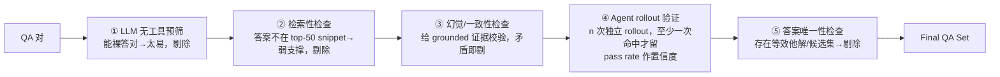

# REDSearcher（小红书 RED）：用 treewidth+MSD 控难度、本地闭库做廉价 RL 的长程搜索 agent

**📄 [REDSearcher: A Scalable and Cost-Efficient Framework for Long-Horizon Search Agents](https://arxiv.org/abs/2602.14234)**

2026-02 · 小红书 Xiaohongshu（RED，论文署名 "REDSearcher Team"）+ 哈尔滨工业大学 + 上海交通大学 · [代码](https://github.com/RedSearchAgent/REDSearcher)

**一句话**：REDSearcher 直指长程深度搜索「高质量轨迹与奖励信号双重稀疏」的训练瓶颈，把**复杂任务合成 + mid-training + post-training** 三件事 codesign 成一条可规模化、低成本的流水线——用 **treewidth + 证据分散度**两个量化维度精确控难度、用**本地千万级文档闭库**替代真实联网 rollout，在 30B 量级做出文本与多模态双线 SOTA 的长程搜索 agent。

::: details 📖 论文原文 Abstract（英文）
Large language models are transitioning from general-purpose knowledge engines to real-world problem solvers, yet optimizing them for deep search tasks remains challenging. The central bottleneck lies in the **extreme sparsity of high-quality search trajectories and reward signals**, arising from the difficulty of scalable long-horizon task construction and the high cost of interaction-heavy rollouts involving external tool calls. To address these challenges, we propose **REDSearcher**, a unified framework that co-designs complex task synthesis, mid-training, and post-training for scalable search-agent optimization. Specifically, REDSearcher introduces the following improvements: (1) We frame task synthesis as a *dual-constrained optimization*, where task difficulty is precisely governed by graph topology and evidence dispersion, allowing scalable generation of complex, high-quality tasks. (2) We introduce *tool-augmented queries* to encourage proactive tool use rather than passive recall. (3) During mid-training, we strengthen core atomic capabilities—knowledge, planning, and function calling—substantially reducing the cost of collecting high-quality trajectories for downstream training. (4) We build a *local simulated environment* that enables rapid, low-cost algorithmic iteration for reinforcement learning experiments. Across both text-only and multimodal search-agent benchmarks, our approach achieves state-of-the-art performance. To facilitate future research on long-horizon search agents, we will release 10K high-quality complex text search trajectories, 5K multimodal trajectories and 1K text RL query set, and together with code and model checkpoints.
:::

**相关**：[Deep Research 总览](/agent/deep-research/) · [Tongyi DeepResearch](/agent/deep-research/tongyi-deepresearch) · [Step-DeepResearch](/agent/deep-research/step-deepresearch) · [Web 长程导航 RL](/agent/agentic-rl/web-agent-rl)

> 图源：REDSearcher Team, *REDSearcher: A Scalable and Cost-Efficient Framework for Long-Horizon Search Agents*（arXiv:2602.14234）Figure 1——文本（上四格）与多模态（右两格）双线基准成绩（用于学习注解，版权归原作者）。

## 动机与创新点：search 轨迹与奖励双重稀疏，用三件套 codesign 把成本压下来

把 LLM 训成一个能「自己规划、反复搜、读、补检、再综合」的 deep search agent，难点不在某一步会不会调工具，而在**整条轨迹太长、训练信号太稀疏**。论文把这个核心瓶颈概括为：

> The central bottleneck lies in the **extreme sparsity of high-quality search trajectories and reward signals**, arising from the difficulty of scalable long-horizon task construction and the high cost of interaction-heavy rollouts involving external tool calls.

拆开看是四重困难：

- **高质量轨迹稀疏**。一条合格的长程搜索轨迹要跨十几到几十步、命中分散在不同来源里的证据、还要在中途纠错。这种数据网上几乎不存在，人工标注昂贵且难以规模化。
- **奖励信号稀疏**。Agentic RL 里通常只有「最终答案对不对」这一个 0/1 信号。轨迹越长，能爬到正确终点、拿到正奖励的 rollout 越少，梯度极度稀疏，RL 难以起步。
- **交互式 rollout 成本高**。RL rollout 要真实联网调搜索 API，慢、贵、还会被限流/超时打断，一轮实验动辄几天，无法快速调参。
- **任务难度不可控**。很多合成的「难题」其实存在「单页捷径」——一个网页就能答完（论文称 *shortcut retrieval*），agent 学不到真正的多跳推理与跨源整合。

REDSearcher 的回答是：**不靠单点 trick，而是把任务合成、mid-training、post-training 三件事 codesign 成一条统一、可规模化、低成本的流水线**，让稀疏问题在每一个环节都被针对性缓解。

**关键创新**：

- **双约束任务合成（dual-constrained optimization）**：把「造一道难题」形式化成同时控制**图拓扑复杂度（treewidth $k$）**与**最小来源分散度（MSD）**的优化问题，难度可量化、可批量调，从源头排除「单页捷径」。
- **工具锚定 query（tool-augmented / tool-grounding）**：用一个 Editor Agent 把关键事实改写成「必须靠工具才能解出」的约束（*tool-resolvable constraints*），把目标从「凭参数记忆硬答」逼成「主动调工具」，给工具使用加密训练信号。
- **两阶段 agentic mid-training**：先在 32K 上下文补「意图锚定 grounding + 层级规划」等核心原子能力，再在 128K 上下文补「agentic 工具使用 + 长程交互」，把基座垫到「学得动 RL」的程度——这是降本的关键前置。
- **功能等价的本地模拟环境**：用 Wikipedia + 缓存网络爬取搭出**千万级文档闭库**替代真实搜索 API，既保证「所有必需证据都在闭库内、但被物理打散在干扰文档里」，又消除真实 API 的延迟/费用/限流，让 RL 快速廉价迭代。
- **文本 + 多模态双线**：同一套合成骨架做**模态注入**扩展到图文，得到 REDSearcher-MM；并开源 10K 文本轨迹、5K 多模态轨迹、1K RL query 集与模型权重。

## 方法：双约束任务合成 + 两阶段 mid-training + SFT/RL，且全程压成本

### 把长程搜索建模为 ReAct 交互 + Discard-all 上下文管理

REDSearcher 把一次「带网的问答」建模成 agent 与一个装备外部工具的环境之间的多步交互。每个会话定义五个核心变量：**问题 $q$**（可能很长、很模糊、欠定）、**动作 $a_t$**（发搜索、开网页、抽片段、去重、终止等工具操作）、**观测 $o_t$**（工具返回的排序结果/网页/图像与元数据）、**内部状态 $\tau_t$**（agent 的工作记忆，是「交互历史与当前约束的**紧凑表示**」——推理摘要、已抽实体、活跃假设、中间结论），以及**答案 $y$**。按 ReAct 把交互记成 *(state/thought, action, observation)* 的交错序列：

$$\mathcal{H}_T = \big(q,\ (\tau_0, a_0, o_0),\ (\tau_1, a_1, o_1),\ \dots,\ (\tau_T, a_T, o_T),\ y\big)$$

长程搜索有个绕不开的工程痛点：**轨迹一长，上下文就爆**——反复的工具调用、长网页、累积的中间笔记会迅速顶满窗口，逼得 agent 截断早期步骤，破坏约束追踪、拖垮长程表现。REDSearcher 用一个极简策略 **Discard-all** 应对：

> Once the running context exceeds a preset threshold of the window budget, we reset the in-context tool-call history (i.e., remove all past $(\tau_t, a_t, o_t)$ pairs from the prompt) while keeping the original question $q$ and a minimal task specification.

即一旦上下文超阈值，就**清空所有历史 $(\tau, a, o)$ 三元组、只保留原始问题与最小任务说明**，从干净上下文重启 rollout，把「维护冗长历史」的 token 预算腾给「继续探索与调工具」。

> 举例：agent 已经搜了 20 步、上下文逼近 128K，但其中大半是早期网页全文与失败的搜索结果。Discard-all 直接把这些丢掉，只留下「原问题 + 一句任务说明」，让模型在剩余预算里继续往下查——用「丢掉长期记忆换更大的剩余 token」。这一招在实验里把 BrowseComp 从 **42.1 拉到 57.4**（约 +15.3 分）。

### 双约束任务合成：用 treewidth 和 MSD 精确控制难度

REDSearcher 的第一块基石，是把「一道深搜题有多难」拆成两个**正交**维度并各自量化——这样难度就能可控、可批量生成，不靠人标。

**① 图拓扑复杂度（treewidth $k$）。** 复杂查询可建模为知识图上的约束满足/遍历问题，而算法与数据库理论的经典洞见是：很多图结构问题的难度，关键取决于图的**结构性质**而非规模。论文借 **treewidth**（树宽）刻画约束之间的耦合程度：把图 $G=(V,E)$ 的逻辑结构做树分解 $(T, \{X_i\})$，宽度为 $\max_i |X_i| - 1$，树宽取所有分解的最小宽度：

$$tw(G) = \min_{(T,\{X_i\})}\Big(\max_{i\in I}|X_i| - 1\Big)$$

并引 **Courcelle 定理** 说明有界树宽图上一大类问题可线性时间解。把推理代价近似为

$$\mathcal{C}_{reasoning} \approx O(N \cdot d^{k+1})$$

（$N$ 为推理步/跳数、$d$ 为每步分支因子、$k=tw(G)$），$k$ 越大，agent 越要**同时维护多个纠缠的假设**而非顺序演绎，难度指数上升。据此论文分三档难度（见下图）：

- **Type I 线性推理（$k=1$）**：链/树。例：「A 是 B 的父亲，B 是 C 的父亲……A 是谁？」只需追踪直接前驱，复杂度 $O(N\cdot d^2)$——这是当前多跳 QA 数据集的主体。
- **Type II 环/菱形约束（$k=2$）**：含环或并行再汇聚的路径。例：「在哪部 1990 年的黑帮片里，导演让自己的女儿出演了主角的女儿？」要同时满足「电影—导演—女演员」之间的约束，搜索空间 $O(N\cdot d^3)$，一个分支错了就得回溯。
- **Type III 高维耦合（$k\ge3$）**：clique/四面体结构。变量 A、B、C、D 完全耦合、无法拆成独立子问题，要校验完整 $K_4$ 子图，不剪枝就组合爆炸 $O(N\cdot d^4)$。

> 图源：REDSearcher Team, *REDSearcher*（arXiv:2602.14234）Figure 2——三档结构难度（Chain / Ring / Tetrahedron）随 treewidth 增大的示意（用于学习注解，版权归原作者）。

**② 最小来源分散度（Minimum Source Dispersion, MSD）。** 光有结构耦合还不够——开放网页信息密度高，一篇综合文档可能同时含 $A,B,C,D$ 多个事实，制造「单页捷径」把理论上很难的题变成近乎一跳就能答。为堵这个口，论文定义 MSD 度量「答案证据被打散到多少个来源」：

$$\mathcal{D}_{task} = \min_{\mathcal{S}\subseteq\mathcal{W}} |\mathcal{S}| \quad \text{s.t.}\quad \mathrm{Cover}(\mathcal{S}, G) = \mathrm{True}$$

即覆盖整张约束图所需的最少不同文档数（$\mathcal{W}$ 为文档库、$\mathcal{S}$ 为检索子集，$\mathrm{Cover}$ 为 $\mathcal{S}$ 的信息并集足以解出 $G$ 中所有节点）。

二者合起来就是 REDSearcher 的**双约束优化**：「当 $tw(G)$ 与 $\mathcal{D}_{task}$ 同时高、即耦合事实被分散到不相交来源时，实例最抗『单页捷径』」——于是合成任务时**联合控制图拓扑（treewidth）与证据分散（MSD）**，逼着 agent 真做跨源迭代规划。

### 合成流水线：graph-to-text 逆问题 + 五级验证

有了难度定义，论文把造题实现成一条「**图到文的逆问题**」流水线——不是随机套模板，而是**先构造出符合目标 treewidth/dispersion 的推理图，再把它转写成自然语言 query**，分 QA 生成与任务验证两段。

> 图源：REDSearcher Team, *REDSearcher*（arXiv:2602.14234）Figure 3——双通路任务合成流水线（QA 生成 + 求解器验证）（用于学习注解，版权归原作者）。

**QA 生成（四步）**：

1. **种子收集与过滤**：以中英文维基百科实体为种子池，过四道筛——正文长度阈值（剔太短/太泛）、结构过滤（弃列表/索引/词汇表）、元页移除（弃管理性页面）、概念过滤（LLM 分类器区分「具体实体」与「抽象理论」），并去重别名/重定向，得到紧凑高信号的种子。
2. **构图与拓扑致密化**：用**有向无环图（DAG）**建模多步推理（保证可审计）。从种子并行走两路扩图——**Wikidata 结构化关系采集** + **超链接文档发现（web 遍历）**；关键一步是 **Topology-Enriched Cross-Source Graph**：用一个 LLM 驱动的 *Graph Agent* 致密拓扑、**主动引入环**，"breaking the linearity of search paths"，把求解从「顺一条线检索」逼成「跨多源联合校验一致性」。
3. **高效子图与答案采样**：致密图很贵，于是用 **One-Graph-Multi-Task** 摊销——从一张主图抽多个连通子图当独立推理上下文，答案节点严格按**拓扑角色**选（深层叶子 vs 高度数枢纽），不同位置诱导不同推理需求（长链回溯 vs 多约束校验），「复用同一底图能产出数量级更多的训练实例」。
4. **生成 query + 工具锚定演化**：先让 LLM 把子图约束忠实转写成自然语言问题；再做 **Tool-Enforced Query Evolution**（见下节）。

**任务验证（五级，便宜→昂贵）**：合成会故意加难（fuzzing）并混合多源信号，难免产生「太易 / 内部不一致 / 网上检不到 / 解不唯一」的次品，于是用一条从廉价过滤逐级升级到强校验的验证链：

**质量研究**佐证这套合成「既可解又够难」：对 500 实例做大学水平人工核验，**>85% 通过**（结构良好、大概率可解）；强开源模型 **DeepSeek-V3.2** 在标准 agent 设定下只约 **40%** 正确率；30 分钟限时下人类标注员也只解出 **47%**——说明数据在「模型与人类的现实交互预算内」都仍有挑战性。

### 工具锚定 query：把静态事实改写成「非调工具不可」的约束

「光靠稀疏的试错探索学用工具，样本效率太低」，所以 REDSearcher 在生成 query 后追加 **Tool-Injection / Tool-Enforced Query Evolution**：一个专门的 **Editor Agent** 把 query 里的静态实体改写成「可计算的功能依赖」，用工具才能解出。

> A specialized **Editor Agent** rewrites each query by converting static entities into tool-resolvable functional dependencies, replacing direct facts with computable constraints.

这一步制造出「靠纯文本检索无法可靠闭合的信息缺口」，把调对工具变成解题的内在前提，从而给目标工具使用**加密训练信号**。

> 举例：与其直接点名「[城市 X]」，改写成「在 [实体 A] 以西约两小时车程的那座城市」——逼 agent 调 **Maps API** 算路由距离；与其点名某位学者，改写成「在学术档案库里引用数约为 N 的那位学者」——逼 agent 去外部检索。多模态版里还可把实体换成「需图像理解才能识别的视觉线索」。

### 两阶段 agentic mid-training：先补原子能力，再补长程交互

在做 task-specific 的 SFT/RL 之前，REDSearcher 插入一段 **agentic mid-training**，作为「通用预训练」与「agent 专项后训练」之间的桥——「预训练给了强知识与推理，却缺与环境的经验性交互」。它分两段课程，由短到长、由内省到带工具：

> 图源：REDSearcher Team, *REDSearcher*（arXiv:2602.14234）Figure 4——mid-training 两段 + post-training 两段的总训练配方（用于学习注解，版权归原作者）。

**阶段一：意图锚定 grounding + 层级规划（32K 上下文，约 90B tokens）。** 这阶段强化两项核心原子能力：

- **意图锚定 grounding（Intent-anchored Grounding）**：在嘈杂网页里精准识别「当前推理步缺什么信息」。做法是**带干扰项的逆向问答合成**——给定中心实体 $\mathcal{E}$ 与其文档 $\mathcal{D}$，抽出与之相关的事实片段 $\mathcal{F}$，据此合成不同意图的查询 $\mathcal{Q}$；并刻意在输入里**混入不相关的干扰文档**模拟真实网页的噪声特性。素材取自维基 dump 与缓存网爬，"requiring no additional data collection effort"。
- **层级规划（Hierarchical Planning）**：把复杂问题切成两类子目标——**具体目标**（已有清晰 query 意图、要取特定信息）与**模糊目标**（需未来通过查询缩小不确定性、再定具体目标）。沿信息流方向把图**展平**，再让 LLM 据上文生成对应 plan，使长程规划对复杂问题可行。

**阶段二：agentic 工具使用 + 长程交互（128K 上下文，约 10B tokens）。** 补「与环境交互」这一预训练缺失的能力：

- **agentic 工具使用**：构造覆盖完整 ReAct 循环的多轮工具调用数据；为避免真实调外部 API 的高成本，用 LLM 生成工具集（工具描述、接口签名、调用链）并在**模拟环境**里大规模产出交互轨迹。
- **长程交互**：深搜常跨几十次迭代，核心难题是「状态空间爆炸、历史信息遗忘、目标一致性维护」。论文据此构建基于 **Wikipedia + Web Crawl Dumps** 的**本地模拟 web 搜索环境**，并保证「流水线合成的复杂 query 在本地环境内可解」，再用大规模合成 query 在其中生成长程轨迹，专练长上下文下的稳定性。

### Post-training：SFT 冷启动 + Agentic RL（本地闭库降本）

mid-training 拿到 agent 的基础能力后，post-training 在高质量数据上把深搜表现激活，分两段：

**① 高质量轨迹 SFT。** 先在合成的 agentic 轨迹上做监督微调冷启动，让模型先学会「长程搜索该长什么样」。轨迹在**真实环境接口**上用 ReAct 的 *thought–action–observation* 循环采集，REDSearcher 配五种接口：

- **Search**（Google 搜索，支持多 query，返回标题/摘要/URL）、**Visit**（按 URL+goal 取页，用 Jina 取网页、再做摘要以缓解上下文压力）、**Python**（代码沙箱做计算/数据处理/逻辑推理）、**Google Scholar**（学术文献/引用/作者）、**Google Maps**（地点/路线/距离/地理信息）。

合成 query 的难度对标 BrowseComp（脚注称 *DeepSeek-V3.2 在该合成 QA 集上 avg@4 仅约 40%*），最大上下文 128K、超长样本直接丢弃。再做后过滤：**只留最终答案正确**的轨迹、剔除「含大量失败 action/工具响应」的样本、且**每题只保留一条轨迹**以促多样性。

**② Agentic RL。** 把 SFT 后的模型接入 RL 继续端到端优化。这里 REDSearcher「可规模化、低成本」标题的工程落点最关键——**不直接联真实搜索 API 跑 rollout，而是用前述本地千万级文档闭库做功能等价的模拟环境**：

> This environment is engineered to balance guaranteed solvability with high-interference noise: it ensures that all necessary evidence is present within the closed corpus, yet physically dispersed and buried amidst extensive distractor documents.

闭库既复现了「证据分散」的真实难度，又消掉真实 API 的延迟、费用与限流/超时，"providing a high-throughput sandbox … without the bottlenecks of external network interactions"，让 RL 实验能快速、廉价地迭代。奖励采用**最终答案对/错的二值 {0,1}**；与同类长程搜索 RL 一致，组相对优化（GRPO 一族）对这种稀疏二值奖励友好、无需单独训 value 网络——RL 算法的具体配方以 arXiv 原文/项目页为准，本页为学习注解。

### 多模态扩展：REDSearcher-MM

REDSearcher-MM 把**同一套合成骨架**迁到图文，只改少数步骤即可「几乎以文本同等效率扩展多模态合成」，保留可规模化、可控难度、显式依赖、可验证四性：

- **模态注入（modality injection）**：①**视觉属性锚定**——给 DAG 中某中间节点 $u$ 挂一张图，并生成「图像内容的文本描述」存为该节点属性约束；②**跨模态依赖（cross-modal dependency）**——强制「视觉不可替代」：不抽出图里的关键视觉线索（背景物、服饰徽标、图表趋势线…），就拿不到推导下游节点 $v$ 所需信息，确保图不是装饰。
- **多模态 fuzzing**：**视觉语义抽象**（题面不直接点名图内容，用抽象指代逼模型先识别再搜）+ **模态翻译**（把视觉证据注到推理轨迹任意位置，制造「视觉瓶颈」精细控难度）。
- **多模态验证**：在文本验证链上加视觉一致性检查——**纯文本可解性**与**纯文本可检索性**剔掉「不看图也能答」的题、**纯视觉可解性**剔掉「不搜也能猜」的题、**视觉-搜索对齐**确保图与检索网页形成互补推理闭环、**多模态 agent rollout** 剔成功率过高的过易样本。
- **多模态轨迹生成**：用 ReAct agent（标准化工具 schema），由 **Qwen3-VL-235B** 在「意图感知推理」与「结构化工具调用」间交替产轨迹，每个 episode 上限 20 轮，只留最终答案对的轨迹做 SFT。

## 实验结果：文本 + 多模态双线 SOTA（以原文 Figure 1 为准）

论文在 30B 量级上报告了文本与多模态两条线、共六个基准的结果（数字读自原文 Figure 1 柱状图；文本线 REDSearcher 带 Discard-all 上下文管理）。

### Benchmark 表现——文本线

| 基准 | REDSearcher | Tongyi-DR | WebResearcher | WebSailor-V2 | GPT-5-Thinking-High | Gemini3-Pro |
| --- | --- | --- | --- | --- | --- | --- |
| BrowseComp | **57.4**（42.1→57.4，+上下文管理） | 43.4 | 37.3 | 35.3 | 54.9 | 37.8 |
| BrowseComp-zh | **58.2**（49.8→58.2） | 46.7 | 45.2 | 44.1 | 63.0 | 51.6 |
| GAIA | **80.1** | 70.9 | — | 74.1 | 76.7 | 74.8 |
| HLE | 34.3 | 32.9 | 28.8 | 30.6 | 41.7 | 45.8 |

> 注：BrowseComp 一栏另有 GLM-4.7 Plus 42.8。读榜要点见下。

- **同档开源全面领先**：在四个文本基准上，REDSearcher-30B 普遍高于同规模的 **Tongyi-DR**、**WebResearcher**、**WebSailor-V2**；在 **GAIA 80.1** 上为全场最高，**BrowseComp 57.4 / BrowseComp-zh 58.2** 超过部分更大的闭源/强推理模型（如 BrowseComp 上超 GPT-5-Thinking-High 54.9、Gemini3-Pro 37.8）。
- **HLE 仍逊于顶尖通用推理模型**（GPT-5-Thinking-High 41.7、Gemini3-Pro 45.8）——HLE 偏「闭卷难题」，更吃模型自身知识广度而非搜索编排，这条线 REDSearcher 不占优，是务实的边界。
- **上下文管理是关键增益**：Discard-all 把 BrowseComp 42.1→57.4、BrowseComp-zh 49.8→58.2，是长程任务上最大的单点提升。

### Benchmark 表现——多模态线（REDSearcher-MM）

| 基准 | REDSearcher-MM | Qwen2.5-VL-72B | Qwen3-VL-30B | Qwen3-VL-235B | Gemini2.5-Flash | Gemini3-Pro |
| --- | --- | --- | --- | --- | --- | --- |
| MMBrowseComp | **26.6** | 1.8 | 10.7 | 12.1 | 5.6 | 28.5 |
| BrowseComp-VL | **57.2** | 10.2 | 37.1 | 43.1 | 44.6 | 56.4 |

- REDSearcher-MM 在两个多模态深搜基准上**大幅领先所有 Qwen-VL 系列**（含 235B 的 Qwen3-VL），并在 BrowseComp-VL 上**追平/超过 Gemini3-Pro（57.2 vs 56.4）**、在 MMBrowseComp 上逼近（26.6 vs 28.5）——印证「同一套合成骨架 + 模态注入」迁到图文同样有效。

> 看榜须知：这些分数的口径、时点、工具配置、test-time 设置各异（REDSearcher 文本线带 Discard-all、商用系统的检索栈不可比），**跨系统直接比绝对值意义有限**；当作「同期 30B 档长程搜索 agent 能力的量级参照」即可，所有数字以 arXiv 原文 Figure 1 为准。

## 在 Deep Research 谱系里的位置

- **vs [Tongyi DeepResearch](/agent/deep-research/tongyi-deepresearch) / WebSailor / WebResearcher**：四者都走「专门训练一个长程搜索 agent + 合成数据 + agentic RL」的路线，且都在 **30B 量级**对标。REDSearcher 的差异点是把**任务难度形式化**（treewidth + MSD 双约束，难度可量化、可批量、显式排除单页捷径），并用**本地千万级文档闭库**做廉价 RL——更强调「可规模化、低成本」的训练系统设计；在 Figure 1 里它对 Tongyi-DR、WebSailor-V2、WebResearcher 普遍占优，可对照阅读。
- **vs [Step-DeepResearch](/agent/deep-research/step-deepresearch)（阶跃）**：两者都信奉「不堆参数、靠训练+数据把 ~30B 压到深研 SOTA」，也都用「mid-training → SFT → RL」三阶段渐进训练。区别在侧重：Step 把深研拆成四类**原子能力**分别造数据、用 **Checklist 式 Rubrics Judger** 给开放式报告打分作奖励（面向「写报告」）；REDSearcher 更聚焦**长程搜索/多跳找证据**本身，奖励用最终答案的二值信号，并把工程降本压在「难度可控的合成 + 本地闭库 RL」上（面向「找得准」）。一个偏「report-centric」、一个偏「search-centric」，互为补充。
- **vs [Web 长程导航 RL](/agent/agentic-rl/web-agent-rl)**：同属「训练浏览/搜索 agent 的 RL」范式，REDSearcher 的独特贡献是用**合成数据的难度控制 + 本地模拟环境**双管齐下对抗「轨迹 + 奖励双重稀疏」，把 RL 的 rollout 成本从「真实联网」降到「闭库回放」。
- **vs open-deep-research / STORM 等开源 DR**：那些工作更偏「用现成强模型 + agent 框架复现 deep research 循环」，不专门训练模型；REDSearcher 是**从训练侧**解决长程搜索能力，二者互补。整体定位见 [Deep Research 总览](/agent/deep-research/)。
