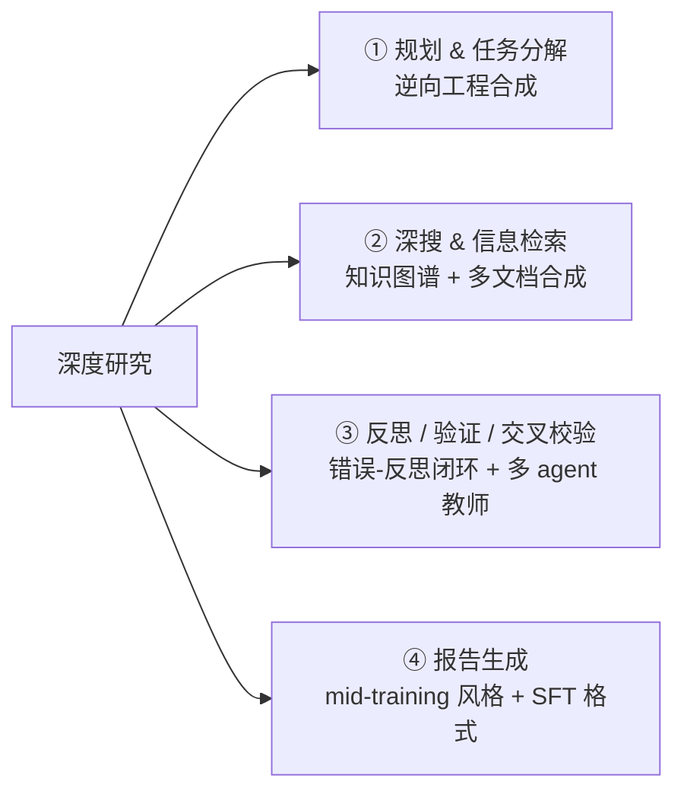
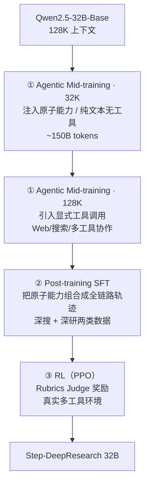

# Step-DeepResearch（阶跃 StepFun）：原子能力数据合成 + 三阶段训练的单 agent 深研

**📄 [Step-DeepResearch Technical Report](https://arxiv.org/abs/2512.20491)**

2025-12 · 阶跃星辰 StepFun Agent-Team · [代码](https://github.com/stepfun-ai/StepDeepResearch)

**一句话**：阶跃 32B 单 agent ReAct 深研模型——靠"原子能力数据合成 + agentic mid-training→SFT→RL 三阶段 + checklist Judger"把中等规模模型做到专家级深研，ResearchRubrics 61.42（单 agent 第一、总榜仅次 Gemini），单篇成本不到顶级商用的 1/10。

::: details 📖 论文原文 Abstract（英文）
As Large Language Models (LLMs) shift toward autonomous agents, Deep Research has emerged as a pivotal metric for assessing the core competitiveness of agents. However, existing works primarily focus on academic multi-hop search tasks with ground truth, such as BrowseComp, which often struggle to satisfy user demands for open-ended research tasks in real-world scenarios. Open-ended research not only demands robust retrieval capabilities but also challenges the agent's comprehensive skills in latent intent recognition, long-horizon decision-making, multi-turn tool use, logical structuring, and cross-source verification. To address this, we introduce **Step-DeepResearch**, a cost-effective, end-to-end Deep Research agent model. We propose a novel *Data Synthesis Strategy Based on Atomic Capabilities*, aimed at reinforcing underlying capabilities in planning, information seeking, reflection, and report writing. In terms of the training paradigm, we construct a progressive path from agentic mid-training to supervised fine-tuning and reinforcement learning. Combined with a *Checklist-style Judger* reward design, this approach significantly improves robustness across diverse scenarios. Furthermore, to address the lack of evaluations reflecting real-world demands in the Chinese domain, we establish **ADR-Bench**, a Chinese benchmark for realistic Deep Research scenarios. Experimental results demonstrate that Step-DeepResearch, with only 32B parameters, achieves a high score of 61.42 on the Scale AI ResearchRubrics. In expert human evaluations on ADR-Bench, its Elo score significantly outperforms comparable models and rivals state-of-the-art proprietary services such as OpenAI DeepResearch and Gemini DeepResearch. These findings prove that through a refined training scheme, medium-sized models can achieve expert-level Deep Research capabilities. With extremely low deployment and inference costs, Step-DeepResearch stands as the most cost-effective Deep Research agent model currently available in the industry.
:::

**相关**：[Deep Research 总览](/agent/deep-research/) · [Tongyi](/agent/deep-research/tongyi-deepresearch) · [Mind DeepResearch](/agent/deep-research/mind-deepresearch) · [DR-Rubric](/agent/deep-research/dr-rubric) · [Web 长程导航 RL](/agent/agentic-rl/web-agent-rl)

> 图源：StepFun, *Step-DeepResearch Technical Report*（arXiv:2512.20491）Figure 1——左图成本-效率、右图 ADR-Bench Elo 雷达（用于学习注解，版权归原作者）。

## 动机与创新点：search ≠ research，用原子能力 + 三阶段训练做单 agent 深研

Step-DeepResearch 的核心论点是 **"search is not research"**——多跳 QA（BrowseComp、GAIA 一类）有标准短答案、优化的是"检索准确率"，容易把 agent 训成高效的"网页爬虫"；而真正的研究是**意图分解 → 规划 → 工具使用 → 跨源验证 → 综合成结构化报告**的迭代过程。作者据此把深研**重新建模为"在一组原子能力上的长程决策"**：自适应规划、信息收集与跨源验证、反思纠错、创造性写作。提升可用性的关键，不在于在外面套更复杂的工作流编排，而在于**把专家式的认知闭环训进模型内部**，让它边做边自检、自我修订。

这与本章 [Tongyi DeepResearch](/agent/deep-research/tongyi-deepresearch)、小红书 [REDSearcher](/agent/deep-research/redsearcher)、理想 [Mind DeepResearch](/agent/deep-research/mind-deepresearch) 同处一条"**不靠堆参数、靠训练 + 数据把 ~30B 压榨到深研 SOTA 级**"的战线；差异点在于 Step-DeepResearch 坚持**单 agent ReAct**（不依赖多 agent 协调或重工作流），把所有能力都内化进一个 32B 模型。

**关键创新**：

- **原子能力数据合成**：把深研拆成规划 / 深搜 / 反思验证 / 报告四类"原子能力"，各自设计针对性的数据合成管线（逆向工程、知识图谱、错误-反思闭环、多 agent 教师），补的是能力而非刷分。
- **三阶段渐进训练**：agentic mid-training（32K→128K 两段课程）→ SFT → RL，把训练目标从"预测下一 token"重塑为"决定下一**原子动作**"。
- **Checklist 式 Rubrics Judger**：把开放式报告质量转成原子化、可验证的 rubric 打分作 RL 奖励，并用非对称二值化消除中间档噪声。
- **单 agent ReAct，不靠多 agent**：所有能力内化进一个 32B 模型，部署/推理成本极低（单篇约 0.5 RMB，不到顶级商用 1/10）。
- **自建 ADR-Bench**：填补中文真实场景深研评测的空白（人评 + rubric 双轨）。

## 方法：原子能力数据合成 + 三阶段训练 + 单 agent ReAct

### 数据合成：把深研拆成四类"原子能力"分别造数据

深研的核心难点，作者概括为"弥合预训练与任务特定优化之间的决策鸿沟"（bridging the decision-making gap between pre-training and task-specific optimization）：预训练给了海量世界知识，但后训练要模型在一个巨大的动作空间里做长程复杂推理。直接在 token 级动作空间 $\mathcal{A}_{\text{token}}$ 里探索，论文指出不仅算力昂贵，还会"因分支因子随序列长度指数增长而把模型困在局部最优"。于是把训练目标——

> reshaping the training objective from "predicting the next token" to "deciding the next **Atomic Action**."

原子能力被定义为"一组可迁移的高层动作抽象，构成紧凑动作子空间 $\mathcal{A}_{\text{atomic}} \subset \mathcal{A}_{\text{token}}$"。数据构造的目标是找一个最优子空间，**同时**最小化两类误差：

$$\min(\epsilon_{\text{pruning}} + \epsilon_{\text{RL}})$$

$\epsilon_{\text{pruning}}$ 是"剪掉潜在最优解"的近似误差，$\epsilon_{\text{RL}}$ 是"在该子空间里做后续规划 / RL 的难度"——子空间砍太狠会丢好解，留太宽又难训，要取 Pareto 最优。具体落到四类原子能力，各建一条数据合成管线：

**① 规划 & 任务分解 —— 逆向工程合成（Reverse Engineering）**

规划要求模型"把模糊或宽泛的用户请求拆成可执行子任务，并据环境反馈动态调路线"。高质量规划数据稀缺，作者反其道而行——拿现成的"完美规划结果"反推。选材是开放获取的技术报告、学术综述、金融研报，因为它们"本质上是复杂研究任务的最终产物，内含隐式的规划逻辑"（*essentially the final output of complex research tasks and contain implicit planning logic*）。三步：

1. 取报告标题+摘要（或正文），**抹掉具体实验细节与结果数据**；
2. 让 LLM 反推"当初可能导向这篇报告的初始项目任务"，得到一个高难 query；
3. 把摘要结构当作"事后诸葛（hindsight）"，合成一份引导全程的高层 Plan——这保证"生成的规划路径有极高可行性与逻辑性，可作推理时的强约束"。

最后做**轨迹一致性过滤**："为 agent 生成执行轨迹、计算其与预设 plan 的对齐度，过滤掉虽完成任务但显著偏离 plan 的轨迹"，只学严格遵循已知 hindsight 的执行过程。

> 举例：拿一篇"固态电池正极材料综述"，抹去其中容量/循环寿命等数据，反推出任务"调研近年固态电池正极的技术路线与瓶颈"，再用综述章节骨架当"标准研究大纲"，让模型学"这类调研该怎么规划"。

**② 深搜 & 信息检索 —— 图谱合成 + 多文档合成**

深搜要的是"多跳推理、挖掘隐藏实体、信息不全时主动拓扑游走"的能力，两条管线造数据：

- **图谱合成**：在 **Wikidata5m / CN-DBpedia** 上做受控子图采样。先选**度数 3–10 的非通用实体**作种子（避免起点太孤立或太宽泛），以它为中心 **BFS 扩出 10–40 个节点**的子图；对度数超阈值（如 >1000）的超级节点**截断当叶子**，防语义漂移。关键一步是**不直接拿三元组出题**——因为知识图谱三元组"常有损、有时过时"，所以"对子图每条边，都把三元组当 query 再搜一次，核验并忠实扩展其信息"，最后基于这个"已验证、结构合理的子图"让 LLM 生成一个"需要多跳搜索与推理的模糊复杂问题"。
  > 举例：子图链「导演 A —执导→ 电影 B —主演→ 演员 C —出生于→ 城市 D」，不会直接问"C 出生在哪"，而模糊成"执导了 B 的那位导演，其影片男主角的出生城市是哪？"——逼 agent 一跳跳查下去。
- **多文档合成**：用自建 **Wiki-doc** 索引，借其天然超链接结构，从随机实体出发、few-shot 引导一个搜索 agent 在文档索引内做"拓扑游走"——"在不预知目标的前提下顺着超链接挖信息，直到步数上限或信息足够"，再把沿途节点汇总、反向生成 (Query, Answer)。

产出的题还要过**难度过滤**：用 **QwQ-32b** 当筛子——"凡 QwQ-32b 在默认 ReAct 下能解的，都算简单题、剔除"。理由很妙：QwQ-32b 与本工作同底座、同预训练知识，但缺 agent 专项训练，所以"它能解的就是不需要专项训练的简单任务"。

**③ 反思 / 验证 / 交叉校验 —— 错误-反思闭环 + 多 agent 教师**

长程推理要模型能"自我纠错（Self-Correction）"和"判断网络信息真伪（Fact-Checking）"，两条闭环造数据：

- **错误-反思闭环**："专家模型生成初步轨迹 → 验证结果 → 多轮反思"。答案对则直接作正样本入库；不对则"构造 prompt 让模型基于错误结果做反思，保留历史记忆后重试，最多迭代 3 次"。对最终反思成功的轨迹做后处理清洗——"移除『根据用户提示（according to user hints）』之类人工诱导痕迹，使输出看起来完全是模型自发的内省与纠错"。
- **深度验证工作流（多 agent 教师）**：从脱敏真实数据清洗出数千个 (段落, 判定结果) 对作种子，用一个**多 agent 教师工作流**模拟专家核验、把完整路径录成轨迹。五个协作 agent：
  - **Extract**：对输入做事实分解，抽出时间、地点、主体、核心数据、因果事件，转成一个个独立"验证点"；
  - **Plan**：判断每个验证点要不要查、该查什么来源，按逻辑依赖排计划；
  - **Verify**：真正调搜索工具+模型，做多源检索与交叉验证；
  - **Replan**：动态调路线，"及时总结已得信息、调整方向，减少冗余搜索"；
  - **Report**：汇总，对每个验证点给出"支持 / 反驳 / 存疑"结论 + 完整引用证据。
  最后把"(验证点, 结论, 证据)"当三元组喂给 judge，"验证报告结论是否与证据逻辑自洽"，确保学到的是"既事实准确、又逻辑严密"的验证范式。

**④ 报告生成 —— mid-training 学风格、SFT 学格式**

报告写作"不只是文本生成，而是把零散信息做结构化重组"，分两段：

- **mid-training** 重"领域风格与内容深度"：用 (Query, Report) 对，报告取自严格筛选的高质量人写报告（金融研报、深度综述），query 由前述逆向工程得到；这阶段"专注学怎么像专家一样组织语言、引用数据、展开有深度的论证"，不纠结具体搜索过程。
- **SFT** 重"指令遵循与格式规范"：要求报告"严格遵循预设 plan 结构"，做对齐检查、过滤偏离样本；对"轨迹质量高但报告格式差"的样本，"用专门的 System Prompt 基于末轮状态重新生成报告"，保证最终产出在内容与格式上都精确响应需求。

### 三阶段训练流水线（Qwen2.5-32B-Base 起步）

**① Agentic Mid-training（两段式课程）**

底座选 **Qwen2.5-32B-Base**，作者明说是为"在性能、算力成本、可复现之间取平衡"——保留接近大模型的核心能力与长上下文（128K），又大幅降低"多阶段训练与系统性消融"的门槛，使"性能提升能更直接归因于所提的训练范式与数据策略"，便于社区复现。中训练走**由短到长、由纯知识到带工具**的课程，分两段：

- **32K 段（注知识、不碰工具）**：在纯文本、**不引入工具调用**下注入规划、信息检索、反思、报告四类原子能力，"确保模型在纯文本条件下先长出稳健的理解与推理能力"。数据覆盖：主动阅读（通用：维基/百度百科的 QA+改写；学术：论文）、合成知识（PleIAs SYNTH）、摘要、推理、反思。跑约 **150B tokens**，期间 SimpleQA **+1.26%** / TriviaQA **+2.30%** / FRAMES **+10.88%**（结构化/agentic 推理涨得最多），且"150B 处曲线仍未收敛，说明还有空间"。
- **128K 段（扩上下文、引工具）**：上下文扩到 128K、**引入显式工具调用**，数据更贴实战——URL QA、深搜步骤（搜索步+工具调用）、Web 浏览（web 导航+工具调用）、规划、长文摘要、推理、反思、通用对话。此阶段要模型"不只生成连贯的中间推理，还要学会何时、如何选择并调用外部工具，并把返回结果整合进后续推理"。

> 图源：StepFun, *Step-DeepResearch Technical Report*（arXiv:2512.20491）Figure 2——32K 中训练的性能随 token 数变化，FRAMES 提升最显著、曲线未收敛（用于学习注解，版权归原作者）。

**② Post-training SFT**

从"单独教能力"转向"**把原子能力组合成端到端全链路轨迹**"——用严格清洗的高质量全链路轨迹，"把已有原子能力系统性地接成高效、鲁棒、深度对齐深研需求的行为模式"。数据分两类：**深搜**（多跳、有 ground-truth）与**深研**（开放式，覆盖意图理解→规划→交叉验证→报告全流程，带严格引用）。四条清洗策略：

- **轨迹效率优化**：奉行"**正确且最短（correct and shortest）**"——成功轨迹里只留推理步数最少、工具用得最省的，"鼓励用有效推理替代冗余搜索、以最小代价获取信息"；
- **鲁棒性 / 噪声控制**：**故意保留**一部分含工具失败（空搜索结果、工具报错）但随后正确"反思-纠错"的轨迹，这种"结构化噪声注入防止模型在真实网络不稳定时崩掉"，并教会它处理异常；
- **认知模式去重**：严格 **N-gram 去重**，剔除过度重复或退化成 loop 的低质轨迹，保证推理行为多样灵活；
- **严格引用对齐**：把 `\cite{}` 引用格式写进 SFT 数据，让模型养成"在关键信息点附来源"的写作范式，保证可追溯、对齐专业研究标准。

**③ Reinforcement Learning（PPO）**

前两阶段靠合成/蒸馏数据，本质是模仿 teacher、无法靠与真实环境试错改进。RL 把模型直接接入**真实多工具环境**（带**检索缓存**：相同 query 复用结果；并对工具调用数与总 token 设**预算**，把训练控在可预测的资源范围）。每个深研任务当一个 RL episode：先做意图分析、复述用户 query，再产分步计划、围绕子问题组织工具调用与信息收集，交叉验证多源证据，最后写完整报告；episode 终止时由 **Rubrics Judge**（见下节）打分作终端奖励。算法用 **PPO**，沿 Open-Reasoner-Zero 实践把 GAE 取 $\gamma=1,\lambda=1$（不折现、不额外平滑，简化长程稀疏奖励下的 credit assignment）。为何不用无 critic 的策略梯度？作者解释 learned critic 能"识别并下调重复 loop 等坏模式、给出更可靠的 token 级价值信号"，这在"奖励无法细分到中间决策（检索策略、证据选择、结构化写作）"的深研场景尤其关键，可避免策略坍缩成粗糙的"整体好/坏"拟合。训练约 **300 步**内奖励曲线稳定上升。

> 图源：StepFun, *Step-DeepResearch Technical Report*（arXiv:2512.20491）Figure 3——RL 训练奖励随步数稳定上升（用于学习注解，版权归原作者）。

### Checklist 式 Judger：把"报告打分"做成可扩展奖励

RL 的奖励来自一个 **Rubrics Judge（checklist 式 Judger）**——把"开放式报告好不好"拆成一串原子化、可验证的检查项打分。三个关键设计：

**造任务 + rubric：两步逆向合成。** RL 需要大量"(任务, rubric)"数据，但高质量 rubric 采集贵。作者用"两步逆向合成"绕开：

- **第一步**：少量高质量样例+模板引导强 LLM 生成一个"隐藏任务摘要（hidden task summary）"，**同步**产出一组细粒度 rubric——每条 rubric 是"含评估维度与重要性权重的**原子标准**，要求具体、可验证、实际可用"，且被标上**显式 / 隐式 / 负向（加分或扣分）**的角色；
- **第二步**：基于这组 rubric 反推真实用户 query，并重新评估每条 rubric 的角色——"若初始与最终的角色判定有出入，整条样本作废"，确保合成 query 真正承载 rubric 里的关键维度、覆盖显式与隐式需求。

再加一道**目标一致性校验**：一个独立 judge 检查"隐藏任务摘要、rubric、合成任务"三者是否一致、有无矛盾，给总一致性分决定去留。

**Judge 自己也要训。** 让大模型按完整 rubric 逐条打分，"每样本要数十次推理才能覆盖所有维度，大规模 agentic RL 下算力与时延都吃不消"。于是先用强模型在 (Query, Rubrics, Report) 三元组上产出分数+解释当监督信号，训一个小 **Rubrics Judge**，经两阶段——SFT（学评分逻辑与解释风格、打基础判别力）+ RLVR（强化输出格式一致性与打分鲁棒性）。它是 RL 阶段主要的奖励提供方，把成本压进可接受预算。作者还点出一个洞见：rubric 本身的质量，往往比 judge 模型的绝对水平更决定"打分能否对齐人类专家"。

**非对称二值化奖励。** 最初按"完全满足 / 部分满足 / 不满足"三元映射到 $\{1, 0.5, 0\}$，但发现"『部分满足』这个中间档在不同强模型之间、以及 LLM 与人类专家之间的一致性最低"，会带来不稳定的奖励信号、削弱模型遵守约束的能力。于是按 rubric 极性折成二值：

- **正向 rubric**：只有"完全满足→1"，"部分满足"与"不满足"都并为 0——贯彻"**不完全满足就不给奖励（no reward unless fully satisfied）**"，防模型靠低质生成钻空子；
- **负向 rubric**：只有"完全不满足→0"，"部分满足"与"完全满足"都并为 1——任何偏离都罚，逼模型避开不良行为。

> 举例（金融/法律场景）：正向 rubric「报告是否引用了与本案相关的《民法典》对应条款」——只有完整引对才得 1；负向 rubric「报告是否把诉讼时效算错」——只要算错一点就触发扣分。报告最终奖励 = 各 rubric 判定 × 其权重（权重可正可负）之和。这种非对称二值映射消除了中间档噪声，"让奖励信号更可区分、加速向专家对齐的收敛"。

### 系统架构：单 agent ReAct + 专用工具集

Step-DeepResearch 刻意走**单 agent ReAct**——"用一个精简的 ReAct 单 agent，而非复杂的多步编排或多 agent 协作"，把复杂深研变成 `<think>→<toolcall>→<tool_response>` 的迭代闭环，循环三相：

- **规划与反思**：先识别用户意图、定行动计划；之后每轮"自发回看此前结果、对照目标校验当前状态，实现动态自纠错"；
- **工具执行**：把计划翻成具体动作，选最合适的工具发起精确的数据获取；
- **反馈与交叉校验**：新工具返回注入下一轮推理，agent"对照历史上下文做交叉验证——解决冲突、过滤虚假——搭起逻辑严密的证据链"。

> 图源：StepFun, *Step-DeepResearch Technical Report*（arXiv:2512.20491）Figure 4——单 agent ReAct 循环 + 专用工具集（用于学习注解，版权归原作者）。

由模型自行决定探索深度直到出报告。工具系统按三条哲学设计——**能力对齐**（给到和人在电脑上做研究相当的操作力）、**信息适配**（结构化、高密度地组织反馈，显式考虑上下文窗口约束与失败恢复）、**架构精简**（功能相近的工具尽量合并）。核心组件：

- **权威增强检索（`batch_web_surfer`）**：专业团队评出 **600+ 权威站点**（政府域名、行业研究机构、国际组织、顶级学术平台）建独立索引分片，"物理且逻辑上把权威内容与低质 SEO 垃圾隔开"；面向 **2000 万+** 长文文献按**段落级粒度**索引，"召回特定语义段落，以更低 token 拿更高密度信息"；排序阶段加**权威 boosting**，相关性接近时优先权威源。
- **文件即外部记忆（`file`）**：**patch 补丁式编辑**——只给改动片段+少量锚点，工具用模糊匹配做原子更新，"长报告局部润色省 70%+ 输出 token"；**隐式上下文管理**——工具结果超阈值就截断、只注入高密度摘要，原文落盘、按需 `file.read` 分页，"把上下文压力卸到磁盘，等效近无限上下文"。
- **有状态待办（`todo`）**：把复杂 CRUD 收进统一入口、按任务栈自动判定 create/rewrite/destroy，"把研究进度从模型权重里解耦、持久化到工具层"，防长程研究中的目标漂移。
- **交互执行与多模态感知**：所有命令在受限 MCP **沙箱**里跑、集成 **tmux** 持久会话以稳定操作 vim 等带状态刷新的命令行程序；**抗扰浏览器**用 **PHash 感知哈希**算连续截图的视觉差异，"页面几乎没变就抑制图像反馈、退回纯文本流，大幅减少多模态 token 冗余"；并配 `file_parser`（文档解析）、`asr`（音频转写）、`analyze_image`（图像分析）处理非结构化研究材料。

## 实验结果：ResearchRubrics 61.42 + 自建 ADR-Bench

### ADR-Bench：面向真实中文场景的深研基准

针对现有学术基准（BrowseComp/GAIA/HLE 偏"闭卷短答"、覆盖不足）的缺口，作者建 **ADR-Bench（Application-driven Deep Research Benchmark）**：

- **110 条 query，9 个领域**（法律、计算机与 IT、教育、金融商业、科学工程、社会生活、文艺、医疗、政治），分两轨：
  - **通用域（70 条，每域 10 条）**：开放式、无单一标准答案，用**人类盲评 side-by-side 对比**（左好/右好/都好/都一般/都差 + 信息完整性 / 内容深度 / 需求贴合 / 可读性四子维），引入参照锚降低主观不确定性。
  - **专业域（40 条，金融 & 法律各 20）**：专家造题 + 交叉校验的 rubric 自动评，且引入**显式负向扣分**——专家认定的致命/专业性错误直接判该报告"零分不可用"。
- 配套总结了一套构造 rubric 的五原则（原子性 / 可验证 / 无歧义 / 独立性 / 对齐核心任务需求）与领域分割经验（深研约 6–12 个领域较合理）。

### Benchmark 表现（以原文为准）

**ResearchRubrics（Scale AI，三元打分、温度 0、三次取均值）**：Step-DeepResearch **61.42**，在 **ReAct/单 agent 类中第一**，总榜仅次于商用 Gemini DeepResearch，**超过 OpenAI DeepResearch**。

| 系统 | ResearchRubrics 分 | 类型 |
| --- | --- | --- |
| Gemini DeepResearch | 63.69 | 商用 agent 系统 |
| **Step-DeepResearch（32B）** | **61.42** | **单 agent ReAct** |
| OpenAI DeepResearch | 60.67 | 商用 agent 系统 |
| Kimi-k2-thinking | 56.17 | ReAct |
| MiniMax-M2 | 55.35 | ReAct |
| Kimi-Researcher | 53.67 | 商用 agent 系统 |
| DeepSeek-V3.2 | 53.14 | ReAct |
| GLM-4.6 | 52.80 | ReAct |
| MiniMax Agent Pro | 51.85 | 商用 agent 系统 |
| Qwen DeepResearch | 49.24 | 商用 agent 系统 |

- **成本**：单次调用约 **0.50 RMB**，而 Gemini ≈6.65、OpenAI ≈5.32 RMB——**不到顶级商用系统的 1/10**，仍保 SOTA 级性能。
- **维度拆解**：隐式标准 54.5 / 显式标准 72.0 / 引用质量 57.0（与 Gemini 并列第一）/ 沟通质量 58.2（全场最佳）；指令遵循 64.9 略逊 Kimi-Researcher 66.7。
- **ADR-Bench 人评（N=70）**：对比自己的**未 mid-training 版**取得 30 胜 / 19 平 / 21 负——印证 mid-training 对齐了人类对复杂报告质量的偏好；对 Gemini 30 胜 / 17 平 / 23 负，对多数对手胜率高于负率。
- **ADR-Bench 金融&法律（严格负向扣分）**呈三梯队：Tier 1 仅 Gemini；**Tier 2：Step-DeepResearch、Kimi-Researcher、Kimi-k2-thinking、OpenAI DeepResearch**；Tier 3 其余。作者称在严格负向扣分下，差距更多来自模型**自身领域知识覆盖**而非 agent 框架优化，Step 凭金融/法律的领域训练进入第二梯队、与更大模型掰手腕。

> 一如本章惯例：这些分数口径、时点、工具配置、test-time 设置各异，**跨系统直接比绝对值意义有限**，当作"同期 32B 档单 agent 深研能力的量级参照"即可。

## 在 Deep Research 谱系里的位置

- **vs Tongyi / REDSearcher / Mind DeepResearch**：四者都在 **~30B 档**走"专门训练深研 agent"。Step 的特色是 **(a) 把深研显式拆成四类原子能力分别造数据 + (b) agentic mid-training（32K→128K 两段课程）→ SFT → PPO 三阶段 + (c) 坚持单 agent ReAct 不靠多 agent**；理想 [Mind DeepResearch](/agent/deep-research/mind-deepresearch) 则相反，用规划/深搜/报告**三 agent 分工** + Search-RL/Report-RL 分块 RL，可对照阅读。
- **vs DR-Rubric / AgentDisCo**：Step 的 Rubrics Judge 与 [DR-Rubric](/agent/deep-research/dr-rubric)（把"造 RL 奖励 rubric"当深研任务）思路相通——开放式深研越来越靠"多维 rubric/checklist"而非单一分数；[AgentDisCo](/agent/deep-research/agentdisco) 不训底座、在强通用模型上做 agent 编排，与 Step"从训练侧造模型"互补。
- 整体定位与"国产/开源刷榜竞赛"背景见 [Deep Research 总览](/agent/deep-research/)。
