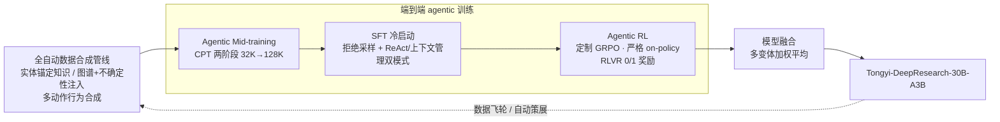

# Tongyi DeepResearch（阿里通义）：端到端 agentic 训练 + 全自动数据合成的开源深研标杆

**📄 [Tongyi DeepResearch Technical Report](https://arxiv.org/abs/2510.24701)**

2026-05（v3；2025-10 首版）· 阿里巴巴 Tongyi Lab · [代码](https://github.com/Alibaba-NLP/DeepResearch)

**一句话**：阿里通义把"会做深度研究"当成一种能从底座训出来的能力——以 Qwen3-30B-A3B-Base 为起点，用 **agentic mid-training → SFT → agentic RL** 端到端训练，配一条**全自动、无人工标注**的数据合成管线，做出一个 30.5B 总参 / 每 token 仅激活 3.3B 的开源深研 agent，并把模型权重、训练框架、数据方案一并开源。

::: details 📖 论文原文 Abstract（英文）
We present **Tongyi DeepResearch**, an agentic large language model, which is specifically designed for long-horizon, deep information-seeking research tasks. To incentivize autonomous deep research agency, Tongyi DeepResearch is developed through an end-to-end training framework that combines **agentic mid-training** and **agentic post-training**, enabling scalable reasoning and information seeking across complex tasks. We design a highly scalable **data synthesis pipeline** that is fully automatic, without relying on costly human annotation, and empowers all training stages. By constructing customized environments for each stage, our system enables stable and consistent interactions throughout. Tongyi DeepResearch, featuring 30.5 billion total parameters, with only 3.3 billion activated per token, achieves state-of-the-art performance across a range of agentic deep research benchmarks, including Humanity's Last Exam, BrowseComp, BrowseComp-ZH, WebWalkerQA, xbench-DeepSearch, FRAMES and xbench-DeepSearch-2510. We open-source the model, framework, and complete solutions to empower the community.
:::

**相关**：[Deep Research 总览](/agent/deep-research/) · [Step-DeepResearch](/agent/deep-research/step-deepresearch) · [Mind DeepResearch](/agent/deep-research/mind-deepresearch) · [REDSearcher](/agent/deep-research/redsearcher) · [DR-Rubric](/agent/deep-research/dr-rubric) · [Web 长程导航 Agent 的 RL](/agent/agentic-rl/web-agent-rl)

> 图源：Tongyi DeepResearch Team, *Tongyi DeepResearch Technical Report*（arXiv:2510.24701）Figure 1——八个深研基准上的对比，紫色斜纹柱为 Tongyi DeepResearch（用于学习注解，版权归原作者）。

## 动机与创新点：深研能力不是"挂工具"挂出来的，而是从底座端到端训出来的

2025-02 OpenAI Deep Research 发布后，"深度研究 agent"成为 agent 元年最受关注的能力形态：给一个开放式研究问题，agent 自主完成"规划 → 多轮检索 → 阅读 → 反思补检 → 综合成稿"的长程轨迹，几十分钟内做完人类要花几小时的调研。但第一梯队（OpenAI、Gemini、Grok、Claude）几乎全是闭源产品——"most deep research systems remain closed-source, and their intermediate research processes are inaccessible"，开源社区只能用"通用模型 + 搜索工具"的即插即用方案逼近，与闭源拉开明显差距。

Tongyi DeepResearch 的核心论点是：**深研能力不应靠在通用模型外面套更复杂的工作流编排来"凑"，而应作为一种归纳偏置直接训进模型。** 论文点破了通用底座的根本缺陷——"General foundation models usually lack agentic inductive bias"：它们在纯文本上预训练、再用指令数据后训练，这些数据**既没有研究级问题、也没有 agentic 行为**，导致模型只能"在后训练阶段同时学 agentic 能力与对齐（learns agentic capabilities and alignment simultaneously）"，结果次优、且两个目标互相打架。于是作者引入 **mid-training（中段训练）作为预训练与 agentic 后训练之间的桥**，先长出一个"agentic foundation model"，再交给后训练精修。

这条路线与本章 [Step-DeepResearch](/agent/deep-research/step-deepresearch)（阶跃 32B）、小红书 [REDSearcher](/agent/deep-research/redsearcher)、理想 [Mind DeepResearch](/agent/deep-research/mind-deepresearch) 同处一条战线——**不靠堆参数、靠训练 + 数据把 ~30B 压到深研 SOTA 级**；差异在于 Tongyi 把"开源一个专门训练的权重 + 公开整套 mid-training→RL 配方与数据合成管线"做到了最彻底，是这个象限里目前最具代表性的开源标杆。

**关键创新**：

- **端到端 agentic 训练范式**：统一 agentic mid-training 与 agentic post-training（SFT + RL），"forming a scalable foundation for deep reasoning and information-seeking behaviors"——让模型从基础交互技能逐步长到自主研究行为，而不是在后训练里一锅烩。
- **全自动、高可扩展的数据合成管线**：完全消除人工标注，批量造出多样、高质量的 agent 轨迹与研究级 QA，"enables the construction of super-human-level datasets with stable distributions"，并形成**数据飞轮**（训出的模型反哺合成更难的数据）。
- **分阶段定制环境**：把环境抽象成 **Prior World / Simulated / Real-world** 三类，各自在稳定性、保真度、成本间取不同平衡——中训练主要用 Prior World + Simulated 低成本造数据，RL 阶段先在 Simulated 验证、再部署到 Real-world。
- **ReAct + 上下文管理双范式 + Heavy Mode**：训练同时覆盖经典 ReAct 与基于马尔可夫状态重构的上下文管理范式；推理侧再用 Research-Synthesis 做 test-time scaling。
- **30.5B 总参 / 3.3B 激活的 MoE**：用显著更小的激活量在多个基准上达到甚至超过闭源前沿，兼顾性能、可解释性与算力效率。

## 方法：mid-training 打底 + 全自动数据合成 + on-policy RL

整条管线是一条**端到端 agentic 训练流水线**：Qwen3-30B-A3B-Base 起步，经两阶段 agentic 中训练打底，再做 SFT 冷启动 + agentic RL，全程由全自动数据合成管线供血。

> 图源：Tongyi DeepResearch Team, *Tongyi DeepResearch Technical Report*（arXiv:2510.24701）Figure 2——从底座到 CPT 两阶段、再到 SFT + RL 的训练流水线（用于学习注解，版权归原作者）。

### 形式化：Thought–Action–Observation 三元 + ReAct / 上下文管理两种 rollout

论文先把每个时间步 $t$ 的 rollout 拆成三个基本组件：**Thought（$\tau_t$）** 是 agent 的内部认知过程（回忆记忆、规划后续步骤、自我反思调整策略）；**Action（$a_t$）** 是对外操作，动作空间由一组工具定义——"*Search, Visit, Python Interpreter, Google Scholar* and *File Parser*"，中间步 $a_t\ (t<T)$ 是工具调用，终止动作 $a_T$ 是给用户产出一份深度报告；**Observation（$o_t$）** 是动作后从环境收到的反馈，用来更新内部状态、驱动下一个 thought。

基于这三件套，定义两种 rollout：

**ReAct（经典范式）。** 架构"fundamentally based on the vanilla ReAct"，把推理与行动交错生成，轨迹是一串 thought–action–observation 三元组：

$$\mathcal{H}_T = (\tau_0, a_0, o_0, \ldots, \tau_i, a_i, o_i, \ldots, \tau_T, a_T)$$

策略据全部历史交互生成当前 thought 与 action：$\tau_t, a_t \sim \pi(\cdot \mid \mathcal{H}_{t-1})$。为什么明明有更复杂的单/多 agent 范式还坚持朴素 ReAct？作者搬出 **"The Bitter Lesson"**——"general methods leveraging scalable computation ultimately outperform approaches that rely on complex, human-engineered knowledge and intricate designs"：重度依赖 prompt 工程或刚性结构的框架，会随底座能力增长而过时，简单且对齐第一性原理的设计才长青。

**Context Management（上下文管理范式）。** 长程任务受限于有限的上下文窗口——把所有检索结果一路堆进同一个膨胀上下文会"认知窒息（context suffocation）"。作者用**基于马尔可夫状态重构的动态上下文管理**：每一步不再以完整历史为条件，而是只看一个**策略性重构的工作区**——问题 $q$、一份持续演进、当压缩记忆用的报告 $S_t$、以及上一轮交互 $(a_t, o_t)$。核心更新写成：

$$S_t, \tau_{t+1}, a_{t+1} \sim \pi(\cdot \mid S_{t-1}, a_t, o_t)$$

这个马尔可夫结构"enables the agent to maintain consistent reasoning capacity across arbitrary exploration depths"——不管探索多深，每步重构都强迫 agent 显式地综合并排序信息，天然对齐人类研究里"周期性总结与反思"的习惯。（这正是团队此前 **IterResearch** 思路的形式化版本。）

> 举例：调研一个有十几跳的问题时，ReAct 模式会把第 1 跳到第 15 跳的所有网页原文都留在上下文里，越滚越长直到塞爆；上下文管理模式则每跳结束就把"目前已知 + 还缺什么"压成一份精简报告 $S_t$，下一跳只带着这份报告和最近一次工具返回继续，等效在有限窗口里跑无限长 horizon。

### Agentic Mid-training：两阶段 CPT，把 agentic 先验注进底座

中训练用**两阶段 Agentic Continual Pre-training（Agentic CPT）**，作为"a critical bridge connecting pre-trained models and agentic post-training"，目标是给底座注入强 agentic 归纳偏置、同时保住语言通用能力，优化目标仍是标准 *Next-Token Prediction*。设计上由短到长、渐进扩能力：

- **Stage 1（32K）**：先在 32K 上下文长出 agentic 基座；
- **Stage 2（128K）**：扩到 128K，引入"a substantial corpus of long-sequence (64K-128K) agentic behavior data"，强化长程连贯推理与行动。两阶段都掺入少量通用预训练数据，"without sacrificing its foundational generalization capabilities"。

中训练的燃料来自一条覆盖 agent 完整工作流的合成管线（下图）——把 agent 的操作循环拆成四个关键动作分别造数据：

> 图源：Tongyi DeepResearch Team, *Tongyi DeepResearch Technical Report*（arXiv:2510.24701）Figure 3——面向 agentic CPT 的大规模 agent 行为数据合成（用于学习注解，版权归原作者）。

- **多风格问题合成（Question Synthesis）**：先构建一个**实体锚定的开放世界记忆（entity-anchored open-world memory）**，把网页爬取数据、agent 交互轨迹整理成"实体 + 关联知识"的结构化表示，再采样实体生成嵌入特定行为模式的问题（多跳推理题、数值计算题等）。
- **规划动作（Planning Action）**：作者的关键观察是"planning accuracy is highly correlated with whether an agent can successfully complete a task"，于是用开源模型对合成问题做分解与首步动作预测，并**拿构题用到的实体与知识做拒绝采样**，保证规划输出高质量。
- **推理动作（Reasoning Action）**：外部工具常返回海量噪声，"whether models can distill critical knowledge from noise ... directly determines task outcomes"。给定问题与依赖知识，引导大模型两阶段生成完整推理链，再按**推理长度 + 答案一致性**双重过滤。
- **决策动作（Decision-Making Action）**：每一步思考与行动本质都是隐式决策，作者**把它显式建模成独立动作类型**——先在既有演示轨迹上充分探索每步可行动作空间，再把原轨迹重构成"多步决策序列"且保留原始决策选择。

此外还有 **General Function-calling via Environment Scaling**：把"环境即 *read–write* 数据库"当原则，自动构造大量全模拟的异构环境来系统性拓宽函数调用场景，产出的数据并入中训练。

### Agentic Post-training（一）：高质量数据合成 + SFT 冷启动

后训练分三步：数据合成、SFT 冷启动、agentic RL。SFT 用的高难数据来自一条专门的合成管线（下图三步），目标是造出"complex, high-uncertainty and super-human level question and answer pairs"、把 agent 性能推到超人级：

1. **图构建（Graph Construction）**：通过随机游走 + 网络搜索 + 真实网站的同构表，建一张高度互联的知识图，确保信息结构真实；
2. **子图采样（Subgraph Sampling）**：在图上采子图、子表，生成初始 (Q, A)；
3. **不确定性注入（Uncertainty Injection）**：这是最关键的一步——"strategically increasing the uncertainty within the question to enhance its difficulty"。把 QA 难度形式化为一系列**可控"原子操作"**（如*合并属性相近的实体*）作用在实体关系上，从而系统性升难度；并借集合论对信息检索问题做形式化建模（团队此前 WebShaper 思路），既能受控扩难、减少推理捷径与结构冗余，又能高效**验证合成 QA 的正确性**。

> 举例：原始问题"X 公司 2023 年营收多少"答案唯一、太好查；不确定性注入会把它和另一个属性相近的实体合并、再抹掉直接线索，变成"在 2023 年营收超过同省某家以 Y 业务起家的公司、且成立晚于它的那家企业，其创始人毕业于哪所大学"——逼 agent 多跳消歧、交叉验证才能解。

另配一个**自动化引擎生成 PhD 级研究问题**：从多学科知识库取需多源推理的种子 QA，再让一个配了工具的"出题 agent"做**迭代式复杂度升级**，每轮在前一轮基础上扩展范围与抽象度，可控地阶梯式拔高难度。

**SFT 冷启动**用拒绝采样从高难 QA 里筛出"覆盖完整思考过程 + 工具响应"的高质量轨迹。其 **Mixed Training Paradigm（混合训练范式）** 同时喂两种形式的数据以增强鲁棒与泛化：

- **ReAct Mode**：输入历史状态 $\mathcal{H}_{t-1}$，输出当前步的 $\tau_t$ 与工具调用 $a_i$；
- **Context Management Mode**：输入上一步的轨迹摘要 $S_{t-1}$、工具调用 $a_{i-1}$、工具响应 $o_{i-1}$，输出当前步的轨迹摘要、$\tau_i$ 与 $a_i$——它"particularly strengthens the agent's capabilities in state analysis and strategic decision-making"，比纯 ReAct 更要求模型把复杂观察综合成连贯摘要、跨长轨迹维持任务焦点。

训练按上下文长度分两阶段：先 **40K**（ReAct 模式中 <40K 的样本 + 全部上下文管理样本），再扩到 **128K**（纳入 40K–128K 的 ReAct 样本 + 少量 40K 数据保稳定）。

### Agentic Post-training（二）：严格 on-policy 的定制 GRPO

RL 阶段把模型接入真实/模拟环境做 **RLVR**——产一条完整 rollout、若终答匹配 ground truth 就给奖励。算法是 **GRPO 的定制版**：

$$\mathcal{J}(\theta) = \mathbb{E}_{(q,y)\sim\mathcal{D},\,\{\mathcal{H}^i\}\sim\pi_{\theta_{\text{old}}}}\!\left[\frac{1}{\sum_{i=1}^{G}|\mathcal{H}^i|}\sum_{i=1}^{G}\sum_{j=1}^{|\mathcal{H}^i|}\min\!\big(r_{i,j}(\theta)\hat{A}_{i,j},\,\text{clip}(r_{i,j}(\theta),1-\varepsilon_{\text{low}},1+\varepsilon_{\text{high}})\hat{A}_{i,j}\big)\right]$$

其中 $r_{i,j}(\theta)=\dfrac{\pi_\theta(\mathcal{H}^{i,j}\mid \text{context})}{\pi_{\theta_{\text{old}}}(\mathcal{H}^{i,j}\mid \text{context})}$，优势 $\hat{A}_{i,j}=R_i-\text{mean}(\{R_i\}_{i=1}^{G})$。几个务实选择：

- **严格 on-policy**：轨迹始终用最新策略采样，重要性比 $r_{i,j}$ 在严格 on-policy 下恒为 1.0，让学习信号永远对齐当前能力；
- **纯 0/1 奖励、不加格式奖励**：因为冷启动阶段已经把输出格式学到位了，"We **do not** include a format reward"；
- 沿 **DAPO** 用 **token 级策略梯度损失 + clip-higher** 鼓励探索，按 **leave-one-out** 降优势估计方差；
- **选择性剔除负样本**：直接在未过滤的负 rollout 上优化会"degrade training stability and ... policy collapse"，故剔掉如"因超长度而没出终答"这类样本——目的不是算法创新，而是"the pragmatic pursuit of a more efficient and stable training paradigm"。

配套的 **Automatic Data Curation（自动数据策展）** 让训练数据随策略一起进化：先用 SFT 模型在大数据集上多次采样，**滤掉"总是失败"和"总是成功"的题**（这类题对 RL 无学习信号），只留中等难度集 $\mathcal{D}'$；训练中持续监控哪些题对更强的策略已变简单、并由一个独立后台进程从原始集挖新的"中等难度"题补进备份池，到一定步数或奖励 plateau 时刷新 $\mathcal{D}'$。整个数据飞轮**独立运行、不打断主 RL 循环**。

由此作者给出一条核心洞见：

> the success of agentic RL depends more on **the quality of the data and the stability of the training environment** than on the specific algorithm being used.

### 训练环境与系统：三类环境 + 统一沙箱 + 异步 rollout

作者把"环境"从被动外部现实重构为"actively designed as systems deeply coupled with the training process"，分三类各取平衡：**Prior World**（零交互成本、无限可扩、但无真实反馈）、**Simulated**（稳定快、低成本、有 sim-to-real gap）、**Real-world**（最真实、但昂贵且非平稳）。落到 RL：

> 图源：Tongyi DeepResearch Team, *Tongyi DeepResearch Technical Report*（arXiv:2510.24701）Figure 5——agentic RL 框架与工具/环境（用于学习注解，版权归原作者）。

- **Real-world Environment**：工具集为 Search / Visit / Python Interpreter / Google Scholar / File Parser。外部 API 高延迟、偶发失败、返回不一致会"corrupt our training trajectories"，于是建一个**统一沙箱**——中央调度层托管每次工具调用，实现 QPS 限速、结果缓存、超时自动重试、非关键失败优雅降级、失败时无缝切到备份数据源，把工具调用抽象成确定性接口，"insulates the training loop from real-world stochasticity"。
- **Simulated Environment**：基于 2024 Wikipedia 离线库 + 一套本地 RAG 工具模拟网络环境，复用数据合成管线造结构复杂的 QA，得到低成本、高效率、完全可控的实验平台，先在这里验证策略再上真实环境。
- **On-Policy 异步 rollout**：基于 **rLLM** 框架实现自定义的步级异步 RL 循环，用两个独立异步服务（一个跑模型推理、一个跑工具调用），中央交互 handler 把两边输出整理成统一 message list，支持多个 agent 实例并行 rollout。

最后一步做**模型融合**：基于"同一底座衍生的不同变体参数可有效平均/插值"这一洞见，对几个能力偏好各异的变体做加权平均 $\theta_{\text{merged}}=\sum_k \alpha_k\,\theta^{(k)},\ \sum_k\alpha_k=1,\ \alpha_k\ge 0$，在不额外训练的前提下兼得各路强项与稳健泛化。

## 实验结果：七个深研基准多数居首，Heavy Mode 再上台阶

### 评测设置

底座对比覆盖两类系统：**LLM-based ReAct agent**（GLM-4.5、Kimi-K2、DeepSeek-V3.1、Claude-4-Sonnet、OpenAI o3/o4-mini）与**端到端深研 agent**（OpenAI DeepResearch、Gemini DeepResearch、Kimi Researcher）。固定推理参数 temperature=0.85、repetition penalty=1.1、top-p=0.95，单任务最多 128 次工具调用、上下文 128K；每个基准独立跑三次取均值（**Avg@3 为主指标**，另报 Pass@1/Pass@3）。结果取自 2025-09-16（xbench-DeepSearch-2510 为 2025-10-28）。

### Benchmark 表现（以原文为准）

| 基准 | Tongyi DeepResearch (30B-A3B) | 这个榜考什么 |
| --- | --- | --- |
| Humanity's Last Exam (HLE) | **32.9** | 跨学科、被刻意设计得对 AI 极难的专家级问答，考"推理 + 检索" |
| BrowseComp | **43.4** | OpenAI 提出的浏览 agent 基准，答案难找但易验，考英文长程网页检索 |
| BrowseComp-ZH | **46.7** | BrowseComp 中文版，考中文网络环境下的长程检索 |
| GAIA | **70.9** | 通用 AI 助手基准，多步工具 + 多模态推理 |
| xbench-DeepSearch | **75.0** | 面向深度搜索能力，考多轮检索与信息综合 |
| WebWalkerQA | **72.2** | 在网站内多跳"走"页面、跨页提取并整合信息 |
| FRAMES | **90.6** | 多文档检索 + 多步推理的事实性问答 |

报告称该模型"achieves the highest scores on nearly all evaluated benchmarks"，在多数榜上**超过 OpenAI o3、DeepSeek-V3.1、Gemini DeepResearch**；在新发布的 xbench-DeepSearch-2510 上约 **55.0**、仅次于 ChatGPT-5-Pro。横向对照（Table 1）里，OpenAI DeepResearch 为 HLE 26.6 / BrowseComp 51.5 / BrowseComp-ZH 42.9 / GAIA 67.4，Kimi Researcher 为 xbench-DeepSearch 69.0 / FRAMES 78.8——Tongyi 用 **3.3B 激活**即在多数维度领先或持平。

**Heavy Mode（test-time scaling）**：推理侧提供 **Research-Synthesis** 框架——并行跑 $n$ 个 agent，各自按上下文管理范式探索不同解路并产出压缩报告 $S^u_T$，再由一个 synthesis 模型在可控窗口内整合 $n$ 份报告出终答（$\text{answer}_{\text{final}}=\text{Synthesis}(\{(S^u_T,\text{answer}_u)\}_{u=1}^n)$）。它把 HLE 推到 **38.3**、BrowseComp-ZH **58.1**、BrowseComp **58.3**。细粒度看，Pass@3 进一步到 **BrowseComp 59.64 / BrowseComp-ZH 63.67 / HLE 45.9**，且 Avg@3 与 Pass@1 高度一致，说明结果稳健。

> 看榜须知：这些分数是**技术报告自报口径**，评测时点、工具配置、test-time 设置各异，**跨系统直接比绝对值意义有限**，当作"同期 30B 档开源深研 agent 能力的量级参照"即可，具体以论文原文与各基准官方说明为准。

## 在 Deep Research 谱系里的位置

- **vs 闭源 DR（OpenAI / Gemini / Grok DeepSearch）**：闭源方案模型不开放、训练方法不公开，只能当产品用、当榜单对照点。Tongyi 的差异化不在"分数高几个点"，而在把**与闭源同构的能力以完全开源、可复现的方式**交了出来——权重、训练框架、数据合成方案全开放。从能力对标看，报告主张其在 HLE / BrowseComp 等多榜达到与 OpenAI DeepResearch 相当甚至领先的水平，且是用 30.5B 总参 / 3.3B 激活这样**显著更小的激活量**达成的。
- **vs Step-DeepResearch / REDSearcher / Mind DeepResearch**：四者都在 **~30B 档**走"专门训练深研 agent"。Tongyi 的特色是 **(a) 引入 agentic mid-training 作为预训练与后训练之间的桥 + (b) 一条全自动、形成数据飞轮的合成管线（实体锚定知识 + 图谱不确定性注入）+ (c) 坚持朴素 ReAct（Bitter Lesson）并以上下文管理范式解长程**；[Step-DeepResearch](/agent/deep-research/step-deepresearch) 同样三阶段 + 中训练，但把深研显式拆成"四类原子能力"分别造数据、并用 checklist 式 Rubrics Judger 做 RL 奖励；理想 [Mind DeepResearch](/agent/deep-research/mind-deepresearch) 反其道用规划/深搜/报告**三 agent 分工** + 分块 RL，可对照阅读。
- **vs 纯框架编排型开源方案（MiroFlow、GPT Researcher 等）**：这些更多停留在"框架编排 + 通用底座 + 工具"层面（工作流开源，但不带一个专为深研端到端训练过的开源权重）。Tongyi 的核心区别是**同时开源了一个专门训练的模型权重**，把竞争点从"怎么把现成模型编排得更好"推进到"怎么训出一个本身就会做深研的模型"。
- **vs 奖励设计前沿（DR-Rubric 等）**：Tongyi 的 RLVR 走"终答匹配的 0/1 奖励 + 自动数据策展"，简单稳健；[DR-Rubric](/agent/deep-research/dr-rubric)、Step 的 Rubrics Judger 则把"开放式报告质量"拆成多维 rubric/checklist——开放式深研的奖励信号正从单一答案匹配向多维 rubric 演进，两条路线互补。
- 整体定位与"国产/开源刷榜竞赛"背景见 [Deep Research 总览](/agent/deep-research/)；训练这类浏览 agent 的 RL 通用方法见 [Web 长程导航 Agent 的 RL](/agent/agentic-rl/web-agent-rl)。
