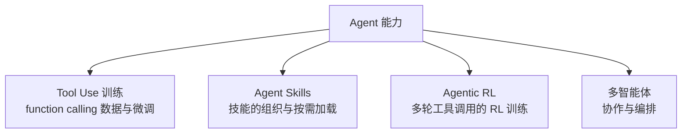

# Agent 与 Skill 总览

> **一句话**：让模型不只是"回答"，而是"行动"：调用工具、执行多步任务、按需加载技能；训练与组织方式是本版块的主题。

::: warning 状态
🚧 本页为占位大纲，正文尚未撰写。
:::

## 版块地图

## 子主题

| 页面 | 回答的问题 |
| --- | --- |
| [Tool Use 训练](/agent/tool-use) | 怎么教模型正确发起函数调用 |
| [Agent Skills](/agent/agent-skills) | 怎么把领域知识打包成可复用的技能 |
| [Agentic RL](/agent/agentic-rl) | 多轮交互任务怎么用 RL 训练 |
| [多智能体](/agent/multi-agent) | 多个 agent 怎么分工协作 |

## TODO

- [ ] Agent 训练与前几个版块（SFT/RL）的关系：同样的算法、不同的数据与环境
- [ ] 评测基准盘点（SWE-bench、τ-bench 等）
