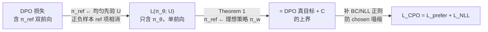

# CPO（JHU & Microsoft）：均匀先验消掉 reference + SFT 锚定，把偏好优化用进机器翻译

**📄 [Contrastive Preference Optimization: Pushing the Boundaries of LLM Performance in Machine Translation](https://arxiv.org/abs/2401.08417)**

2024-06（ICML 2024）· Johns Hopkins University & Microsoft · [代码](https://github.com/fe1ixxu/ALMA)

**一句话**：CPO 用「均匀分布先验」近似 DPO 里的 reference model，得到 DPO 损失的一个**上界**从而彻底去掉 $\pi_{\text{ref}}$，再补一个 SFT（NLL）正则把 chosen 的绝对似然顶住；为机器翻译提出（训出 ALMA-13B-R），方法本身对所有偏好优化通用。

::: details 📖 论文原文 Abstract（英文）
Moderate-sized large language models (LLMs) – those with 7B or 13B parameters – exhibit promising machine translation (MT) performance. However, they do not match the performance of state-of-the-art conventional encoder-decoder translation models or larger-scale LLMs such as GPT-4. In this study, we bridge this performance gap. We first assess the shortcomings of supervised fine-tuning for LLMs in the MT task, emphasizing the quality issues present in the reference data, despite being human-generated. Then, in contrast to supervised fine-tuning which mimics reference translations, we introduce **Contrastive Preference Optimization (CPO)**, a novel approach that trains models to avoid generating adequate but not perfect translations. Applying CPO to ALMA models with only 22K parallel sentences and tuning only 0.1% parameters yields significant improvements. The resulting model, called **ALMA-R**, can match or exceed the performance of the WMT competition winners and GPT-4 on WMT'21, WMT'22 and WMT'23 test datasets.
:::

**相关**：[DPO](/dpo/dpo) · [SimPO](/dpo/simpo) · [SFT 总览](/sft/) · [DPO/偏好优化总览](/dpo/)


> 图源：Xu et al., *Contrastive Preference Optimization: Pushing the Boundaries of LLM Performance in Machine Translation*（arXiv:2401.08417）Figure 1——ALMA-13B-R 在 WMT'22 八方向上的三种 reference-free 评分均值对各尺寸系统的对比（用于学习注解，版权归原作者）。

## 动机与创新点：SFT 在「模仿参考译文」处触顶，要一个去 reference 又能细粒度对比的目标

CPO 诞生于机器翻译，但动机对所有偏好优化都成立，核心是两条「SFT 的天花板」。

**第一，金标准参考本身就「镀金而非真金」（Gold or Gilded?）。** SFT 的范式是最小化预测输出与金标准参考之间的差距（式 1 的 NLL 损失 $\mathcal{L}_{\text{NLL}} = -\mathbb{E}_{(x,y)\sim\mathcal{D}}[\log\pi_\theta(y|x)]$），这意味着**模型能力被参考数据的质量牢牢封顶**。作者对 ALMA 用的 FLORES-200 人写参考做了细致核查，发现"在很多情况下，人写平行数据的质量甚至不如强翻译模型生成的译文"——

> Preventing the production of these near-perfect but ultimately flawed translations is essential.

用 KIWI-XXL / XCOMET 两个 10B 级 reference-free 评估模型打分，ALMA-13B-LoRA 的输出在 $\text{xx}\to\text{en}$ 方向上以 **73.24%** 的胜率（KIWI-XXL）盖过金标准参考。一味朝参考靠拢，既触不到上限，又学不会"拒绝那些'够好但不完美'的译文"。

**第二，翻译里的偏好是「好 vs. 更好」的细粒度对比。** 真正需要的不是再做一遍 SFT，而是在多个都不错的候选里学出更精细的偏好——一个能做细粒度对比、又不被 reference 束缚的目标。

**关键创新**：

- **均匀先验消 reference**：把 DPO 隐式 reward $\beta\log\frac{\pi_\theta}{\pi_{\text{ref}}}$ 里的 $\pi_{\text{ref}}$ 取成均匀分布 $U$，正负样本的 $\pi_{\text{ref}}$ 项互相抵消，reference model 直接消失——省一份显存、省一次前向。
- **上界定理**：证明这不是随手近似——当把 $\pi_{\text{ref}}$ 视作"理想策略 $\pi_w$"而非常规的 SFT 检查点时，去 reference 的 $\mathcal{L}(\pi_\theta;U)$ 是真实 DPO 目标的一个**上界**，最小化它即在优化 DPO 目标的代理。
- **SFT/BC 正则防塌缩**：去掉 KL 锚后补一个行为克隆（NLL）项 $\mathcal{L}_{\text{NLL}}=-\mathbb{E}[\log\pi_\theta(y_w|x)]$，把 chosen 的**绝对**似然顶住，扮演 DPO 里 KL 项的部分角色。
- **三元 reference-free 偏好数据**：对每条源句，让 GPT-4、ALMA-13B-LoRA、金标准参考各出一版译文，用 KIWI-XXL/XCOMET 打分取最高为 chosen、最低为 rejected、中间档丢弃——连金标准都可能沦为 rejected。
- **极低成本撬动 SOTA**：只用 22K 平行句、只调 0.1% 参数（12M LoRA），就把 ALMA-13B-LoRA 推到 ALMA-13B-R，匹配/超过 GPT-4 与 WMT 冠军。

## 方法：三元偏好数据 + 均匀先验上界 + NLL 锚定

CPO 的最终损失由一个对比项和一个 SFT/NLL 项相加（论文式 5）：

$$
\mathcal{L}_{\text{CPO}} = \underbrace{-\,\mathbb{E}_{(x,y_w,y_l)}\!\left[\log \sigma\big(\beta \log \pi_\theta(y_w|x) - \beta \log \pi_\theta(y_l|x)\big)\right]}_{\mathcal{L}_{\text{prefer}}\;=\;\mathcal{L}(\pi_\theta;U)} \;+\; \underbrace{-\;\mathbb{E}_{(x,y_w)}\!\left[\log \pi_\theta(y_w|x)\right]}_{\mathcal{L}_{\text{NLL}}}
$$

下面拆三步：怎么造数据、怎么把 reference 消掉并证明它是上界、为什么还要补 NLL。

### 三元偏好数据：让「参考 / GPT-4 / ALMA」三译互评，连金标准都可能被判为 rejected

数据建在 FLORES-200（开发+测试集）上，覆盖 10 个翻译方向。对每条源句 $x$，同时拿三方译文凑成三元组 $\mathbf{y}=(y_{\text{ref}}, y_{\text{gpt-4}}, y_{\text{alma}})$：金标准参考、GPT-4、ALMA-13B-LoRA 各一版。再用两个高人类相关性的 reference-free 模型 **KIWI-XXL** 与 **XCOMET** 给三译打分，得分向量 $\mathbf{s}=(s_{\text{ref}}, s_{\text{gpt-4}}, s_{\text{alma}})$，按

$$y_w = \mathbf{y}_{\arg\max_i(\mathbf{s})}, \qquad y_l = \mathbf{y}_{\arg\min_i(\mathbf{s})}$$

取最高分为 chosen、最低分为 rejected，**中间档直接丢弃**。作者强调 rejected 也常是高质量译文——

> It is important to note that even the dis-preferred translations may be of high-quality. The designation 'dis-preferred' indicates that there is still room for improvement.

这正是"用高质量但不完美的译文当负样本"的硬负例思路：逼模型在细节处精益求精，而非粗暴地把"坏译文"推开。


> 图源：Xu et al., *Contrastive Preference Optimization*（arXiv:2401.08417）Figure 3——一条三元偏好样本：reference-free 模型给三译打分，最高为 preferred、最低为 dis-preferred、中间档舍弃（用于学习注解，版权归原作者）。

> 举例：源句 "Now this has become the central square, bustling day and night"。GPT-4 给的"无论白天还是晚上，总是有很多事情再进行"略显啰嗦得 86.05 被判 rejected；金标准参考"昼夜都热闹繁忙"更凝练得 90.32 被判 chosen；ALMA 自己的译文 88.32 居中、丢弃。注意这里 chosen 恰好是参考——但在另一些样本里参考反而是分数最低的那个，会被当成 rejected。

数据规模上：$2\text{K}\times 10$ 方向 $=20\text{K}$ 对偏好数据，外加 1K 内部人工标注（仅 $\text{en}\leftrightarrow\text{zh}$、$\text{en}\to\text{de}$ 两向，论文实测其影响很小）。各方向 chosen 的来源分布见 Table 2：$\text{en}\leftrightarrow\text{de}$ 里 ALMA 占 46%、GPT-4 占 37%、参考仅 17%。

### 从 DPO 推导 CPO：均匀先验让 reference 项相消，再证它是 DPO 损失的上界

起点是 DPO（论文式 2），reward 为 $\beta\log\frac{\pi_\theta}{\pi_{\text{ref}}}$：

$$\mathcal{L}(\pi_\theta;\pi_{\text{ref}}) = -\mathbb{E}_{(x,y_w,y_l)\sim\mathcal{D}}\!\left[\log\sigma\Big(\beta\log\frac{\pi_\theta(y_w|x)}{\pi_{\text{ref}}(y_w|x)} - \beta\log\frac{\pi_\theta(y_l|x)}{\pi_{\text{ref}}(y_l|x)}\Big)\right]$$

DPO 的两个工程痛点，论文点得很直白——

> Firstly, DPO is **memory-inefficient**: it necessitates twice the memory capacity to simultaneously store both the parameterized policy and the reference policy. Secondly, it is **speed-inefficient**: executing the model sequentially for two policies doubles the processing time.

**第一步，均匀先验让 reference 相消。** 若把 $\pi_{\text{ref}}$ 取成均匀先验 $U$（对所有 $y$ 是常数），则 $\pi_{\text{ref}}(y_w|x)$ 与 $\pi_{\text{ref}}(y_l|x)$ 互相抵消，整条 reference 项消失，DPO 损失化简为只含 $\pi_\theta$ 的式 3：

$$\mathcal{L}(\pi_\theta;U) = -\mathbb{E}_{(x,y_w,y_l)\sim\mathcal{D}}\!\left[\log\sigma\Big(\beta\log\pi_\theta(y_w|x) - \beta\log\pi_\theta(y_l|x)\Big)\right]$$

"This negates the need for additional computations and storage beyond the policy model itself."——这就是 CPO 相对 DPO 的算力收益来源。

**第二步，证明它是上界（不是拍脑袋的近似）。** 关键在于换一个视角看 $\pi_{\text{ref}}$。常规 DPO 把 $\pi_{\text{ref}}$ 设成初始 SFT 检查点；CPO 反过来，把它设成"我们想达到的**理想策略** $\pi_w$"——那个完美对齐真实 preferred 数据分布的策略。论文的 Theorem 1：

> **Theorem 1.** When $\pi_{\text{ref}}$ is set as $\pi_w$, an ideal policy that precisely aligns with the true data distribution of preferred data, the DPO loss $\mathcal{L}(\pi_\theta;\pi_w) + C$ is upper bounded by $\mathcal{L}(\pi_\theta;U)$, where $C$ is a constant.

于是最小化去 reference 的 $\mathcal{L}(\pi_\theta;U)$ = 最小化真实 DPO 目标（朝理想策略对齐）的上界，是合法的代理目标。理想策略 $\pi_w$ 虽不可知，但在近似之后它根本不进入损失计算。



### 行为克隆正则（NLL 项）：去掉 KL 锚后，把 chosen 的绝对似然顶住

去掉 reference 也去掉了 DPO 的 KL 缰绳——对比项只关心 $y_w$ 与 $y_l$ 的**相对**对数概率，把两者一起压低同样能减小损失，于是 chosen 的绝对概率可能塌缩、生成质量崩坏。CPO 加一个**行为克隆（Behavior Cloning, BC）正则**约束 $\pi_\theta$ 别偏离 preferred 数据分布（论文式 4）：

$$\min_\theta \mathcal{L}(\pi_\theta,U) \quad \text{s.t.}\quad \mathbb{E}_{(x,y_w)\sim\mathcal{D}}\big[\mathbb{KL}(\pi_w(y_w|x)\,\|\,\pi_\theta(y_w|x))\big] < \epsilon$$

论文证明这个 KL 约束可以化简成在 preferred 数据上加一个 NLL 项（式 5），即 $\mathcal{L}_{\text{NLL}}=-\mathbb{E}_{(x,y_w)}[\log\pi_\theta(y_w|x)]$。它强制 chosen 的绝对似然保持高位，充当锚点——本质上就是在 preferred 样本上做 SFT。这也解释了 CPO 损失为何长成"对比项 + SFT 项"的样子：**对比项学相对偏好、NLL 项守绝对质量**。

### TRL 实现与调参

CPO 在 TRL 中由 `CPOTrainer` 提供（它同时承载 [SimPO](/dpo/simpo) 与 CPO-SimPO 混合）。核心计算：

```python
# logps_w, logps_l: 序列求和 logprob, 形状 [B]; nll_w: chosen 的 NLL
prefer = -F.logsigmoid(beta * (logps_w - logps_l)).mean()   # L_prefer = L(pi_theta; U)
sft    = nll_w.mean()                                        # L_NLL = -E[log pi(y_w|x)]
loss   = prefer + cpo_alpha * sft
```

实现与调参要点：

- **无 reference 前向**：与 SimPO 一样省掉一份模型和一次前向，这是 CPO 相对 DPO 的算力收益来源。
- **`cpo_alpha`** 控制 NLL 项权重，TRL 默认 1.0；置 0 即退化为纯对比项（容易塌缩，论文消融也证实，见下）。可在 0.5~1.0 间扫——偏小让 chosen 概率塌缩、生成退化，偏大则过强拟合 chosen、削弱对比信号。
- **$\beta$**：对比项 reward 是序列求和量纲，$\beta$ 取值与 DPO 接近（论文用 **0.1**），而非 SimPO 那种较大的 $\beta$。
- **`loss_type`**：`"sigmoid"` 为标准 CPO；切到 `"simpo"` 把对比项换成长度归一化形式，可与 `cpo_alpha` 组合成 CPO-SimPO 混合目标。
- **logprob 按序列求和**，CPO 标准形式不做长度归一化（与 SimPO 的核心区别）。
- **训练配置（论文）**：以 ALMA-13B-LoRA 为起点，只更新 12M LoRA 参数（rank 16，约占 13B 的 0.1%），batch 128、warmup 0.01、单 epoch、最大长度 512、deepspeed；数据只 20K + 1K 人工标注。
- **数据要求**：CPO 对比项无 KL 缰绳，对偏好数据质量与分布契合度敏感；建议在与基座分布接近的高质量数据上训，并以较少 epoch 配合留出集监控。

## 实验结果：ALMA-13B-R 在 WMT'21/'22/'23 匹配或超过 GPT-4 与 WMT 冠军

### 动机性实验：金标准参考真的可靠吗（Table 1）

用 KIWI-XXL / XCOMET 对比"金标准参考 vs 模型输出"，并报告**模型胜过参考的比例（Win Ratio）**：在 $\text{xx}\to\text{en}$ 方向，ALMA-13B-LoRA 的输出按 KIWI-XXL 有 **73.24%** 的样本被判得分高于参考、按 XCOMET 也有 60.17%；GPT-4 更高（79.43% / 54.25%）。这从数据侧坐实了"SFT 朝参考靠拢会触顶"的论点，是 CPO 改用 reference-free 偏好的依据。

### WMT'21 / '22 主结果（Table 3/4，reference-free 指标，均值）

| 方向 / 系统 | KIWI-22 | KIWI-XXL | XCOMET |
| --- | --- | --- | --- |
| **en→xx** Gold Reference | 82.05 | 83.47 | 92.85 |
| WMT Winners | 83.41 | 84.81 | 93.78 |
| GPT-4 | 82.94 | 83.83 | 93.23 |
| ALMA-13B-LoRA | 82.48 | 82.66 | 92.66 |
| + SFT on preferred | 82.57 | 82.42 | 92.54 |
| + DPO | 82.27 | 82.07 | 92.25 |
| **+ CPO（ALMA-13B-R）** | **83.34** | **85.74** | **94.05** |
| **xx→en** GPT-4 | 81.28 | 82.60 | 89.41 |
| WMT Winners | 79.92 | 81.19 | 87.13 |
| ALMA-13B-LoRA | 80.53 | 81.50 | 86.74 |
| + DPO | 80.51 | 81.36 | 86.58 |
| **+ CPO（ALMA-13B-R）** | **81.33** | 82.43 | 89.11 |

要点：CPO 在所有方向显著提升，$\text{en}\to\text{xx}$ 的 KIWI-XXL（85.74）/ XCOMET（94.05）已超过 GPT-4 与 WMT 冠军；而**直接在同一份 preferred 数据上做 SFT 或 DPO，提升微乎其微、$\text{en}\to\text{xx}$ 甚至略降**——印证"提升不是来自指标偏置（metric bias），而是 CPO 目标本身"。WMT'23（六方向均值）同样领先 ALMA-13B-LoRA 与 TowerInstruct，匹配/超过 WMT 冠军。

### 消融：损失两项缺一不可，两路数据各司其职（Figure 4 / Table 8）


> 图源：Xu et al., *Contrastive Preference Optimization*（arXiv:2401.08417）Figure 4——左为损失组件消融、右为偏好数据来源消融（蓝 xx→en、橙 en→xx）（用于学习注解，版权归原作者）。

- **损失组件**：$\mathcal{L}_{\text{prefer}}$ 与 $\mathcal{L}_{\text{NLL}}$ 缺一即降，二者合用最优——对应前面"对比项学相对、NLL 项守绝对"的设计；论文附录还显示把 NLL 项加进 DPO 也能带来明显增益。
- **负样本质量很重要（Table 8）**：把 rejected 换成"对 chosen 随机删词（0.15）/换词（0.3）"的人工噪声译文，三项指标全线大跌——说明 CPO 真正吃的是"高质量但不完美"的硬负例，而非"明显坏"的负例。
- **人评（Table 7，zh→en 400 样本）**：ALMA-13B-R 对 ALMA-13B-LoRA 的胜率 **77.80% vs 62.50%**、平均分 5.16 vs 4.86，人类判断与 reference-free 评估一致。

> 看榜须知：以上分数口径（reference-free 模型版本、方向、test-time 设置）各异，且作者主张 reference-free 评估正是因金标准参考有瑕疵——跨系统比绝对值意义有限，当作"22K 数据 + 0.1% 参数能把 13B 翻译模型推到的量级"参照即可。一切以原文为准。

## 在 DPO / 偏好优化谱系里的位置

CPO 与 [SimPO](/dpo/simpo) 是"去 reference 偏好优化"的两条代表路线，差异集中在**怎么去 reference**与**怎么防塌缩**：

| 维度 | [DPO](/dpo/dpo) | CPO | [SimPO](/dpo/simpo) |
| --- | --- | --- | --- |
| Reference model | 需要 | 不需要 | 不需要 |
| 去 ref 的依据 | —— | 均匀先验 → DPO 损失上界（Thm 1） | 直接换 reward 定义 |
| 防塌缩手段 | 隐式 KL | SFT/BC（NLL）项 | margin $\gamma$ |
| 长度归一化 | 无 | 无 | 有 |
| reward 量纲 | 序列求和 logprob | 序列求和 logprob | per-token 平均 logprob |
| 显存 / 计算 | 高 | 低 | 低 |

- **vs DPO**：CPO 可看作"省掉 reference 的 DPO + 一个 SFT 锚"。DPO 用 $\pi_{\text{ref}}$ 当 KL 锚点既费显存又把 $\pi_\theta$ 往 SFT 模型拉回、限制超越空间；CPO 用均匀先验把 $\pi_{\text{ref}}$ 消掉，再用 NLL 项接管"绝对质量锚"的角色。论文 Table 3 显示在同一份偏好数据上 DPO 提升甚微、CPO 才打开局面，是这条思路的关键证据。
- **vs SimPO**：两者都去 reference，但 CPO 用 NLL 项锚定绝对似然、SimPO 用长度归一化 + margin 对齐生成度量。在易出现长度膨胀的任务上 SimPO 往往更稳；在希望 chosen 似然被牢牢顶住、对长度不敏感的任务（如翻译）上 CPO 更直接。两者的混合 **CPO-SimPO** 在部分公开评测中表现不俗，值得作为对比实验（TRL 的 `CPOTrainer` 直接支持）。
- **方法的可迁移性**：虽为机器翻译提出、产物是 ALMA-13B-R，但"均匀先验消 reference + 上界定理 + NLL 防塌缩"的推导不依赖翻译任务，可迁移到任意带 (chosen, rejected) 偏好对的对齐场景，是 [DPO/偏好优化总览](/dpo/) 里"轻量化 DPO 变体"一支的代表。
