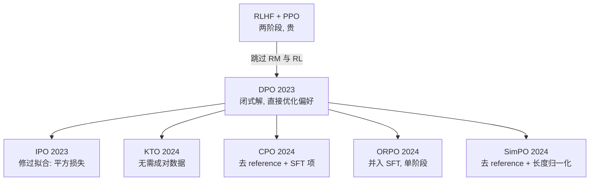

# 偏好优化（DPO 家族）总览

> **一句话**：DPO 证明了「不训 reward model、不跑 RL」也能做偏好对齐；之后的变体围绕「去 reference、长度偏置、非成对数据」继续演化。

::: warning 状态
🚧 本页为占位大纲，正文尚未撰写。
:::

## 家族演化图

## 变体对比

| 方法 | Reference model | 数据形式 | 核心改动 |
| --- | --- | --- | --- |
| [DPO](/dpo/dpo) | 需要 | 成对 $(y_w, y_l)$ | BT 模型闭式解 |
| [IPO](/dpo/ipo) | 需要 | 成对 | 平方损失防过拟合 |
| [KTO](/dpo/kto) | 需要 | 单条 + 好/坏标签 | 前景理论价值函数 |
| [ORPO](/dpo/orpo) | 不需要 | 成对 | SFT + odds ratio 单阶段 |
| [SimPO](/dpo/simpo) | 不需要 | 成对 | 长度归一化 + margin |
| [CPO](/dpo/cpo) | 不需要 | 成对 | 似然上界近似 + SFT 项 |

## TODO

- [ ] 选型建议：何时 DPO 够用、何时上 RL
- [ ] 共同的坑：chosen 概率同时下降、长度膨胀、分布偏移
- [ ] 与 RLHF 的理论联系（同一 KL 约束目标的不同解法）
