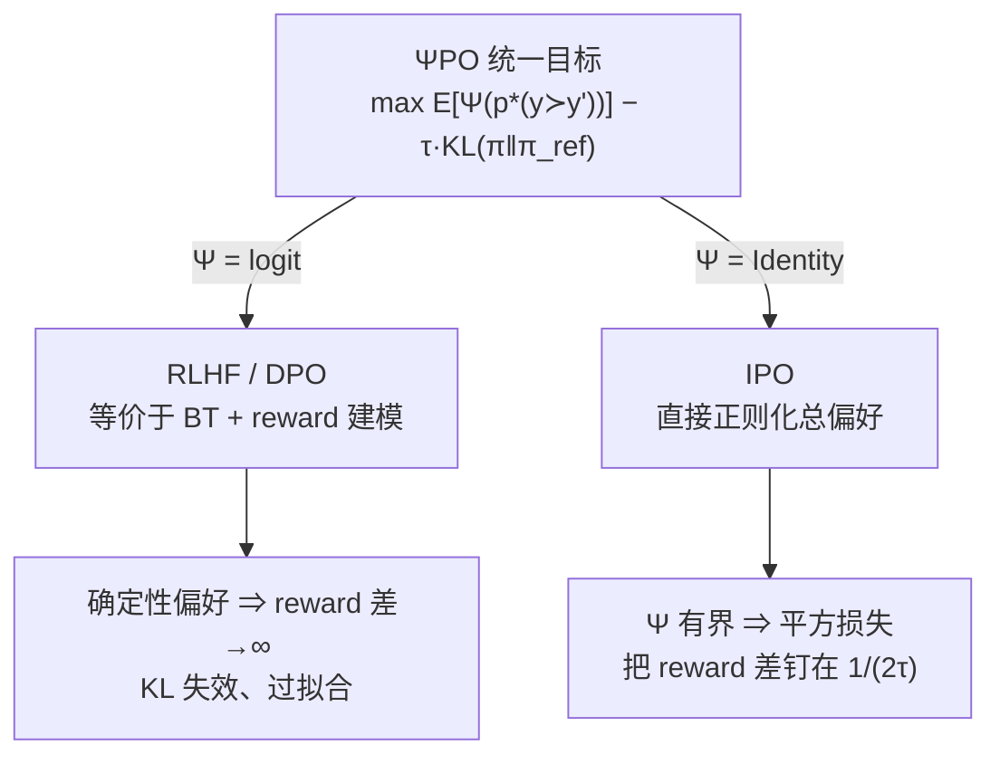

# IPO（Google DeepMind）：用 ΨPO 统一框架给 DPO 的「无界放大」装上刹车

**📄 [A General Theoretical Paradigm to Understand Learning from Human Preferences](https://arxiv.org/abs/2310.12036)**

2023-10 · Google DeepMind（AISTATS 2024）

**一句话**：先把 RLHF 与 [DPO](/dpo/dpo) 统一成同一个「对偏好概率做非线性变换 $\Psi$」的目标 ΨPO，指出 DPO 取 $\Psi=\text{logit}$ 时在「近乎确定性」的偏好下会把隐式 reward 差推向无穷、KL 正则失效；再取 $\Psi=\text{Identity}$ 得到 IPO，用平方损失把 reward 差**钉**在一个固定有限目标上，从根上消除过拟合。

::: details 📖 论文原文 Abstract（英文）
The prevalent deployment of learning from human preferences through reinforcement learning (RLHF) relies on two important approximations: the first assumes that pairwise preferences can be substituted with pointwise rewards. The second assumes that a reward model trained on these pointwise rewards can generalize from collected data to out-of-distribution data sampled by the policy. Recently, Direct Preference Optimisation (DPO) has been proposed as an approach that bypasses the second approximation and learn directly a policy from collected data without the reward modelling stage. However, this method still heavily relies on the first approximation. In this paper we try to gain a deeper theoretical understanding of these practical algorithms. In particular we derive a new general objective called **ΨPO** for learning from human preferences that is expressed in terms of pairwise preferences and therefore bypasses both approximations. This new general objective allows us to perform an in-depth analysis of the behavior of RLHF and DPO (as special cases of ΨPO) and to identify their potential pitfalls. We then consider another special case for ΨPO by setting Ψ simply to **Identity**, for which we can derive an efficient optimisation procedure, prove performance guarantees and demonstrate its empirical superiority to DPO on some illustrative examples.
:::

**相关**：[偏好优化总览](/dpo/) · [DPO](/dpo/dpo) · [SimPO](/dpo/simpo) · [CPO](/dpo/cpo) · [ORPO](/dpo/orpo) · [KTO](/dpo/kto) · [符号约定](/guide/notation)


> 图源：Azar et al., *A General Theoretical Paradigm to Understand Learning from Human Preferences*（arXiv:2310.12036）Figure 1——数据集 $\mathcal{D}_1$（全序）上 IPO vs DPO 的动作概率学习曲线（用于学习注解，版权归原作者）。

## 动机与创新点：BT 假设遇上确定性偏好，KL 正则会悄悄失效

把「从人类偏好中学习」建模成一个**带 KL 约束的离线 contextual bandit**：给定上下文 $x$，从 reference 策略 $\mu$ 采两条候选 $y,y'$，人类标注谁更好（$y_w\succ y_l$），目标是学一个策略，既最大化「被人偏好」又不要偏离已知的 $\pi_{\text{ref}}$ 太远——KL 正则的作用正是"to avoid model drift"。

主流做法 RLHF 与 [DPO](/dpo/dpo) 都依赖一个强假设：**成对偏好可以被替换成逐点 reward（pointwise reward / Elo 分），并服从 Bradley-Terry（BT）模型** $p(y\succ y')=\sigma(r(y)-r(y'))$。作者指出这个假设在偏好近乎确定时会出大问题，并把问题讲清楚需要先有一个统一视角。

**核心论点：把 RLHF 和 DPO 都看成同一个目标的特例。** 论文提出 **ΨPO**——最大化「偏好概率经一个非递减映射 $\Psi$ 变换后」的期望，减 KL 正则：

$$\max_\pi\ \underset{\substack{x\sim\rho,\,y\sim\pi(\cdot|x)\\ y'\sim\mu(\cdot|x)}}{\mathbb{E}}\big[\Psi\big(p^*(y\succ y'|x)\big)\big]\ -\ \tau\, D_{\mathrm{KL}}(\pi\,\|\,\pi_{\text{ref}})$$

它"is expressed in terms of pairwise preferences and therefore bypasses both approximations"——直接写在成对偏好上，不必先过 reward 模型。取不同的 $\Psi$ 就回到熟悉的算法：$\Psi=\text{logit}$（即 $\Psi(q)=\log\frac{q}{1-q}$）且 BT 成立时，ΨPO 的最优解与 RLHF、DPO **完全重合**（Proposition 1）。

**问题出在 $\Psi=\text{logit}$ 的无界性。** logit 把 $p\to1$ 映到 $\Psi(p)\to+\infty$。一旦某对偏好是确定性的 $p^*(y\succ y')=1$，BT 模型就要求 $r(y)-r(y')\to+\infty$；代入 ΨPO 的闭式最优解，会得到 $\pi^*(y')=0$——**无论 KL 系数 $\tau$ 取多大**。原文：

> the strength of the KL-regularisation becomes weaker and weaker the more deterministic the preferences.

更糟的是有限数据下：即便真实偏好只是 $p^*=0.8$，样本少时经验估计也很容易变成 $\hat p=1$，于是模型照样被推向确定性策略。在 LLM 这种**上下文/动作空间极大**的场景里，这正是「DPO 训久了 chosen 和 rejected 概率一起塌、通用能力退化」的理论根源。作者还点出一个反直觉的对照：RLHF 因为**显式训练并隐式欠拟合（underfit）reward 函数**，反而保住了对 $\pi_{\text{ref}}$ 的正则；DPO 省掉 reward 建模的同时，也丢掉了这层正则保护。

**关键创新**：

- **ΨPO 统一框架**：把 RLHF、DPO 收编为「对偏好概率做非线性变换 $\Psi$ + KL 正则」的特例，得以正面分析它们的失效模式（Proposition 1 给出三者最优解一致的条件）。
- **诊断出 DPO 的结构性弱点**：弱正则 + 过拟合源自 $\Psi=\text{logit}$ 的**无界性**叠加「不训练显式 reward」，在确定性/小样本偏好下 KL 约束被架空。
- **IPO = ΨPO 取 $\Psi=\text{Identity}$**：用**有界**映射保证 KL 正则始终生效，且"by construction bypasses the BT modelisation assumption"——绕开了 BT 假设本身。
- **可落地的采样损失**：把 IPO 化成一个 root-finding 问题，推出一个**只需偏好数据集、无需 reward 模型、无需 RL** 的平方损失（Algorithm 1），并证明全局/局部最优唯一（Theorem 2）。
- **toy bandit 反例**：在最小可控的 bandit 上直观展示 DPO 何时塌缩、IPO 如何受 $\tau$ 调控。

## 方法：从 ΨPO 统一目标推到 IPO 的平方损失



### ΨPO 的闭式最优解：为什么 logit 会爆

在 BT 假设下，ΨPO（含 RLHF/DPO）的最优策略有解析形式：

$$\pi^*(y)\ \propto\ \pi_{\text{ref}}(y)\,\exp\!\Big(\tau^{-1}\,\mathbb{E}_{y'\sim\mu}\big[\Psi(p^*(y\succ y'))\big]\Big)$$

这是标准的 KL 正则 softmax 解（附录 A.1 有完整推导）。关键观察："small increases in preference probabilities already close to 1 are just as incentivized as larger increases in preference probabilities around 50%"——logit 变换让「把 0.99 推到 0.999」和「把 0.5 推到 0.6」获得**同等激励**，于是模型有动力把已经压倒性的偏好继续往极端拉。

> 举例：只有两个动作、$p^*(y_1\succ y_2)=1$、$\pi_{\text{ref}}$ 与 $\mu$ 都是均匀分布。DPO（$\Psi=\text{logit}$）会收敛到确定性策略 $\pi^*(y_1)=1,\ \pi^*(y_2)=0$——**哪怕 $\tau$ 开到极大**，结果都与均匀的 $\pi_{\text{ref}}$ 南辕北辙。这就是「KL 正则被架空」的最小演示。

### IPO：取 $\Psi=\text{Identity}$，直接正则化「总偏好」

既然病根是 $\Psi$ 无界，自然的修法就是换一个**有界**的 $\Psi$。最朴素的选择是恒等映射 $\Psi=\text{Identity}$（这也是 **I**dentity-**PO** 名字的由来），ΨPO 退化为对「总偏好」的直接正则优化：

$$\max_\pi\ p^*_\rho(\pi\succ\mu)\ -\ \tau\, D_{\mathrm{KL}}(\pi\,\|\,\pi_{\text{ref}})$$

其中 $p^*(y\succ\mu)=\mathbb{E}_{y'\sim\mu}[p^*(y\succ y')]$ 是动作 $y$ 对整个 reference 分布的期望胜率。因为 $\Psi$ 现在有界，确定性偏好不再把目标推向无穷，"the KL regularisation in Equation 6 remains effective even in the regime of $\{0,1\}$-valued preferences"。

回到上面那个两动作的例子：IPO 下 $p^*(y_1\succ\mu)=3/4,\ p^*(y_2\succ\mu)=1/4$，代入最优解得 $\pi^*(y_1)=\sigma(0.5\,\tau^{-1})$。于是 $\tau\to\infty$ 时 $\pi^*\to$ 均匀 $\pi_{\text{ref}}$，$\tau\to0$ 时才退化到确定性——"The regularisation parameter $\tau$ can now actually be used to control how close to $\pi_{\text{ref}}$ we are."（$\tau$ 终于真正握住了"离 reference 多近"这根杠杆）。

### 采样损失：把 root-finding 化成一个平方回归

直接优化总偏好需要估计 reward $r(y)=p^*(y\succ\mu)$ 再做 RL，"both using RL and estimating the reward model can be costly"。作者仿照 DPO，把最优解改写成一组 root-finding 方程，再凑成单个优化目标。定义隐式 reward 差

$$h_\pi(y,y')=\log\frac{\pi(y|x)\,\pi_{\text{ref}}(y'|x)}{\pi(y'|x)\,\pi_{\text{ref}}(y|x)}$$

它正是 [DPO](/dpo/dpo) 那个「policy 对 reference 的对数似然比之差」。最优策略要满足 $h_{\pi^*}(y,y')=\tau^{-1}\big(p^*(y\succ\mu)-p^*(y'\succ\mu)\big)$。利用 $y,y'$ 的对称性和「每个偏好对 $(y_w,y_l)$ 同时贡献 $I=1$ 与 $I=0$ 两项」这一方差缩减技巧（Proposition 3），最终化简成一个干净的**平方损失**（Eq. 17）：

$$\mathcal{L}_{\text{IPO}}=\mathbb{E}_{(y_w,y_l)\sim D}\left[\Big(h_\pi(y_w,y_l)-\frac{\tau^{-1}}{2}\Big)^2\right]$$

**这就是 IPO 与 DPO 的核心分水岭**：DPO 是 $-\log\sigma(\tau\,h_\pi)$，logistic 损失对 $h_\pi$ 单调递减，**永远奖励更大的差**；IPO 是 $(h_\pi-\frac{1}{2\tau})^2$，平方损失在 $h_\pi=\frac{1}{2\tau}$ 处取最小，把差**钉**在一个固定的目标 margin 上——一旦达到，继续增大反而被惩罚。论文一句话点透：

> IPO learns from preferences dataset simply by regressing the gap between log-likelihood ratios $\log(\pi(y_w)/\pi(y_l))$ and $\log(\pi_{\text{ref}}(y_w)/\pi_{\text{ref}}(y_l))$ to $\frac{\tau^{-1}}{2}$.

作者证明（Theorem 2）：当 $\mathrm{Supp}(\mu)=\mathrm{Supp}(\pi_{\text{ref}})$ 时，这个损失关于 logits 是（除常值平移外）严格凸的，故 $\pi^*$ 是**唯一**全局/局部极小点——没有 DPO 那种被无穷 reward 拽走的坏极值。

整套流程就是 Algorithm 1：


**$\tau$ 的作用**：$\tau$ 是正则强度，目标 margin $=\frac{1}{2\tau}$。$\tau$ 越大 → 目标 margin 越小 → 对偏离 reference 越保守（更强 KL 约束）；$\tau$ 越小 → 允许的 chosen/rejected 差距越大 → 行为越接近激进的 DPO。"the weaker the regularisation becomes, the higher would be the log-likelihood ratio of $y_w$ to $y_l$."

### TRL 中的实现要点

IPO 在 [TRL](https://github.com/huggingface/trl) 里通过 `DPOTrainer(loss_type="ipo")` 选择，复用 DPO 的双前向与 reference 处理：

```python
# pi_logratios  = (logp_w - logp_l) on policy
# ref_logratios = (logp_w - logp_l) on reference
h = (pi_w - pi_l) - (ref_w - ref_l)   # = h_theta，隐式 reward 差（TRL 中 logp 已按 completion 长度归一化）
loss = ((h - 1.0 / (2 * tau)) ** 2).mean()
```

关键细节：

- **目标 margin 是 $\frac{1}{2\tau}$，但 TRL 的超参名叫 `beta`，语义对应这里的 $\tau$**——即 TRL 的 `beta` 越大、目标 margin 越小、约束越强，与 DPO 的 `beta`（越大约束越强是通过 logistic 的温度实现）方向看似一致、但作用点完全不同，迁移时务必核对。
- **仍需 reference model**：IPO 没有去掉 $\pi_{\text{ref}}$，双前向开销与 DPO 相同；它解决的是**损失形状**问题，不是显存问题。
- **TRL 实现对 logprob 做长度归一化**：在 `loss_type="ipo"` 下，TRL 会把 completion 的 logprob 除以其 token 数（per-token 平均）再算 $h_\theta$。TRL 维护者说明此选择是与 IPO 作者确认过的。需要与 [SimPO](/dpo/simpo) 对照时：二者都做了长度归一化，区别在于 IPO 的归一化是实现层引入（原论文未显式讨论）且仍保留 reference，SimPO 的长度归一化是方法定义本身、并彻底去掉 reference。

## 实验结果：两个 toy bandit 反例，直观看 DPO 塌缩 / IPO 受控

论文不在 LLM 上跑评测，而是用**最小可控的 bandit 实验**直接验证理论：动作空间 $\mathcal{Y}=\{y_a,y_b,y_c\}$，策略参数化为 $\pi_\theta(y_i)=\mathrm{softmax}(\theta)_i$，用 Adam（lr 0.01、batch 9）跑 18000 步，每组超参重复 10 个种子取均值 + 95% 置信区间。

### 设定一·$\mathcal{D}_1$（全序）：IPO 不变贪心

采样三个偏好得 $\mathcal{D}_1=\{(y_a,y_b),(y_b,y_c),(y_a,y_c)\}$，构成一个完整的全序 $y_a\succ y_b\succ y_c$。

- **DPO**："always converges to the deterministic policy for all values of $\tau$"——$\pi(y_a)\to1$、其余 $\to0$，无论正则多强都无视 $\pi_{\text{ref}}$（上方 Figure 1 左列）。
- **IPO**：正则一强就把策略拉回均匀附近，"prevent the policy from becoming greedy when the regularisation is strong"（Figure 1 右列，$\tau=0.5/1.0$ 明显不塌）。

### 设定二·$\mathcal{D}_3$（含未观测动作对）：IPO 不排除动作

$\mathcal{D}_3=\{(y_a,y_b),(y_b,y_a)\}$——只观测到 $y_a/y_b$ 互有胜负，$y_c$ 那一对完全没被观测。这种「大动作空间 + 小数据集，某些动作只被采到一次甚至从没赢过」的情形在真实数据里**更常见**。


> 图源：Azar et al., *A General Theoretical Paradigm to Understand Learning from Human Preferences*（arXiv:2310.12036）Figure 2——数据集 $\mathcal{D}_3$（含未观测动作对）上 IPO vs DPO 的动作概率学习曲线（用于学习注解，版权归原作者）。

DPO 把从没赢过的 $y_c$ 概率压到 0（"DPO will sets its probability to 0 regardless of $\tau$"），而 IPO 出于"safety"考虑随 $\tau$ 增大逐步保留 $y_c$ 的概率、贴近 $\pi_{\text{ref}}$。作者据此下结论："those minimal experiments are sufficient to prove that IPO is better suited to learn from sampled preferences than DPO."

### 看榜须知

这些是**人工构造的 toy bandit 例子**，目的是隔离并放大理论性质，**不是 LLM 规模的 benchmark**。论文自己也把「scale those experiments to more complex settings such as training language models」列为 future work。后续社区在真实 LLM 偏好对齐上的复现普遍显示：**理论上更稳 ≠ 实测一定更好**（见下节）。换言之，这两张图证明的是"IPO 在确定性/稀疏偏好下行为更可控"，而非"IPO 在通用对齐任务上一定胜过调好的 DPO"。

## 在 DPO 偏好优化谱系里的位置

**与 DPO 的核心对照**：

| 维度 | DPO | IPO |
| --- | --- | --- |
| ΨPO 中的变换 $\Psi$ | $\Psi=\text{logit}$（无界） | $\Psi=\text{Identity}$（有界） |
| 是否依赖 BT 假设 | 是 | **否**（by construction 绕开） |
| 损失形式 | $-\log\sigma(\beta\, h_\theta)$ | $\big(h_\theta-\frac{1}{2\tau}\big)^2$ |
| 对 reward 差 $h_\theta$ 的偏好 | 越大越好（单调递减损失） | 钉在固定目标 $\frac{1}{2\tau}$ |
| 确定性/稀疏偏好下 | reward 差 $\to\infty$，KL 约束被架空、过拟合 | 有界，KL 约束始终生效，最优唯一 |
| 是否需要 reference | 需要 | 需要（未省显存，仅改损失形状） |
| 关键超参 | $\beta$ | $\tau$（TRL 里复用 `beta` 字段，语义相反，须核对） |

- **vs [DPO](/dpo/dpo)**：IPO 是 DPO 的「同框架兄弟」——共用 $h_\theta$ 这个隐式 reward 差，只把外层的 logistic 换成平方回归。理解 IPO 的最佳入口就是先吃透 DPO 的损失，再问「如果不让这个差越大越好、而是回归到一个目标会怎样」。
- **vs [SimPO](/dpo/simpo) / [CPO](/dpo/cpo) / [ORPO](/dpo/orpo) / [KTO](/dpo/kto)**：它们都在回应「DPO 无界放大」这一共性病。IPO 用**固定目标 margin**收口；SimPO 用 $\gamma$ 目标 margin **并去掉 reference**；CPO/ORPO 加 **SFT/odds 项**当锚；KTO 改用**前景理论的逐样本效用**、连成对偏好都不要。把 IPO 放进这条谱系，它的独特性在于**有完整的统一理论（ΨPO）与唯一性证明**做背书。
- **调参与实践经验**：
  - **$\tau$**：常见取值使目标 margin $\frac{1}{2\tau}$ 落在 $0.1\sim1.0$ 量级（以 TRL 的 `beta` 表示约 $0.1\sim1.0$）。从较强约束（小 margin）起调更安全。
  - **诊断信号**：若 DPO 训练出现 chosen 与 rejected logprob **一起急剧下降**、留出集质量回退，正是论文所诊断的「确定性偏好下 KL 失效」征兆，可把 IPO 当作「带刹车」的替代实验，看目标 margin 能否换来更稳的曲线。
  - **务实边界**：多个公开评测显示，在常规标注质量与中等数据量下，IPO 相比调好的 DPO **并无稳定优势、有时略逊**——它的价值集中在**偏好高度确定、且已观察到 DPO 明显过拟合/塌缩**的场景。理论漂亮是真，万灵药则未必。
