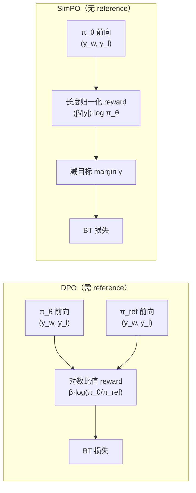

# SimPO（Princeton / UVA）：去掉 reference model 的长度归一化偏好优化

**📄 [SimPO: Simple Preference Optimization with a Reference-Free Reward](https://arxiv.org/abs/2405.14734)**

2024-05 · University of Virginia / Princeton Language and Intelligence (PLI) · [代码](https://github.com/princeton-nlp/SimPO)

**一句话**：把 [DPO](/dpo/dpo) 的隐式 reward 换成「长度归一化的平均对数概率」，去掉 reference model，再加一个目标 margin $\gamma$——让训练目标直接对齐生成时的打分度量，同时从根上抑制长度膨胀，做到更简单、更省、还更强。

::: details 📖 论文原文 Abstract（英文）
Direct Preference Optimization (DPO) is a widely used offline preference optimization algorithm that reparameterizes reward functions in reinforcement learning from human feedback (RLHF) to enhance simplicity and training stability. In this work, we propose **SimPO**, a simpler yet more effective approach. The effectiveness of SimPO is attributed to a key design: using the *average* log probability of a sequence as the implicit reward. This reward formulation better aligns with model generation and eliminates the need for a reference model, making it more compute and memory efficient. Additionally, we introduce a **target reward margin** to the Bradley-Terry objective to encourage a larger margin between the winning and losing responses, further improving the algorithm's performance. We compare SimPO to DPO and its recent variants across various state-of-the-art training setups, including both base and instruction-tuned models such as Mistral, Llama 3, and Gemma 2. We evaluate on extensive chat-based evaluation benchmarks, including AlpacaEval 2, MT-Bench, and Arena-Hard. Our results demonstrate that SimPO consistently and significantly outperforms existing approaches without substantially increasing response length. Specifically, SimPO outperforms DPO by up to 6.4 points on AlpacaEval 2 and by up to 7.5 points on Arena-Hard. Our top-performing model, built on Gemma-2-9B-it, achieves a 72.4% length-controlled win rate on AlpacaEval 2, a 59.1% win rate on Arena-Hard, and ranks 1st on Chatbot Arena among <10B models with real user votes.
:::

**相关**：[DPO](/dpo/dpo) · [CPO](/dpo/cpo) · [IPO](/dpo/ipo) · [ORPO](/dpo/orpo) · [符号约定](/guide/notation)


> 图源：Meng et al., *SimPO: Simple Preference Optimization with a Reference-Free Reward*（arXiv:2405.14734）Figure 1——左框对比两种 reward 形式、右框给出 AlpacaEval 2 与 Arena-Hard 上 SimPO 对 DPO 的稳定增益（用于学习注解，版权归原作者）。

## 动机与创新点：reward 形式与生成度量对齐，顺手扔掉 reference model

SimPO 的出发点是审视 [DPO](/dpo/dpo) 隐式 reward 的几处「不优雅」。DPO 用闭式 reward $r(x,y)=\beta\log\frac{\pi_\theta(y|x)}{\pi_{\text{ref}}(y|x)}+\beta\log Z(x)$ 重参数化，其中 $\log\pi_\theta(y|x)=\sum_t\log\pi_\theta(y_t|x,y_{<t})$ 是**序列求和**的对数概率。问题在于：

**第一，训练用的 reward 与生成用的度量不一致。** 模型在解码时（greedy / beam search / 采样）给候选排序，实际用的更接近**平均**对数概率（长度归一化后的得分）。论文直言这是 "a mismatch between the reward optimized during training and the log-likelihood optimized during inference"——训练时把某个回答排在前面，生成时不一定真的更倾向它。作者实测发现，DPO 训完后**只有约 50% 的训练三元组**满足「reward 排序」与「平均 logprob 排序」一致（Figure 4b），与"DPO 模型的平均 logprob 排序准确率接近随机"这一并行观察吻合。

**第二，序列求和的对数概率引入长度偏置。** 每个 token 的 logprob 都是负数，求和让长回答总分天然偏低。当 $y_w$ 比 $y_l$ 长时，"optimizing the summed log probability as a reward forces the model to artificially inflate probabilities for longer sequences"——这种过度补偿会推高退化风险，常见后果是 DPO 训完回答显著变长（reward hacking 的一种）。

**第三，reference model 是纯负担。** 它多占一份显存、每步多一次前向，存在的唯一意义是提供 KL 锚点。SimPO 想问：能不能把锚点的作用换种更便宜的方式实现？

SimPO 的答案是：**用长度归一化的平均对数概率直接当 reward、去掉 $\pi_{\text{ref}}$；再用一个固定的目标 margin $\gamma$ 来替代「锚点」的角色**，要求 chosen 不只是比 rejected 高，而要高出 $\gamma$。

**关键创新**：

- **Reference-free 的长度归一化 reward**：reward $=\frac{\beta}{|y|}\log\pi_\theta(y|x)$，即平均（per-token）logprob，直接对齐生成时的 length-normalized log-likelihood 度量，且无需任何 reference 前向。
- **目标 reward margin $\gamma$**：在 Bradley-Terry 目标里加一个 $\gamma>0$，强制 chosen 比 rejected 至少高出 $\gamma$，把决策边界往里推、提升泛化与 reward accuracy。
- **更简单更省**：去掉 reference model，显存与计算各省接近一份模型/一次前向（实测约省 10% 显存、20% 运行时）。
- **效果反而更强**：在 Mistral / Llama-3 / Gemma-2 多套 base 与 instruct 设置上一致超过 DPO 及 IPO / ORPO / R-DPO 等变体，且未显著增加回答长度。

## 方法：长度归一化平均 logprob + 目标 margin，去掉 reference model

### 先回顾 DPO：对数比值当 reward

DPO 把 RLHF 的 reward 写成策略与参考策略的对数比值，代入 Bradley-Terry 排序目标 $p(y_w\succ y_l\mid x)=\sigma\!\left(r(x,y_w)-r(x,y_l)\right)$，得到无需显式 reward model 的损失：

$$
\mathcal{L}_{\text{DPO}}(\pi_\theta;\pi_{\text{ref}}) = -\mathbb{E}_{(x,y_w,y_l)}\left[\log\sigma\!\left(\beta\log\frac{\pi_\theta(y_w|x)}{\pi_{\text{ref}}(y_w|x)} - \beta\log\frac{\pi_\theta(y_l|x)}{\pi_{\text{ref}}(y_l|x)}\right)\right]
$$

这里 $\pi_{\text{ref}}$ 通常是 SFT 模型，既当 KL 锚点又（隐式地）抵消一部分长度偏置——SimPO 要在不要它的前提下把这两件事都办好。

### 核心一：长度归一化的 reference-free reward

朴素去 reference 的做法是直接拿**序列求和**的 logprob 当 reward，但这会触发长度偏置。SimPO 改用**平均**对数概率：

$$
p_\theta(y\mid x) = \frac{1}{|y|}\log\pi_\theta(y\mid x) = \frac{1}{|y|}\sum_{i=1}^{|y|}\log\pi_\theta(y_i\mid x,y_{<i})
$$

论文指出这个量"is commonly used for ranking options in beam search and multiple-choice tasks"——正是解码时给候选打分的度量。于是 SimPO 把它（乘上缩放系数 $\beta$）直接当 reward：

$$
r_{\text{SimPO}}(x,y) = \frac{\beta}{|y|}\log\pi_\theta(y\mid x) = \frac{\beta}{|y|}\sum_{i=1}^{|y|}\log\pi_\theta(y_i\mid x,y_{<i})
$$

其中 $|y|$ 是回答的**有效 token 数**（去掉 prompt、去掉 padding），$\beta$ 控制 reward 差值的缩放。长度归一化 $\frac{1}{|y|}$ 一举两得：把 reward 变成 per-token 量纲、直接对齐生成度量；并消掉「序列越长总分越低」的偏置——作者强调"removing the length normalization term from the reward formulation results in a bias toward generating longer but lower-quality sequences"。这样既扔掉了 $\pi_{\text{ref}}$，又省了显存与计算。

> 举例：同一个 prompt 下，回答 A 有 50 个 token、总 logprob $-40$，回答 B 有 200 个 token、总 logprob $-100$。按序列求和，A（$-40$）"看起来"远好于 B（$-100$），优化器会被诱导去拔高长回答的概率；按 SimPO 的平均值，A 是 $-0.8$/token、B 是 $-0.5$/token——长度被抵消，谁的 per-token 置信更高一目了然，这也正是解码时排序候选用的口径。

### 核心二：目标 reward margin γ

去掉 $\pi_{\text{ref}}$ 后，损失只看 $\pi_\theta$ 自身在 chosen / rejected 上的差。若只要求差大于 0，模型可以靠把两者都压低、只留微弱差距来「偷懒」。SimPO 在 Bradley-Terry 目标里引入目标 margin $\gamma>0$：

$$
p(y_w\succ y_l\mid x) = \sigma\!\left(r(x,y_w) - r(x,y_l) - \gamma\right)
$$

它要求 winning response 的 reward "exceeds the reward for the losing response by at least $\gamma$"。作者点出这一项在 Bradley-Terry 模型里被称作 **home advantage**，且"the margin between two classes is known to influence the generalization capabilities of classifiers"——把决策边界往里推，相当于给优化施加一个最小置信间隔。实测中 reward accuracy 随 $\gamma$ 单调上升，但生成质量（AlpacaEval 2 win rate）先升后降：$\gamma$ 太大会"flatten both distributions and reduce the average log likelihood of winning sequences"，最终拖累质量，存在一个"trade-off between accurately approximating the true reward distribution and maintaining a well-calibrated likelihood"。


> 图源：Meng et al., *SimPO: Simple Preference Optimization with a Reference-Free Reward*（arXiv:2405.14734）Figure 3——γ 对 reward accuracy / win rate、reward 差分布、chosen logprob 分布的影响（用于学习注解，版权归原作者）。

> 举例：取 $\beta=2$、$\gamma=0$ 时，只要 chosen 的 per-token logprob 比 rejected 高哪怕 $0.001$，损失就已接近饱和、几乎不再推动二者拉开；把 $\gamma$ 提到 $1.0$，模型必须让 $\beta(r_w-r_l)$ 至少达到 $1.0$ 才"算赢"，于是它会持续优化直到差距足够大——区分度被强制拉开。但若 $\gamma$ 提到 $2.4$，大量样本根本满足不了 margin、梯度饱和，反而把 chosen 概率一起压低，质量回落。

### 核心三：SimPO 目标函数

把长度归一化 reward 代入带 margin 的 Bradley-Terry 目标，得到 SimPO 的最终损失：

$$
\mathcal{L}_{\text{SimPO}}(\pi_\theta) = -\mathbb{E}_{(x,y_w,y_l)\sim\mathcal{D}}\left[\log\sigma\!\left(\frac{\beta}{|y_w|}\log\pi_\theta(y_w|x) - \frac{\beta}{|y_l|}\log\pi_\theta(y_l|x) - \gamma\right)\right]
$$

对照 DPO 损失，差异只在「把 $\beta\log\frac{\pi_\theta}{\pi_{\text{ref}}}$ 换成 $\frac{\beta}{|y|}\log\pi_\theta$，并多减一个 $\gamma$」——形式更简单，却同时解决了 reference 负担、训练-推理错位、长度偏置三件事。



**两处设计都不可省（消融，以原文为准）。** 论文 Table 5 在 Mistral-Base 上拆开看：去掉长度归一化（w/o LN）时 AlpacaEval 2 LC 从 **21.5 掉到 11.9**，且"leads to the generation of long and repetitive patterns"——这是负面影响最大的一刀；把 $\gamma$ 设为 0 时也从 **21.5 掉到 16.8**，证明 margin 确有贡献。

### 为什么长度归一化能防长度膨胀

Bradley-Terry 目标本质是优化 reward 差 $\Delta r=r(x,y_w)-r(x,y_l)$ 超过 $\gamma$。作者把 $\Delta r$ 与长度差 $\Delta l=|y_w|-|y_l|$ 摆在一起看（Figure 2a）：带 LN 的 SimPO 对**所有**长度差的样本对都给出正的 reward 差并稳定改善 margin；而去掉 LN 后，一旦 winning response 比 losing 短，reward 差就变负——"the model learns poorly for these instances"，于是被迫靠拉长输出来博取高 reward。Figure 2b/2c 进一步用平均 logprob 与回答长度的 Spearman 相关佐证：SimPO 的相关系数仅 $\rho=0.34$（接近 SFT 模型的健康水平），去掉 LN 后飙到 $\rho=0.82$——强正相关正是"length exploitation"的指纹。


> 图源：Meng et al., *SimPO: Simple Preference Optimization with a Reference-Free Reward*（arXiv:2405.14734）Figure 2——长度归一化如何阻止长度利用（用于学习注解，版权归原作者）。

### 不用 KL 正则，为何也不塌缩

SimPO 没有 $\pi_{\text{ref}}$ 这条 KL 缰绳，但作者论证"a combination of practical factors ensures effective learning from preference data while maintaining generalization"，从而经验上对 reference 仍保持较低 KL 散度。三个因素：**(1) 较小的学习率；(2) 覆盖多领域、多任务的偏好数据；(3) LLM 本身从新数据学习而不灾难性遗忘旧知识的内在鲁棒性。** Figure 5a 实测：SimPO 训练时对 SFT 模型的 KL 散度"reasonably small"，且增大 $\beta$ 会进一步压低 KL——这解释了它为何能在没有显式约束下仍稳住通用能力。

### 实现要点（TRL `CPOTrainer`）

SimPO 在 TRL 中通过 `CPOTrainer(loss_type="simpo")` 提供，与 [CPO](/dpo/cpo) 共用一套去 reference 的代码路径。核心 loss 计算：

```python
# logps_w, logps_l: 序列求和的 logprob, 形状 [B]
# len_w, len_l:     回答有效 token 数 (不含 prompt 与 padding)
r_w = logps_w / len_w          # 长度归一化, 平均 logprob
r_l = logps_l / len_l
logits = beta * (r_w - r_l) - gamma
loss = -F.logsigmoid(logits).mean()
```

关键细节：

- **长度必须用回答的有效 token 数**：去掉 prompt 部分、去掉 padding，否则归一化失真。实践中等价于「对 response 区域、非 pad 位置的 per-token logprob 求平均」。
- **没有任何 reference 前向**：因此 SimPO 比 DPO 省掉接近一半的前向计算与一份模型显存，这是它「Simple」的直接收益。
- TRL 实现里 $\gamma$ 以 `simpo_gamma` 暴露；注意它是绝对量纲（per-token reward 的差），需与 $\beta$ 配合调。

## 实验结果：多套设置全面超 DPO，且不靠拉长回答

### 评测设置

- **底座 & 设置**：Llama-3-8B、Mistral-7B，各取 **Base** 与 **Instruct** 两种设置（Base 走 Zephyr 流程先在 UltraChat-200k 上 SFT，Instruct 直接用现成 instruct 模型当 SFT 起点并用其重生成偏好对，更接近 on-policy）；最强模型基于 **Gemma-2-9B-it** 配更强 reward model（ArmoRM-Llama3-8B）。
- **偏好数据**：UltraFeedback。
- **基准**：AlpacaEval 2（报 length-controlled LC 与 raw WR）、Arena-Hard v0.1（WR）、MT-Bench；并在 Chatbot Arena 上以真实用户投票验证。
- **基线**：DPO 及其变体 RRHF / SLiC-HF / IPO / CPO / KTO / ORPO / R-DPO。
- **超参**：$\beta\in[2.0,2.5]$、$\gamma\in[0.5,1.6]$ 普遍表现好（注意 $\gamma$ 在表里常以 $\gamma/\beta$ 的相对比值汇报）。

### 主结果（Table 4 / Table 1，以原文为准）

四套设置下，SimPO 在 AlpacaEval 2 与 Arena-Hard 上一致取得最佳（节选 LC win rate，单位 %）：

| 设置 | SFT | DPO | SimPO | SimPO − DPO |
| --- | --- | --- | --- | --- |
| Mistral-Base (7B) · AlpacaEval2 LC | 8.4 | 15.1 | **21.5** | +6.4 |
| Mistral-Base (7B) · Arena-Hard WR | 1.3 | 10.4 | **16.6** | +6.2 |
| Mistral-Instruct (7B) · AlpacaEval2 LC | 17.1 | 26.8 | **32.1** | +5.3 |
| Llama-3-Base (8B) · AlpacaEval2 LC | 6.2 | 18.2 | **22.0** | +3.8 |
| Llama-3-Instruct (8B) · AlpacaEval2 LC | 26.0 | 40.3 | **44.7** | +4.4 |
| Llama-3-Instruct (8B) · Arena-Hard WR | 22.3 | 32.6 | **33.8** | +1.2 |

- **最强模型 Gemma-2-9B-it-SimPO**：AlpacaEval 2 **LC 72.4 / WR 65.9**、Arena-Hard **59.1**，是当时 **<10B 最强开源模型**；在 Chatbot Arena 真实用户投票里把 Gemma-2-9B-it 从第 36 名推到第 25 名、**<10B 模型中排第一**。
- **总增益**：相比 DPO，AlpacaEval 2 最多 **+6.4**、Arena-Hard 最多 **+7.5**。
- **不靠拉长回答**：SimPO 的生成长度与 SFT / DPO 相当（Table 1 中 Gemma-2-9B-it-SimPO 长度 1833，与 GPT-4 Turbo 的 1802 同档），印证"minimal length exploitation"。
- **reward accuracy 更高**：留出集上 SimPO 的 reward 排序准确率一致高于 DPO（Figure 4c），说明其 reward 设计泛化更好。

### 效率：更省显存、更快

去掉 reference model 的直接收益在算力账本上（Mistral-Base，8×H100，原文 Figure 5c）：


> 图源：Meng et al., *SimPO: Simple Preference Optimization with a Reference-Free Reward*（arXiv:2405.14734）Figure 5c——去掉 reference model 后运行时与峰值显存均下降（用于学习注解，版权归原作者）。

> **看榜须知**：以上分数口径（LC vs WR、judge 模型、reward model、采样温度）各异，且 AlpacaEval 2 / Arena-Hard 均为模型评审、查询空间有限。论文自己也提示 MT-Bench 区分度差、不同方法差异多属噪声；跨方法直接比绝对值意义有限，应当作"同期同设置下相对 DPO 的增量"参考，一切以原文为准。

## 在 DPO / 偏好优化谱系里的位置

SimPO 属于"**offline、reference-free、对 DPO reward 形式动刀**"这一支。和 DPO 的核心异同：

| 维度 | DPO | SimPO |
| --- | --- | --- |
| Reference model | 需要 | 不需要 |
| 隐式 reward | 序列求和 logprob 的比值 | 长度归一化平均 logprob |
| 防塌缩 / 锚点 | 隐式 KL（靠 $\pi_{\text{ref}}$） | 目标 margin $\gamma$ + 小学习率等经验因素 |
| 长度偏置 | 残留，易导致回答变长 | 显式归一化缓解 |
| 显存 / 计算 | 高（两份模型，两次前向） | 低（一份模型，约省 10% 显存 / 18% 时间） |
| 跑飞风险 | 较低（有 KL 约束） | 较高（无显式约束，依赖 margin 与数据质量） |

横向对比同期工作：

- **vs [CPO](/dpo/cpo)**：两者都去 reference、都属"sequence-likelihood as reward"系。CPO 用**序列求和** logprob 并额外挂一个 SFT/BC 正则项，因此**没有长度归一化**——论文实测 CPO 生成的回答比 SimPO 平均**长约 50%**，长度利用更明显；SimPO 靠 LN 把这条堵上。二者在 TRL 里共用 `CPOTrainer` 代码路径，`loss_type` 切换。
- **vs [IPO](/dpo/ipo)**：IPO 也引入了类似 SimPO 的目标 reward margin，但它仍是 reference-based、且优化的是 reward 差的平方误差；论文指出"its full objective is not as effective as SimPO"——SimPO 把 margin 与 reference-free 的长度归一化 reward 组合起来，效果更好。
- **vs [ORPO](/dpo/orpo)**：ORPO 同样 reference-free，用 odds-ratio 项 + SFT 联合训练、可直接从 base 起步无需单独 SFT 阶段；SimPO 把它当作"recent reference-free objective"基线，在多数设置下超过它。
- **vs R-DPO**：R-DPO 是在 DPO 上加一个显式长度正则项来抑制长度利用；SimPO 用长度归一化"内生地"解决同一问题，无需额外正则超参。
- **vs RRHF / SLiC-HF / KTO**：RRHF 用长度归一化 logprob 做 ranking loss（与 SimPO reward 形式相近但是 hinge/ranking 框架），SLiC-HF 用序列 logprob + margin，KTO 走 prospect-theory 的 pointwise（可用非配对偏好）——SimPO 与它们的根本区别仍是"长度归一化平均 logprob + BT margin + 完全去 reference"这套组合。

### 调参与实践经验

- **$\beta$**：常见 2.0~2.5，明显高于 DPO 的 0.05~0.5。因为 reward 已被长度归一化到 per-token 量纲、数值变小，需要更大的 $\beta$ 把 logits 拉回有效区间。
- **$\gamma$**：常见 0.5~1.6（或以 $\gamma/\beta$ 比值感受相对强度）。太小退化为「只要 chosen 略高即可」、区分度不足；太大则大量样本无法满足 margin、梯度饱和、压低 chosen 概率反伤质量。
- **稳定性**：没有 $\pi_{\text{ref}}$ 这条 KL 缰绳，SimPO 更依赖数据质量与训练配置——建议在质量较高、与基座分布接近的数据上用，配合较小学习率、较少 epoch（1~2），并在留出集上盯紧通用指标防回退。
- **与 DPO/CPO 的取舍**：算力紧张、且已观察到 DPO 训出的回答异常变长时，SimPO 是首选；但它对超参更敏感、调参成本高于 DPO。生产中常见做法是先用 DPO 拿到稳定 baseline，再尝试 SimPO 看能否在更低开销下持平或超越。
