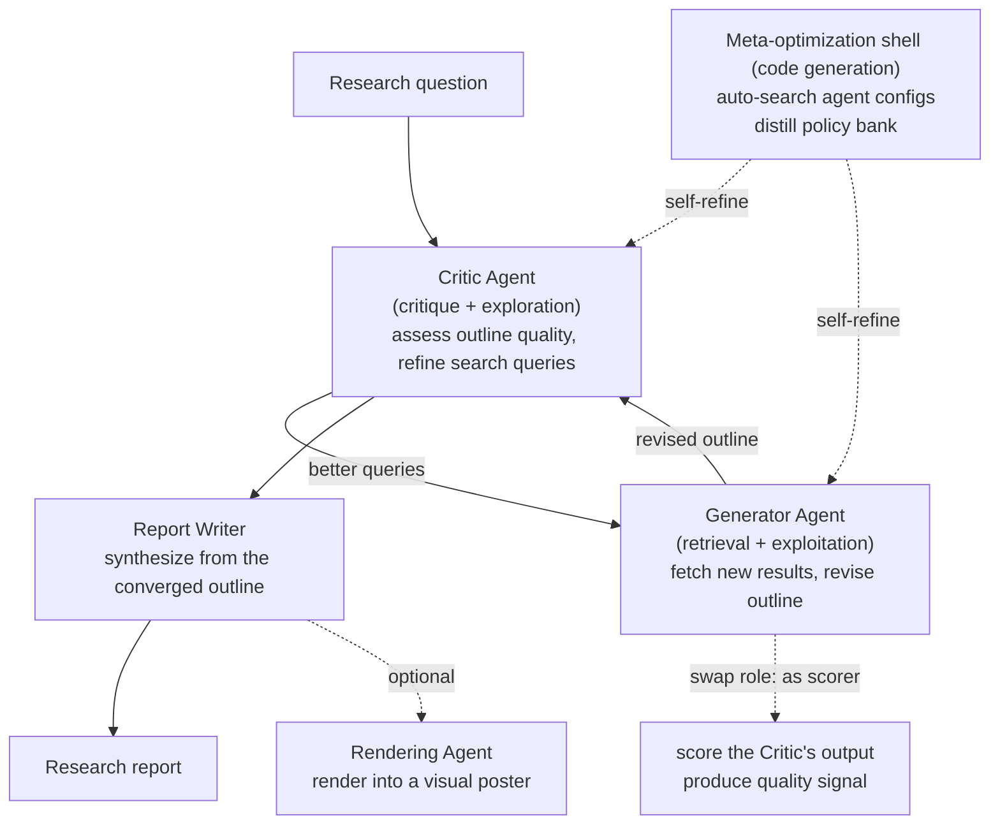

# AgentDisCo: Disentanglement and Collaboration for Open-ended Deep Research Agents

> **In one sentence**: AgentDisCo (Disentanglement and Collaboration) reframes open-ended deep research as an **adversarial optimization problem between information "exploration" and "exploitation"**, explicitly separating "what to search for" and "how to use what is found"—usually crammed into a single module—and handing them to **two agents (Critic / Generator) that play against each other and even swap roles to critique one another** in a collaborative loop; it then uses a **code-generated meta-optimization shell** to automatically search agent configurations and distill a reusable "policy bank", matching or surpassing leading closed-source systems on multiple deep research report benchmarks.
> Year proposed: 2026 (arXiv:2605.11732, v1 2026-05; v2 2026-06) · Authors: Jiarui Jin, Zexuan Yan, Shijian Wang, Wenxiang Jiao, Yuan Lu (affiliations per the original paper) · Evaluation backbone model: Gemini-2.5-Pro
> Prerequisite reading: [Deep Research overview](/en/agent/deep-research/) · [Multi-agent](/en/agent/multi-agent) · [STORM / Co-STORM](/agent/deep-research/storm)

## The problem: exploration and exploitation tangled together

Most deep research agents stuff "**discovering new information**" and "**organizing existing information into a report**" into the same module, done off-handedly by the same loop. AgentDisCo argues this is a structural flaw:

- **Exploration** cares about "what is still missing, where should I search next"—the goal is to broaden information coverage and fill knowledge gaps.
- **Exploitation** cares about "how to trim and organize existing material into a well-argued, high-quality report"—the goal is to converge and maximize quality.

These two tasks have naturally conflicting optimization directions: one wants to diverge, the other to converge. When tangled together, an agent tends to either search a lot but organize poorly, or write smoothly but cover shallowly, and is hard to tune in a targeted way. AgentDisCo's core claim is: **disentangle exploration and exploitation into independent components, then let them correct each other in an adversarial + collaborative manner**, improving both research quality and adaptability.

## Breaking down the framework

### ① Critic / Generator: two disentangled roles that also swap positions

- **Critic Agent (the judge, exploration-leaning)**: evaluates the quality of the current **outline**, identifies weaknesses and gaps, and accordingly **refines the search queries**—it is responsible for "this version isn't good enough yet, we should go search for these".
- **Generator Agent (the producer, exploitation-leaning)**: based on the refined queries, **fetches new results and revises the outline**—it is responsible for "absorbing the retrieved material into the structure".
- **Role swapping produces supervision signals**: the Generator is later **reused as a scoring agent**, evaluating the Critic's output in turn and generating quality signals. This "you grade me, I grade you" adversarial-collaborative closed loop lets both sides supply training/filtering signals to each other without human annotation—this is where the **Co (collaboration)** in "DisCo" lands.

The two alternate and iterate, and the outline gradually converges through "being critiqued → supplementary retrieval → revision → being critiqued again". It is finally handed to the **Report Writer**, which synthesizes a long report from the finalized outline; optionally, a **Rendering Agent** can then render the report into a visual poster.

### ② The meta-optimization shell and the policy bank: auto-tuning agents via code generation

AgentDisCo's second layer of innovation lies in "**who designs this agent configuration**". Instead of manually tuning prompts and workflows, it uses **code-generation agents (including the Claude-Code family) as a meta-optimization shell**, systematically exploring different agent configurations and distilling the designs that work into a **policy bank**—a structured, reusable "repository of design strategies". Subsequent tasks can directly draw validated strategies from the policy bank, enabling continuous self-refinement with **minimal human intervention**. This turns "tuning the agent" itself into an automatable, accumulable process.

### ③ GALA: a new benchmark that "mines" research needs from user browsing history

To make evaluation closer to real usage, the authors propose the **GALA (General AI Life Assistants)** benchmark: **mining latent research interests from a user's historical browsing behavior** and constructing research tasks accordingly—compared with "an examiner inventing questions out of thin air", GALA better reflects "what real users actually want to deep-research". The paper also builds an end-to-end product demo on top of this, **AutoResearch Your Interest**.

## Evaluation and performance (per the original paper)

AgentDisCo uses **Gemini-2.5-Pro** as its backbone and is evaluated on three **report-quality-oriented** deep research benchmarks:

| Benchmark | Focus |
| --- | --- |
| **DeepResearchBench** | Comprehensive deep research capability |
| **DeepConsult** | Consulting/advisory-style long-report quality |
| **DeepResearchGym** | Environment-grounded evaluation of deep research tasks |

The paper reports that its performance is **on par with, or even better than, leading closed-source deep research systems** (exact scores per the tables in the arXiv original). Note that these three benchmarks measure **report-writing quality** (structure, coverage, argumentation, citations), which differs in focus from browsing benchmarks like BrowseComp/GAIA that test "finding deeply buried information"—AgentDisCo sits toward the **"synthesizing the final report"** end of deep research work.

## Where it sits in the Deep Research lineage

- **vs STORM / Co-STORM**: both lean toward "organizing long reports", but [STORM](/agent/deep-research/storm) relies on multi-perspective questioning for pre-writing, whereas AgentDisCo **explicitly disentangles** exploration/exploitation and adds a layer of **code-generated meta-optimization** to auto-tune agents, achieving a higher degree of automation.
- **vs training-side deep research (Tongyi / REDSearcher)**: [Tongyi DeepResearch](/agent/deep-research/tongyi-deepresearch) and [REDSearcher](/agent/deep-research/redsearcher) build a long-horizon search model **from the training side**; AgentDisCo does not train the backbone but instead **performs agent orchestration and self-optimization on top of a strong general-purpose model (Gemini-2.5-Pro)**, complementing that line of work.
- **Multi-agent collaboration**: its Critic/Generator mutual-critique and role-swapping mechanism is a concrete instance of [multi-agent](/en/agent/multi-agent) ideas applied to the deep research setting. For the overall positioning, see the [Deep Research overview](/en/agent/deep-research/).

## References

- Jiarui Jin, Zexuan Yan, Shijian Wang, Wenxiang Jiao, Yuan Lu. *AgentDisCo: Towards Disentanglement and Collaboration in Open-ended Deep Research Agents.* arXiv:2605.11732, 2026-05 (v2 2026-06). <https://arxiv.org/abs/2605.11732>
- Evaluation benchmarks: DeepResearchBench, DeepConsult, DeepResearchGym; new benchmark GALA (General AI Life Assistants)
