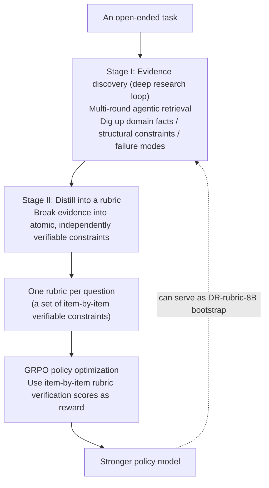

# DR-Rubric: Treating "Deep Research" as a Way to Generate RL Reward Rubrics

> **In one sentence**: DR-Rubric (Deep Research as Rubric) tackles the problem that "**open-ended reasoning and long-form generation tasks have no reliable automatic verification signal, making it hard to give RL a reward**" — instead of having humans hand-write the scoring rubric or having a model generate it in one shot, it **treats "building the rubric" itself as a deep research task**: it uses multi-round agentic retrieval to dig up domain facts, structural constraints, and typical failure modes, then distills them into individual **atomic, independently verifiable constraints** that serve as the reward signal for **GRPO** to train the policy. It also lets a small model (DR-rubric-8B) bootstrap usable rubrics **without relying on a frontier large model**.
> Proposed: 2026 (arXiv:2606.01091, 2026-05-31) · Authors: Wangyi Mei, Zhouhong Gu, Yao Hu, Jiaqing Liang, Deqing Yang, et al. (Fudan University / Xiaohongshu, etc.; affiliations per the original paper) · Open source: meiotoufa/DR-Rubric
> Prerequisites: [Deep Research Overview](/en/agent/deep-research/) · [Reward Model](/en/rlhf/reward-model) · [GRPO](/en/rlhf/grpo) · [LLM-as-judge](/eval/llm-as-judge)

## The Problem: Open-Ended Tasks Have No Reliable Reward Signal

Training a model with RL presupposes that **you can assign a trustworthy score to every answer**. On tasks with ground-truth answers (math, code) this is easy — right is right. But **open-ended reasoning and long-form generation** (writing research reports, answering expert-level questions, giving consulting advice) have no single correct answer, so the field commonly uses a **rubric (scoring scale)**: decompose "what makes a good answer" into several scoring dimensions, check them one by one, and weight them into a score.

The problem is where the rubric comes from:

- **Hand-written**: high quality but expensive and hard to scale, and the person writing the rubric may not cover the question-specific, knowledge-intensive details unique to each item.
- **Letting a model generate it in one shot**: cheap, but it often **only produces generic, generic dimensions** ("Is it clear?" "Is it comprehensive?") and **misses the task-specific key points that require domain expertise to even think of** — for instance, in a medical question, "Did it mention a particular contraindication?", a point you'd only know to check after researching the literature.

**Core insight**: writing a good rubric inherently requires "first going and researching this question's domain knowledge, constraints, and pitfalls" — isn't that exactly what deep research does? So the paper proposes: **reframe rubric construction as a research problem, using agentic search to systematically discover external knowledge**.

## Method: The Two-Stage DR-Rubric

### Stage I: Turn "Researching the Question" into an Agentic Retrieval Loop

For each task, DR-Rubric runs a stretch of **multi-round agentic search** (the standard deep research loop: search → read → reflect and re-retrieve). The goal is not to answer the question, but to **collect evidence for "how to judge the answer to this question"**:

- **Domain facts**: the key knowledge points that a correct answer to this question should involve;
- **Structural constraints**: the requirements a good answer should satisfy in structure / format / coverage;
- **Failure modes**: the common mistakes, easily-missed points, and easily-confused places for this kind of question.

### Stage II: Distill into "Atomic, Independently Verifiable Constraints"

The evidence dug up in Stage I is distilled into a set of **atomic, independently verifiable constraints** — each constraint is small, specific, and can be judged true or false on its own (e.g., "Did it cite guideline X?" "Did it distinguish between cases A and B?"). This atomic design is exactly what makes the reward signal usable: **verifying each item 0/1 and then aggregating** is more stable and more noise-resistant than a single vague holistic score, and naturally fits the needs of RL.

### Using GRPO to Turn the Rubric into a Reward for Policy Optimization

Once the rubric is obtained, **[GRPO](/en/rlhf/grpo) (Group Relative Policy Optimization)** is used to train the policy: for the same question, sample a group of answers, use the rubric to verify each one item by item to give it a score as its reward, then update the policy with the within-group relative advantage — no separate value network needed, which is especially suitable for this kind of "item-by-item verification, aggregated" reward. In essence, DR-Rubric supplies **rubric-based RL** with the hardest prerequisite step: "**where does the rubric come from, and how do we make it professional enough**."

### Bootstrapping: Letting Small Models Build Rubrics Too

A noteworthy result in the paper is **DR-rubric-8B** — an 8B model that, **without help from a frontier large model**, **bootstraps** usable rubrics via the pipeline above. Experiments show the bootstrapped rubrics **improve round by round**, reaching the overall best at the **third iteration**. This means the approach need not rely on an expensive closed-source large model as a "question-setting/scoring teacher," and can self-improve at low cost.

## Evaluation and Performance (per the original paper)

The paper evaluates on **6 benchmarks**, spanning both the "agentic research" and "expert reasoning" ends, including **GPQA, MMLU-Pro, DeepResearchBench, ResearchQA, HealthBench**, and others (the exact list and scores are per the arXiv original). Key conclusions:

- Competitive performance can be achieved with just **1K–3K training samples**, indicating high data efficiency;
- Bootstrapped rubrics improve round by round, with the **third round** being overall best;
- Rubrics from different sources have different strengths: the paper observes that **GPT-5-generated rubrics are stronger in coverage breadth, while Gemini's rubrics are more balanced across the two task types** — showing that a rubric's "origin" systematically affects the downstream policy's bias.

## Its Place in the Deep Research Lineage

DR-Rubric takes a **different angle** from the other works in this chapter, which warrants a separate note:

- **It is not yet another "deep research agent that writes reports"**, but rather **uses deep research's "autonomous retrieval — knowledge synthesis" capability as a reward-engineering tool for RL** — the object of research is "how to judge," and the product is a rubric, not a report.
- **vs [LLM-as-judge](/eval/llm-as-judge)**: LLM-as-judge has a strong model act as judge and score directly, which is prone to generic bias and missing professional points; DR-Rubric first **researches** task-specific verifiable constraints and then scores, making it finer, more noise-resistant, and making the judging criteria explicit and auditable.
- **vs [Reward Model](/en/rlhf/reward-model)**: a traditional RM learns a scalar scorer; DR-Rubric takes the "**interpretable atomic-constraint verification**" route, where the reward comes from individual rules that can be independently verified, rather than a black-box score.
- Therefore it is placed in the Deep Research chapter because it **reuses and extends deep research's core mechanism (agentic search + synthesis)**, spilling that capability over to the RL training side. For the overall positioning, see the [Deep Research Overview](/en/agent/deep-research/).

## References

- Wangyi Mei, Zhouhong Gu, Zhenhan Bai, Yin Cai, Lefan Zhang, Zhenxin Ding, Bo Chen, Yan Gao, Yi Wu, Yao Hu, Jiaqing Liang, Deqing Yang. *Deep Research as Rubric for Reinforcement Learning.* arXiv:2606.01091, 2026-05-31. <https://arxiv.org/abs/2606.01091>
- Code: <https://github.com/meiotoufa/DR-Rubric>
- Related: DeepSeekMath, *GRPO*; rubric-based RL / LLM-as-judge related work; original papers for the GPQA, MMLU-Pro, DeepResearchBench, ResearchQA, HealthBench benchmarks
