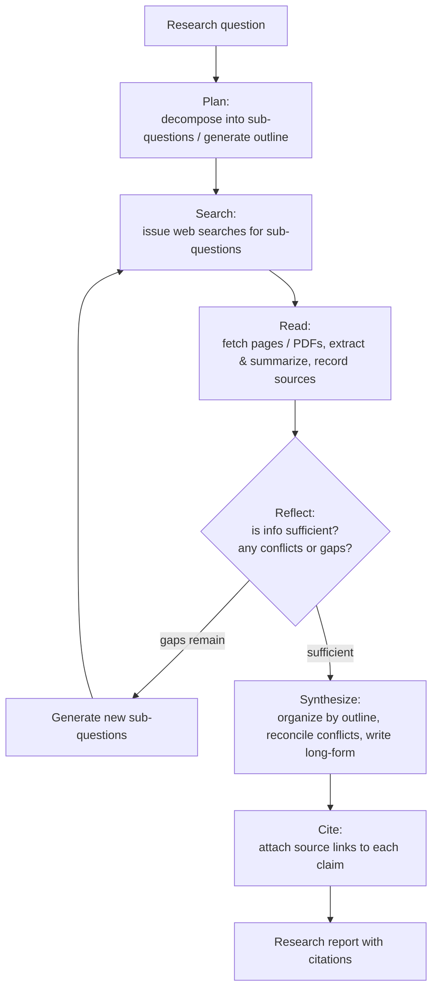
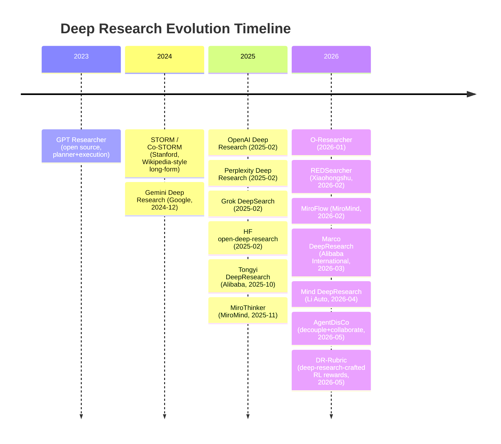

# Deep Research (Deep Research Agents) Overview

> **In one sentence**: Deep Research refers to a class of autonomous agents — given a research-style question, they independently complete an iterative loop of "plan → multi-step web search → read → reflect and re-search → synthesize → write up with citations," producing a verifiable long-form report; it is not a one-shot connected-to-the-web Q&A, but treats "doing research" itself as an agent trajectory that may run for several minutes to tens of minutes. The representative starting points are OpenAI Deep Research (2025-02) and Google Gemini Deep Research (2024-12), while on the open-source side there are GPT Researcher, HF open-deep-research (2025-02), Stanford STORM (2024), and others.

> Prerequisite reading: [Agent Overview](/en/agent/), [Tool Use](/en/agent/tool-use), [Multi-Agent](/en/agent/multi-agent); for the boundary with retrieval augmentation see [Skills vs RAG/Fine-tuning](/en/skills/vs-rag-finetune); for the RL used to train these browsing agents see [RL for Long-Horizon Web Navigation Agents](/agent/agentic-rl/web-agent-rl).

## Definition and Capability Boundaries

The term "Deep Research" was adopted almost simultaneously by several vendors from late 2024 to early 2025, with broadly consistent meaning: the user poses an **open-ended question that requires synthesizing multiple sources** ("compare the inference-chip roadmaps of three cloud vendors over the past three years," "investigate the latest first-line therapies for a disease and their evidence levels"), and the agent autonomously decides **what to search, what to read, what is still missing, and when to wrap up**, finally delivering a structured report with inline citations.

Its capability boundaries are drawn by three things:

- **The goal is "synthesis," not "looking up a single fact"**. A single fact ("who is a company's CEO") is fine with ordinary connected-to-the-web Q&A; the value of Deep Research lies in cases that require cross-comparing dozens to hundreds of web pages, reconciling conflicting claims, and organizing them into a long, argumentative piece.
- **It plans and iterates on its own**. Rather than a fixed retrieve-then-read pass, it discovers knowledge gaps while reading, then generates new sub-questions to fill them, looping for several rounds.
- **It produces a verifiable report with citations**, not an unsourced answer — citations are the core contract that distinguishes Deep Research from an ordinary "chat that can browse the web" (although citation reliability itself remains an open problem, see below).

## A Typical Agent Loop

The vast majority of Deep Research systems (whether closed- or open-source) converge to the same iterative paradigm: plan first, then loop through "search — read — reflect" for several rounds, and finally synthesize the writeup with citations attached.

The differences among systems mainly lie in three places: whether the loop is driven by a **single agent self-reflecting** (GPT Researcher, HF open-deep-research) or by a **supervisor dispatching multiple parallel sub-agents** (LangChain open_deep_research, most products); whether browsing uses **plain-text web pages** or a **real browser with vision**; and whether the underlying model has undergone **dedicated training for browsing and reasoning** (OpenAI Deep Research is specifically optimized on the o-series).

## Differences from RAG / Ordinary Connected-to-the-Web Q&A

|  | Ordinary RAG / Web Q&A | Deep Research |
| --- | --- | --- |
| Number of retrievals | Usually one round (retrieve → read → answer) | Multiple iterative rounds, re-searching while reading |
| Built-in planning | Generally none | Yes, decompose sub-questions / make an outline first |
| Reflective re-search | None | Yes, search again when gaps are found |
| Output form | A single answer | Structured long report + inline citations |
| Time cost | Seconds | Minutes to tens of minutes |
| Failure mode | Poor answer if retrieval misses | Any misstep in the long trajectory accumulates bias |

In short: RAG "fetches material once to answer," while Deep Research "verifies repeatedly like a researcher before writing up." Deep Research usually **contains RAG internally** (each round of search-read is a RAG pass), but wraps it in an agent loop of planning and reflection.

## Evolution Timeline

## Taxonomy Comparison Table

| Name | Year | Closed/Open | Org | One-liner | Link |
| --- | --- | --- | --- | --- | --- |
| GPT Researcher | 2023-07 | Open | Assaf Elovic (community) | planner+execution dual-agent, can plug in any LLM, deep mode ~5 min/report | [GitHub](https://github.com/assafelovic/gpt-researcher) |
| STORM / Co-STORM | 2024 | Open | Stanford OVAL | Writes Wikipedia-style long-form: pre-writing research to make an outline, then writeup with citations (Co-STORM 2024-09) | [Details](/agent/deep-research/storm) ·[GitHub](https://github.com/stanford-oval/storm) |
| Gemini Deep Research | 2024-12 | Closed/Product | Google | Released 2024-12, produces a research plan for user confirmation before executing | [Blog](https://blog.google/products/gemini/google-gemini-deep-research/) |
| OpenAI Deep Research | 2025-02 | Closed/Product | OpenAI | Specifically optimizes browsing and reasoning on the o-series, released 2025-02, HLE 26.6% | [Details](/agent/deep-research/openai-deep-research) ·[Blog](https://openai.com/index/introducing-deep-research/) |
| Perplexity Deep Research | 2025-02 | Closed/Product | Perplexity | Released 2025-02, emphasizes speed (most tasks under 3 min), HLE 21.1% | [Blog](https://www.perplexity.ai/hub/blog/introducing-perplexity-deep-research) |
| Grok DeepSearch | 2025-02 | Closed/Product | xAI | Launched with Grok 3 (2025-02), can integrate X real-time data and reconcile conflicting claims | [Release](https://x.com/xai/status/1892400134178164775) |
| open-deep-research (HF) | 2025-02 | Open | Hugging Face | Reproduced the OpenAI version in 24 hours, a code agent based on smolagents, GAIA validation set 55% | [Details](/agent/deep-research/open-deep-research) ·[Blog](https://huggingface.co/blog/open-deep-research) |
| open_deep_research (LangChain) | 2025 | Open | LangChain | Supervisor architecture based on LangGraph, dispatching parallel sub-agents | [GitHub](https://github.com/langchain-ai/open_deep_research) |
| **Tongyi DeepResearch** | 2025-10 | Open | Alibaba Tongyi Lab | 30B-A3B MoE, agentic mid/post-training, open-source benchmark-topping standard (BrowseComp 43.4 / HLE 32.9 / GAIA 70.9, per the technical report) | [Details](/agent/deep-research/tongyi-deepresearch) ·[arXiv](https://arxiv.org/abs/2510.24701) |
| **REDSearcher** | 2026-02 | Open | Xiaohongshu RED · HIT · SJTU | Targets sparse trajectories/rewards, low-cost unified training of long-horizon search agents, includes a multimodal version (BrowseComp 57.4 / GAIA 80.1, per the paper) | [Details](/agent/deep-research/redsearcher) ·[arXiv](https://arxiv.org/abs/2602.14234) |
| **MiroFlow / MiroThinker** | 2026-02 | Open | MiroMind | Highly robust open-source deep-research framework + research agent model, SOTA-level on GAIA / BrowseComp(-ZH) / HLE / xbench (per the papers) | [arXiv](https://arxiv.org/abs/2602.22808) ·[Model](https://arxiv.org/abs/2511.11793) |
| **Marco DeepResearch** | 2026-03 | Paper | Alibaba International AIDC | verification-centric: three-layer verification across data synthesis / trajectories / test-time, emphasizing efficiency | [arXiv](https://arxiv.org/abs/2603.28376) |
| **O-Researcher** | 2026-01 | Open | Academic team | Multi-agent distillation + agentic RL, achieves competitive deep-research scores without relying on closed-source data/models | [arXiv](https://arxiv.org/abs/2601.03743) |
| **Mind DeepResearch** | 2026-04 | Paper | Li Auto | ~30B, three agents for planning/deep-search/report + a four-stage pipeline of SFT→Search-RL→Report-RL→preference alignment, deployed in Li Auto products | [Details](/en/agent/deep-research/mind-deepresearch) ·[arXiv](https://arxiv.org/abs/2604.14518) |
| **AgentDisCo** | 2026-05 | Paper | Jin et al. | Models deep research as adversarial optimization of exploration vs exploitation: decoupled Critic/Generator collaboration + code-generation meta-optimization accumulating a policy bank, matching closed-source on multiple report benchmarks | [Details](/en/agent/deep-research/agentdisco) ·[arXiv](https://arxiv.org/abs/2605.11732) |
| **DR-Rubric** | 2026-05 | Open | Fudan / Xiaohongshu etc. | Treats "crafting RL reward rubrics" as a deep-research task: agentic retrieval to mine evidence → distill into atomic verifiable constraints → GRPO, small models can bootstrap | [Details](/en/agent/deep-research/dr-rubric) ·[arXiv](https://arxiv.org/abs/2606.01091) |

## The Domestic and Open-Source Benchmark Race (2025–2026)

From the second half of 2025 into 2026, Deep Research evolved from "a few product launches" into a **head-to-head contest on public leaderboards**, with the main battlegrounds being **BrowseComp / BrowseComp-ZH** (deep browsing to find information), **HLE** (hard knowledge), **GAIA** (general assistant), **xbench-DeepSearch / WebWalkerQA / FRAMES**, and others. The most representative work in this wave — those **with papers and high scores** — comes almost entirely from domestic large companies and the open-source community:

- **Tongyi DeepResearch** (Alibaba Tongyi Lab, [arXiv:2510.24701](https://arxiv.org/abs/2510.24701)): 30B-A3B MoE, end-to-end trained with **agentic mid-training + agentic post-training** plus a fully automated data-synthesis pipeline, pulling open-source deep-research agents into the same tier as OpenAI Deep Research; reports BrowseComp 43.4 / BrowseComp-ZH 46.7 / HLE 32.9 / GAIA 70.9 / xbench-DeepSearch 75.0 (per the technical report). **See the [Tongyi DeepResearch page](/agent/deep-research/tongyi-deepresearch)**.
- **REDSearcher** (Xiaohongshu RED × HIT × SJTU, [arXiv:2602.14234](https://arxiv.org/abs/2602.14234)): directly tackles the bottleneck of "extremely sparse high-quality search trajectories and reward signals," using a low-cost unified pipeline of **complex task synthesis (graph topology + scattered evidence) + two-stage mid-training + SFT/Agentic RL**, and doing rollouts on a local closed corpus of tens of millions of documents to save cost; the 30B-A3B reports BrowseComp 57.4 / GAIA 80.1 (per the paper), and extends to the multimodal REDSearcher-MM. **See the [REDSearcher page](/agent/deep-research/redsearcher)**.
- **MiroFlow / MiroThinker** (MiroMind, [arXiv:2602.22808](https://arxiv.org/abs/2602.22808) / [arXiv:2511.11793](https://arxiv.org/abs/2511.11793)): MiroFlow is a highly robust open-source deep-research **framework** (agent-graph orchestration + optional deep-reasoning mode), MiroThinker is the accompanying **model** (scaling along model / context / interactive dimensions); achieves open-source SOTA-level scores across GAIA, BrowseComp-EN/ZH, HLE, xbench-DeepSearch and other leaderboards (exact scores vary by version, per the respective papers).
- **Mind DeepResearch** (Li Auto, [arXiv:2604.14518](https://arxiv.org/abs/2604.14518)): ~30B, decomposes deep research into **three agents for planning / deep-search / report**, polishing search and report-writing abilities separately with a four-stage pipeline of **SFT cold-start → Search-RL → Report-RL → preference alignment**, and builds its own MindDR Bench benchmark of 500 Chinese queries with multi-dimensional rubrics; deployed in Li Auto's own products. Reports BrowseComp 42.8 / BrowseComp-ZH 45.7 / xbench-DS 75.0 (per the paper). **See the [Mind DeepResearch page](/en/agent/deep-research/mind-deepresearch)**.
- **Marco DeepResearch** (Alibaba International AIDC, [arXiv:2603.28376](https://arxiv.org/abs/2603.28376)): threads **verification** through data synthesis, trajectory construction, and test-time as three layers — letting the agent act as its own verifier, suppressing the downstream propagation of errors at each stage, emphasizing "efficient deep research."
- **O-Researcher** ([arXiv:2601.03743](https://arxiv.org/abs/2601.03743)): uses two-stage training of **multi-agent distillation + agentic RL** to let open-source models of various sizes achieve competitive deep-research scores without relying on closed-source data/models.

> Leaderboard caveat: these scores come from the respective papers/technical reports, and **the definitions, time points, tool configurations, and test-time scaling (e.g., Heavy Mode / parallel sub-agents) all differ**, so directly comparing absolute values across systems is of limited meaning; the leaderboards (especially BrowseComp-ZH and xbench-DeepSearch) are also iterating quickly. Treat them as a "rough order-of-magnitude reference for open-source deep-research capability in the same period," not a precise ranking.

## Evaluation and Current State

These systems mainly compete on three benchmarks:

- **GAIA** (arXiv:2311.12983, 2023-11, Meta et al.): 466 real-world tasks that are "easy for humans, hard for AI," requiring reasoning, multimodality, web browsing, and tool use. HF open-deep-research reaches ~55% on the validation set (pass@1), and its blog cites OpenAI Deep Research's ~67% average as a comparison.
- **Humanity's Last Exam (HLE)**: hard knowledge questions across over a hundred disciplines. OpenAI Deep Research officially reports 26.6%, Perplexity Deep Research reports 21.1% — these are self-reported numbers with differing definitions and time points, so cross-comparison should be cautious.
- **BrowseComp** (arXiv:2504.12516, 2025-04, OpenAI): 1266 browsing questions that require "persistent digging through deeply buried information," with short answers that are easy to auto-grade, specifically measuring an agent's ability to "dig up" information on the web.

Current state and limitations (this is also the part most worth being wary of right now):

- **Hallucination and unreliable citations**: reports read authoritatively, but the claims are not necessarily supported by their attached citations — there are cases of "a link is attached but doesn't match the source text" or over-extrapolation; the presence of a citation ≠ a correct citation.
- **Uneven source quality**: the agent struggles to reliably distinguish authoritative sources from marketing/low-quality content, and tends to write one-sided or outdated information into its conclusions.
- **Cost and latency**: a report easily takes minutes to tens of minutes and invokes heavy retrieval and long-context reasoning; open-source solutions (e.g., GPT Researcher self-reports ~$0.4/report under o3-mini) are relatively controllable, but product-grade deep research is still expensive.
- **Poor reproducibility**: web content changes over time and search results are nondeterministic, so two runs of the same question may give different results, posing difficulties for evaluation and auditing.

Practical advice: treat Deep Research as a **first-draft research assistant that lists its sources**, not as a final reviewer, and always trace important conclusions back to the original text via their citations.

## References

- OpenAI, *Introducing deep research* (2025-02): <https://openai.com/index/introducing-deep-research/>
- Google, *Gemini Deep Research*: <https://blog.google/products/gemini/google-gemini-deep-research/>
- Perplexity, *Introducing Perplexity Deep Research* (2025-02): <https://www.perplexity.ai/hub/blog/introducing-perplexity-deep-research>
- Hugging Face, *Open-source DeepResearch* (2025-02): <https://huggingface.co/blog/open-deep-research>
- GPT Researcher (GitHub): <https://github.com/assafelovic/gpt-researcher>
- LangChain open_deep_research (GitHub): <https://github.com/langchain-ai/open_deep_research>
- Stanford STORM (GitHub): <https://github.com/stanford-oval/storm>
- Mialon et al., *GAIA: a benchmark for General AI Assistants* (arXiv:2311.12983, 2023-11)
- Wei et al., *BrowseComp* (arXiv:2504.12516, 2025-04)
- Tongyi DeepResearch Team, *Tongyi DeepResearch Technical Report* (arXiv:2510.24701, 2025-10) ·[GitHub](https://github.com/Alibaba-NLP/DeepResearch)
- *REDSearcher: A Scalable and Cost-Efficient Framework for Long-Horizon Search Agents* (arXiv:2602.14234, 2026-02) ·[GitHub](https://github.com/RedSearchAgent/REDSearcher)
- *MiroFlow: Towards High-Performance and Robust Open-Source Agent Framework for General Deep Research Tasks* (arXiv:2602.22808, 2026-02)
- *MiroThinker: Pushing the Performance Boundaries of Open-Source Research Agents* (arXiv:2511.11793, 2025-11)
- *Marco DeepResearch: Unlocking Efficient Deep Research Agents via Verification-Centric Design* (arXiv:2603.28376, 2026-03)
- *O-Researcher: An Open Ended Deep Research Model via Multi-Agent Distillation and Agentic RL* (arXiv:2601.03743, 2026-01)
- *Mind DeepResearch Technical Report* (Li Auto, arXiv:2604.14518, 2026-04)
- *AgentDisCo: Towards Disentanglement and Collaboration in Open-ended Deep Research Agents* (arXiv:2605.11732, 2026-05)
- *Deep Research as Rubric for Reinforcement Learning (DR-Rubric)* (arXiv:2606.01091, 2026-05) ·[GitHub](https://github.com/meiotoufa/DR-Rubric)
