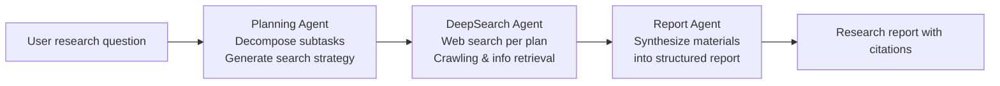
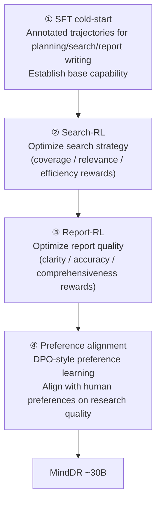

# Mind DeepResearch (Li Auto MindDR): Three-Agent Collaboration + Four-Stage Training for Efficient Deep Research

> **In one sentence**: Mind DeepResearch (MindDR, Li Auto) takes the "**small but refined**" route — using a model of roughly **30B** scale, paired with an architecture of **three agents collaborating sequentially (Planning / DeepSearch / Report)**, plus a **four-stage training** pipeline of **SFT cold-start → Search-RL → Report-RL → preference alignment**, to push open-source deep research to "better than open-source systems of the same scale, and able to go toe-to-toe with larger models," and it has already been deployed in Li Auto's own products; it also proposes **MindDR Bench**, scored with a multi-dimensional rubric over 500 real-world Chinese queries.
> Year proposed: 2026 (arXiv:2604.14518, 2026-04) · Institution: MindDR Team, Li Auto Inc · Scale: ~30B
> Prerequisite reading: [Deep Research Overview](/en/agent/deep-research/) · [Tongyi DeepResearch](/agent/deep-research/tongyi-deepresearch) · [REDSearcher](/agent/deep-research/redsearcher) · [Long-Horizon Web Navigation RL](/agent/agentic-rl/web-agent-rl)

## Positioning: Doing Efficient Deep Research with a Small Model

MindDR's core thesis lies on the same battle line as Alibaba's [Tongyi DeepResearch](/agent/deep-research/tongyi-deepresearch) and Xiaohongshu's [REDSearcher](/agent/deep-research/redsearcher) — **rather than piling on parameters, it squeezes a ~30B model to deep-research SOTA level through "training + architecture."** Its differentiator is to explicitly decompose "deep research" into **three agents with clearly divided roles**, and to design a **dedicated RL stage** to polish each part separately.

## Three Agents: Planning → DeepSearch → Report

MindDR realizes the deep-research loop as three sequentially collaborating agents, with information passed down stage by stage:

- **Planning Agent**: **decomposes the user question into subtasks** and generates the corresponding search strategy — deciding "which aspects to research, and in what order to search."
- **DeepSearch Agent**: **executes web search and information retrieval** per the plan, with multi-round crawling, reading, and supplemental search — this is the part that truly "digs up information."
- **Report Agent**: **synthesizes the collected materials into a coherent, structured report**, responsible for clarity, accuracy, and comprehensiveness.

The benefit of this explicit division of labor is that **each agent's capability can be trained and optimized separately** — which is precisely the design premise behind the four-stage training pipeline below.

## Four-Stage Training Pipeline

MindDR does not RL all the way through in one shot; instead it builds up different capabilities layer by layer in four steps:

1. **SFT cold-start**: supervised fine-tuning on annotated trajectories for planning, search, and report-writing tasks, first establishing the base capability to "follow this workflow."
2. **Search-RL**: reinforcement learning targeting the **search stage**, using search-specific rewards (coverage / relevance / efficiency type) to optimize "how to search better."
3. **Report-RL**: reinforcement learning targeting the **report stage**, using report-quality rewards (clarity, accuracy, comprehensiveness) to optimize "how to write better."
4. **Preference alignment**: finally, [DPO](/en/dpo/dpo)-style preference learning to align with human preferences on "what makes good research."

This design of **doing RL separately for "search" and "report"** echoes its architecture of splitting the agents into a deep-search part and a report part — each part has its own reward signal, avoiding mashing two objectives into a single fuzzy aggregate score.

## MindDR Bench: 500 Real-World Chinese Queries + Multi-Dimensional Rubric

To make evaluation closer to real usage, MindDR proposes its own benchmark, **MindDR Bench**: based on **500 real-world Chinese user queries**, scored **not with a single metric but with a multi-dimensional rubric** (research depth, factual accuracy, report coherence, etc.). This aligns with the approach in this chapter's [DR-Rubric](/en/agent/deep-research/dr-rubric) and [AgentDisCo](/en/agent/deep-research/agentdisco) of evaluating deep research with rubrics / report-quality benchmarks — open-ended deep research increasingly favors a "multi-dimensional scale" over "a single score."

## Benchmark Performance (defer to the original paper)

The technical report reports multi-leaderboard results at ~30B scale (numbers per the arXiv original):

| Benchmark | MindDR ~30B |
| --- | --- |
| BrowseComp-ZH | 45.7 |
| BrowseComp | 42.8 |
| WideSearch | 46.5 |
| xbench-DeepSearch | 75.0 |
| DeepResearch Bench | 52.5 |
| MindDR Bench | 51.8 (self-reported SOTA) |

The paper claims it is **better than open-source agent systems of the same scale, and able to compete with larger-scale models**. As is customary in this chapter: these scores differ in measurement protocol, timing, and tool configuration, so **directly comparing absolute values across systems has limited meaning** — treat them as an order-of-magnitude reference for "the deep-research capability of contemporaneous ~30B-class open source."

## Position in the Deep Research Lineage

- **vs Tongyi DeepResearch / REDSearcher**: all three work in the **30B class** along the route of "specifically training long-horizon search / deep-research agents." MindDR's distinguishing feature is the four-stage pipeline of **explicit three-agent division of labor + independent RL for search and report (Search-RL / Report-RL)**, and it has **already been deployed in Li Auto's own products**; REDSearcher emphasizes more "task-difficulty formalization + low-cost RL over a local closed corpus," while Tongyi emphasizes "agentic mid/post-training + fully automated data synthesis." See [Tongyi](/agent/deep-research/tongyi-deepresearch) and [REDSearcher](/agent/deep-research/redsearcher) for comparison.
- **vs AgentDisCo / open-source frameworks**: [AgentDisCo](/en/agent/deep-research/agentdisco) does not train a base model and instead does agent orchestration on a strong general model; MindDR builds the model **from the training side**, making the two complementary.
- For overall positioning and the backdrop of the "domestic/open-source leaderboard race," see the [Deep Research Overview](/en/agent/deep-research/).

## References

- MindDR Team, Li Auto Inc. *Mind DeepResearch Technical Report.* arXiv:2604.14518, 2026-04. <https://arxiv.org/abs/2604.14518>
- Evaluation benchmarks: BrowseComp / BrowseComp-ZH, WideSearch, xbench-DeepSearch, DeepResearch Bench, and the in-house MindDR Bench (500 Chinese queries, multi-dimensional rubric)
