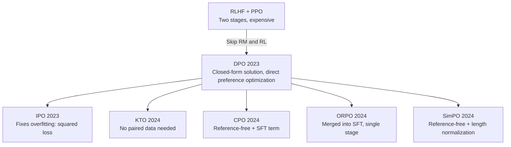

# Preference Optimization (DPO Family) Overview

> **In one sentence**: DPO proved that preference alignment is possible "without training a reward model and without running RL"; later variants keep evolving around "removing the reference, length bias, and unpaired data".

::: warning Status
🚧 This page is a placeholder outline; the full text has not been written yet.
:::

## Family Evolution Map

## Variant Comparison

| Method | Reference model | Data format | Core change |
| --- | --- | --- | --- |
| [DPO](/en/dpo/dpo) | Required | Pairs $(y_w, y_l)$ | Closed-form solution of the BT model |
| [IPO](/en/dpo/ipo) | Required | Pairs | Squared loss against overfitting |
| [KTO](/en/dpo/kto) | Required | Single samples + good/bad labels | Prospect-theory value function |
| [ORPO](/en/dpo/orpo) | Not required | Pairs | SFT + odds ratio, single stage |
| [SimPO](/en/dpo/simpo) | Not required | Pairs | Length normalization + margin |
| [CPO](/en/dpo/cpo) | Not required | Pairs | Likelihood upper-bound approximation + SFT term |

## TODO

- [ ] Selection advice: when DPO is enough, when to go to RL
- [ ] Shared pitfalls: chosen probability dropping together with rejected, length inflation, distribution shift
- [ ] Theoretical connection to RLHF (different solutions to the same KL-constrained objective)
