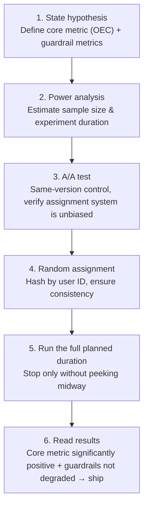

# Statistics Basics: How Big Tech Runs A/B Experiments

> **In one sentence**: Offline evaluation tells you "what score the model gets on a question bank," but "whether users actually prefer the new version after launch" can only be answered by **online A/B experiments**. The core of A/B is a body of statistics: use random assignment to attribute "differences" to versions, then use **significance testing** to judge whether the difference is real skill or pure luck.

The [Evaluation chapter](/eval/) covers how to score models with benchmarks and judges before launch; this page covers the final gate after launch — serving the old and new versions to real users at the same time and using statistical methods to judge which is better. It explains what terms like "p-value, significance, confidence interval, statistical power" actually mean, plus the standard moves big tech makes when running an A/B and the pitfalls most often stepped on.

## 1. Why A/B: A Difference Might Just Be Noise

The most naive idea is "ship the new version to everyone and see if the metric goes up." The problem is: metrics fluctuate every day — weekends differ from weekdays, sales events differ from no events, regions differ. **You can't tell whether the ups and downs you see are due to the new version or to these natural fluctuations.**

The A/B experiment (also called a **randomized controlled experiment / online controlled experiment**) solves this by **randomly splitting users into two groups**:

- **Control group (A, control)**: sees the old version;
- **Treatment group (B, treatment)**: sees the new version.

Random assignment ensures the two groups of users are statistically almost identical (age, region, activity level all evenly distributed); the only difference is the version they see. This way, the difference in metrics between the two groups can be cleanly **attributed to the version itself** — this is exactly the power of "randomization" to cut off confounders and turn correlation into causation.

## 2. Hypothesis Testing: The Statistical Core of A/B

Even with random assignment, the two groups' metrics will almost never be exactly equal — even if you show both groups the exact same version, the numbers will differ by a fraction of a percentage point at random. So the real question is: **is the small difference you observe a real effect, or sampling noise?**

The tool to answer it is called **hypothesis testing**, and its logic is like "presumption of innocence" in a courtroom:

- **Null hypothesis $H_0$ (null hypothesis)**: the two versions have no difference ("the defendant is innocent"). This is the default stance.
- **Alternative hypothesis $H_1$**: the two versions differ ("the defendant is guilty"). This is what you want to prove.
- **Testing logic**: first assume $H_0$ holds (there really is no difference), then ask — **if there truly were no difference, how likely is it that pure luck alone would produce a difference as large (or larger) than the one we currently see?** That probability is the **p-value**.
- If the p-value is very small (too small to be luck), then **reject $H_0$** and declare the difference "**statistically significant**."

The threshold for "how small counts as small" is the **significance level $\alpha$**, and the industry convention is **0.05**:

$$
p < \alpha \;(\text{usually } 0.05) \;\Longrightarrow\; \text{reject } H_0,\ \text{deem the difference significant}.
$$

## 3. The p-value: The Most Misread Number

The p-value is arguably the most easily misunderstood concept in statistics; remembering one sentence is enough:

> **p-value = the probability that, assuming the two versions actually have no difference, pure luck alone would produce a difference this large.** The smaller it is, the less tenable the "lucky coincidence" explanation, and the more likely the difference is real.

Three frequent misreadings to avoid:

- ❌ The p-value is **not** "the probability the new version is better," nor "the probability that $H_0$ is true."
- ❌ The p-value **does not reflect how large the difference is**. A small p-value only says "there is almost certainly a difference"; it doesn't say whether the difference is 0.1% or 10%.
- ❌ **Statistically significant ≠ business-important**. With a large enough sample, even a tiny 0.01% improvement can be "significant," yet may not be worth shipping at all. The actual magnitude of the difference is called the **effect size**, and should be viewed separately from significance.

## 4. Confidence Intervals: More Useful Than the p-value

When big tech looks at A/B results, they often prefer the **confidence interval (CI)**, because it tells you both **direction** and **magnitude**.

The meaning of a **95% confidence interval**: if you repeated the experiment many times, about 95% of the intervals would cover the true difference value. In practice, read it like this:

- **The interval does not contain 0** ↔ the difference is significant (equivalent to p < 0.05);
- **How wide the interval is** reflects how precise the estimate is — a narrow interval means the conclusion is reliable, a wide interval means the sample is still insufficient and more traffic is needed.

For example, if the 95% CI for the new version's click-through-rate improvement is `[+0.5%, +2.3%]`: it doesn't contain 0 → significantly positive, and the improvement is most likely between 0.5% and 2.3%. If it's `[-0.3%, +1.8%]`, it straddles 0 → **no conclusion can be drawn**. [Arena and human preference](/eval/arena) also uses confidence intervals when ranking models to judge "whether the win-rate gap between two models is trustworthy" — it's the same line of thinking.

## 5. Two Types of Error, Statistical Power, and Sample Size

A test can make two kinds of error, and you must watch both:

| | Truth: no difference | Truth: there is a difference |
| --- | --- | --- |
| **Verdict: there is a difference** | ❌ Type I error (false positive, probability $\alpha$) | ✅ Correct |
| **Verdict: no difference** | ✅ Correct | ❌ Type II error (false negative, probability $\beta$) |

- **Type I error (false positive)**: judging a difference where there is none → shipping a version that is actually useless or even harmful. Controlled by $\alpha$ (0.05).
- **Type II error (false negative)**: failing to detect a difference that truly exists → missing a good version. Controlled by $\beta$.
- **Statistical power = $1-\beta$**: the probability of successfully detecting a difference when one truly exists. Industry convention requires **≥ 80%**.

**Power directly determines how much sample size you need.** Sample size is jointly determined by four quantities:

$$
\text{sample size} \;\propto\; \frac{\text{baseline variance}}{(\text{MDE})^2} \times f(\alpha,\ \text{power})
$$

Here **MDE (minimum detectable effect)** is the smallest improvement you want to be able to "detect." The key intuition: **the smaller the improvement you want to detect (the smaller the MDE), the more traffic you need** — reliably detecting a 0.1% improvement requires about 100 times the sample size of detecting 1%. With insufficient traffic but wanting to detect a tiny improvement, the experiment is doomed to fail (underpowered). So **before the experiment starts**, do a power analysis and estimate the sample size and how long it needs to run — don't discover after the fact that the sample was too small.

## 6. The Standard Process at Big Tech

A well-run A/B experiment roughly proceeds like this:

A few key points:

- **Metrics fall into two kinds**: the **core metric (OEC, Overall Evaluation Criterion)** is the goal you want to optimize (e.g., retention, conversion); **guardrail metrics** are bottom lines that must not be sacrificed (e.g., latency, crash rate, churn rate). A new version can only ship if "the core rises and guardrails don't degrade."
- **A/A test**: before launch, first run two groups of the same old version as a control; in theory they should show "no significant difference." If even an A/A test detects a significant difference, it means there's a bug in the assignment system or metric instrumentation, and the results can't be trusted.
- **Run the full duration**: usually cover at least one complete week (to smooth out weekday/weekend differences), and **you must not stop early just because "it looks significant"** — see the next section for why.

## 7. The Four Most Common Pitfalls

| Pitfall | What's happening | Countermeasure |
| --- | --- | --- |
| **Peeking** | Watching results every day and stopping the moment p < 0.05. Repeated testing pushes the false-positive rate far above 5% | Fix the sample size in advance; or use **sequential testing** (see next section) |
| **Multiple comparisons** | Testing 20 metrics at once; pure luck will produce about 1 with p < 0.05 | Bonferroni / FDR correction, lower the per-metric threshold |
| **Simpson's paradox** | The new version wins in every subgroup, yet loses when combined (because the two populations have different compositions) | Check whether assignment is even; look at results stratified |
| **Sample ratio mismatch (SRM)** | It should be 50/50 but is actually 52/48 | Indicates a bug in the experiment (assignment/logging); discard the results and fix it first |

"Peeking" is the most insidious and the most fatal: **every extra look gives you one more chance to "hit a random coincidence."** Watching an experiment that truly has no difference look after look, sooner or later some day will show p < 0.05. This is why the discipline is "either fix the sample size in advance and run it to the end, or use a method specifically designed to allow looking at any time."

## 8. Advanced Weapons (One Sentence Each)

- **Variance reduction (CUPED)**: use user data from **before the experiment starts** as a covariate to subtract out individual baseline differences, lowering metric variance — reaching significance faster at the same traffic. It's a standard tool big tech uses to boost experiment sensitivity.
- **Sequential testing / always-valid p-values**: testing methods specifically designed so that "looking at any time does not inflate the false-positive rate," solving the peeking problem and allowing an early conclusion when the effect is obvious.
- **Multi-armed bandit**: instead of fixing the assignment ratio, dynamically route more traffic to the version currently doing better, trading off between "exploration" and "earning returns sooner" — suitable for scenarios chasing online returns rather than pure causal inference.

## 9. Relationship to LLM Evaluation

Connecting this page with the [Evaluation chapter](/eval/) gives a complete chain for deciding "did the model get better":

- **Before launch**: use [fixed benchmarks](/eval/benchmarks) and [LLM-as-judge](/eval/llm-as-judge) for cheap, fast offline coarse screening and regression — but they only represent "on-the-question-bank" performance.
- **After launch**: use an **A/B experiment** to let real users vote and see whether core business metrics improve significantly — this is the final verdict.
- When [Arena and human preference](/eval/arena) ranks models with Bradley-Terry/Elo, judging "whether the win-rate gap between two models is trustworthy" also relies on confidence intervals and significance — the same origin as A/B.

In one sentence: **offline evaluation is responsible for "don't ship something clearly worse," and online A/B is responsible for "confirm it's truly better before going full traffic."** Both fear the same thing — mistaking noise for real skill.

## Cheat Sheet

| Term | One-sentence meaning |
| --- | --- |
| Null hypothesis $H_0$ | Default stance: the two versions have no difference |
| p-value | Assuming no difference, the probability of seeing a difference this large by pure luck (smaller = less like luck) |
| Significance level $\alpha$ | The threshold for rejecting $H_0$, usually 0.05 |
| Statistically significant | p < α, the difference is unlikely to be noise (≠ large difference, ≠ business-important) |
| Effect size | The actual magnitude of the difference; view separately from significance |
| Confidence interval | The interval the true value most likely falls in; not containing 0 ↔ significant |
| Type I error | False positive: judging a difference where there is none (probability α) |
| Type II error | False negative: a difference exists but isn't detected (probability β) |
| Statistical power | The probability of detecting a difference when one truly exists, 1−β, convention ≥ 80% |
| MDE | The smallest improvement you want to be able to detect; smaller needs more sample |
| A/A test | Same-version control, verifies the assignment system is unbiased |
| Guardrail metric | Bottom-line metric that must not be sacrificed (latency, crash rate, etc.) |

## References

- Kohavi, Tang & Xu. *Trustworthy Online Controlled Experiments: A Practical Guide to A/B Testing.* Cambridge University Press, 2020.
- Kohavi et al. *Controlled Experiments on the Web: Survey and Practical Guide.* Data Mining and Knowledge Discovery, 2009.
- Deng et al. *Improving the Sensitivity of Online Controlled Experiments by Utilizing Pre-Experiment Data (CUPED).* WSDM 2013.
