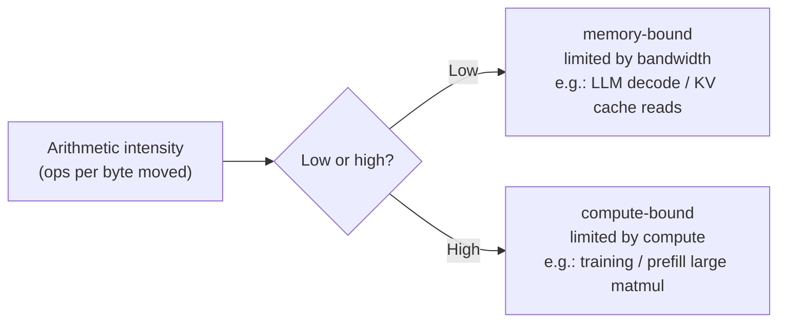

# GPU Basics: Why Large Models Can't Live Without It

> **In one sentence**: Training and inference for large models are, at their core, massive matrix multiplication + massive data movement. GPUs push both to the extreme with "thousands of tiny cores + ultra-high-bandwidth memory"—once you understand these four numbers—**compute (FLOPS)**, **memory bandwidth**, **memory hierarchy**, and **multi-GPU interconnect**—every term across this site (memory wall / communication wall / KV cache / FlashAttention / quantization) suddenly has a home.

This page doesn't assume you know hardware. First we explain what makes a GPU suited to large models, then we work through the four numbers that actually bottleneck you in practice (compute, bandwidth, memory capacity, interconnect) one by one, and finally we give a selection table of mainstream models. It is a shared prerequisite for both the [Training Systems](/training-systems/) and [Inference & Decoding](/en/inference/) chapters.

## 1. Why GPU, Not CPU

The division of labor between CPU and GPU, in one sentence: **the CPU is a few PhD students (few but strong, good at complex serial logic), the GPU is thousands of elementary schoolers (many but weak, good at doing a huge amount of simple arithmetic simultaneously)**.

The core computation of large models is matrix multiplication—thousands upon thousands of mutually independent multiply-adds, naturally something you can "compute all at once". This plays right into the GPU's hands:

| | CPU | GPU |
| --- | --- | --- |
| Core count | A few ~ a few dozen strong cores | Thousands ~ tens of thousands of weak cores |
| Good at | Serial logic, branching, low latency | Massive parallelism, high throughput |
| Analogy | A few PhD students | Thousands of elementary schoolers doing arithmetic at once |
| Role in large models | Scheduling, data preprocessing | Carrying nearly all the matrix operations |

So when training / running inference for LLMs, the GPU (or accelerators like TPU / NPU) shoulders almost all the compute, while the CPU only handles scheduling and feeding data.

## 2. Hardware Architecture: SM / CUDA Core / Tensor Core

An NVIDIA GPU is made up of dozens ~ over a hundred **SMs (Streaming Multiprocessors)**, the SM being the real basic unit that does the work. Each SM in turn contains two kinds of compute cores:

- **CUDA Core**: a general-purpose scalar core that handles ordinary floating-point / integer operations (element-wise add/subtract/multiply, activation functions, etc.).
- **Tensor Core**: a **core designed specifically for matrix multiply-accumulate (MMA)**, computing a small block of matrix multiplication in a single instruction. It is the true source of large-model compute—the vast majority of FLOPS in an LLM come from Tensor Cores, not CUDA Cores. As we'll see when discussing precision later, Tensor Cores support low precisions like FP16/BF16/FP8, which is the hardware foundation that lets mixed-precision training and quantized inference speed up.

> One intuition is enough to remember: **to gauge how fast a card "computes", look at the Tensor Core's TFLOPS under FP16/BF16; it sets the ceiling for matrix multiplication.**

## 3. Memory Hierarchy: A Bandwidth Pyramid

GPU storage isn't one solid slab but a pyramid—**the closer to the compute cores, the faster, smaller, and more expensive; the farther out, the larger, slower, and cheaper**:

| Tier | Capacity order | Bandwidth order | Characteristics |
| --- | --- | --- | --- |
| Registers / L1 / **SRAM** (on-chip) | KB ~ tens of MB | Extremely high (~10+ TB/s) | Fast but tiny; FlashAttention relies on it |
| L2 cache | Tens of MB | High | Shared by all SMs |
| **HBM** (device memory, off-chip) | Tens ~ hundreds of GB | High (~2–8 TB/s) | The "80GB of memory" people talk about is this tier |
| Host memory / cross-GPU | Hundreds of GB+ | Low (PCIe ~64 GB/s) | Slow; avoid moving data back and forth |

Two key takeaways:

1. **"80GB of memory" refers to HBM**. Model parameters, gradients, optimizer state, and the KV cache all live here. Can't fit → memory wall (see [Training Systems Overview](/training-systems/)).
2. **SRAM is extremely fast but extremely small**, so whoever can keep hot data in SRAM and make fewer trips to HBM is faster. The core idea of [FlashAttention](/architecture/attention) is exactly this: tile the attention computation into SRAM, avoiding writing the giant attention matrix back to HBM—what it optimizes is not compute but **data movement**. This leads to the most important concept in the next section.

## 4. Compute vs. Bandwidth: Two Bottlenecks and the Roofline

The point beginners most often overlook: **a computation being slow doesn't necessarily mean "not enough compute"—more likely it's "data can't be fed in fast enough"**. GPU performance is squeezed by two ceilings:

- **Compute ceiling**: how many multiply-adds per second the Tensor Cores can do (TFLOPS).
- **Bandwidth ceiling**: how many bytes per second HBM can move in and out of the compute cores (TB/s).

To tell which one bottlenecks an operation, look at its **arithmetic intensity = amount of compute ÷ amount of memory access** (how many operations you get per byte moved):

- **Compute-bound**: high arithmetic intensity, bottlenecked by compute. Typical case: large matrix multiplications (training, the prefill stage).
- **Memory-bound**: low arithmetic intensity, bottlenecked by bandwidth. Typical case: LLM **autoregressive decoding**—every token generated requires reading the entire KV cache and weights from HBM, yet does very little computation.

Plot these two ceilings on one chart and you get the famous **Roofline model**:

**This distinction explains why more than half the inference optimizations across this site look the way they do**:

- LLM inference decoding is memory-bound, so [KV Cache](/en/inference/kv-cache) management, [quantization](/en/inference/quantization) (compressing weights from 16-bit down to 4-bit directly cuts data movement by 4×), and [speculative decoding](/en/inference/speculative-decoding) are all, at their core, about **saving bandwidth / raising arithmetic intensity**—not piling on compute.
- Training and prefill are compute-bound, so over there people care more about Tensor Core utilization (MFU), mixed precision, and [FlashAttention](/architecture/attention).

> One sentence to remember: **training competes on compute, decoding competes on bandwidth.** When you see an LLM optimization, first ask whether it saves FLOPS or GB/s.

## 5. Precision: FP32 / TF32 / FP16 / BF16 / FP8

Low precision is the other big lever for GPU speedup: **fewer digits means less data moved (saving bandwidth) and higher Tensor Core throughput (saving compute)**. The cost is reduced numerical range / precision. Common formats:

| Format | Bits | Characteristics & use |
| --- | --- | --- |
| FP32 | 32 | Full-precision baseline, slow; now mostly used for the optimizer's master copy |
| TF32 | 19 (internal to hardware) | A compromise since A100, speeds up matmul by default with virtually imperceptible precision loss |
| FP16 | 16 | Small range, prone to overflow, needs loss scaling |
| **BF16** | 16 | Same range as FP32, lower precision, **the go-to for training**, no loss scaling needed |
| FP8 | 8 | Supported since H100, further speedup for training / inference |
| INT8 / INT4 | 8 / 4 | Mainly for inference [quantization](/en/inference/quantization) |

For the memory math of mixed-precision training (compute in BF16 for params, FP32 for the master copy and optimizer), see the $16\Psi$ estimate in the [Training Systems Overview](/training-systems/); for the trade-offs of compressing weights to INT4/FP8 on the inference side, see [quantization](/en/inference/quantization).

## 6. Multi-GPU Interconnect: NVLink / NVSwitch / InfiniBand

When one card can't hold a large model, you need multiple cards working together (see the five-dimensional parallelism in [Training Systems](/training-systems/)). At this point, **how the cards are connected and how fast** directly determines how large you can scale. Bandwidth splits into two tiers:

| Interconnect | Scope | Bandwidth order | Use |
| --- | --- | --- | --- |
| **NVLink / NVSwitch** | Intra-machine GPU interconnect (8 cards per machine) | High (hundreds of GB/s ~ 1.8 TB/s) | High-frequency intra-machine communication; TP must rely on it |
| **PCIe** | GPU↔CPU / cross-GPU when no NVLink | Low (~64 GB/s, PCIe 5.0) | Slow; avoid if possible |
| **InfiniBand (IB) / RoCE** | Cross-machine, cross-node | Medium (NDR single port ~50 GB/s) | Cross-machine communication in thousand-GPU clusters |

This is precisely the hardware root of the "**communication wall**" and the "**the heavier the communication, the closer you place it**" partitioning principle in the [Training Systems Overview](/training-systems/):

- **Tensor parallelism (TP)** has the most frequent, most bandwidth-hungry intra-layer communication → lock it within a single machine, relying on NVLink;
- **Pipeline parallelism (PP) / data parallelism (DP)** communication is relatively sparse → can go cross-machine over IB.

> The **H800 / A800**, common in China, are export-tailored versions of the H100 / A100 with similar compute, but **what's mainly cut is exactly the NVLink interconnect bandwidth** (e.g., the H800's NVLink drops from 900 GB/s to about 400 GB/s)—which is why they're at a bigger disadvantage in large-scale distributed training: they hit the communication wall sooner.

## 7. Mainstream Models and Selection

The table below gives approximate key specs for several generations of workhorse cards (numbers vary by version / vendor; just remember the **orders of magnitude and relative relationships**, no need to memorize exact values):

| Model | Architecture | Memory | Memory bandwidth | FP16 compute (dense) | Intra-machine interconnect |
| --- | --- | --- | --- | --- | --- |
| A100 | Ampere | 40 / 80 GB | ~2.0 TB/s | ~312 TFLOPS | NVLink ~600 GB/s |
| H100 (SXM) | Hopper | 80 GB | ~3.4 TB/s | ~990 TFLOPS (double with FP8) | NVLink ~900 GB/s |
| H800 | Hopper (export-tailored) | 80 GB | ~3.4 TB/s | ≈H100 | NVLink ~400 GB/s (cut) |
| B200 | Blackwell | ~192 GB | ~8 TB/s | Greatly increased (emphasizing FP8/FP4) | NVLink ~1.8 TB/s |

**Selection intuition:**

- **Large-scale training**: look for all three—memory capacity + compute + **intra-machine interconnect bandwidth**. A cut interconnect (like the H800) is a serious handicap in thousand-GPU training.
- **Inference deployment**: decoding is memory-bound, so prioritize **memory bandwidth** and **memory capacity** (capacity determines how large a model + how long a KV cache you can hold); raw compute is actually not the first constraint, which is why inference often uses quantization to fit models into smaller cards.
- **Budget / small-to-medium scale**: consumer cards (like the 4090, 24GB) can do small-model fine-tuning / inference, but have small memory and no NVLink, so they scale poorly across multiple cards.

## Quick Reference

| Number | Dimension | Determines | Related chapter |
| --- | --- | --- | --- |
| Compute (Tensor Core TFLOPS) | Multiply-adds per second | How fast training / prefill is | [Training Efficiency](/training-systems/efficiency) |
| Memory bandwidth (TB/s) | Bytes moved per second | How fast decoding is (memory-bound) | [KV Cache](/en/inference/kv-cache), [Quantization](/en/inference/quantization) |
| Memory capacity (GB, HBM) | How much can be held | Whether the model / KV cache fits (memory wall) | [Training Systems](/training-systems/) |
| Interconnect bandwidth (NVLink/IB) | Bytes moved between cards | How many cards you can scale to (communication wall) | [Model Parallelism](/training-systems/model-parallel) |
| SRAM size and speed | On-chip ultra-fast small storage | How much HBM movement FlashAttention can save | [Attention Mechanism](/architecture/attention) |

Once you understand these five numbers, go back and look at the "memory wall / communication wall" in [Training Systems](/training-systems/) and the "KV cache / quantization / speculative decoding" in [Inference](/en/inference/)—you'll find they're all wrestling with one ceiling or another in this table.

## References

- NVIDIA. *NVIDIA A100 / H100 Tensor Core GPU Architecture Whitepapers.*
- Williams et al. *Roofline: An Insightful Visual Performance Model for Multicore Architectures.* CACM 2009
- Dao et al. *FlashAttention: Fast and Memory-Efficient Exact Attention with IO-Awareness.* arXiv:2205.14135
