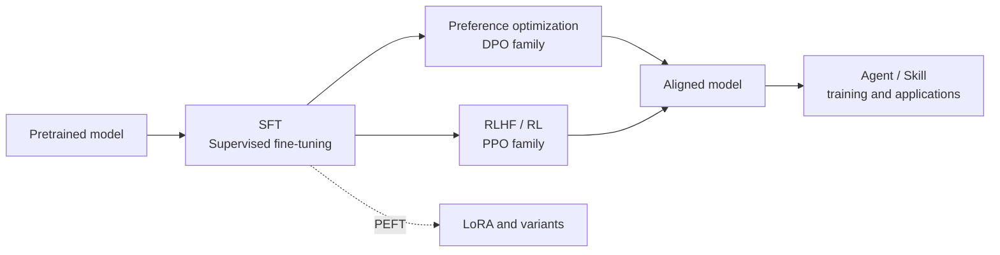

# How to Use This Knowledge Base

> LLM Atlas organizes LLM post-training knowledge as an "algorithm map": one page per algorithm, with a uniform structure and cross-links between pages.

::: warning Status
🚧 This page is a placeholder outline; the full text has not been written yet.
:::

## Knowledge Map Overview

## Reading Paths

TODO:

- [ ] Beginner path: SFT overview → LoRA → DPO → RLHF overview
- [ ] Advanced path: variant comparison pages for each family
- [ ] Standard page structure explained (motivation → formulas → comparison → implementation → tuning → references)

## What Each Section Covers

| Section | Question it answers |
| --- | --- |
| [SFT](/en/sft/) | How to teach a base model to follow instructions |
| [LoRA](/en/lora/) | How to fine-tune with less memory and fewer parameters |
| [Preference Optimization](/en/dpo/) | How to align with preferences without training an RM or running RL |
| [RLHF / RL](/en/rlhf/) | How to keep improving a model with reinforcement learning |
| [Agent](/en/agent/) | How to train and organize models that can use tools |

## Notation

All formulas across the site use the conventions in [Notation](/en/guide/notation).
