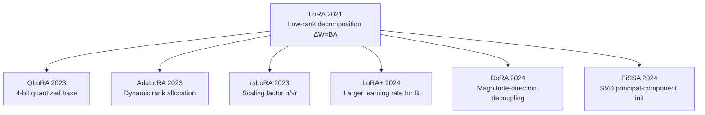

# LoRA and Variants Overview

> **In one sentence**: LoRA approximates the weight update with low-rank matrices, pushing trainable parameters below 1%; the variants keep improving on "initialization, scaling, quantization, and rank allocation".

::: warning Status
🚧 This page is a placeholder outline; the full text has not been written yet.
:::

## Family Evolution Map

## Variant Comparison

| Method | Core change | Extra overhead | Paper |
| --- | --- | --- | --- |
| [LoRA](/en/lora/lora) | $\Delta W = BA$ low-rank decomposition | — | 2021 |
| [QLoRA](/en/lora/qlora) | NF4-quantized base + LoRA | TODO | 2023 |
| [AdaLoRA](/en/lora/adalora) | Importance-based dynamic rank allocation | TODO | 2023 |
| [rsLoRA](/en/lora/rslora) | Scaling factor changed to $\alpha/\sqrt{r}$ | None | 2023 |
| [LoRA+](/en/lora/lora-plus) | Larger learning rate for $B$ | None | 2024 |
| [DoRA](/en/lora/dora) | Decoupled magnitude and direction updates | TODO | 2024 |
| [PiSSA](/en/lora/pissa) | Initialize from the principal singular components of $W_0$ | TODO | 2024 |

## TODO

- [ ] Selection decision tree: what to pick under memory constraints vs when chasing quality
- [ ] Shared hyperparameters: rank $r$, $\alpha$, target modules, dropout
- [ ] Survey of the quality gap between LoRA and full fine-tuning
