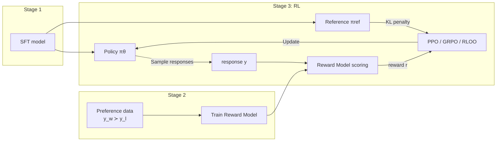

# RLHF / Reinforcement Learning Overview

> **In one sentence**: Keep optimizing a language model with reward signals (human preferences or verifiable rules) via reinforcement learning; PPO is the classic approach, while variants like GRPO simplify the critic and reduce cost.

::: warning Status
🚧 This page is a placeholder outline; the full text has not been written yet.
:::

## The Classic Three-Stage RLHF Pipeline

## Optimization Objective

$$
\max_{\pi_\theta} \; \mathbb{E}_{x \sim \mathbb{D},\, y \sim \pi_\theta(\cdot|x)} \left[ r(x, y) \right] - \beta \, \mathbb{D}_{\text{KL}}\!\left[ \pi_\theta(\cdot|x) \,\|\, \pi_{\text{ref}}(\cdot|x) \right]
$$

## Algorithm Comparison

| Algorithm | Critic/Value | Advantage estimation | Memory | Notable users |
| --- | --- | --- | --- | --- |
| [PPO](/en/rlhf/ppo) | Required | GAE | High (4 models) | InstructGPT |
| [GRPO](/en/rlhf/grpo) | Not required | Group-relative | Medium | DeepSeek |
| [RLOO](/en/rlhf/rloo) | Not required | Leave-one-out baseline | Medium | TODO |
| [REINFORCE++](/en/rlhf/reinforce-plus-plus) | Not required | Global baseline | Medium | TODO |

## Subtopics

- [Reward Model](/en/rlhf/reward-model): where the reward comes from
- [PPO](/en/rlhf/ppo) → [GRPO](/en/rlhf/grpo) → [RLOO](/en/rlhf/rloo) → [REINFORCE++](/en/rlhf/reinforce-plus-plus): the algorithm evolution line

## TODO

- [ ] Choosing between RLHF and the DPO family
- [ ] The rise of RLVR (verifiable rewards) and its relationship to this section (future expansion)
- [ ] References: InstructGPT, DeepSeekMath, DeepSeek-R1
