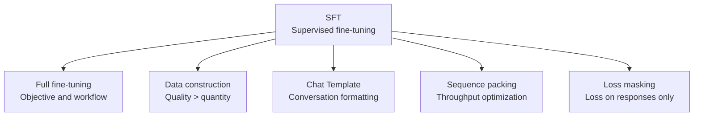

# SFT (Supervised Fine-Tuning) Overview

> **In one sentence**: Fine-tune a pretrained model on high-quality instruction–response pairs so that it turns from a "text continuator" into a "conversational assistant".

::: warning Status
🚧 This page is a placeholder outline; the full text has not been written yet.
:::

## Section Map

## Core Objective

$$
\mathcal{L}_{\text{SFT}}(\theta) = -\mathbb{E}_{(x, y) \sim \mathbb{D}} \left[ \sum_{t=1}^{|y|} \log \pi_\theta(y_t \mid x, y_{<t}) \right]
$$

## Subtopics

| Page | Contents |
| --- | --- |
| [Full Fine-Tuning](/en/sft/full-finetuning) | Standard SFT workflow, hyperparameters, differences from continued pretraining |
| [Data Construction](/en/sft/data-construction) | Data sources, quality filtering, mixing ratios, synthetic data |
| [Chat Template](/en/sft/chat-template) | Conversation templates, special tokens, multi-turn concatenation |
| [Sequence Packing](/en/sft/packing) | Packing multiple samples, attention isolation, throughput gains |
| [Loss Masking](/en/sft/loss-masking) | Which tokens get a loss, masking strategies for multi-turn dialogue |

## TODO

- [ ] Where SFT sits in the post-training pipeline (handoff to DPO/RLHF)
- [ ] Common failure modes: catastrophic forgetting, overfitting to templates, repetition
- [ ] References: InstructGPT, FLAN, LIMA
