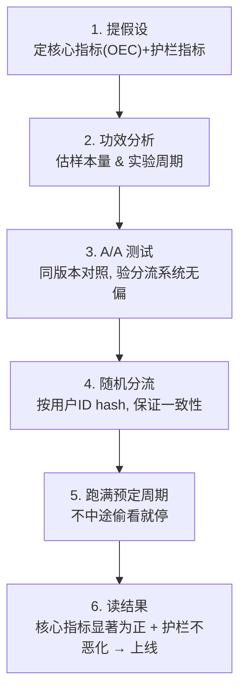

# 统计学基础：大厂的 A/B 实验怎么做

> **一句话**：离线评测告诉你"模型在题库上分数多少"，但"上线后用户是不是真的更喜欢新版本"只能靠**线上 A/B 实验**回答。A/B 的内核是一套统计学：用随机分流把"差异"归因到版本，再用**显著性检验**判断这个差异是真本事还是纯运气。

[评测章](/eval/) 讲的是上线前怎么用基准和裁判给模型打分；这一页讲上线后的最后一关——把新旧版本同时放给真实用户，用统计方法判断谁更好。它解释了「p 值、显著性、置信区间、统计功效」这些词到底在说什么，以及大厂跑一个 A/B 的标准动作和最常踩的坑。

## 一、为什么要 A/B：差异可能只是噪声

最朴素的想法是"新版本直接全量上线，看指标涨没涨"。问题是：指标天天都在波动——周末和工作日不同、有没有大促不同、不同地区不同。**你看到的涨跌，分不清是新版本的功劳，还是这些自然波动。**

A/B 实验（又叫**随机对照实验 / online controlled experiment**）的解法是：**把用户随机分成两组**——

- **对照组（A，control）**：看老版本；
- **实验组（B，treatment）**：看新版本。

随机分流保证两组用户在统计上几乎一样（年龄、地区、活跃度都均匀分布），唯一的差别就是看到的版本。这样两组指标的差异，就能干净地**归因到版本本身**——这正是"随机化"切断混杂因素、把相关变成因果的力量。

## 二、假设检验：A/B 的统计内核

就算随机分了组，两组指标也几乎不可能完全相等——哪怕给两组看一模一样的版本，数字也会有零点几个百分点的随机差异。所以真正的问题是：**观测到的这点差异，是真实效果，还是抽样噪声？**

回答它的工具叫**假设检验（hypothesis testing）**，逻辑像法庭的"无罪推定"：

- **原假设 $H_0$（null hypothesis）**：两版本没有差异（"被告无罪"）。这是默认立场。
- **备择假设 $H_1$**：两版本有差异（"被告有罪"）。这是你想证明的。
- **检验逻辑**：先假设 $H_0$ 成立（真没差异），然后问——**如果真没差异，纯靠运气也能看到当前这么大（或更大）差异的概率有多大？** 这个概率就是 **p 值**。
- 如果 p 值很小（小到不像是运气），就**拒绝 $H_0$**，宣布差异"**统计显著（statistically significant）**"。

判断"多小算小"的门槛叫**显著性水平 $\alpha$**，业界惯例取 **0.05**：

$$
p < \alpha \;(\text{通常} 0.05) \;\Longrightarrow\; \text{拒绝 } H_0,\ \text{认为差异显著}.
$$

## 三、p 值：最常被误读的数字

p 值几乎是统计学里最容易理解错的概念，记住一句话就够：

> **p 值 = 假设两版本其实没差异时，纯靠运气也能观测到这么大差异的概率。** 它越小，"运气巧合"的解释就越站不住，差异越可能是真的。

三个高频误读，务必避开：

- ❌ p 值**不是**"新版本更好的概率"，也不是"$H_0$ 为真的概率"。
- ❌ p 值**不反映差异有多大**。p 值很小只说明"几乎肯定有差异"，没说差异是 0.1% 还是 10%。
- ❌ **统计显著 ≠ 业务重要**。样本量足够大时，0.01% 的微小提升也能"显著"，但可能根本不值得上线。差异的实际大小叫**效应量（effect size）**，要和显著性分开看。

## 四、置信区间：比 p 值更有用

大厂看 A/B 结果时，往往更爱看**置信区间（confidence interval, CI）**，因为它同时告诉你**方向**和**幅度**。

**95% 置信区间**的含义：如果把实验重复很多次，约 95% 的区间会盖住真实的差异值。实践中这样读：

- **区间不包含 0** ↔ 差异显著（等价于 p < 0.05）；
- **区间多宽** 反映估计有多精确——区间窄说明结论可靠，区间宽说明样本还不够、需要更多流量。

比如新版本点击率提升的 95% CI 是 `[+0.5%, +2.3%]`：不含 0 → 显著为正，且提升大概率在 0.5%~2.3% 之间。如果是 `[-0.3%, +1.8%]`，跨过了 0 → **不能下结论**。[Arena 与人类偏好](/eval/arena) 给模型排名时也用置信区间判断"两个模型的胜率差是否可信"，是同一套思维。

## 五、两类错误、统计功效与样本量

检验会犯两种错，必须同时盯：

| | 真相：无差异 | 真相：有差异 |
| --- | --- | --- |
| **判定：有差异** | ❌ 第一类错误（假阳性，概率 $\alpha$） | ✅ 正确 |
| **判定：无差异** | ✅ 正确 | ❌ 第二类错误（假阴性，概率 $\beta$） |

- **第一类错误（假阳性）**：本没差异却判有 → 上线了一个其实没用、甚至有害的版本。由 $\alpha$（0.05）控制。
- **第二类错误（假阴性）**：本有差异却没测出 → 错过了一个好版本。由 $\beta$ 控制。
- **统计功效（power）= $1-\beta$**：真有差异时，能成功检测出来的概率。业界惯例要求 **≥ 80%**。

**功效直接决定要多少样本量。** 样本量由四个量共同定下：

$$
\text{样本量} \;\propto\; \frac{\text{基线方差}}{(\text{MDE})^2} \times f(\alpha,\ \text{power})
$$

其中 **MDE（最小可检测效应，minimum detectable effect）** 是你希望"测得出来"的最小提升。关键直觉：**你想检测的提升越小（MDE 越小），需要的流量越大**——想稳定地测出 0.1% 的提升，需要的样本量是测 1% 的约 100 倍。流量不够却想测微小提升，实验注定测不出来（功效不足）。所以实验**开跑前**就要做功效分析、估好样本量和需要跑多久，而不是事后才发现样本不够。

## 六、大厂的标准流程

一个规范的 A/B 实验大致是这样跑的：

几个关键点：

- **指标分两类**：**核心指标（OEC, Overall Evaluation Criterion）**是你要优化的目标（如留存、转化）；**护栏指标（guardrail）**是不能被牺牲的底线（如延迟、崩溃率、退订率）。新版本必须"核心涨、护栏不恶化"才上。
- **A/A 测试**：上线前先拿两组同样的老版本对照，理论上应该"无显著差异"。如果 A/A 都能测出显著差异，说明分流系统或指标埋点有 bug，结果不可信。
- **跑满周期**：通常至少覆盖一个完整的周（抹平工作日/周末差异），且**中途不能因为"看到显著了"就提前停**——原因见下一节。

## 七、四个最常见的坑

| 坑 | 怎么回事 | 对策 |
| --- | --- | --- |
| **偷看（peeking）** | 每天盯着结果，一看到 p<0.05 就停。反复检验会让假阳性率远超 5% | 预先固定样本量；或用**序贯检验**（见下节） |
| **多重比较** | 一次测 20 个指标，纯靠运气也会有约 1 个 p<0.05 | Bonferroni / FDR 校正，调低单指标阈值 |
| **辛普森悖论** | 每个子群都是新版赢，合并后却输（因两组人群构成不同） | 检查分流是否均匀，分层看结果 |
| **样本比例失衡（SRM）** | 本该 50/50，实际却是 52/48 | 说明实验有 bug（分流/日志），结果作废，先修再说 |

"偷看"最隐蔽也最致命：**每多看一次，就多给了一次"撞上随机巧合"的机会**。盯着一个本无差异的实验连续看，迟早会有某一天 p<0.05。这就是为什么纪律是"要么预先定好样本量跑满，要么用专门允许随时看的方法"。

## 八、进阶武器（各一句话）

- **方差缩减（CUPED）**：用实验**开始前**的用户数据当协变量，扣掉个体基线差异，降低指标方差——同样流量下更快达到显著。是大厂提升实验灵敏度的标配。
- **序贯检验 / always-valid p 值**：专门设计成"允许随时查看也不会抬高假阳性"的检验方法，解决偷看问题，能在效果明显时提前下结论。
- **多臂老虎机（bandit）**：不固定分流比例，而是动态把更多流量导给当前更优的版本，在"探索"和"尽快收益"间权衡，适合追求线上收益而非纯做因果推断的场景。

## 九、和 LLM 评测的关系

把这页和 [评测章](/eval/) 接起来，就是一条完整的"模型变好了吗"判定链：

- **上线前**：用 [固定基准](/eval/benchmarks) 和 [LLM-as-judge](/eval/llm-as-judge) 做离线粗筛和回归——便宜、快，但只代表"在题库上"的表现。
- **上线后**：用 **A/B 实验**让真实用户投票，看核心业务指标是否显著提升——这才是最终裁决。
- [Arena 与人类偏好](/eval/arena) 用 Bradley-Terry/Elo 给模型排名时，判断"两个模型的胜率差是否可信"靠的也是置信区间和显著性——和 A/B 同源。

一句话：**离线评测负责"别上线明显更差的"，线上 A/B 负责"确认真的更好再全量"。** 二者都怕同一件事——把噪声当成了真本事。

## 速查表

| 术语 | 一句话含义 |
| --- | --- |
| 原假设 $H_0$ | 默认立场：两版本无差异 |
| p 值 | 假设没差异时，纯靠运气看到这么大差异的概率（越小越不像运气） |
| 显著性水平 $\alpha$ | 拒绝 $H_0$ 的门槛，通常 0.05 |
| 统计显著 | p<α，差异不太可能是噪声（≠ 差异大、≠ 业务重要） |
| 效应量 | 差异的实际大小，和显著性分开看 |
| 置信区间 | 真值大概率落在的区间；不含 0 ↔ 显著 |
| 第一类错误 | 假阳性：没差异却判有（概率 α） |
| 第二类错误 | 假阴性：有差异却没测出（概率 β） |
| 统计功效 | 真有差异时能测出来的概率，1−β，惯例 ≥80% |
| MDE | 想测得出来的最小提升；越小需要样本越多 |
| A/A 测试 | 同版本对照，验证分流系统无偏 |
| 护栏指标 | 不能被牺牲的底线指标（延迟、崩溃率等） |

## 参考

- Kohavi, Tang & Xu. *Trustworthy Online Controlled Experiments: A Practical Guide to A/B Testing.* Cambridge University Press, 2020.
- Kohavi et al. *Controlled Experiments on the Web: Survey and Practical Guide.* Data Mining and Knowledge Discovery, 2009.
- Deng et al. *Improving the Sensitivity of Online Controlled Experiments by Utilizing Pre-Experiment Data (CUPED).* WSDM 2013.
