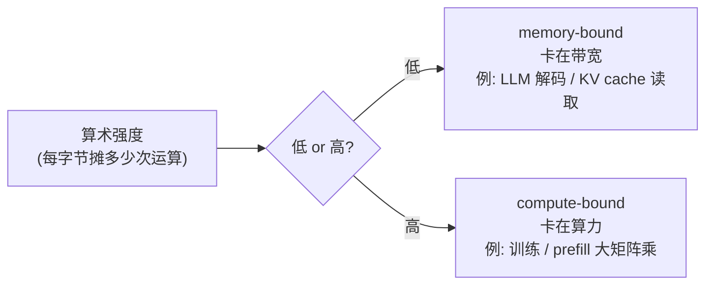

# GPU 基础：大模型为什么离不开它

> **一句话**：大模型的训练和推理，本质是海量矩阵乘法 + 海量数据搬运。GPU 用「成千上万个小核 + 超高带宽显存」把这两件事做到极致——读懂它的**算力（FLOPS）**、**显存带宽**、**显存层级**和**多卡互联**这四个数字，全站「显存墙 / 通信墙 / KV cache / FlashAttention / 量化」这些词就都有了着落。

这一页不假设你懂硬件。先讲清楚 GPU 凭什么适合大模型，再把工程上真正卡你的四个数字（算力、带宽、显存容量、互联）一个个讲透，最后给一张主流型号选型表。它是 [训练系统](/training-systems/)、[推理与解码](/inference/) 两章的共同前置。

## 一、为什么是 GPU，不是 CPU

CPU 和 GPU 的分工，用一句话概括：**CPU 是几个博士生（少而强，擅长复杂串行逻辑），GPU 是几千个小学生（多而弱，擅长同时做大量简单算术）**。

大模型的核心计算是矩阵乘法——成千上万个互不依赖的乘加，天然可以"同时算"。这正中 GPU 下怀：

| | CPU | GPU |
| --- | --- | --- |
| 核心数 | 几个~几十个强核 | 几千~上万个弱核 |
| 擅长 | 串行逻辑、分支、低延迟 | 大规模并行、高吞吐 |
| 类比 | 几个博士生 | 几千个小学生同时算加减乘除 |
| 大模型角色 | 调度、数据预处理 | 扛下几乎全部矩阵运算 |

所以训练 / 推理 LLM 时，GPU（或 TPU / NPU 等加速器）扛下几乎全部算力，CPU 只负责调度和喂数据。

## 二、硬件架构：SM / CUDA Core / Tensor Core

一张 NVIDIA GPU 由几十~上百个 **SM（Streaming Multiprocessor，流多处理器）** 组成，SM 是真正干活的基本单元。每个 SM 里又有两类计算核：

- **CUDA Core**：通用标量核，干常规的浮点 / 整数运算（逐元素加减乘、激活函数等）。
- **Tensor Core**：**专为矩阵乘加（MMA）设计的核**，一条指令算一小块矩阵乘法。它是大模型算力的真正来源——LLM 里绝大部分 FLOPS 来自 Tensor Core，而非 CUDA Core。后面讲精度时会看到，Tensor Core 支持 FP16/BF16/FP8 等低精度，是混合精度训练和量化推理能加速的硬件基础。

> 记一个直觉就够了：**衡量一张卡"算得多快"，看的是 Tensor Core 在 FP16/BF16 下的 TFLOPS；它决定矩阵乘法的天花板。**

## 三、显存层级：一座带宽金字塔

GPU 的存储不是一块铁板，而是一座金字塔——**越靠近计算核，越快越小越贵；越往外，越大越慢越便宜**：

| 层级 | 容量量级 | 带宽量级 | 特点 |
| --- | --- | --- | --- |
| 寄存器 / L1 / **SRAM**（片上） | KB ~ 几十 MB | 极高（~10+ TB/s） | 快但极小，FlashAttention 就靠它 |
| L2 缓存 | 几十 MB | 高 | 全 SM 共享 |
| **HBM**（显存，片外） | 几十~上百 GB | 高（~2–8 TB/s） | 平时说的"显存 80GB"就是这层 |
| 主机内存 / 跨卡 | 上百 GB+ | 低（PCIe ~64 GB/s） | 慢，要尽量避免来回搬 |

两个关键认知：

1. **"显存 80GB"指的是 HBM**。模型参数、梯度、优化器、KV cache 都住在这里。放不下 → 显存墙（见 [训练系统总览](/training-systems/)）。
2. **SRAM 极快但极小**，所以谁能把热数据留在 SRAM 里、少去 HBM 搬运，谁就快。[FlashAttention](/architecture/attention) 的核心思想正是如此：把注意力计算分块塞进 SRAM，避免把巨大的注意力矩阵写回 HBM——它优化的不是算力，而是**数据搬运**。这就引出了下一节最重要的概念。

## 四、算力 vs 带宽：两种瓶颈与 Roofline

新手最容易忽略的一点：**一个计算慢，未必是"算力不够"，更可能是"数据喂不进来"**。GPU 性能受两个上限夹击：

- **算力上限**：Tensor Core 每秒能做多少次乘加（TFLOPS）。
- **带宽上限**：HBM 每秒能搬多少字节进出计算核（TB/s）。

判断一个操作被哪个卡住，看它的 **算术强度（arithmetic intensity）= 计算量 ÷ 访存量**（每搬一字节能摊上多少次运算）：

- **计算密集（compute-bound）**：算术强度高，瓶颈在算力。典型是大矩阵乘法（训练、prefill 阶段）。
- **访存密集（memory-bound）**：算术强度低，瓶颈在带宽。典型是 LLM **自回归解码**——每生成一个 token，都要把整个 KV cache 和权重从 HBM 读一遍，却只做很少的计算。

把这两个上限画在一张图上，就是著名的 **Roofline 模型**：

**这个区分解释了全站一大半的推理优化为什么长那样**：

- LLM 推理解码是 memory-bound，所以 [KV Cache](/inference/kv-cache) 管理、[量化](/inference/quantization)（把权重从 16bit 压到 4bit，搬运量直接砍 4 倍）、[投机解码](/inference/speculative-decoding) 这些手段，本质都在**省带宽 / 提高算术强度**，而不是堆算力。
- 训练和 prefill 是 compute-bound，所以那边更关心 Tensor Core 利用率（MFU）、混合精度、[FlashAttention](/architecture/attention)。

> 一句话记忆：**训练拼算力，解码拼带宽。** 看到一个 LLM 优化，先问它省的是 FLOPS 还是 GB/s。

## 五、精度：FP32 / TF32 / FP16 / BF16 / FP8

低精度是 GPU 提速的另一大杠杆：**数字位数越少，搬运越少（省带宽）、Tensor Core 吞吐越高（省算力）**。代价是数值范围 / 精度下降。常见格式：

| 格式 | 位数 | 特点与用途 |
| --- | --- | --- |
| FP32 | 32 | 全精度基准，慢；现多用于优化器主副本 |
| TF32 | 19（硬件内部） | A100 起的折中，矩阵乘默认提速，几乎无感精度损失 |
| FP16 | 16 | 范围小、易溢出，需 loss scaling |
| **BF16** | 16 | 范围同 FP32、精度低，**训练首选**，无需 loss scaling |
| FP8 | 8 | H100 起支持，训练 / 推理进一步提速 |
| INT8 / INT4 | 8 / 4 | 主要用于推理 [量化](/inference/quantization) |

混合精度训练（参数算用 BF16、主副本和优化器用 FP32）的显存账，见 [训练系统总览](/training-systems/) 的 $16\Psi$ 估算；推理侧把权重压到 INT4/FP8 的得失，见 [量化](/inference/quantization)。

## 六、多卡互联：NVLink / NVSwitch / InfiniBand

一张卡放不下大模型，就得多卡协同（见 [训练系统](/training-systems/) 的五维并行）。这时**卡和卡之间怎么连、连得多快**，直接决定能扩到多大。带宽分两个层级：

| 互联 | 范围 | 带宽量级 | 用途 |
| --- | --- | --- | --- |
| **NVLink / NVSwitch** | 机内 GPU 互联（一台机器 8 卡） | 高（数百 GB/s ~ 1.8 TB/s） | 机内高频通信，TP 必须靠它 |
| **PCIe** | GPU↔CPU / 无 NVLink 时跨卡 | 低（~64 GB/s，PCIe 5.0） | 慢，尽量不走 |
| **InfiniBand (IB) / RoCE** | 跨机器、跨节点 | 中（NDR 单口 ~50 GB/s） | 千卡集群跨机通信 |

这正是 [训练系统总览](/training-systems/) 里"**通信墙**"和"**通信越重、放得越近**"切分原则的硬件根源：

- **张量并行 TP** 层内通信最频繁、最吃带宽 → 锁在单机内，靠 NVLink；
- **流水并行 PP / 数据并行 DP** 通信相对稀疏 → 可以跨机，走 IB。

> 国内常见的 **H800 / A800** 是 H100 / A100 的特供版，算力相近，但**主要砍的就是 NVLink 互联带宽**（如 H800 的 NVLink 从 900 GB/s 降到约 400 GB/s）——这就是为什么它在大规模分布式训练里更吃亏：通信墙更早撞上。

## 七、主流型号与选型

下表给出几代主力卡的近似关键规格（数字随版本 / 厂商有出入，记**量级和相对关系**即可，不必背具体值）：

| 型号 | 架构 | 显存 | 显存带宽 | FP16 算力(稠密) | 机内互联 |
| --- | --- | --- | --- | --- | --- |
| A100 | Ampere | 40 / 80 GB | ~2.0 TB/s | ~312 TFLOPS | NVLink ~600 GB/s |
| H100 (SXM) | Hopper | 80 GB | ~3.4 TB/s | ~990 TFLOPS（FP8 翻倍） | NVLink ~900 GB/s |
| H800 | Hopper(特供) | 80 GB | ~3.4 TB/s | ≈H100 | NVLink ~400 GB/s（被砍） |
| B200 | Blackwell | ~192 GB | ~8 TB/s | 大幅提升（主打 FP8/FP4） | NVLink ~1.8 TB/s |

**选型直觉：**

- **大规模训练**：看显存容量 + 算力 + **机内互联带宽**三者齐全。互联被砍（如 H800）在千卡训练里是硬伤。
- **推理部署**：解码是 memory-bound，优先看**显存带宽**和**显存容量**（容量决定能放多大模型 + 多长 KV cache）；纯算力反而不是第一约束，所以推理常用量化把模型塞进更小的卡。
- **省钱 / 中小规模**：消费级卡（如 4090，24GB）可做小模型微调 / 推理，但显存小、无 NVLink，多卡扩展差。

## 速查表

| 数字 | 量纲 | 决定什么 | 相关章节 |
| --- | --- | --- | --- |
| 算力 (Tensor Core TFLOPS) | 每秒乘加 | 训练 / prefill 快不快 | [训练效率](/training-systems/efficiency) |
| 显存带宽 (TB/s) | 每秒搬字节 | 解码快不快（memory-bound） | [KV Cache](/inference/kv-cache)、[量化](/inference/quantization) |
| 显存容量 (GB, HBM) | 能放多少 | 模型 / KV cache 放不放得下（显存墙） | [训练系统](/training-systems/) |
| 互联带宽 (NVLink/IB) | 卡间搬字节 | 能扩到多少卡（通信墙） | [模型并行](/training-systems/model-parallel) |
| SRAM 大小与速度 | 片上极快小存储 | FlashAttention 能省多少 HBM 搬运 | [注意力机制](/architecture/attention) |

读懂这五个数字，再回头看 [训练系统](/training-systems/) 的「显存墙 / 通信墙」、[推理](/inference/) 的「KV cache / 量化 / 投机解码」，就会发现它们全是在跟这张表里的某个上限较劲。

## 参考

- NVIDIA. *NVIDIA A100 / H100 Tensor Core GPU Architecture Whitepapers.*
- Williams et al. *Roofline: An Insightful Visual Performance Model for Multicore Architectures.* CACM 2009
- Dao et al. *FlashAttention: Fast and Memory-Efficient Exact Attention with IO-Awareness.* arXiv:2205.14135
