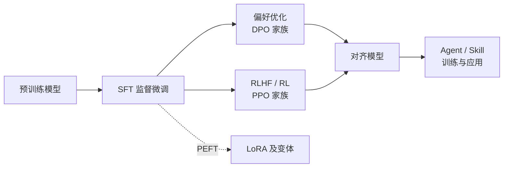

# 如何使用本知识库

> LLM Atlas 以「算法地图」的方式组织 LLM 后训练（post-training）知识：每个算法一页，结构统一，互相链接。

::: warning 状态
🚧 本页为占位大纲，正文尚未撰写。
:::

## 知识体系总览

## 阅读路线

TODO：

- [ ] 新手路线：SFT 总览 → LoRA → DPO → RLHF 总览
- [ ] 进阶路线：各家族变体对比页
- [ ] 每页的标准结构说明（动机 → 公式 → 对比 → 实现 → 调参 → 文献）

## 各版块定位

| 版块 | 回答的问题 |
| --- | --- |
| [SFT](/sft/) | 怎么让基座模型学会听指令 |
| [LoRA](/lora/) | 怎么用更少的显存和参数微调 |
| [偏好优化](/dpo/) | 怎么不训 RM、不跑 RL 就对齐偏好 |
| [RLHF / RL](/rlhf/) | 怎么用强化学习继续提升模型 |
| [Agent](/agent/) | 怎么训练和组织会用工具的模型 |

## 符号约定

正文公式统一使用 [符号约定](/guide/notation) 中的记号。
