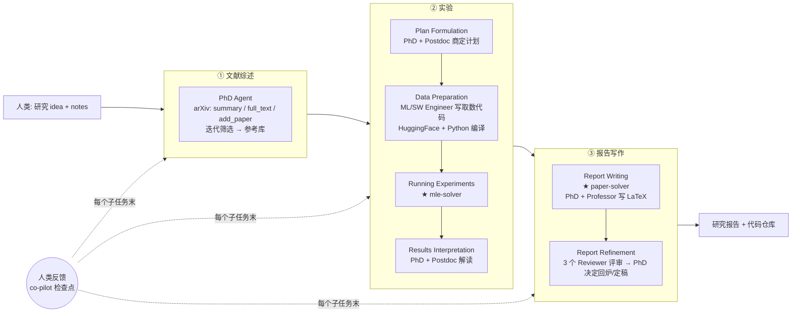

# Agent Laboratory（AMD / Johns Hopkins）：拟人化多 agent 把一条研究流水线跑完

**📄 [Agent Laboratory: Using LLM Agents as Research Assistants](https://arxiv.org/abs/2501.04227)**

2025-01 · AMD / Johns Hopkins / ETH Zurich（Samuel Schmidgall 等） · [代码](https://github.com/SamuelSchmidgall/AgentLaboratory)

**一句话**：一个开源、可复现的「研究助理」框架——人给一个研究 idea（外加一段 notes），系统用「PhD / Postdoc / ML Engineer / Professor」等拟人化 agent 把「文献综述 → 实验 → 写报告」三段繁琐流程跑完，输出一份研究报告 + 一个代码仓库；定位不是「取代研究者」，而是把工程苦力外包出去、让人专注创造性构思。

::: details 📖 论文原文 Abstract（英文）
Historically, scientific discovery has been a lengthy and costly process, demanding substantial time and resources from initial conception to final results. To accelerate scientific discovery, reduce research costs, and improve research quality, we introduce **Agent Laboratory**, an autonomous LLM-based framework capable of completing the entire research process. This framework accepts a human-provided research idea and progresses through three stages—**literature review, experimentation, and report writing** to produce comprehensive research outputs, including a code repository and a research report, while enabling users to provide feedback and guidance at each stage. We deploy Agent Laboratory with various state-of-the-art LLMs and invite multiple researchers to assess its quality by participating in a survey, providing human feedback to guide the research process, and then evaluate the final paper. We found that: (1) Agent Laboratory driven by o1-preview generates the best research outcomes; (2) The generated machine learning code is able to achieve state-of-the-art performance compared to existing methods; (3) Human involvement, providing feedback at each stage, significantly improves the overall quality of research; (4) Agent Laboratory significantly reduces research expenses, achieving an 84% decrease compared to previous autonomous research methods. We hope Agent Laboratory enables researchers to allocate more effort toward creative ideation rather than low-level coding and writing, ultimately accelerating scientific discovery.
:::

**相关**：[自动研究 Agent 总览](/harness/auto-agents/) · [The AI Scientist / v2](/harness/auto-agents/ai-scientist) · [AIDE](/harness/auto-agents/aide) · [Google AI co-scientist](/harness/auto-agents/ai-co-scientist) · [多 Agent](/agent/multi-agent)

> 图源：Schmidgall et al., *Agent Laboratory: Using LLM Agents as Research Assistants*（arXiv:2501.04227）Figure 1——输入研究想法+笔记，输出报告与代码仓库（用于学习注解，版权归原作者）。

## 动机与创新点：不追「取代科学家」，而做「把你的 idea 落地」的研究助理

科学家在任一时刻能探索的研究想法数量受限于时间与算力，只能"按预期影响力排序、优先做有限几个"，大量好想法因此被搁置。已有一类工作（ResearchAgent、[The AI Scientist](/harness/auto-agents/ai-scientist)）让 LLM **自己生成 idea、自己写论文**，追求"全自动产出可发表成果"；但 Si et al. (2024) 指出 LLM 在 idea 的**可行性与实现细节**上仍有明显短板。作者据此提出一个克制得多的定位：

> "we aim to design an autonomous agent pipeline that can assist humans toward implementing **their own** research ideas."

也就是说，**idea 由人提供**，系统只负责把这个 idea 走完"查文献 → 做实验 → 写报告"的繁琐流程。这条线把 LLM 摆在**辅助而非替代**的位置（complementary rather than replacement role），因此它天然强调 **co-pilot（人在环）模式**——人可以在每个子任务结束的检查点介入、给反馈、纠偏，而不必等整条流水线跑完才发现方向跑偏。

这与本章的 [The AI Scientist](/harness/auto-agents/ai-scientist)（自动生成 idea + 自动写论文 + 自动过评审）走的是两条相反的叙事；与 [AIDE](/harness/auto-agents/aide) 这类只优化"实验/ML 工程一段"的求解器相比，Agent Laboratory 把综述与写作两段也包进来，做成端到端、可被研究者直接拿来用的开源流水线。

**关键创新**：

- **拟人化三段流水线**：把研究拆成「文献综述 / 实验 / 报告写作」三阶段，每段配以熟悉职业角色命名的 agent（PhD、Postdoc、ML Engineer、SW Engineer、Professor、Reviewers），每个 agent 的 system prompt 围绕一个清晰职责来写，减少角色混淆。
- **mle-solver**：实验阶段的核心引擎——自主生成、编译、修错、打分、自反思、迭代优化 ML 代码，把「研究计划」变成「能跑出指标的实验」。在 MLE-Bench 子集上拿到比 MLAB / OpenHands / AIDE 更多的奖牌。
- **paper-solver**：写作阶段的引擎——按八段式学术结构搭脚手架、逐节生成 LaTeX、用一个 NeurIPS 式自动评审模型打分驱动迭代。
- **autonomous / co-pilot 双模式**：把"全自动"从一个全有或全无的开关，变成可调节的人机协作连续谱；论文用真人调研证明**加人反馈显著提升质量**。
- **极低成本**：gpt-4o 后端跑完整条流水线仅约 **$2.33/篇**，比前序自动研究方法便宜约 **84%**——把"自动研究"的单价压到可日常使用的量级。

## 方法：三阶段流水线 + mle-solver + paper-solver + 双运行模式

Agent Laboratory 的整体工作流由三个主要阶段构成——(1) Literature Review、(2) Experimentation、(3) Report Writing——各阶段有各自的子任务、工具与人-agent 角色分工。

> 图源：Schmidgall et al., *Agent Laboratory: Using LLM Agents as Research Assistants*（arXiv:2501.04227）Figure 2——三阶段、多角色、带工具与人在环的完整流水线（用于学习注解，版权归原作者）。

### 阶段一 · 文献综述：PhD agent 用 arXiv 迭代攒参考库

PhD agent 调 arXiv API，围绕用户的研究 idea 反复检索、评估相关性、精炼参考库。它有三个动作：

- **`summary`**：取与初始 query 最相关的 **top 20 篇**的摘要；
- **`full text`**：抽取某几篇的全文；
- **`add paper`**：把选中的摘要/全文纳入参考库。

关键是这是个**迭代过程而非一锤子买卖**——"the agent performs multiple queries, evaluates the relevance of each paper based on its content, and refines the selection to build a comprehensive review"。攒够预设篇数（N=max）后定稿，供后续阶段引用。

### 阶段二 · 实验：从定计划到 mle-solver 跑实验

实验阶段又拆成四个子任务，由 PhD / Postdoc / ML Engineer / SW Engineer 分工：

- **Plan Formulation**：PhD 与 Postdoc 对话敲定一份"可执行研究计划"——用哪些模型、哪些数据集、实验的高层步骤，由 Postdoc 用 `plan` 命令提交，作为后续子任务的指令集。
- **Data Preparation**：ML Engineer 用 `Python` 命令写取数/预处理代码，可用 `search HF` 搜 HuggingFace 数据集；SW Engineer 用 `submit code` 提交前，代码先过一遍 Python 编译器，**迭代执行直到无编译错误**。
- **Running Experiments**：核心，交给 **mle-solver**（见下节）。
- **Results Interpretation**：PhD 与 Postdoc 讨论 mle-solver 产出的结果，达成一个"能支撑论文的有意义解读"，由 Postdoc 用 `interpretation` 命令提交，作为写作阶段的基础。

### mle-solver：自主生成-编译-打分-反思的实验求解器

mle-solver 是把"研究计划"变成"能跑出指标的代码"的引擎。它从文献综述与研究计划出发产出初始代码（第一步程序为空、需从零生成，作为初始 *top scoring program*），然后在一个**维护着一池高分程序**的循环里迭代：

> 图源：Schmidgall et al., *Agent Laboratory: Using LLM Agents as Research Assistants*（arXiv:2501.04227）Figure 3——mle-solver 的命令执行/代码执行/打分/反思/稳定五个环节（用于学习注解，版权归原作者）。

- **A. 命令执行（Command Execution）**：从高分程序池里采一个程序，用两种操作精修——**`EDIT`** 指定一段行号、把其间代码替换为新生成的代码；**`REPLACE`** 直接重写整个 Python 文件。这等价于在"程序空间"里做带自评分的树搜索：作者类比 LLM reasoning tree search 与 [AIDE](/harness/auto-agents/aide) 的 Solution Space Search，但强调"AIDE 是为 Kaggle 设计、只抽取 accuracy，而这里是给**研究代码与结果**打分"。
- **B. 代码执行（Code Execution）**：新程序过编译器查运行时错误。编译成功→返回分数、若高于池中既有程序则更新 top 列表；编译失败→**最多修 $N_{\text{rep}}=3$ 次**（$N_{rep}=3$），仍不行就报错、换一次新程序重来。
- **C. 程序打分（Program Scoring）**：编译通过的程序送进一个 **LLM reward model**，结合研究计划、产出代码与观测输出，"on a scale from 0 to 1"给分——越贴合初始目标越接近 1。
- **D. 自反思（Self-Reflection）**：无论成败都生成一段反思——编译失败就反思"下轮怎么修"，成功就反思"怎么把分提得更高"，让系统**从错误中学习**、跨迭代改进。
  > 举例：某次 `REPLACE` 生成的训练脚本因为 batch_size 写成字符串而崩，self-reflection 记下"下一轮把超参类型对齐"；下一轮据此修好并涨了分，这条经验被带进后续迭代。
- **E. 性能稳定（Performance Stabilization）**：两招防"性能漂移"——**top program sampling**（维护一池高分程序，每次执行命令前随机采一个，兼顾多样性与质量）+ **batch-parallelization**（每步同时做 N 个修改、选最优去替换池中最差者）。两者都用高熵采样，在"探索新解"与"打磨已有解"之间取平衡。

### paper-solver：八段式脚手架 + LaTeX 迭代 + 自动评审打分

写作阶段由 PhD 与 Professor agent 把研究发现综合成一份学术报告，引擎是 **paper-solver**。作者特意澄清它的定位："paper-solver does **not** aim to entirely replace the academic paper-writing process, but rather to **summarize** the research ... so that the researcher *using* Agent Laboratory understands what has been accomplished"——它产出的是"给人看、便于继续推进"的报告，而非主张可直接投稿的终稿。

> 图源：Schmidgall et al., *Agent Laboratory: Using LLM Agents as Research Assistants*（arXiv:2501.04227）Figure 4——paper-solver 的脚手架/检索/编辑/评审四环节（用于学习注解，版权归原作者）。

四个环节：

- **A. 初始脚手架（Initial Report Scaffold）**：先生成一个**八段式标准结构**的论文骨架——Abstract、Introduction、Background、Related Work、Methods、Experimental Setup、Results、Discussion，每节插占位符、带 LaTeX 编译所需格式，确保结构完整、符合学术惯例。
- **B. arXiv 研究（Arxiv Research）**：搭脚手架时允许 paper-solver 再访 arXiv（与综述阶段同一接口），按某节实际需要扩展引用——非强制，但给了"边写边补文献"的能力。
- **C. 报告编辑（Report Editing）**：用 `EDIT` 命令对 LaTeX 做逐行精修，每次集成改动后**重新编译 LaTeX 校验无误**，迭代提升论证清晰度、格式合规与学术深度。
- **D. 论文评审（Paper Review）**：用一个改编自 [The AI Scientist](/harness/auto-agents/ai-scientist)（Lu et al. 2024）的**自动评审系统**给报告打分——LLM 扮演 NeurIPS 评审，按 originality/quality/clarity/significance/soundness/presentation/contribution 等维度评分。作者称该评审器在 500 篇 ICLR 2022 论文上达到"人类级准确率"（65% vs 人类 66%），校准后 F1 甚至超过人类（0.57 vs 0.49）。
  > 举例（论文给的 o1-mini 评审样例，主题"word order sensitivity"）：Strengths 列"实验设计完整、用了知名数据集 RACE"，Weaknesses 列"对额外去偏方法探索有限、局限讨论不深"，最终 `"Overall": 7, "Decision": "Accept"`——这个结构化打分就是 paper-solver 迭代的奖励信号。

**Report Refinement（报告精炼）**：三个 Reviewer agent 模拟 NeurIPS 同行评审给出意见，PhD agent 据此**决定定稿、还是回炉某个更早的子任务**（重新规划/实验/解读），形成图中底部的 `report revisions` 回环——模拟真实学术修订过程。

### 双运行模式：autonomous vs co-pilot

- **Autonomous（全自动）**：除提供初始 idea 外无人介入，每个子任务完成即自动进入下一个。
- **Co-pilot（人在环）**：在**每个子任务末设检查点**，人审阅该阶段产物（如综述摘要、生成的报告），可以放行、也可以"附上高层 notes 让 agent 重做这段以改进表现"。
  > 举例：综述阶段漏掉了某篇关键论文、或实验没用到你想要的某个技术，co-pilot 让你当场指出、要求 agent 补上，而不必等整条流水线跑完。

这把"全自动"从全有/全无的开关变成可调节连续谱，也是它比纯黑箱系统更贴合真实科研工作流的原因。

## 实验结果：质量随后端而变、成本骤降、mle-solver 拿牌

作者从四个角度评估：不同 LLM 后端下的**自动模式质量**（真人评分）、**co-pilot 模式质量**、**运行时成本/时间/成功率**，以及把 **mle-solver 单独拉到 MLE-Bench** 上比。后端覆盖 gpt-4o、o1-mini、o1-preview。

### 自动模式：质量随后端而变，自动评分系统性高估

10 名 PhD 志愿者对 15 篇（5 主题 × 3 后端）自动生成的论文按 1–5 打分（实验质量 / 报告质量 / 有用性）：

| 后端 | 实验质量 | 报告质量 | 有用性 |
| --- | --- | --- | --- |
| gpt-4o | 2.6 | 3.0 | 4.0 |
| o1-mini | **3.2** | 3.2 | 4.3 |
| o1-preview | 2.9 | **3.4** | **4.4** |

- **o1-mini 实验质量最高**、**o1-preview 报告质量与有用性最高**，gpt-4o 在各维度普遍垫底。
- 换成 NeurIPS 式真人评审（满分 10），三后端 overall 仅 gpt-4o 3.5 / o1-mini 3.8 / o1-preview 4.0——**均低于 NeurIPS 接收线 5.85**，说明纯自动模式离"可发表"还有距离。
- 一个重要发现：**自动评审显著高估质量**——自动评审 overall 均值 6.1/10，真人只给 3.8/10（**低 2.3 分**）。作者由此强调"未来工作应让真人评分与自动评分并列，才能更准地理解生成论文的质量"。

### Co-pilot 模式：加人反馈一致提升质量

o1-mini 后端、人在每个子任务给反馈：工具体验上 utility 3.5 / continuation 3.75 / satisfaction 3.63 / usability 4.0（满分 5），多数参与者愿意继续使用。外部评审对比"co-pilot vs 自动"：co-pilot 在 quality（**+0.75**）、soundness（+0.48）、overall（**+0.58**）上明显更高——印证 abstract 的论断"human involvement ... significantly improves the overall quality"。不过 co-pilot overall 4.38/10 仍比 NeurIPS 接收线 5.85 低约 1.45 分。

### 成本 / 时间 / 成功率：gpt-4o $2.33 跑完整流程

> 图源：Schmidgall et al., *Agent Laboratory: Using LLM Agents as Research Assistants*（arXiv:2501.04227）Figure 9——mle-solver 与 MLAB / OpenHands / AIDE 在 MLE-Bench 子集上的奖牌对比（用于学习注解，版权归原作者）。

| 后端 | 整条流程成本 | 整条流程耗时 | 整体成功率 |
| --- | --- | --- | --- |
| gpt-4o | **$2.33** | **1165 s** | 94.3% |
| o1-mini | $7.51 | 3617 s | 92.8% |
| o1-preview | $13.10 | 6201 s | **95.7%** |

- **成本**：gpt-4o 仅 **$2.33/篇**，比前序自动研究方法（Lu et al. ~$15）便宜约 **84%**（约 6.4×）；最贵的环节是 Report Writing（o1-preview 该段就花 $9.58）。
- **成功率**：整体都较高，唯一明显短板是**文献综述阶段**（gpt-4o/o1-mini/o1-preview 分别只有 60%/70%/80% 成功率）——后文 failure mode 指出 agent 容易反复调 `summarize` 直到步数耗尽而终止。
- **mle-solver 在 MLE-Bench 子集（10 个 Kaggle 挑战）**单拎出来比：拿到 **4 枚奖牌（2 金 1 银 1 铜）**，多于 OpenHands（2 金）、AIDE（1 金 1 铜）、MLAB（0）；**6/10** 高于人类中位（AIDE 5/10、OpenHands 2/10、MLAB 0/10），且一致性更高。

> 看榜须知：以上分数的口径、后端、test-time 设置与人评样本量各异，跨系统直接比绝对值意义有限；当作"同期端到端科研 agent 在成本-质量上的量级参照"即可，定量结果以原论文为准。

### 务实的边界与失败模式

作者用一整节坦陈局限：

- **产出未达发表线**：自动模式 NeurIPS 式评分普遍低于接收均值 5.85，且 paper-solver 报告"qualitatively less satisfying"——这与 [The AI Scientist](/harness/auto-agents/ai-scientist) 追求"过同行评审"的叙事有本质区别，本框架明说只做"给人看的研究报告"。
- **自评不可靠**：LLM 当评审"agreement 53.3% vs 人类 56.1%"，主观研究质量判断仍偏弱，而 mle-solver / paper-solver 的奖励都建立在这种自评上。
- **结构僵化**：paper-solver 被约束成固定八段式、且 mle-solver/paper-solver 只能往论文里塞 2 张图。
- **幻觉**：弱后端（gpt-4o）会编造"没真正跑过的实验结果"（如凭空写出 learning rate、epoch 数）。
- **典型失败模式**：综述阶段反复 `summarize` 直到超步终止；mle-solver 偶尔生成 `exit()` 终止整个进程、或用 `subprocess.run()` 在宿主机跑系统命令（需加沙箱）；paper-solver 的 arXiv 检索可能查上百次才命中（后加 5 次上限）。

## 在自动研究 Agent 谱系里的位置

- **vs [The AI Scientist / v2](/harness/auto-agents/ai-scientist)**：AI Scientist 追求**全自动**生成 idea、写代码、做实验、写论文并以"过自动同行评审"为里程碑；Agent Laboratory 更克制——**idea 由人给**、定位"辅助而非替代"、强调 co-pilot，且开源易上手。有意思的是两者共用一套技术血缘：Agent Laboratory 的 paper-solver 评审器正是改编自 AI Scientist（Lu et al. 2024）的自动评审系统。
- **vs [AIDE](/harness/auto-agents/aide)**：AIDE 只做"实验/ML 工程一段"（把 Kaggle 指标做高、抽取 accuracy），Agent Laboratory 的 mle-solver 内置了一个类似的"程序空间树搜索 + 自评分"引擎，但**外面还包了综述与写作两段**，而且打分对象是研究代码与结果而非单纯 accuracy。在 MLE-Bench 子集上 mle-solver 的奖牌数还反超了 AIDE。
- **vs [Google AI co-scientist](/harness/auto-agents/ai-co-scientist)**：两者都强调与人协作，但 co-scientist 面向真实学科的**假设生成**、不跑 ML 实验代码；Agent Laboratory 面向 **ML 研究本身**、核心是写代码做实验。
- **后续工作 AgentRxiv（arXiv:2503.18102）**：同团队把单条 Agent Laboratory 流水线推向**多实例协作**——让多个 Agent Laboratory 共享研究成果、累积式推进，是从"单 agent 流水线"走向"协作式自治研究"的延伸。
- 整体定位与"自动科研 agent 竞赛"背景见 [自动研究 Agent 总览](/harness/auto-agents/)。
