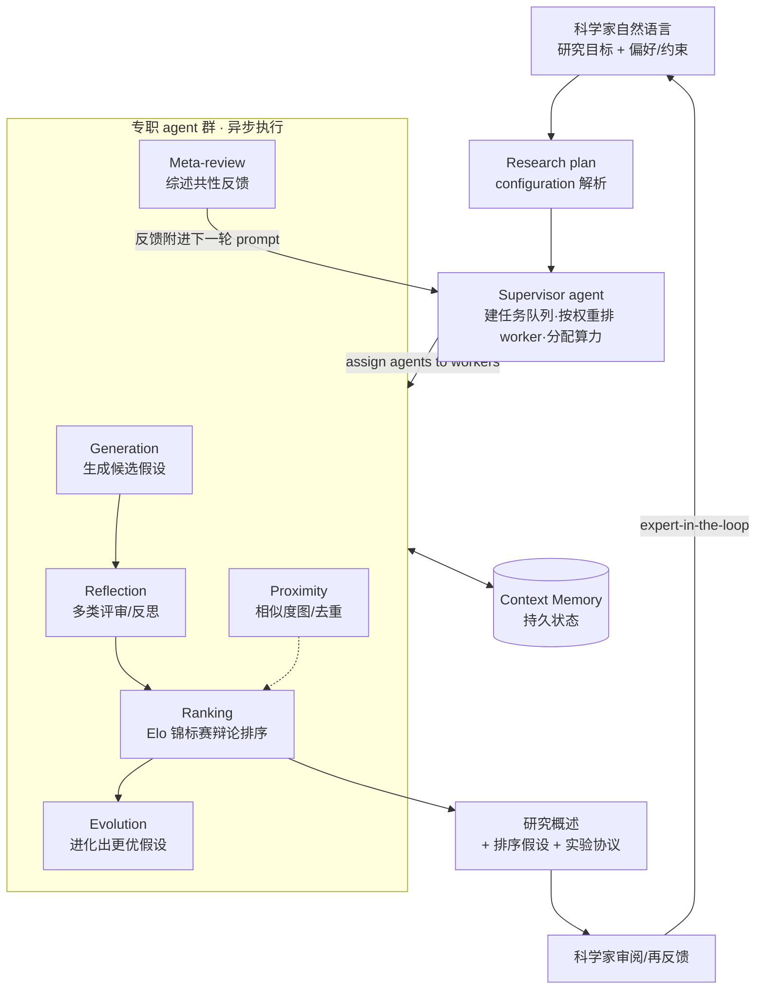

# Google AI co-scientist（Google / DeepMind）：生成—辩论—进化的科学假设多 Agent 系统

**📄 [Towards an AI co-scientist](https://arxiv.org/abs/2502.18864)**

2025-02 · Google Cloud AI Research / Google Research / Google DeepMind（含 Houston Methodist、Sequome、帝国理工 Fleming Initiative、斯坦福医学院等合作）

**一句话**：基于 Gemini 2.0 的多 agent 系统，定位为「虚拟科研合作者（co-scientist）而非自治科学家」——科学家用自然语言给出研究目标，系统用「生成—辩论—进化」的方式产出新颖假设、研究概述与可执行实验协议；它不写论文、不替人下结论，而是把**扩展 test-time compute（推理时算力）** 落到科学推理上，加速生物医药等学科最依赖经验直觉的「提出好假设」环节。

::: details 📖 论文原文 Abstract（英文）
Scientific discovery relies on scientists generating novel hypotheses that undergo rigorous experimental validation. To augment this process, we introduce an **AI co-scientist**, a multi-agent system built on Gemini 2.0. The AI co-scientist is intended to help uncover new, original knowledge and to formulate demonstrably novel research hypotheses and proposals, building upon prior evidence and aligned to scientist-provided research objectives and guidance. The system's design incorporates a **generate, debate, and evolve** approach to hypothesis generation, inspired by the scientific method and accelerated by **scaling test-time compute**. Key contributions include: (1) a multi-agent architecture with an asynchronous task execution framework for flexible compute scaling; (2) a tournament evolution process for self-improving hypotheses generation. Automated evaluations show continued benefits of test-time compute, improving hypothesis quality. While general purpose, we focus development and validation in three biomedical areas: drug repurposing, novel target discovery, and explaining mechanisms of bacterial evolution and anti-microbial resistance. For drug repurposing, the system proposes candidates with promising validation findings, including candidates for acute myeloid leukemia that show tumor inhibition *in vitro* at clinically applicable concentrations. For novel target discovery, the AI co-scientist proposed new epigenetic targets for liver fibrosis, validated by anti-fibrotic activity and liver cell regeneration in human hepatic organoids. Finally, the AI co-scientist recapitulated unpublished experimental results via a parallel in silico discovery of a novel gene transfer mechanism in bacterial evolution. These results, detailed in separate, co-timed reports, demonstrate the potential to augment biomedical and scientific discovery and usher an era of AI empowered scientists.
:::

**相关**：[The AI Scientist](/harness/auto-agents/ai-scientist) · [Agent Laboratory](/harness/auto-agents/agent-laboratory) · [AIDE](/harness/auto-agents/aide) · [多 Agent 编排](/agent/multi-agent)

> 图源：Gottweis et al., *Towards an AI co-scientist*（arXiv:2502.18864）Figure 1——(a) 多 agent 系统设计、(b) 三项验证总结（蓝色为科学家输入、红色为 co-scientist agent/输出）（用于学习注解，版权归原作者）。

## 动机与创新点：做「合作者」而非「自治科学家」，把 test-time compute 落到科学推理

现代科学突破越来越来自**跨学科桥接**——论文开篇就举 CRISPR（化学诺奖）与 Hinton/Hopfield（物理诺奖）为例，指出研究者面对的是"既要学科纵深、又要跨学科洞见"的 *breadth and depth conundrum*。但单个专家很难同时拥有两者，而真正瓶颈往往不在「读懂已知」，而在**生成值得验证的新假设**这一最依赖经验与直觉的环节。

co-scientist 的关键定位是 **scientist-in-the-loop 的协作者**，而非端到端自动化科学：

> This work does not aim to completely automate the scientific process with AI. Instead, the co-scientist is purpose-built for a "scientist-in-the-loop" collaborative paradigm, to help domain experts augment their hypothesis generation process.

它不替科学家跑实验、下结论，而是**扩展科学家的思路、加速假设生成**；产出的是排序后的假设、研究概述（research overview）和实验协议，最终的实验验证与判定仍交还给人类。这与本章 [The AI Scientist](/harness/auto-agents/ai-scientist)、[Agent Laboratory](/harness/auto-agents/agent-laboratory) 那种"自己写代码、跑实验、产论文"的**自治科学家**路线形成鲜明对照。

方法论上，作者把假设生成显式建模为对**科学方法本身**的模仿——"a generate, debate, and evolve approach to hypothesis generation, inspired by the scientific method"——并借**扩展 test-time compute** 来提升假设质量：不是让模型一次给出最终答案，而是给系统更多"辩论 + 反思 + 进化"的算力预算，从同一批候选里筛出更扎实的假设。这把 [推理模型](/reasoning/) 里"想得更久 = 想得更好"的扩展规律迁移到了开放科学推理上。

**关键创新**：

- **生成—辩论—进化（generate–debate–evolve）的多 agent 闭环**：用一组各司其职的专职 agent 模拟科学方法的不同环节，靠 agent 间的批判性辩论而非客观指标来筛选假设。
- **异步任务执行框架 + 灵活算力扩展**：Supervisor agent 管理任务队列、按权重把专职 agent 排进 worker 进程，使系统能**按需弹性分配 test-time compute**，并随算力增加持续改进。
- **Elo 锦标赛式自我进化**：把所有假设放进基于 Elo 评分的两两辩论锦标赛，胜负更新评分、引导算力流向最有希望的候选，形成"自我改进循环（self-improving loop）"。
- **无需梯度的自我改进（Meta-review）**：Meta-review agent 把锦标赛与评审里的共性问题综述成反馈、附进下一轮各 agent 的 prompt，"feedback propagation and learning without back-propagation techniques"——不微调、不 RL 也能逐轮变好。
- **端到端湿实验验证**：在 AML 药物重定位、肝纤维化新靶点、细菌基因转移（AMR）三个复杂度递增的真实生物医药课题上，由独立实验外部验证，而非仅停在自动/主观评分。

## 方法：Supervisor 调度六个专职 agent + Elo 锦标赛 + 无梯度反馈循环

co-scientist 是构建在 **Gemini 2.0** 上的复合多 agent 系统，整套设计就是把"科学方法的归纳偏置（inductive biases derived from the scientific method）"显式编码进 agent 分工，**不引入任何额外学习/微调**。给定一个自然语言研究目标，系统默认要求产出满足五条标准：**对齐研究目标（Alignment）/ 可信（Plausibility）/ 新颖（Novelty）/ 可验证（Testability）/ 安全（Safety）**。

### 整体框架：研究目标 → 配置 → Supervisor 异步调度 → 研究概述

系统有四个高层组件：**自然语言接口**（科学家随时定义/细化目标、提供反馈，甚至贡献自己的假设）、**异步任务框架**、**专职 agent 群**、**持久 context memory**（跨长时程存取 agent 与系统状态，支持断点续算）。

流程是：研究目标先被解析成 **research plan configuration**（捕获偏好、属性、约束，以及"是否只要新颖假设""新颖性/可行性如何评分"等评估标准），交给 **Supervisor agent** 创建任务队列、按权重把专职 agent 排进 worker 进程异步执行。Supervisor 周期性把统计量（已生成多少假设、待评审多少、锦标赛进度、各生成方法的有效性等）写入 context memory，据此决定后续算力分配与是否到达终止状态。

> 举例：科学家输入"探索 ALS（肌萎缩侧索硬化）的某个生物学机制"，系统会先解析出"只要新颖、可湿实验验证、聚焦核孔复合体磷酸化"等配置（论文用的正是 NPC 磷酸化作为 ALS 致病机制这一 running example），再驱动下面的 agent 群迭代。

### 六个专职 agent：把科学方法拆成可调度的子任务

> 图源：Gottweis et al., *Towards an AI co-scientist*（arXiv:2502.18864）Figure 2——多 agent 架构设计：红框为专职 agent、蓝框为 scientist-in-the-loop 输入、红箭头为 agent 间反馈环（用于学习注解，版权归原作者）。

每个 agent 配独立 instruction prompt，由 Supervisor 编排，按需调用 web 搜索等外部工具：

- **Generation agent（生成）**：产出初始 focus area 与候选假设。四种技法——**web 搜索做文献探索**并 grounding；**模拟科学辩论**（self-critique / self-play 多轮对话收敛出精炼假设）；**迭代假设识别**（用条件推理跳挖可验证的中间假设再聚合）；**研究扩展**（参考上一轮的研究概述与 Meta-review 反馈，探索假设空间里没碰过的区域）。
- **Reflection agent（反思/评审）**：扮演科学同行评审，做多层级 review——**initial review**（不联网，快速枪毙明显有错/不新颖的）、**full review**（联网全文献核验正确性/质量/新颖性）、**deep verification review**（把假设拆成假设链与子假设逐条去上下文化地核验，定位细微推理或实验设计错误）、**observation review**（看该假设能否解释既有实验里的长尾观测）、**simulation review**（在脑内"world model"里逐步模拟机制/实验，找失败场景）、**recurrent/tournament review**（随系统知识增长动态调整评审）。

  > 举例（deep verification）：一个药物重定位假设会被拆成"该药能透过血脑屏障""该靶点在肿瘤中过表达"等子假设，每条独立核验；某条子假设错了，agent 还要判断它是不是**根本性**的——非根本错误留待后续 refine 阶段修。

- **Ranking agent（排序）**：核心抽象是一个 **Elo 锦标赛**——所有假设两两对决、用模拟科学辩论评出胜负，更新 Elo 分以排序，把算力优先导向最有希望的候选（详见下节）。
- **Proximity agent（相似度）**：异步计算假设间相似度、建 proximity 图，用于聚类去重、组织锦标赛对阵（相似假设更可能被两两对比），也方便科学家浏览相关概念。
- **Evolution agent（进化）**：持续改进锦标赛里的头部假设。手法包括 **grounding 增强**（找弱点→生成检索 query→补证据填推理缝）、**可行性改进**、**从已有假设获取灵感 / 组合多条头部假设、简化、out-of-box 发散思维**。关键设计：**Evolution 只产出新假设、不修改或替换原假设**——"each new hypothesis must also compete in the tournament"，让进化结果必须重新参赛证明自己，保护头部假设不被劣质改写污染。
- **Meta-review agent（元评审）**：综合所有评审与锦标赛辩论里的**共性模式**，生成 meta-review critique，反馈给各 agent；并把头部假设综述成给科学家的 **research overview**（可用约束解码套 NIH Specific Aims Page 等科研格式），还能推荐合适的领域专家做评审/合作。

### Elo 锦标赛与科学辩论：把「评分函数」交给 agent 互辩

co-scientist 没有客观损失函数，它的"评分函数"就是 **agent 之间的批判性辩论**。Ranking agent 用 **Elo 锦标赛**自动评估排序：新假设初始 Elo 设 **1200**，两两对决产生胜负、按 Elo 规则更新分数。Elo 的期望胜率遵循标准式

$$E_A = \frac{1}{1 + 10^{(R_B - R_A)/400}}$$

（$R_A, R_B$ 为两个假设当前评分），对局后按实际胜负与 $E_A$ 的偏差更新评分——胜过强者涨得多，输给弱者掉得多。为省算力做了优化：**头部假设之间走多轮科学辩论**（multi-turn scientific debate，聚焦新颖性/正确性/可验证性，缓解排序偏置），**低分假设只做单轮成对比较**；且优先让**相似的、以及新生成或排名靠前的**假设参赛。"靠多 agent 辩论 + 自我批判 + 排序竞争"来逼近好结果，是 [多 Agent 编排](/agent/multi-agent) 在科学发现场景的典型落地——与 [AIDE](/harness/auto-agents/aide) 在代码空间里按客观指标搜索不同，co-scientist 是在**假设空间**里用辩论做搜索与筛选。

### Meta-review：无需梯度的自我改进循环

co-scientist 的"学习"不靠微调或 RL，而靠 Meta-review 在**上下文层面**做反馈传播：

> the Meta-review agent enables feedback propagation and learning without back-propagation techniques (e.g., fine-tuning or reinforcement learning). The Meta-review agent generates feedback applicable to all agents, which is simply appended to their prompts in the next iteration.

它把多次评审/辩论中**反复出现**的问题综述出来，附进下一轮所有 agent 的 prompt。

> 举例（论文原文）：若某 ALS 药物重定位候选的评审里，只有约 90% 的评审正确指出了"血脑屏障通透性"问题，Meta-review 会把这条共性缺口提炼出来，确保此后 Reflection agent 的**每一次**评审都明确检查这一关键因素。

这套机制依托 Gemini 2.0 的长上下文检索与推理能力，使系统"随算力扩展在后续迭代中持续学习与改进"。系统还是 **model-agnostic** 的——框架可移植到其它/更强模型，未来 LLM 进步会直接抬升其能力。

### Expert-in-the-loop 与工具使用

科学家可在多处介入：**细化研究目标**、**手动评审**生成的假设（co-scientist 据此改进）、**贡献自己的假设/方案**进锦标赛与系统产物同台竞争、**指定后续方向**（如限定在某批先验文献内）。工具方面：web 搜索与检索是首要工具（保证 grounding 与时效）；面向约束搜索空间（如某类细胞受体、全部 FDA 批准药）时调用领域专用数据库；也能索引/检索科学家提供的私有文献库；并可把 **AlphaFold** 等专用 AI 模型当工具纳入（论文用蛋白设计例子做了定性演示）。

## 实验结果：Elo 与 GPQA 一致、随算力上升超越前沿模型，三项湿实验外部验证

### 自动评估：Elo 与 GPQA 准确率一致，且随 test-time compute 单调上升

由于深研无客观真值，作者先验证**自评 Elo 是否可信**：把 GPQA diamond（生物/物理/化学专家级多选难题）每道题当作研究目标喂进系统，按答案 Elo 分桶（1001–1050、1051–1100… 每 50 分一桶），统计每桶平均正确率。结果 Elo 越高、正确率越高，呈明显**一致性**（concordance）；取每题最高 Elo 的结果，co-scientist 在 GPQA diamond 上 **top-1 准确率 78.4%**。

随后在 **203 个跨学科研究目标**上把生成结果按时间分十桶，发现 best-Elo 与 top-10 平均 Elo 都**随 test-time compute 单调上升、未见饱和**——印证"自我改进循环确实在变好"。在 **15 个专家精挑的高难课题**子集上，与多条前沿基线对比：

> 图源：Gottweis et al., *Towards an AI co-scientist*（arXiv:2502.18864）Figure 5——co-scientist 与基线（Gemini 2.0 Pro/Flash Thinking、OpenAI o1/o3-mini-high、DeepSeek R1、Human Expert）的 Elo 对比（用于学习注解，版权归原作者）。

随算力增加，co-scientist 一致超越各前沿 LLM/推理模型与专家"best guess"；作者还观察到它能在专家 best-guess 之上**继续改进**（先与之并行、后超越），但强调这是初步发现、需进一步验证。

### 专家评估与安全性

在 11 个专家课题上请领域专家盲评偏好与新颖性/影响力：co-scientist 平均**偏好排名 2.36**（4 选 1，越低越好，最优），新颖性 **3.64**、影响力 **3.09**（满分 5），均优于 Gemini 2.0 Flash Thinking、Gemini 2.0 Pro、OpenAI o1 等基线，且专家偏好与相对 Elo 一致。换用 o3-mini / o1-preview / Gemini 2.0 Pro/Flash Thinking 当 LLM 评委做偏好排序，co-scientist 仍最受青睐。安全上，作者用前沿 LLM 造了 **40 个主题、1200 条对抗性研究目标**做初步安全分析，系统**全部通过**（成功拒绝危险/双用途请求）。

### 三项端到端生物医药湿实验验证

| 应用 | 任务性质 | 复杂度 | co-scientist 的产出与外部验证 |
| --- | --- | --- | --- |
| **药物重定位（AML）** | 组合搜索（约 2300 种已批准药 × 33 类癌型） | 中 | 提出含 KIRA6、Leflunomide 等的重定位候选；*in vitro* 在多株 AML 细胞系（含 MOLM13）于临床相关浓度抑制肿瘤活性 |
| **新治疗靶点（肝纤维化）** | 发现全新靶点 | 高 | 提出多个新表观遗传靶点；在人肝类器官中显示抗纤维化活性与肝细胞再生 |
| **细菌基因转移机制（AMR）** | 解释复杂系统机制 | 极高 | 独立提出 cf-PICIs 与多种噬菌体尾部相互作用以扩展宿主范围；**2 天内** in silico 复现了某团队耗时 10 余年、当时尚未发表的实验结论 |

三项验证复杂度递增、均有 expert-in-the-loop 指导并由独立湿实验外部核验，结论细节见各自的 co-timed 预印本。

> 看榜须知：这些 Elo 是**自评、非独立真值**（作者反复声明 auto-evaluation may favour attributes not aligned with scientists' preferences），专家评估为小样本（11–15 个课题）、主观，湿实验为案例性结果而非统计 benchmark；跨系统直接比绝对值意义有限，应作"同期多 agent 科学假设系统能力量级"的参照。

## 在自动科研 agent 谱系里的位置

co-scientist 与本章其它"自动科研"系统处于**不同象限**——别人多在自动化 ML 研究或文献综合，它专攻**真实自然科学的新假设生成、且与人协作不闭环**：

- **vs [The AI Scientist](/harness/auto-agents/ai-scientist) / [Agent Laboratory](/harness/auto-agents/agent-laboratory)**：那两者面向 **ML 研究**，要自己写代码、跑实验、产出论文，目标是端到端自动化；co-scientist 面向**真实生物医药**，只做假设与方案、把验证交还人类，是"加速器而非替代者"。论文亦明确区分：The AI Scientist "fully automated"，而 co-scientist 是 helpful collaborator。
- **vs [AIDE](/harness/auto-agents/aide)**：完全不同档位——AIDE 在**已知客观指标**上做 ML 工程搜索；co-scientist 在开放科学问题上生成假设，没有单一可优化指标，"评分函数"是 agent 互辩。
- **vs PaperQA2（FutureHouse）**：两者都偏生物医药文献，但 PaperQA2 专注**文献检索与综合**（自称在文献任务上超过博士/博后），co-scientist 强调**生成新假设**而非综合已知——论文特意把"only summarizing existing information"划为"deep research 工具已解决"的能力，自己要做的是 novelty。一个偏"读懂已知"，一个偏"提出未知"。
- **vs Boiko et al. "Coscientist"（GPT-4 化学实验自治体）**：名字相近但取向相反——那套高度自治、直接对接实验硬件、聚焦化学；co-scientist 显式走 scientist-in-the-loop、广谱适用、专注研究的**认知环节**而非动手执行。
- **vs Virtual Lab / data-to-paper / HypoGeniC**：同属"多 LLM agent 协作做科研"的探索，但 co-scientist 的差异点是 **test-time compute 扩展 + Elo 锦标赛自我进化 + 自动/专家/湿实验三重验证**的组合，而非纯 GPT-4 编排或仅靠主观人评/回溯数据。
- 更广的多 agent 编排背景见 [多 Agent 编排](/agent/multi-agent)；其"靠辩论与排序扩展推理"的内核，与 [推理模型](/reasoning/) 的 test-time scaling 一脉相承。

**务实的边界**：它不闭环（假设/方案产出后，实验验证与结论判定仍由人完成）；后端是**闭源 Gemini、未开源**，外部难独立复现其全部声明；公开案例集中在生物医药，向其它学科的泛化待观察；与所有 LLM 系统一样有幻觉风险，生成的假设/引用需专家严格筛查、不能盲信。
