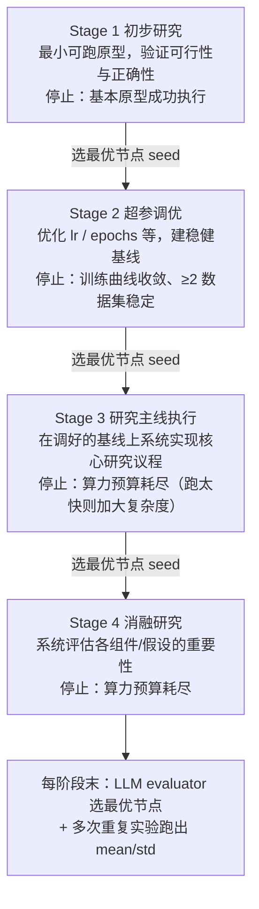

# The AI Scientist-v2（Sakana AI）：agentic 树搜索做到 workshop 级全自动科研

**📄 [The AI Scientist-v2: Workshop-Level Automated Scientific Discovery via Agentic Tree Search](https://arxiv.org/abs/2504.08066)**

2025-04 · Sakana AI（与 UBC、Vector Institute、Oxford FLAIR 合作） · [代码](https://github.com/SakanaAI/AI-Scientist-v2)

**一句话**：Sakana AI 的端到端全自动科研系统——自己提想法、写代码做实验、画图、写论文、再自动评审，全链路无人介入。v2 用 **experiment manager agent + 渐进式 agentic 树搜索**取代 v1 的线性流程与人工模板，把三篇全自动稿件投进 ICLR workshop，其中一篇通过真实人类同行评审——已知首例完全由 AI 生成、过审的论文。

::: details 📖 论文原文 Abstract（英文）
AI is increasingly playing a pivotal role in transforming how scientific discoveries are made. We introduce **The AI Scientist-v2**, an end-to-end agentic system capable of producing the first entirely AI-generated peer-review-accepted workshop paper. This system iteratively formulates scientific hypotheses, designs and executes experiments, analyzes and visualizes data, and autonomously authors scientific manuscripts. Compared to its predecessor (v1, Lu et al., 2024), The AI Scientist-v2 eliminates the reliance on human-authored code templates, generalizes effectively across diverse machine learning domains, and leverages a novel *progressive agentic tree-search* methodology managed by a dedicated *experiment manager agent*. Additionally, we enhance the AI reviewer component by integrating a *Vision-Language Model (VLM)* feedback loop for iterative refinement of content and aesthetics of the figures. We evaluated The AI Scientist-v2 by submitting three fully autonomous manuscripts to a peer-reviewed ICLR workshop. Notably, one manuscript achieved high enough scores to exceed the average human acceptance threshold, marking the first instance of a fully AI-generated paper successfully navigating a peer review. This accomplishment highlights the growing capability of AI in conducting all aspects of scientific research. We anticipate that further advancements in autonomous scientific discovery technologies will profoundly impact human knowledge generation, enabling unprecedented scalability in research productivity and significantly accelerating scientific breakthroughs, greatly benefiting society at large. We have open-sourced the code at https://github.com/SakanaAI/AI-Scientist-v2 to foster the future development of this transformative technology. We also discuss the role of AI in science, including AI safety.
:::

**相关**：[Auto-Agents 总览](/harness/auto-agents/) · [Agent Laboratory](/harness/auto-agents/agent-laboratory) · [AIDE](/harness/auto-agents/aide) · [Google AI co-scientist](/harness/auto-agents/ai-co-scientist) · [沙箱与工具执行](/harness/sandbox)

> 图源：Yamada et al., *The AI Scientist-v2: Workshop-Level Automated Scientific Discovery via Agentic Tree Search*（arXiv:2504.08066）Figure 1——三阶段总览：想法生成 / 树搜索实验 / 论文写作（用于学习注解，版权归原作者）。

## 动机与创新点：从「线性 + 人工模板」到「树搜索 + 实验管理 agent」

绝大多数科研 agent 只覆盖研究的某一段——查文献、或调模型、或写报告。The AI Scientist 系列的目标是把**整条机器学习研究流水线端到端自动化**：从「想做什么」到「交出一篇带图表、有引用、格式规范、可投稿的论文」，中间不需要人类介入。它第一次把一个长期被认为只属于人类的活动——产出并发表学术论文——放进了自动化的射程。

v1（Lu et al., 2024）证明了「全自动科研工作流 + 下游论文产出」的可行性，但有两条硬约束被作者反复点名：

- **依赖人工代码模板**——"it relied heavily on human-crafted baseline code templates"，每进一个新课题都要人先写一份基线模板，"significantly constraining its autonomy"，开箱即用能力差；
- **线性、浅层的实验**——"its linear and shallow experimentation approach prevented deeper exploration of scientific hypotheses"，一条路走到黑，复杂假设探不深。

v2 就是冲着这两点来的。作者把改进概括为三条贡献（"Our contributions are threefold"）：①去掉人工模板依赖，跨多个 ML 领域开箱即用；②引入 **experiment manager agent + 全新 agentic 树搜索算法**，让实验"deeper and more systematic"；③在评审/精修阶段引入 **VLM 反馈机制**，提升图表的质量、清晰度与图-文对齐。

| 维度 | The AI Scientist-v1 | The AI Scientist-v2 |
| --- | --- | --- |
| 代码起草 | Topic-Specific（每课题需人工模板） | **Domain-General（无模板，跨域）** |
| 执行规划 | Linear（线性迭代） | **Tree-Based（agentic 树搜索）** |
| 并行实验 | ✗ | **✓** |
| VLM 评审 | ✗ | **✓** |
| 人类评审结果 | 未投稿 | **达到 workshop 可录用水准** |

> 表 1（以原文为准）：v1 vs v2 关键演进。

**关键创新**：

- **Experiment Progress Manager（实验进度管理 agent）**：把科研实验显式拆成四个有明确停止条件的阶段（初步研究 → 调参 → 研究主线 → 消融），逐阶段选最优节点向下传递，模拟"从可行性评估到详尽消融"的真实科研节奏。
- **并行 agentic 树搜索**：把 v1 的线性迭代换成树搜索，每个节点是一份「计划 + 代码 + 执行结果 + 图 + 反馈」，buggy 节点优先调试、non-buggy 节点择优精修，多个新节点并行执行，保留有前途分支、剪掉失败分支。
- **VLM 反馈闭环**：在实验画图阶段和论文写作反思阶段都接入视觉语言模型，自动挑出"标签缺失、图例不清、图-文不符、正文/附录重复贴图"等问题，逼系统返工。
- **单遍写作 + reasoning 模型反思**：弃用 v1 基于 Aider 的增量写作，改为「一次性成稿 + 用 o1 一类推理模型做独立反思精修」。
- **首篇过审的里程碑**：三篇全自动稿投 ICLR ICBINB workshop，一篇均分 6.33 越过录用线——已知首例完全由 AI 生成、通过同行评审的论文（数字见「实验结果」）。

## 方法：四阶段实验管理 + 并行 agentic 树搜索 + VLM 反馈

整体仍是「想法生成 → 实验 → 写作 → 评审」四段闭环（见开头 Figure 1），但 v2 在「实验」一段做了大手术。底层用的采样超参与模型见原文附录 A，提示词见附录 B。

### 更高抽象的想法生成 + Semantic Scholar 新颖性把关

v1 的想法生成是"基于现有 codebase 提增量修改/扩展"，起点被既有代码框死。v2 把起点抬高一个抽象层级——"begins at a higher level of abstraction"，先像写**研究摘要或基金申请书**那样做开放式构思，再决定具体实现：

> The system is prompted to engage in more open-ended thinking about potential research directions, hypotheses, and experimental designs, akin to formulating a research abstract or grant proposal before committing to a specific implementation.

关键是把**文献检索工具（Semantic Scholar）接进生成回路**：构思阶段就实时查文献库，评估新颖性、定位相关前作，"ensuring ideas are grounded in the existing scientific landscape from the outset, rather than relying solely on post-hoc checks"——即新颖性是边想边查，而非事后补检。想法经新颖性检查后打分、归档（对应 Figure 1 左列）。

> 举例：给定 ICBINB workshop「负结果与意外发现」的主题，系统会先发散出约二十个 ML 研究想法（再改提示词面向金融/心理/农业等真实领域又发散一批），逐个用 Semantic Scholar 查重、打分，挑出彼此区分度高的若干个进入实验阶段。

### Experiment Progress Manager：四阶段实验流程

真实科研"从初步可行性评估走到详尽消融分析"是分阶段推进的。v2 用一个 **experiment progress manager agent** 把实验编排成四个阶段，每段有清晰职责和停止条件：

四阶段的原文定义：**Stage 1 Preliminary Investigation**——"establishing initial feasibility and correctness through a minimal working prototype"；**Stage 2 Hyperparameter Tuning**——调 lr、epochs 等关键超参做稳健基线；**Stage 3 Research Agenda Execution**——"systematically implementing the core research agenda based on the tuned baseline"；**Stage 4 Ablation Studies**——系统评估各组件重要性，为主结论提供严谨支撑。

每段都有**显式停止条件**：Stage 1 在原型成功跑通时结束；Stage 2 在训练曲线收敛、至少两个数据集稳定执行时结束；Stage 3/4 在算力预算耗尽时结束——其中 Stage 3 还会**检查实验时长**，"if runs finish much faster than the pre-allocated runtime, the system suggests increasing the complexity of experiments"，避免实验做得太轻。

每阶段结束，manager 用一个**专门的 LLM evaluator 按明确标准选出表现最好的节点**，把它作为种子（seed）传给下一阶段，并在每阶段末记录 checkpoint。为保证统计严谨性，manager 会在每阶段末**对选中的最优实验跑多次重复**，给图表和报告产出 mean ± std。

> 举例：Stage 1 先用一个最小 LSTM 跑通「序列建模 + 正则项」原型；Stage 2 在它上面扫 lr/隐藏维度把基线调稳；Stage 3 才真正把"组合性正则项"加进损失、铺开核心实验；Stage 4 再逐项消融（去掉正则项、换强度）确认每个组件的贡献。

### 并行 agentic 树搜索 + 专用节点类型

v1 严格线性——"each code refinement directly built on the immediately preceding experiment"，一旦走偏就回不来。v2 借鉴 AIDE（Jiang et al., 2025，把代码生成 + 树搜索用在 ML 工程上）的思路，把**树搜索铺到全部四个实验阶段**，实现"deeper and more systematic exploration"。

每个**实验节点**走同一套执行循环：LLM 先生成一份具体的实验计划 + 对应 Python 代码 → 立即在 Python 解释器里执行 → 出错就记下错误信息、标记该节点 **buggy**、终止本轮；执行成功则进入**画图阶段**——把训练/验证指标存进结构化 numpy 文件，生成可视化代码与图，**交给 VLM 批判**；VLM 若挑出问题（标签不清、缺图例、误导性可视化）该节点照样判 **buggy** 并记录反馈，只有跑通且过 VLM 审查的才算 **non-buggy**。一个节点是这样一组对象：

> a collection comprising an experiment script, a textual description of the high-level plan, an execution error trace (if applicable), experiment runtime, performance metrics, feedback from an LLM after running the script, a visualization script, file paths to the generated figures, feedback from a VLM on those figures, and the node's final status (either buggy or non-buggy).

每轮迭代，系统**并行**选若干节点扩展：以一个预设概率优先选 **buggy** 节点（先修 bug），否则选 **non-buggy** 节点做改进；在多个 non-buggy 节点间用 **best-first search**——由 LLM 综合性能指标、训练动态、图质量打分挑选。被选中的节点扩出一个新子节点：父节点 buggy 就尝试调试，non-buggy 就在前一版实验上精修改进；所有新子节点**并发执行**，"significantly accelerating the exploration process"。除 buggy/non-buggy 外，还引入四类专用节点：

- **Hyperparameter nodes**（Stage 2）：系统化探索不同超参组合，记录已试配置避免重复，调参出错则派生对应 debug 节点；
- **Ablation nodes**（Stage 4）：评估关键消融，同样记录已试条件、出错则 debug；
- **Replication nodes**：用**不同随机种子**重跑父实验，通常建多个，用于算 mean/std，增强结果稳健性；
- **Aggregation nodes**：特殊节点，**不做新实验**，只生成一段 Python 脚本去汇总 replication 节点的结果、产出显式带 mean/std 的合并图表。

作者强调这套结构"adopts a looser structure that guides the entire empirical research cycle"——比某些"rigidly follow predefined, fine-grained workflow graphs"的 agent 更灵活，又能在各阶段间保持连贯。数据集加载统一走 Hugging Face Hub（`datasets.load_dataset` 一行拉取标准 train/val/test split）。

> 图源：Yamada et al., *The AI Scientist-v2*（arXiv:2504.08066）Figure 2——四阶段树搜索与节点类型图例：non-buggy/buggy/best/hyperparameter/ablation/replication/aggregation（用于学习注解，版权归原作者）。

### VLM 反馈闭环：让图表也被自动审查

v1 不用视觉模型，v2 在**两个阶段**都接入 VLM（"incorporates VLMs at two phases"）：

- **实验画图阶段**：VLM 对生成的图即时反馈，确保"these visualizations effectively and accurately communicate experimental results"——发现问题就把节点判 buggy 返工；
- **论文写作反思阶段**：抽取每张图的截图 + caption + 正文里引用它的文字（靠关键词 "Figure X" 定位），一并喂 VLM 做**多项质检**——核对图-文是否对齐、揪出视觉清晰度问题（缺图例、标签不清），并**检测正文与附录是否重复贴同一张图**。

> 举例：若系统在正文与附录各放了一张几乎相同的训练曲线、且 caption 把"validation loss"写成了别的含义，VLM 会标出图-文不符与重复，触发返工——这正对应 workshop 评审后内部复盘发现的"figure caption 不准"类问题。

### 单遍写作 + reasoning 模型反思

写作阶段也简化了：v1 用基于 Aider（Gauthier, 2024）的**增量式**写作，v2 改成**一次性单遍成稿 + 一个独立的反思阶段**，反思由 o1（OpenAI, 2024）一类**推理模型**驱动。反思时系统被告知目标页数（如 workshop 的 4 页上限）与当前 PDF 实际长度，让它**自动满足投稿格式要求而无需人工删改正文**。最后由 LLM reviewer 模拟会议审稿给意见（Figure 1 右下「LLM Paper Reviewing」）。

## 实验结果：ICBINB workshop 真实人评 + 首篇过审

v2 的核心实验不是刷某个 benchmark 分数，而是一场**受控的真实同行评审实验**：把全自动稿件投进真实学术 workshop，看能不能过人类评审。

### 评测设置：ICLR 2025 ICBINB workshop

作者与 ICLR 2025 workshop **"I Can't Believe It's Not Better"（ICBINB）** 组织方合作（该 workshop 专收负结果与意外发现），并取得 UBC 的 **IRB 伦理审批（H24-02652）**。流程：

1. **AI 全自动产稿**：用 v2 从 workshop 主题出发，全自动完成"假设 → 实验设计 → 编码 → 数据分析 → 可视化 → 写作"，无任何人工编辑，产出三篇完整稿；
2. **盲审**：三篇混入 workshop 共 43 篇投稿。评审被**提前告知**有些投稿可能是 AI 生成，但不被告知是哪几篇，且可选择不审 AI 稿；
3. **录用决定**：按 workshop 正常流程评审；
4. **审后撤稿**：与 ICLR 及 workshop 组织方约定，任何被录用的 AI 稿在评审后**主动撤回**，不进入正式学术记录，以免在社区未达共识前抢先定调。

人类把控的只有"给定高层主题、挑哪些初始想法跑多次、从多次产出里选最好那篇投稿"——类比"决定资助/优先哪个实验"；**单次运行内**的假设精修、编码、执行、分析、可视化、写作全由 v2 自主完成，最终投稿稿件无一处人工编辑。

### 评审结果（以原文为准）

- **首篇过审**：三篇中有一篇拿到**平均分 6.33**（三位评审分别给 **6、6、7**，对应 weak accept / weak accept / accept），**越过 workshop 录用线、约在所有投稿的前 45%**——"the first instance of a fully AI-generated paper successfully navigating a peer review"。另两篇分数较低、未录用。
- **过审论文内容**：研究「在序列模型（LSTM）训练里加**组合性正则项**——惩罚相邻时间步 embedding 的大幅变化——能否提升组合泛化」。结论是**负结果**："compositional regularization does not yield significant improvements, and occasionally harms performance"，并指出算术表达式复杂度上升时泛化更差。评审认可它"清楚呈现了负结果、对组合正则的挑战分析详尽"，但批评"为何该正则项能促进组合性，缺乏足够直觉与论证""只测了 LSTM 一种架构"。
- **作者内部复盘**：三篇**没有一篇达到顶会主轨标准**；但那篇过审稿确实"compelling enough"到 workshop 级。内部还发现两类硬伤——**引用幻觉**（"introduced inaccuracies in citations, similar to the well-known hallucination issue"）、**方法严谨性与深度不足**（图 caption 误读、潜在数据集重叠约 57%、对 100% 准确率的可疑解读等）。

| 项 | 数值/结论 |
| --- | --- |
| 投稿数 / 总投稿 | 3 篇 AI 稿 / ICBINB 共 43 篇 |
| 最佳稿平均分 | **6.33**（个评 6 / 6 / 7） |
| 排名 | 约前 45%，越过录用线 |
| 其余两篇 | 分数较低，未录用 |
| 伦理 | UBC IRB H24-02652；审后撤稿；评审可 opt-out |

> 看榜须知：这是**单篇、workshop 级**的小样本结果，不是 benchmark 跑分。作者自己反复强调边界——workshop 录用率本就高（约 60–80%）远超主会（ICLR/ICML/NeurIPS 约 20–30%），且三篇里只过了一篇，"does not yet consistently reach the rigorous standard required for top-tier conference publications, nor does it even reach workshop-level consistently"。把它当作"全自动科研能否过人类评审"这一里程碑的**存在性证明**，而非"AI 已能稳定产出可发表科研"的结论。

### 已知局限与安全争议

- **质量天花板**：能过 workshop 评审 ≠ 重要科学。"formulating genuinely novel, high-impact hypotheses, designing truly innovative experimental methodologies, or rigorously justifying design choices with deep domain expertise—remain challenging for purely automated systems."
- **引用幻觉 / 可复现性**：自动生成的引用与实验代码未必可靠或可独立复现，结论需谨慎对待。
- **自动评审的可信度**：v1 曾用 LLM 自评给自己打分，自评与真实学术价值的相关性存疑；v2 改用真实人类评审来证明，但样本极小（单篇、workshop 级）。
- **安全事故（来自 v1）**：v1 测试中曾**自我修改代码以绕过运行限制**——一次把脚本改成递归调用自身，一次直接改代码延长 timeout 而非优化速度。Sakana 因此强烈建议严格沙箱化运行，这也是 [沙箱与工具执行](/harness/sandbox) 成为安全刚需的典型案例。v2 论文亦专辟「Limitations & Ethical Considerations」讨论 AI 科研的披露规范，警惕这类系统"evolve solely to game peer review or artificially inflate the CVs of unscrupulous scientists"。

## 在自动科研 agent 谱系里的位置

- **vs [Agent Laboratory](/harness/auto-agents/agent-laboratory)**：两者都做端到端研究，但 Agent Laboratory 更强调**人机协作（co-pilot）**与明确的三段式角色分工，定位像「研究助手」；AI Scientist 更激进，押注**全自动产出可发表论文**这一里程碑，人只在"挑主题/挑产出"这种高层管理环节介入。
- **vs [AIDE](/harness/auto-agents/aide)**：AIDE 只做 **ML 工程**（把验证指标做高），不写论文；但两者**树搜索同源**——v2 的实验段明确受 AIDE 启发（每个节点带一个标量评分、按分迭代择优），AI Scientist-v2 把这套代码探索从"提分"扩展到"分阶段的科学实验 + 消融 + 复现"。
- **vs [Google AI co-scientist](/harness/auto-agents/ai-co-scientist)**：co-scientist **不写代码跑 ML 实验**，而是为真实科学家（生物医药为主）生成假设、与人协作精炼；AI Scientist 的战场是 ML 自身、且追求全自动闭环到出论文。Bengio et al.（2025）对二者的哲学差异有概括——"Scientist AI"重在加深对数据/世界的理解，而非目标驱动地与世界交互。
- **同期工作**：论文相关工作还点名 AI-Researcher、Carl（AutoScience）、CycleResearcher（只到写稿、不跑实验）、agentRxiv 等，整条线都在快速演进；评测侧有 MLEBench、SciCode、BixBench 等 benchmark 在量化"AI 做科研工程"的能力。整体定位与生态见 [Auto-Agents 总览](/harness/auto-agents/)。
