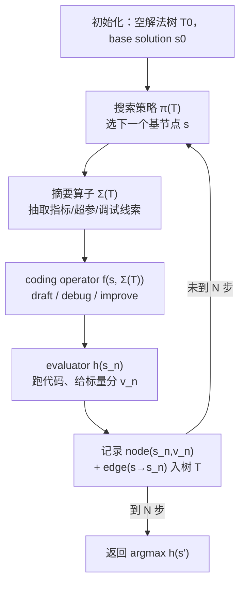

# AIDE（Weco AI）：把 ML 工程建成代码方案树搜索的工程 Agent

**📄 [AIDE: AI-Driven Exploration in the Space of Code](https://arxiv.org/abs/2502.13138)**

2025-02 · Weco AI · [代码](https://github.com/WecoAI/aideml)

**一句话**：Weco AI 的机器学习工程 agent——把「写代码→跑→改」建成一棵**代码方案树（solution tree）**，用硬编码的树搜索策略系统性地起草、调试、改进解法；它是 OpenAI MLE-bench 上当之无愧的标杆 scaffolding。

::: details 📖 论文原文 Abstract（英文）
Machine learning, the foundation of modern artificial intelligence, has driven innovations that have fundamentally transformed the world. Yet, behind advancements lies a complex and often tedious process requiring labor and compute intensive iteration and experimentation. Engineers and scientists developing machine learning models spend much of their time on trial-and-error tasks instead of conceptualizing innovative solutions or research hypotheses. To address this challenge, we introduce **AI-Driven Exploration (AIDE)**, a machine learning engineering agent powered by large language models (LLMs). AIDE frames machine learning engineering as a **code optimization problem**, and formulates trial-and-error as a **tree search in the space of potential solutions**. By strategically reusing and refining promising solutions, AIDE effectively trades computational resources for enhanced performance, achieving state-of-the-art results on multiple machine learning engineering benchmarks, including our Kaggle evaluations, OpenAI's MLE-Bench and METR's RE-Bench. The implementation of AIDE is publicly available at https://github.com/WecoAI/aideml.
:::

**相关**：[Agent Harness 总览](/harness/) · [执行循环](/harness/agent-loop) · [The AI Scientist](/harness/auto-agents/ai-scientist) · [Agent Laboratory](/harness/auto-agents/agent-laboratory) · [AI Co-Scientist](/harness/auto-agents/ai-co-scientist)

> 图源：Jiang et al., *AIDE: AI-Driven Exploration in the Space of Code*（arXiv:2502.13138）Figure 1——AIDE 的样例解法树，每个节点是一份 Python 脚本，箭头是 coding operator 提出的变换（用于学习注解，版权归原作者）。

## 动机与创新点：把 ML 工程从 ReAct 的「单调上下文累积」改成代码空间里的树搜索

机器学习工程（machine learning engineering）支撑了几乎所有现代 AI 成果，但它本质是个**反复试错**的苦活——"engineers and scientists developing machine learning models spend much of their time on trial-and-error tasks instead of conceptualizing innovative solutions"。传统 AutoML（贝叶斯优化、NAS、超参搜索）能自动化一部分，但它们**在预定义的配置空间里搜索**，需要大量领域专家先把搜索空间划好，且相对人类专家偏暴力、算力效率低、易过拟合验证集。

LLM 带来的新可能是：**直接在代码空间里搜索，而不是在预定义配置里搜索**（*searching directly within the space of code rather than the space of predefined configurations*），从而吃到 LLM 里海量的领域知识、把搜索收窄到更有前途的方向。但直接套 ReAct 式 agent 又有两个老问题——论文在 Preliminaries 里点得很直白：把任务建成 POMDP、"continually appending all historical data can lead to oversized prompts and limit scalability, because the model's context window eventually fills up"；而且 POMDP 那套"lacks a principled way to break down the problem when there is a clear structure available"。

AIDE 的破题方式是**换一个建模框架**：不把 ML 工程看成一条长程决策轨迹，而看成一个**无状态的优化问题**——令 $\mathcal{S}$ 是候选解（如 Python 脚本）的空间、$h:\mathcal{S}\to\mathbb{R}$ 是一个**无状态目标函数**（如验证准确率/损失），目标就是

$$s^* = \arg\max_{s\in\mathcal{S}} h(s)$$

每个候选解 $s$ 都能被 $h(s)$ **独立评估**，于是"rather than unrolling a single, long-horizon decision process, we can directly evaluate and compare solutions"——天然对接树搜索这类「依赖对候选解做独立打分」的优化方法。

**关键创新**：

- **代码优化 + 树搜索的双重建模**：把 ML 工程 reframe 为「在代码空间里求 $\arg\max h(s)$」，把试错 reframe 为「在潜在解空间里做 tree search」，避开 ReAct 把全部历史塞进上下文的可扩展性瓶颈。
- **解法树（solution tree）+ 三类原子算子**：所有历史解组织成一棵树，节点是脚本、边是改进尝试；coding operator 只有 draft / debug / improve 三个入口，每次 improve 只做"exactly one atomic change"，让效果可直接归因。
- **硬编码搜索策略 π**：用一条简单确定性规则（先铺多样初始解、再持续改进最优解、限制调试深度）决定下一步 draft/debug/improve，把"花算力的方向"集中到最有前途的节点。
- **摘要算子 Σ(T) 维持无状态视角**：不追加全部日志，只抽取性能指标、超参设置、调试线索，"offers much of the benefit of incremental reasoning without exploding the prompt size"。
- **用算力换性能**：树搜索"effectively trades computational resources for enhanced performance"，在 Weco-Kaggle、MLE-bench、RE-bench 三套评测上拿到 SOTA 级结果（数字见「实验结果」）。

## 方法：解法树 + 硬编码搜索策略 + 三类 coding operator + 摘要算子

AIDE 的核心循环可以浓缩成 Algorithm 1：维护一棵解法树 $T$，每一步「选一个基节点 → 让 coding operator 产一个新解 → 评估并记录 → 更新树」，跑 $N$ 步后返回得分最高的解。

形式化地，AIDE 由四个组件构成（论文 §3.1）：一个**解法树** $T$（节点=脚本，边 $s\to s'$=一次改进尝试）、一个**搜索策略** $\pi(T)$（选哪个 $s\in T$ 当下一个基节点）、一个**摘要算子** $\Sigma(T)$（从树里抽取高层信息）、一个**coding operator** $f(s,\Sigma(T))$（产出新脚本）。Algorithm 1 的主循环每步做：

$$s_n \leftarrow f\big(s,\ \Sigma(T_{n-1})\big),\quad v_n \leftarrow h(s_n),\quad T_n \leftarrow T_{n-1}\cup\{\text{node}(s_n,v_n),\ \text{edge}(s\to s_n)\},\quad s \leftarrow \pi(T_n)$$

### 解法树（solution tree）：为什么是树而不是单线迭代

$s_0$ 是空的根解，evaluator $h$ 给每个解打一个标量分，所有解存进树 $T$——"nodes correspond to scripts and edges represent an improvement attempt"。ML 工程的搜索空间极大且遍布死路：一个看似合理的改动可能让指标变差，而单线迭代一旦走进死胡同就很难回头。树结构让 agent 能「记住」每条分支的历史与指标，在某方向走不通时**回退到更早的好节点重新展开**——本质上是用一点记账开销，换取对算力的高效分配。这与 [The AI Scientist-v2](/harness/auto-agents/ai-scientist) 的 agentic tree search 同源，也是 [执行循环](/harness/agent-loop) 中「从环境反馈迭代」在 ML 工程上的强化版——每次跑出的指标，就是来自环境的 ground truth。

> 举例：根 $s_0$ 派生出三个草稿 $s_1/s_2/s_3$（draft），其中 $s_1$、$s_3$ 跑出 bug（图中灰色），$s_2$ 是有效解（米色）；对 $s_1$ 连做两次 fix 得 $s_4/s_5$，对最有前途的 $s_2$ 做一次 improve 得到当前最优解 $s_6$（红色）。失败分支被记录但不再扩展，算力集中流向有前途的节点。

### 搜索策略 π：一条硬编码规则决定 draft / debug / improve

搜索策略 $\pi$（Algorithm 1 第 7 行）刻意做成**简单的硬编码规则**——根据当前是否存在某个解，决定下一步是起草、调试还是改进：

- **Drafting**——"if we have not yet reached the desired number of initial solutions"：还没铺够多样的初始解时，先多 draft 几个不同起点；
- **Debugging**——"if a buggy node remains within a certain debug depth"：有 buggy 节点且还在限定调试深度内，就修它；
- **Improving**——否则（otherwise），"typically targeting the best (non-buggy) solution"：在当前最优有效解上继续改进。

这条策略落地了两条实用启发式：**(1) 先探索一组多样的初始解、并持续改进其中最优者；(2) 对一个坏解限制调试尝试次数**——避免在一个修不好的分支上无限耗算力。

### Coding operator f：draft / debug / improve 三个专用入口

coding operator 有三个主入口，各配一套**专用 prompt**：

- **Drafting**——需要从零造一个全新解时触发。它"prompts an LLM to outline a brief plan for a model（e.g., specifying a particular network architecture or feature-engineering idea），then emits a single-file Python program implementing that plan"——先让 LLM 列个简短方案（选哪种网络架构、什么特征工程思路），再吐出一份单文件 Python 程序实现它。
- **Debugging**——专修 buggy 解。"By inspecting error logs and execution traces, it attempts to rectify issues like broken imports, incorrect tensor dimensions, or other coding errors while preserving the overall approach"——读报错日志和执行轨迹，修 import 错、张量维度错等编码问题，且**保留整体方法不变**。
- **Improving**——已有一个有效非 buggy 解、但还能从数据预处理/架构/优化上改进时触发。关键约束是每次只动一处：LLM "proposes exactly one 'atomic' change, such as switching optimizers or adding a regularization technique, so that its effect on performance is directly measurable"——只做一个原子改动（换优化器、加正则等），让它对性能的影响可被直接度量。

> 举例：improve 一次只把 Adam 换成 AdamW、或只加一层 dropout，而不是同时改五个地方——这样若分数变好/变差，能干净地归因到这一个改动上，避免「一次改一堆、说不清谁起了作用」。

论文强调：把这三类操作组合起来，"keeps the solution tree structured and ensures that each new node arises from a well-defined modification of a parent node"——每个新节点都来自对父节点的一次定义明确的修改，树因此始终结构清晰。

### 摘要算子 Σ(T) 与 Data Preview：维持「无状态」又不爆上下文

尽管能生成任意多的解，AIDE 不把全部历史日志塞进 prompt，而是用**上下文摘要算子** $\Sigma(T)$ 选择性抽取：

- **性能指标**（accuracy、AUC-ROC、test set loss 等）；
- **超参设置**（若某解涉及超参扫描）；
- **调试相关线索**（如 traceback 里维度对不齐的数组形状）。

设计动机正是前面那条无状态原则——"each code revision stands on its own, but $\Sigma(T)$ uses prior information to guide subsequent proposals. This design offers much of the benefit of incremental reasoning without exploding the prompt size"：每次代码修订自成一体，但 $\Sigma(T)$ 用历史信息引导后续提案，拿到了增量推理的大部分好处，又不让 prompt 体积爆炸。

此外，ML 版 AIDE 还在每个 prompt 里塞一小段静态 **Data Preview**——把数据集元数据（行数、列名、数据划分）写进 workspace 再插入 coding operator 的 prompt，"giving the LLM basic knowledge of dataset size or feature layouts"。它不是完整 EDA，但这点轻量信息能帮 AIDE 做关键代码决策（怎么切验证集、怎么缩放超参），而无需反复把庞大的数据集上下文塞进去。

## 实验结果：Weco-Kaggle / MLE-bench / RE-bench 三线 SOTA 级

### 评测设置：Weco-Kaggle 与 leaderboard-quantile 口径

AIDE 自建了 **Weco-Kaggle** 基准——63 个不同复杂度和数据规模的 Kaggle 竞赛，覆盖表格、图像分类、时序预测；从中取 16 个偏低复杂度、主要靠 CPU 的表格任务做 **Weco-Kaggle Lite**。评测协议的关键是用 **leaderboard quantile**：定义 *Exceeds % of Human* $=100(1-q)$，$q$ 是 AIDE 成绩在官方 Kaggle 榜上的分位——即「AIDE 超过了百分之多少的人类选手」；另报 *Above Median (%)*（成绩严格高于人类中位数的竞赛占比）。选这个口径是因为不同竞赛自带的指标尺度各异，而**榜单分位在竞赛之间分布相近，可直接平均聚合**，比把名次坍缩成「有没有奖牌」更细粒度。

### Benchmark 表现（以原文为准）

**Weco-Kaggle Lite（16 个表格任务，对比基线）**：AIDE 用 GPT-4 Turbo 取得 *Exceeds % of humans* **51.38**、*Above Median* **50.00**，平均超过约一半 Kaggle 参与者、在半数任务上高于人类中位数；显著优于传统 H2O AutoML 与 LangChain AutoGPT，也优于「人类用 ChatGPT 辅助」。逐竞赛看，AIDE 的 *Exceeds % of Human* 从最难任务的约 13% 到最易任务的近 92% 不等。

| Agent | Model | Exceeds % of humans ↑ | Above Median (%) ↑ |
| --- | --- | --- | --- |
| **AIDE** | GPT-4 Turbo | **51.38** | **50.00** |
| Human with ChatGPT | GPT-4 Turbo | 41.17 | 18.75 |
| AutoML (H2O) | N/A | 35.34 | 18.75 |
| AutoGPT (LangChain) | GPT-4 Turbo | 32.34 | 0.00 |

> 在完整 Weco-Kaggle（63 个竞赛）上，平均 *Exceeds % of Humans* 为 **48.23%**，在 **49.21%** 的竞赛中超过人类中位数——在部分任务上接近顶尖水平，但表现随数据集/任务差异较大。

**MLE-bench（OpenAI，75 个真实 Kaggle 竞赛，pass@1）**：AIDE 是搭配 SOTA 模型时**表现最好的 agent 框架**——论文指出 MLAB 的 ResearchAgent、OpenHands 等"tended to terminate early or struggle with iterative refinement"，而 AIDE 的优化中心式设计带来更高的有效提交率，最终拿更多奖牌。其中 AIDE + o1-preview 在 **16.9%** 的竞赛里拿到奖牌，约为后继 agent OpenHands 的**近 4 倍**。

| Agent | Model | Valid Subm. (%) | Above Median (%) | Gold (%) | Any Medal (%) |
| --- | --- | --- | --- | --- | --- |
| **AIDE** | o1-preview | **82.8 ± 1.1** | **29.4 ± 1.3** | **9.4 ± 0.8** | **16.9 ± 1.1** |
| AIDE | GPT-4o | 54.9 ± 1.0 | 14.4 ± 0.7 | 5.0 ± 0.4 | 8.7 ± 0.5 |
| AIDE | Claude 3.5 | 51.1 ± 3.3 | 12.9 ± 2.2 | 4.4 ± 1.4 | 7.6 ± 1.8 |
| AIDE | Llama 3.1 | 27.3 ± 2.6 | 6.7 ± 1.4 | 1.7 ± 0.7 | 3.0 ± 1.0 |
| OpenHands | GPT-4o | 52.0 ± 3.3 | 7.1 ± 1.7 | 2.7 ± 1.1 | 4.4 ± 1.4 |
| MLAB | GPT-4o | 44.3 ± 2.6 | 1.9 ± 0.7 | 0.8 ± 0.5 | 0.8 ± 0.5 |

同一个底层模型，**加不加 AIDE scaffolding 差距巨大**——这正是 [Agent Harness](/harness/) 的核心命题。在 MLE-bench Lite（低复杂度子集）上，o1-preview 套上 AIDE 后：有效提交率 63.6%→**92.4%**、超过人类中位数 13.6%→**59.1%**、金牌率 6.1%→**21.2%**（翻三倍多）、任意奖牌率 7.6%→**36.4%**（近五倍），且各项 $p<0.01$（双尾 t 检验）显著。

> 图源：Jiang et al., *AIDE: AI-Driven Exploration in the Space of Code*（arXiv:2502.13138）Figure 3——o1-preview 在 MLE-bench Lite（complexity=low）上有无 AIDE 的性能对比（用于学习注解，版权归原作者）。

**RE-bench（METR，7 个 AI 研发任务）**：METR 把更难的 AI R&D 任务（从优化 Triton Kernel 到用 GPT-2 做 QA 微调）建成优化任务后套 AIDE 评测。AIDE 因 LLM 能更快实现方案、跑更多迭代，**在 6 小时内一度超过顶尖人类科学家**；尤其在 *Optimize a Kernel* 上，它发现一个定制 Triton 方案，比九位人类专家在 64 小时内做到的都快。但随后**人类追了上来**——AIDE 的简单贪心策略容易陷入局部最优，在需要处理大代码库、或单次改进涉及多步交互的环境（如 *Agent for Rust CodeContests*）里，它倾向"repeating local patches instead of discovering new strategies"。这是它最务实的能力边界。

> 图源：Jiang et al., *AIDE: AI-Driven Exploration in the Space of Code*（arXiv:2502.13138）Figure 4——AIDE+o1-preview 与顶尖人类科学家在 7 个 AI R&D 任务上的平均得分随时间变化（用于学习注解，版权归原作者）。

> 看榜须知：这些分数的口径、时点、底座模型、test-time 设置、test-set 划分各异，且论文明确警示**预训练污染（pre-training contamination）**风险——许多 Kaggle 竞赛解法可能已在训练语料里，绝对值跨系统直接比意义有限；当作「同期 ML 工程 scaffolding 能力的量级参照」即可。

## 在 Agent Harness 谱系里的位置

- **vs [The AI Scientist](/harness/auto-agents/ai-scientist) / [Agent Laboratory](/harness/auto-agents/agent-laboratory)**：后两者是端到端科研 agent（选题→实验→写论文），AIDE 是其中「实验 / ML 工程」那一段的**专精版与标杆**——这一档目标有客观 ground truth（榜单名次、验证集分数），进展能被干净量化，不像「论文质量」那样难评判。代价是能力边界更窄：AIDE 只把已知指标做高，不提出新科学问题、不写论文。AI Scientist-v2 的 agentic tree search 与 AIDE 的解法树同源，可对照阅读。
- **vs ReAct 类通用 agent**：AIDE 的整个设计就是冲着 ReAct「把全部历史观测追加进上下文、当成单一巨型优化问题」的可扩展性瓶颈去的——它用解法树显式拆解问题、用 $\Sigma(T)$ 控上下文，把"何时该退回到哪个节点"变成结构化决策而非靠长上下文硬记。
- **vs 传统 AutoML（H2O / Auto-Sklearn / NAS）**：AutoML 在**预定义配置空间**里搜（需专家先划好空间、偏暴力），AIDE 在**代码空间**里搜、吃 LLM 的领域知识来收窄方向；实验里 AIDE 也直接压过了 H2O AutoML 基线。
- **vs DS-Agent / AutoML-Agent**：DS-Agent（ICML'24）用案例推理（CBR）从 Kaggle 经验迁移做数据科学，AIDE 靠树搜索在代码空间探索，路线不同；AutoML-Agent 是覆盖「数据检索→可部署模型」全流程的多 agent 框架、面更宽，AIDE 更聚焦竞赛/benchmark 式的指标优化。
- **vs MLE-bench / MLAgentBench / RE-bench**：这些是「考卷」（评测环境）而非 agent，AIDE 是在它们上被对比、且常居榜首的「考生」之一——也正因如此，它成了衡量「scaffolding 给同一模型带来多大增益」的事实标准底座。整体定位见 [Agent Harness 总览](/harness/)。
