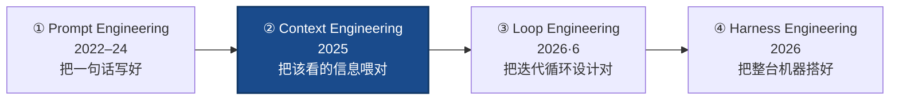

# Context Engineering（上下文工程）

> **一句话**：Context Engineering（上下文工程）是这条链的**第②环**——焦点从"怎么把一句话写好"抬到"**在有限的 context window 里，每一步该放进哪些信息**"：系统提示、检索到的资料、工具结果、历史、记忆，全都要**选对、压好、隔离干净**。它的核心信念是：**一句再完美的 prompt 也补不上模型从未拿到的事实**，所以工程对象从"措辞"变成了"喂给模型的整个上下文"。
>
> 缘起：2025 年，"context engineering"取代"prompt engineering"成为 agent 圈的新关键词——Andrej Karpathy、Tobi Lütke 等人公开背书"它比 prompt engineering 更贴近我们实际在做的事"；Anthropic 发表《Effective Context Engineering for AI Agents》系统化这门手艺。
> 前置阅读：本页是 **prompt → context → loop → harness** 链的第②环。上一环 [提示工程](/harness/prompt-engineering)；**机制与消融数字在** [执行循环与上下文管理](/harness/agent-loop)（本页讲方法论，那页讲怎么实现）；下一环 [循环工程](/harness/loop-engineering)。

## 在演进链上的位置：第②环

上下文工程**把提示工程包进去**：system prompt 只是上下文的一部分，检索资料、工具返回、长期记忆、子任务摘要都要一起治理。再往外，[循环工程](/harness/loop-engineering) 关心的是"循环每一圈如何自动刷新这份上下文"——所以上下文工程是 loop engineering 的内层。

## 为什么需要它：上下文是会"腐烂"的有限资源

- **补不上缺失的事实**：模型不知道你的代码库、私有文档、实时状态——这些只能靠**检索**塞进窗口，措辞再好也变不出来。
- **Context rot（上下文腐烂）**：窗口不是越满越好。无关内容、过期历史、重复工具输出会稀释注意力、把真正关键的指令淹没，准确率随之下降。上下文是**边际收益递减**的有限资源。
- **长任务必然溢出**：agent 自跑几十上百轮，原始历史无限膨胀，必须**压缩 / 外置**才能继续。

> 举例：一个改 bug 的 agent，第 1 轮就把整个仓库 50 个文件全塞进窗口（"预加载"），结果窗口被无关文件占满、真正相关的两个文件反而被埋掉；换成"先 grep 定位、只读相关片段"（按需检索），同一个模型一次就改对——**喂什么信息，比模型多强，往往更决定成败**。

## 四类手法：写 / 选 / 压 / 隔（Write · Select · Compress · Isolate）

LangChain 把上下文工程归纳成四个动作，可对照本站 [agent-loop §2.2 四级手段](/harness/agent-loop) 的机制实现来看：

| 动作 | 含义 | 落点 |
| --- | --- | --- |
| **Write（写出去）** | 把状态/记忆**外置**到窗口之外（scratchpad、文件、长期记忆库），需要时再读回 | [agent-loop](/harness/agent-loop) 的"外置记忆"；持久指令文件见 [Harness 总览](/harness/) |
| **Select（选进来）** | 每一步只把**相关**信息放进窗口：agentic 检索（grep/语义检索）、按需加载工具定义、挑相关记忆 | [Tool Use](/agent/tool-use)、[Skills 按需加载](/skills/) |
| **Compress（压缩）** | 总结历史、修剪旧轮次、把长工具输出折叠成要点，腾出窗口 | [agent-loop](/harness/agent-loop) 的折叠/总结 |
| **Isolate（隔离）** | 用子 agent / 分窗口把不同任务的上下文**隔开**，避免互相串味、各自只带必需上下文 | [多智能体](/agent/multi-agent) 的子 agent 隔离 |

## 两个关键判断

### System prompt 的 "right altitude"

系统提示要写在**恰当的高度**：足够具体以稳定引导行为，又足够灵活留出启发空间——既不硬编码一堆 if-else，也不堆空泛口号；用 XML 标签 / Markdown 标题分节，让指令、上下文、示例各归其位（详见 [Harness 总览](/harness/) 设计原则表）。

### 预加载 RAG vs. 按需 agentic 检索

- **预加载（传统 RAG）**：检索一批文档，开局就塞进窗口。简单，但容易塞太多、且无法随推理动态调整。
- **按需检索（agentic search）**：把检索本身做成工具，让 agent 在循环里"想查才查、查了再决定下一步"。更省窗口、更贴合推理，是当前 coding agent 的主流——这也正是上下文工程**自然滑向** [循环工程](/harness/loop-engineering) 的地方：检索变成循环里的一个动作。

## 与本站既有内容的关系

| 想了解 | 去这里 |
| --- | --- |
| 上下文管理的**机制**：折叠/压缩/外置/子 agent 隔离 + 消融数字 | [执行循环与上下文管理](/harness/agent-loop) |
| 上一环：把"问法"写好 | [提示工程](/harness/prompt-engineering) |
| 下一环：把"反复迭代"设计成自纠错循环 | [循环工程](/harness/loop-engineering) |
| 给上下文**注入领域知识**而不重训（按需加载） | [Skills](/skills/) |
| 整台机器（上下文+循环+工具+沙箱）的全貌 | [Harness 工程](/harness/harness-engineering) |
| 工具定义本身占上下文、怎么省 | [Harness 总览](/harness/) 设计原则表 |

## 务实的边界

- **不是越满越好**：堆满窗口会触发 context rot；"放尽量少、但放对"才是目标。可观测性（看 token 占用、看哪些内容真被用到）是前提。
- **检索质量是上限**：选进来的资料错了，模型只会"自信地答错"——上下文工程的可靠性受限于检索/记忆系统本身。
- **它仍被更外层包着**：上下文每一圈怎么刷新、何时压缩、卡住怎么退出，属于 [循环工程](/harness/loop-engineering)；上下文工程治的是"某一步窗口里放什么"，不负责"轮与轮之间的控制流"。

## 参考链接

- Anthropic, 2025. *Effective Context Engineering for AI Agents*（系统化命名与原则）
- Anthropic, 2024. *Building Effective Agents*（检索、工具、上下文的基础）
- LangChain. *Context Engineering for Agents*（Write / Select / Compress / Isolate 四动作）
- 机制、四级上下文管理与消融数字见本站 [执行循环与上下文管理](/harness/agent-loop)
