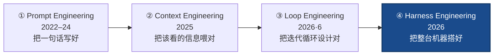
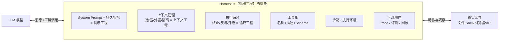

# Harness Engineering（机器工程）

> **一句话**：Harness Engineering（harness 工程 / "机器工程"）是这条链的**最外环**——不再只设计某一句 prompt、某一步上下文、某一个循环，而是把**循环 + 上下文管理 + 工具集 + 沙箱 + 记忆 + 可观测性**整体设计成一台包在模型外面、能把活自己干完的机器。它的主张：**同一个模型，配上更好的 harness，能力可以差出一个数量级——harness 是和模型权重同量级的杠杆。**
>
> 缘起：当 prompt → context → loop 这条链一路外扩，最后落到一个朴素事实上——真正交付价值的是模型**外面那整层工程**。本站 [Harness](/harness/) 整章讲的就是它；本页把它放进演进链、与前三环对齐。
> 前置阅读：本页是 **prompt → context → loop → harness** 链的第④环（最外）。前三环：[提示工程](/harness/prompt-engineering) · [上下文工程](/harness/context-engineering) · [循环工程](/harness/loop-engineering)。机制实现散落在 [执行循环与上下文管理](/harness/agent-loop) · [沙箱与工具执行](/harness/sandbox) · [代表系统对比](/harness/systems)。

## 在演进链上的位置：第④环（把前三环全包进去）

四者是**包含关系而非替代**：prompt 在某一步里把话说清楚 → context 决定那一步窗口里放什么 → loop 决定轮与轮之间怎么自动迭代 → **harness 把这条循环连同工具、沙箱、记忆、监控裹成完整运行环境**。loop engineering 是"把循环这一环做对"，harness engineering 是"把循环跑在一台对的机器里"。

## 一台 harness 由什么组成

Claude Code 官方把自身定位为模型外围的 "agentic harness"——提供工具、上下文管理与执行环境，"把语言模型变成有能力的 coding agent"。组成可以拆成（详见 [Harness 总览](/harness/)）：

注意前三环正好是这台机器里的三个组件（提示、上下文、循环）；harness engineering 多管的是**工具、沙箱、记忆、可观测性**，以及把它们**接成一个整体**的工程。

## 为什么 harness 是和权重同量级的杠杆

最硬的证据来自 SWE-agent（NeurIPS 2024）的 **Agent-Computer Interface（ACI）**——为 LM agent 专门设计接口、而非沿用给人类的 shell/IDE。同一个 GPT-4 Turbo：

- 接定制 ACI 后在 SWE-bench 解决 **12.47%**，非交互式 RAG 基线只有 **3.8%**；
- SWE-bench Lite 上定制 ACI **18.0%** vs 只给 Linux shell **11.0%**——**模型没变，接口带来约 64% 相对提升**。

Anthropic 也报告过**仅靠改进工具描述**就提升了 Claude 的 SWE-bench 成绩。结论：harness 的迭代成本远低于重训模型，收益却同量级——这正是"机器工程"值得作为独立学科的原因。

## 设计 harness ≈ 设计好的 ACI

SWE-agent 总结的四条原则，是整个 [Harness](/harness/) 章反复出现的母题：

1. **动作简单易懂**：模型能可靠生成的动作，而非复杂 DSL；
2. **动作紧凑高效**：把导航+编辑等高频组合并成单一动作，省轮次省上下文；
3. **反馈充分但简洁**：环境回传的信息要够诊断、又不淹没窗口（呼应 [上下文工程](/harness/context-engineering)）；
4. **用 guardrail 阻断错误传播**：如 linter 拦截错误编辑、沙箱隔离危险操作（见 [沙箱与工具执行](/harness/sandbox)）。

外加 loop engineering 那一层的安全底线：**可测的终止条件、显式失败出口、致命/可恢复错误分级、卡住升级给人**（见 [循环工程](/harness/loop-engineering)）。

## 与本站既有内容的关系

整章 [Harness](/harness/) 都是 harness engineering 的展开，重点页：

| 想了解 | 去这里 |
| --- | --- |
| harness 三件套总览 + 设计原则速查表 | [Harness 总览](/harness/) |
| 循环的机制：形式化、上下文四级管理、消融 | [执行循环与上下文管理](/harness/agent-loop) |
| 动作在哪执行、怎么隔离、观察怎么回传 | [沙箱与工具执行](/harness/sandbox) |
| Claude Code / SWE-agent / OpenHands 怎么取舍 | [代表系统对比](/harness/systems) |
| 把整条循环当 RL 环境直接训练策略 | [Agentic RL](/agent/agentic-rl/) |
| 给 harness 注入领域知识而不重训 | [Skills](/skills/) |
| 前三环 | [提示工程](/harness/prompt-engineering) · [上下文工程](/harness/context-engineering) · [循环工程](/harness/loop-engineering) |

## 务实的边界

- **harness 补不上模型的根本能力**：接口能把模型已有能力兑现到极致，但模型不会的推理，再好的 harness 也变不出来——它是杠杆，不是发电机。
- **可调试性 > 编排花活**：组件越多越难排错。Claude Code 刻意只留单主循环 + 至多一层子 agent，理由是可调试性优先于编排复杂度（见 [agent-loop §4](/harness/agent-loop)）。harness 要按任务复杂度伸缩，而非默认堆满。
- **可观测性是前提**：没有 trace 就无法评测、回放、改进；"机器工程"的复利来自能复盘的运行记录。
- **成本要算**：多一层验证、多一个子 agent 都加延迟与 token（[多 agent](/agent/multi-agent) 可达普通 chat 的 ~15 倍）。

## 参考文献

- Yang et al., 2024. *SWE-agent: Agent-Computer Interfaces Enable Automated Software Engineering.* arXiv:2405.15793
- Wang et al., 2024. *OpenHands: An Open Platform for AI Software Developers as Generalist Agents.* arXiv:2407.16741
- Anthropic, 2024. *Building Effective Agents.*
- Anthropic, 2025. *Effective Context Engineering for AI Agents.*
- Claude Code 官方文档. *How Claude Code Works* / *Best Practices.*
