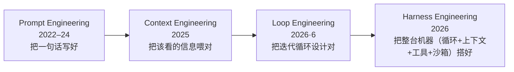
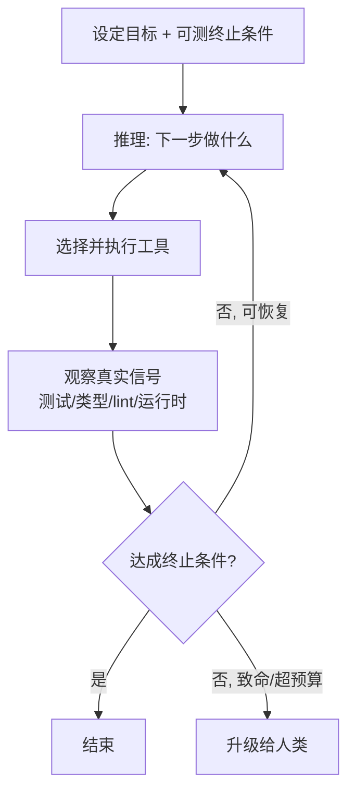
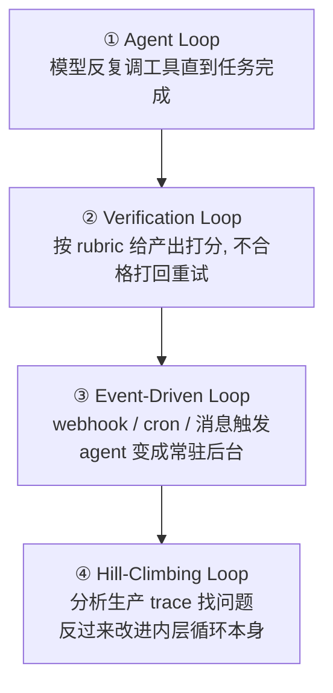

# Loop Engineering（循环工程）

> **一句话**：Loop Engineering（循环工程）是 2026 年 6 月突然爆火的提法——**不要再亲手 prompt 你的 coding agent，而是去设计那个"替你不断 prompt 它"的循环**：定义什么是完成、给什么工具、上下文怎么管、卡住了怎么退出与升级、报错算反馈还是算致命。它把焦点从"写好一句话"抬到"设计好一台自纠错的状态机"，是 **prompt engineering → context engineering → loop engineering → harness engineering** 这条演进链上最新的一环。
>
> 缘起：Peter Steinberger（[OpenClaw](/agent/frameworks/openclaw) 作者）2026-06-07 的帖子（数日内约 650 万阅读）+ Addy Osmani 次日的同名长文《Loop Engineering》为这门手艺命名。
> 前置阅读：本页是 **prompt → context → loop → harness** 链的第③环。前两环 [提示工程](/harness/prompt-engineering) · [上下文工程](/harness/context-engineering)，下一环 [Harness 工程](/harness/harness-engineering)；机制细节见 [执行循环与上下文管理](/harness/agent-loop)（本页讲方法论，**机制在那一页**）· [Deep Research](/agent/deep-research/) · [Agentic RL](/agent/agentic-rl/)。

## 它为什么是"新词，但不全是新东西"

先把话说在前面：loop engineering 描述的循环本身**不是新发明**——它就是 [ReAct](/harness/agent-loop)（2022）「思考→动作→观察」循环的工程化，本站 [执行循环与上下文管理](/harness/agent-loop) 早已把它的形式化、上下文管理四级手段、消融数字讲透。2026 年 6 月真正发生的是**话语层面的重组**：当 coding agent（[Claude Code](/agent/frameworks/claude-code)、[Codex](/agent/frameworks/codex)、OpenClaw）强到能连续自跑几分钟到几小时时，"人怎么用它"的最佳实践被重新命名、提炼成了一门可教的学科。

引爆点是 Peter Steinberger 2026-06-07 的一句话——"**别再 prompt 你的 coding agent，去设计那个替你 prompt 它的循环**"，数日内约 650 万阅读；Addy Osmani 次日发表长文把这套做法正式命名为 *Loop Engineering* 并给出结构解剖；Anthropic 做 Claude Code 的 Boris Cherny 的概括广为流传：**"I don't prompt Claude anymore."**（我已经不 prompt Claude 了。）一句话的核心主张：**你不再 prompt agent，你设计那个 prompt agent 的系统。**

## 演进链：prompt → context → loop → harness

四者是**包含关系而非替代关系**：

- **Prompt engineering**：关心措辞——但"一句再完美的 prompt 也无法补上模型从未拿到的事实"。详见 [提示工程](/harness/prompt-engineering)。
- **Context engineering**：关心推理时窗口里放什么（选择/检索/压缩/刷新），详见 [上下文工程](/harness/context-engineering)。
- **Loop engineering**：关心**每一轮之间发生什么**——agent 在两次工具调用之间做什么、何时自检、凭什么判定"做完了"。loop 是那个循环，context engineering 决定循环每一圈让 agent 看到什么，二者被 loop engineering **一并包进去**。
- **Harness engineering**：关心**整台机器**——循环、上下文管理、工具、记忆、沙箱，整体裹在模型外面，详见 [Harness 工程](/harness/harness-engineering) 与 [Harness 总览](/harness/)；loop engineering 是它内部"把循环这一环做对"的子学科。

> 一句话记忆：**loop engineering 不取代 prompt / context engineering，它把它们裹进一个会自我迭代的循环里；harness engineering 再把这个循环裹进完整的运行环境。**

## 一个"工程良好的循环"长什么样

Addy Osmani 的解剖给出五个要件——可对照本站 [agent-loop](/harness/agent-loop) 的机制实现来看：

| 要件 | 含义 | 反面教材 / 落点 |
| --- | --- | --- |
| **1. 可测的终止条件** | 用客观、可自动检查的成功判据 | "让测试通过 ✓"可检查；"把代码改好 ✗"无法判定 |
| **2. 真实世界的工具集** | 文件、终端、测试、类型检查、版本控制——给出**诚实**的反馈信号 | 见 [沙箱与工具执行](/harness/sandbox)、[Tool Use](/agent/tool-use) |
| **3. 上下文管理** | 总结 / 修剪 / 外置状态，防止窗口溢出（context rot） | 机制详见 [agent-loop §2.2 四级手段](/harness/agent-loop) |
| **4. 终止与升级逻辑** | 显式的成功/失败出口 + 卡住时**升级给人** | 防无限循环；预算/步数上限 |
| **5. 分级的错误处理** | 区分**可恢复**与**致命** | 测试失败=可行动的反馈；缺凭证=硬停 |

核心心态转变：把软件工作当成**一个能跑几分钟到几小时、不断对照真实信号（测试、类型检查、linter、运行时错误）自我纠偏的迭代系统**，而不是把 agent 当一次性的代码生成器。[Deep Research](/agent/deep-research/) 正是这种"长循环"在研究任务上的同构体——同样是规划→检索→反思→补检的自纠错迭代。

## Loopcraft：把循环叠起来（stacking loops）

LangChain 把这门手艺称作 **loopcraft——"叠循环的艺术"**：agent 的价值不来自单个组件，而来自刻意堆叠的分层反馈系统。常见四层，由内向外：

1. **Agent Loop**：最基础的"调工具直到完成"，即 [agent-loop](/harness/agent-loop) 讲的那一圈。
2. **Verification Loop**：用 rubric 给输出评分、不达标就带反馈重试——以延迟和成本换准确率；与本站 [LLM-as-judge](/eval/llm-as-judge)、[DR-Rubric](/agent/deep-research/dr-rubric) 一脉。
3. **Event-Driven Loop**：用触发器（webhook / 定时 / 频道消息）把 agent 接成**持续运行**的后台组件，而非手动唤起。
4. **Hill-Climbing Loop**：分析生产轨迹、定位问题，**直接回头改 agent loop**——外层循环让内层越跑越好，形成复利式改进。竞争优势属于那些建起"学习循环"的团队。

人始终在每一层里：判断、敏感操作、最终校验都离不开人类监督。

## 与本站既有内容的关系

| 想了解 | 去这里 |
| --- | --- |
| 循环的**机制**：形式化、上下文压缩/外置、子 agent 隔离、消融数字 | [执行循环与上下文管理](/harness/agent-loop) |
| 循环跑在**哪**、怎么隔离、观察怎么回传 | [沙箱与工具执行](/harness/sandbox) |
| 把整条循环当 **RL 环境**直接训练策略 | [Agentic RL](/agent/agentic-rl/) |
| 叠多个循环 / 多 agent 编排的**成本核算** | [多智能体](/agent/multi-agent) |
| 给循环**注入领域知识**而不重训 | [Skills](/skills/) |
| 长循环在**研究任务**上的形态 | [Deep Research](/agent/deep-research/) |

## 务实的边界

- **新词、老料**：loop engineering 的多数要件（终止条件、工具反馈、上下文压缩、验证内建）本站早已分散覆盖；它的真正贡献是把这些**整合成一个可教的心智模型**，并把使用重心从"写 prompt"明确挪到"设计循环"。把它当框架去理解，而非当成需要全新工具链的新技术。
- **自跑越久，护栏越重要**：循环能自跑几小时，意味着一个没有显式失败出口、没有分级错误处理的循环可能**烧着 token 空转**或把错误级联放大——五要件里"可测终止条件 + 升级逻辑 + 致命/可恢复区分"是安全底线，不是可选项。
- **可观测性是前提**：没有 trace 就没有 hill-climbing loop；要让外层循环改进内层，得先把每次运行记录下来、可复盘。
- **别过度叠循环**：每多一层 verification / 多一个子 agent 都在加延迟与成本（[多 agent](/agent/multi-agent) 的 token 可达普通 chat 的 ~15 倍）。Claude Code 刻意只留单主循环 + 至多一层 subagent，理由是**可调试性 > 编排花活**（见 [agent-loop §4](/harness/agent-loop)）。叠循环要按任务复杂度伸缩，而非默认堆满。

## 参考链接

- Addy Osmani, *Loop Engineering*（2026-06，命名与结构解剖）
- Peter Steinberger（[OpenClaw](/agent/frameworks/openclaw) 作者）2026-06-07 引爆帖："stop prompting your coding agent, start designing the loop that prompts it"
- LangChain, *The Art of Loop Engineering*（loopcraft / 四层叠循环）：<https://www.langchain.com/blog/the-art-of-loop-engineering>
- Anthropic, *Effective Context Engineering for AI Agents*（2025）·*Building Effective Agents*（2024）
- 机制与论文出处见 [执行循环与上下文管理](/harness/agent-loop)：ReAct（2022）· SWE-agent（2024）· OpenHands（2024）
