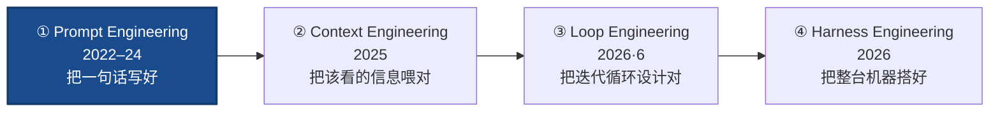

# Prompt Engineering（提示工程）

> **一句话**：Prompt Engineering（提示工程）是这条演进链的**起点**——在**一次调用**里，靠措辞、示例、结构和"让模型先想再答"把任务讲清楚，从模型已有的能力里榨出最好的单轮输出。它关心的是**怎么问**；当问题不再是"怎么问"而是"模型根本没拿到该看的信息 / 一次答不完需要反复迭代"时，焦点就外溢到了 [上下文工程](/harness/context-engineering) 与 [循环工程](/harness/loop-engineering)。
>
> 缘起：GPT-3 的 few-shot（2020）让"给几个例子就会做新任务"成为范式；CoT、ReAct、self-consistency（2022）把"怎么写 prompt"提炼成手艺。2023–24 是它的全盛期，也是它天花板暴露的时期。
> 前置阅读：本页是 **prompt → context → loop → harness** 链的第①环。机制细节见 [执行循环与上下文管理](/harness/agent-loop)；后续环节见 [上下文工程](/harness/context-engineering) · [循环工程](/harness/loop-engineering) · [Harness 工程](/harness/harness-engineering)。

## 在演进链上的位置：第①环

后三环都是**把 prompt engineering 包进更大的范围**：context engineering 决定"窗口里放哪些 prompt 之外的信息"，loop engineering 决定"每一轮之间怎么自动改写 prompt 与上下文"，harness engineering 把这一切连同工具与沙箱裹成一台机器。所以提示工程没有过时，它**沉降成了内层的一项基本功**——只是不再是工程的全部。

## 核心手法

| 手法 | 做什么 | 典型出处 |
| --- | --- | --- |
| **Zero / Few-shot** | 不给/给几个输入-输出示例，靠示例隐式定义任务与格式 | GPT-3（2020） |
| **Chain-of-Thought（CoT）** | 让模型"一步步想"，把中间推理显式写出来，复杂推理显著提升 | Wei et al.（2022） |
| **Self-Consistency** | 采样多条推理路径、对最终答案投票，换准确率 | Wang et al.（2022） |
| **角色 / System prompt** | 用系统提示设定身份、风格、约束，把行为先验固定下来 | 各家对话模型 |
| **结构化输出 / XML 标签** | 用 `<thinking>`、`<answer>` 等标签或 JSON schema 框定输出，便于解析与分节 | Anthropic 提示文档 |
| **任务分解 / Prompt chaining** | 把大任务拆成多个子提示串起来，每步只做一件事 | Anthropic《Building Effective Agents》 |
| **ReAct 提示** | 在 prompt 里交错"思考→动作→观察"，是后来 [agent loop](/harness/agent-loop) 的原型 | Yao et al.（2022） |

> 举例：同一个"判断这段代码有没有 SQL 注入"的任务，zero-shot 直接问往往给笼统答案；加一句"先逐行分析数据如何流入查询，再下结论（CoT）"、再给一个标注好的正例与反例（few-shot），同一个模型的判准率就明显上来——**模型没变，是把它已会的能力问出来了**。

## Anthropic 的提示原则（按收益排序）

Anthropic 官方提示工程文档给的优先级，从高到低：

1. **清晰、直接**：把任务、受众、格式讲明白，别让模型猜意图；
2. **给示例（multishot）**：示例比形容词管用，覆盖边界情况；
3. **让它先想（CoT）**：留出"思考"空间再给结论，难任务尤其有效；
4. **用 XML 标签分节**：把指令、上下文、示例、输出位用标签隔开，减少串味；
5. **给角色（system prompt）**：用系统提示定身份与基调；
6. **预填（prefill）回复开头**：用 assistant 起手几个字锁定格式/语气；
7. **拆成提示链**：一个提示只干一件事，串起来比塞进一个巨型提示稳。

注意这条清单的第 5–7 条已经在往外探了：system prompt、提示链其实是 [上下文工程](/harness/context-engineering) 和 [循环工程](/harness/loop-engineering) 的入口。

## 天花板：为什么"写好一句话"不够了

提示工程的根本局限，被这条广为流传的话点破：**"一句再完美的 prompt 也无法补上模型从未拿到的事实。"**

- **补不上缺失的信息**：模型不知道你的代码库、你的私有文档、今天的实时数据——再精巧的措辞也变不出它没见过的事实。这把需求推向 [上下文工程](/harness/context-engineering)：去**检索、选择、压缩**该进窗口的信息。
- **单轮框架装不下长任务**：很多真实任务要"试→看报错→改→再试"反复多轮，单次 prompt 的心智模型天然不适配。这把需求推向 [循环工程](/harness/loop-engineering)：设计那个**替你反复 prompt 的自纠错循环**。
- **手工调 prompt 不可扩展**：逐字微调对一次性任务有用，但 agent 要在成千上万种情境下自跑，靠的是**系统**而非某条神 prompt。

一句话：**提示工程优化"问法"，但 agent 时代的瓶颈逐渐从"问法"转移到"喂什么信息、怎么迭代、整台机器怎么搭"——于是有了后面三环。**

## 与本站既有内容的关系

| 想了解 | 去这里 |
| --- | --- |
| 把"该看的信息"喂对（检索/压缩/记忆） | [上下文工程](/harness/context-engineering) |
| 把"反复迭代"设计成自纠错循环 | [循环工程](/harness/loop-engineering) |
| 循环的**机制**：形式化、上下文四级管理、消融数字 | [执行循环与上下文管理](/harness/agent-loop) |
| 把整台机器（循环+上下文+工具+沙箱）搭好 | [Harness 工程](/harness/harness-engineering) |
| 让模型学会"在对的时机发起符合 schema 的调用" | [Tool Use 训练](/agent/tool-use) |

## 务实的边界

- **提示工程没死，只是降维成基本功**：清晰、给例子、让它先想，这些在每一环里都还要用；它只是不再是工程的**顶层**。
- **过度堆 prompt 反而有害**：把一切塞进一个巨型 system prompt 会稀释真正重要的指令；Anthropic 的经验是 prompt 写在"right altitude"——够具体以引导、又不硬编码 if-else（详见 [Harness 总览](/harness/) 设计原则表）。
- **可复现性差**：神 prompt 对模型版本敏感、换模型就漂移；这也是工程重心转向"系统"而非"措辞"的原因之一。

## 参考链接

- Brown et al., 2020. *Language Models are Few-Shot Learners*（GPT-3，few-shot 范式）
- Wei et al., 2022. *Chain-of-Thought Prompting Elicits Reasoning in Large Language Models*
- Wang et al., 2022. *Self-Consistency Improves Chain of Thought Reasoning*
- Yao et al., 2022. *ReAct: Synergizing Reasoning and Acting in Language Models*（[agent loop](/harness/agent-loop) 原型）
- Anthropic. *Prompt Engineering Overview / Be Clear and Direct / Use XML Tags / Chain Prompts*（官方提示工程文档）
- Anthropic, 2024. *Building Effective Agents*（提示链与任务分解）
