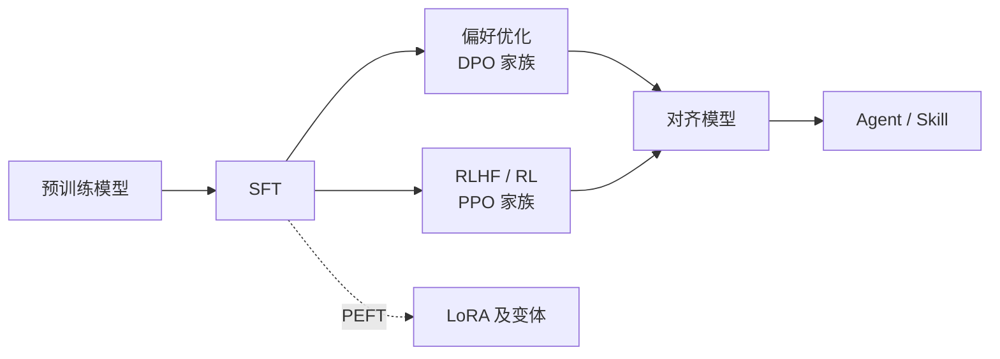

# LLM Atlas <Badge type="tip" text="全景速览" />

**LLM 训练算法知识图谱** —— 这一页过完全部算法：每个算法只给「一句话 + 核心公式 + 适用场景」，五分钟建立全图认知。需要推导、伪代码和调参经验时点「详细 →」深入对应页面。

[如何阅读本知识库 →](/guide/) · [符号约定 →](/guide/notation)

## SFT 监督微调

### SFT

用「指令-回答」数据做有监督微调，让基座模型学会听指令。

$$
\mathcal{L}_{\text{SFT}} = -\mathbb{E}_{(x, y)} \left[ \sum_{t} \log \pi_\theta(y_t \mid x, y_{<t}) \right]
$$

**适用**：一切后训练的第一步。 [详细 →](/sft/)

关键工程子主题：[全量微调](/sft/full-finetuning) · [数据构造](/sft/data-construction) · [Chat Template](/sft/chat-template) · [序列 Packing](/sft/packing) · [Loss Masking](/sft/loss-masking)

## LoRA 及变体

### LoRA

冻结 $W_0$，只训练低秩增量 $\Delta W = BA$，可训练参数降至 1% 以下，推理时可合并、零开销。

$$
h = W_0 x + \frac{\alpha}{r} B A x
$$

**适用**：显存受限微调的默认选择。 [详细 →](/lora/lora)

### QLoRA

基座权重量化为 4-bit NF4 存储、计算时反量化，LoRA 适配器照常训练。

$$
h = \mathrm{dequant}(W_0^{\text{NF4}})\, x + \frac{\alpha}{r} B A x
$$

**适用**：单卡/极低显存微调大模型，能换训练速度。 [详细 →](/lora/qlora)

### DoRA

权重分解为幅值 × 方向：幅值直接训练、方向走 LoRA，学习行为更像全量微调。

$$
W = m \cdot \frac{W_0 + BA}{\lVert W_0 + BA \rVert_c}
$$

**适用**：低 rank 下追效果。 [详细 →](/lora/dora)

### AdaLoRA

SVD 形式参数化 $\Delta W = P \Lambda Q$，按重要性动态裁剪奇异值，把秩预算分给最需要的模块。

**适用**：参数预算紧、各模块重要性差异大。 [详细 →](/lora/adalora)

### rsLoRA

缩放因子从 $\alpha/r$ 改为 $\alpha/\sqrt{r}$，大 rank 时更新尺度不再衰减。

$$
h = W_0 x + \frac{\alpha}{\sqrt{r}} B A x
$$

**适用**：rank ≥ 64 时一行代码的免费提升。 [详细 →](/lora/rslora)

### LoRA+

给 $B$ 矩阵更大的学习率（$\eta_B = \lambda \eta_A$，$\lambda \approx 16$），修正两矩阵天然不对称的梯度尺度。

**适用**：任何 LoRA 训练的免费加速。 [详细 →](/lora/lora-plus)

### PiSSA

用 $W_0$ 的主奇异成分初始化 $B, A$（残差冻结），从"最重要的方向"起步训练。

**适用**：追求更快收敛；可与量化结合减小量化误差。 [详细 →](/lora/pissa)

## 偏好优化（DPO 家族）

### DPO

把 RLHF 的 KL 约束目标求出闭式解，"训 RM + 跑 RL"塌缩成一个分类损失。

$$
\mathcal{L}_{\text{DPO}} = -\mathbb{E} \left[ \log \sigma \left( \beta \log \frac{\pi_\theta(y_w|x)}{\pi_{\text{ref}}(y_w|x)} - \beta \log \frac{\pi_\theta(y_l|x)}{\pi_{\text{ref}}(y_l|x)} \right) \right]
$$

**适用**：有成对偏好数据时的默认对齐方案。 [详细 →](/dpo/dpo)

### IPO

DPO 在确定性偏好下会把 reward 差推向无穷；IPO 改用平方损失，把差拉向固定目标。

$$
\mathcal{L}_{\text{IPO}} = \mathbb{E} \left[ \left( \log \frac{\pi_\theta(y_w|x)\,\pi_{\text{ref}}(y_l|x)}{\pi_\theta(y_l|x)\,\pi_{\text{ref}}(y_w|x)} - \frac{1}{2\tau} \right)^2 \right]
$$

**适用**：DPO 明显过拟合偏好数据时。 [详细 →](/dpo/ipo)

### KTO

不要成对数据，单条样本 + 好/坏标签即可；损失借鉴前景理论的损失厌恶。

**适用**：只有点赞/点踩类二元反馈。 [详细 →](/dpo/kto)

### ORPO

SFT 损失 + odds ratio 惩罚，单阶段同时"学会回答 + 对齐偏好"，无 reference model。

$$
\mathcal{L}_{\text{ORPO}} = \mathcal{L}_{\text{SFT}}(y_w) - \lambda \log \sigma \left( \log \frac{\text{odds}_\theta(y_w|x)}{\text{odds}_\theta(y_l|x)} \right)
$$

**适用**：想省掉 SFT → DPO 两阶段流程。 [详细 →](/dpo/orpo)

### SimPO

去 reference，隐式 reward 改为长度归一化的平均 logprob，加目标 margin $\gamma$。

$$
\mathcal{L}_{\text{SimPO}} = -\mathbb{E}\left[\log \sigma\!\left(\frac{\beta}{|y_w|}\log \pi_\theta(y_w|x) - \frac{\beta}{|y_l|}\log \pi_\theta(y_l|x) - \gamma\right)\right]
$$

**适用**：显存紧张、被长度膨胀困扰。 [详细 →](/dpo/simpo)

### CPO

用均匀先验近似 reference 得到 DPO 上界，加 SFT 项防止 chosen 概率塌缩。

$$
\mathcal{L}_{\text{CPO}} = -\mathbb{E}\left[\log \sigma\left(\beta \log \pi_\theta(y_w|x) - \beta \log \pi_\theta(y_l|x)\right)\right] - \mathbb{E}\left[\log \pi_\theta(y_w|x)\right]
$$

**适用**：去 reference 且需要稳住生成质量（翻译等）。 [详细 →](/dpo/cpo)

## RLHF / 强化学习

RL 阶段共同的优化目标：

$$
\max_{\pi_\theta} \; \mathbb{E}_{y \sim \pi_\theta} \left[ r(x, y) \right] - \beta \, \mathbb{D}_{\text{KL}}\!\left[ \pi_\theta \,\|\, \pi_{\text{ref}} \right]
$$

### Reward Model

在偏好数据上用 Bradley-Terry 损失训练打分模型，作为 RL 的奖励来源。

$$
\mathcal{L}_{\text{RM}} = -\mathbb{E} \left[ \log \sigma \left( r_\phi(x, y_w) - r_\phi(x, y_l) \right) \right]
$$

**适用**：RLHF 的前置组件；质量决定 RL 上限。 [详细 →](/rlhf/reward-model)

### PPO

裁剪重要性采样比值限制每步更新幅度，优势用 GAE（需训练 critic）。

$$
\mathcal{L}_{\text{PPO}} = -\mathbb{E}_t \left[ \min \left( \rho_t A_t, \; \mathrm{clip}(\rho_t, 1\pm\epsilon) A_t \right) \right]
$$

**适用**：经典 RLHF；资源充足、需要 token 级 credit assignment。 [详细 →](/rlhf/ppo)

### GRPO

去掉 critic：同 prompt 采样一组回答，组内标准化 reward 即优势。

$$
\hat{A}_i = \frac{r_i - \mathrm{mean}(\{r_j\})}{\mathrm{std}(\{r_j\})}
$$

**适用**：推理任务 RL 的当前主流（DeepSeek-R1 路线）。 [详细 →](/rlhf/grpo)

### RLOO

回归 REINFORCE：每个回答用其余 $k{-}1$ 个的平均 reward 做基线，无偏、无 critic。

$$
\nabla \mathcal{J} = \frac{1}{k} \sum_{i} \Big( r_i - \tfrac{1}{k-1}\textstyle\sum_{j \neq i} r_j \Big) \nabla \log \pi_\theta(y_i | x)
$$

**适用**：追求简单与无偏的组采样方案。 [详细 →](/rlhf/rloo)

### REINFORCE++

REINFORCE + PPO 的稳定化技巧（token 级 KL、clip、全局 batch 优势归一化），无需组采样。

**适用**：采样预算紧（每 prompt 一条）时的轻量方案。 [详细 →](/rlhf/reinforce-plus-plus)

## Agent 与 Skill

### Tool Use 训练

教模型按 schema 发起函数调用并消化返回结果；SFT 为主、偏好优化修正调用决策。 [详细 →](/agent/tool-use)

### Agent Skills

把流程、工具用法打包成「指令 + 脚本 + 资源」的技能包，按需加载、不改权重。 [详细 →](/agent/agent-skills)

### Agentic RL

episode 从单轮生成扩展为多轮「生成 → 执行 → 反馈」，以任务结果验证为 reward 做策略优化。 [详细 →](/agent/agentic-rl)

### 多智能体

planner / executor / reviewer 分工协作，编排模式与 credit assignment 是核心问题。 [详细 →](/agent/multi-agent)
