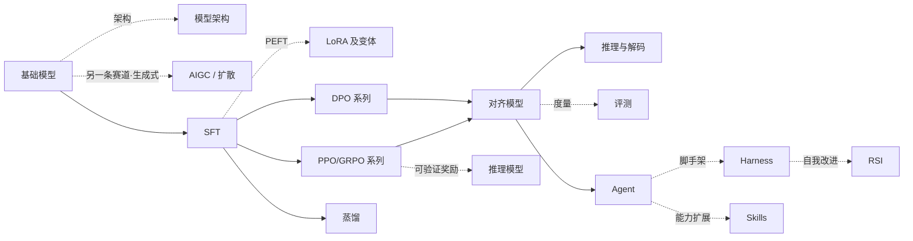

# LLM Atlas <Badge type="tip" text="全景速览" />

**LLM 训练算法知识图谱** —— 这张图是整站的地图：一眼看清各章节怎么串起来、该往哪个方向深入。具体算法的推导、公式、伪代码和调参经验都在各章节页里，点进侧边栏对应条目即可；本站只收**讨论度高、用得最多的出名算法**。

[如何阅读本知识库 →](/guide/) · [符号约定 →](/guide/notation)
