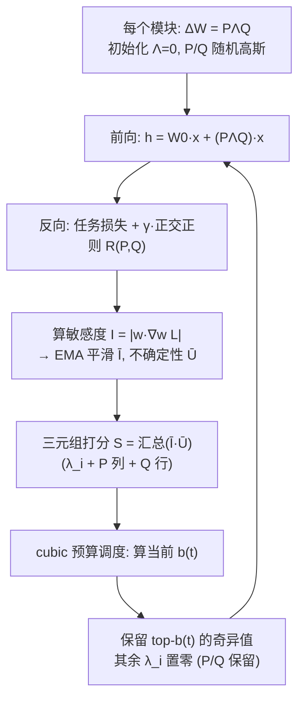

# AdaLoRA（微软 & 佐治亚理工）：按重要性给每个模块自适应分配秩预算

**📄 [AdaLoRA: Adaptive Budget Allocation for Parameter-Efficient Fine-Tuning](https://arxiv.org/abs/2303.10512)**

2023-03 · Georgia Tech & Princeton & Microsoft Azure AI（ICLR 2023） · [代码](https://github.com/QingruZhang/AdaLoRA)

**一句话**：标准 LoRA 给每个被注入的模块发同样大小的秩，AdaLoRA 把增量改写成 SVD 形式 $\Delta W=P\Lambda Q$，让每个奇异方向成为可独立打分、可独立剪掉的最小单元，从而在训练中按"重要性"把有限的秩预算动态匀到最需要的层与矩阵上。

::: details 📖 论文原文 Abstract（英文）
Fine-tuning large pre-trained language models on downstream tasks has become an important paradigm in NLP. However, common practice fine-tunes all of the parameters in a pre-trained model, which becomes prohibitive when a large number of downstream tasks are present. Therefore, many fine-tuning methods are proposed to learn incremental updates of pre-trained weights in a parameter efficient way, e.g., low-rank increments. These methods often evenly distribute the budget of incremental updates across all pre-trained weight matrices, and overlook the varying importance of different weight parameters. As a consequence, the fine-tuning performance is suboptimal. To bridge this gap, we propose **AdaLoRA**, which adaptively allocates the parameter budget among weight matrices according to their importance score. In particular, AdaLoRA parameterizes the incremental updates in the form of *singular value decomposition*. Such a novel approach allows us to effectively prune the singular values of unimportant updates, which is essentially to reduce their parameter budget but circumvent intensive exact SVD computations. We conduct extensive experiments with several pre-trained models on natural language processing, question answering, and natural language generation to validate the effectiveness of AdaLoRA. Results demonstrate that AdaLoRA manifests notable improvement over baselines, especially in the low budget settings. Our code is publicly available at https://github.com/QingruZhang/AdaLoRA.
:::

**相关**：[LoRA](/lora/lora)（前置） · [QLoRA](/lora/qlora) · [rsLoRA](/lora/rslora) · [LoRA+](/lora/lora-plus) · [PiSSA](/lora/pissa) · [DoRA](/lora/dora)


> 图源：Zhang et al., *AdaLoRA: Adaptive Budget Allocation for Parameter-Efficient Fine-Tuning*（arXiv:2303.10512）Figure 1——同等参数预算下，FFN 层与高层比注意力层、底层更"吃"容量（用于学习注解，版权归原作者）。

## 动机与创新点：秩不该平均分——把"分配预算"做成可微、可调度的剪枝

标准 [LoRA](/lora/lora) 在所有被注入的模块上使用**同一个固定的秩 $r$**。这隐含了一个并不成立的假设：每一层、每一种投影矩阵（$q/k/v/o$、FFN 的 $W_{f_1}/W_{f_2}$）对增量容量的需求是均等的。论文用一组对照实验（上方 Figure 1）直接戳破它——在严格固定 0.28M 可训练参数的前提下，只给 FFN 加 LoRA 比只给注意力加效果好得多，只给高层加比只给底层加好得多。作者由此点明：

> "the importance of weight matrices varies significantly across modules and layers when fine-tuning pre-trained models."

给所有模块发同样的额度，等价于一部分模块严重过剩、另一部分却被饿着。一个朴素的补救是"先用大 $r$ 训练、再事后剪枝"，但 LoRA 的增量 $\Delta W = BA$ 是两个矩阵相乘，没有天然的"哪一维更重要"的结构——你无法把 $BA$ 的某些秩单独丢掉而不破坏其余部分。更直接的"对每个 $\Delta$ 算精确 SVD 再截断小奇异值"在大模型上又太贵：复杂度 $O(\min(d_1,d_2)d_1 d_2)$，对海量高维矩阵反复迭代代价不可接受。

AdaLoRA 的破题方式是：**不去算 SVD，而是把增量直接参数化成 SVD 的形状** $\Delta W = P\Lambda Q$，让每个"奇异方向"成为可以独立度量重要性、可以独立剪掉的最小单元，从而把"分配秩预算"变成一个连续、可微、可调度的过程。论文把要回答的问题凝练成一句：

> "How can we allocate the parameter budget adaptively according to importance of modules to improve the performance of parameter-efficient fine-tuning?"

**关键创新**：

- **SVD 形式参数化**：把 $\Delta W=BA$ 换成 $\Delta W=P\Lambda Q$（$\Lambda$ 为对角奇异值），剪枝时只需把奇异值置零、保留奇异向量，既避开昂贵的精确 SVD，又给"误剪后恢复"留了余地。
- **奇异方向 = 可独立增删的最小单元**：每个"秩-1 三元组" $\mathcal G_i=\{P_{*i},\lambda_i,Q_{i*}\}$ 是预算分配的原子，正交正则保证奇异值的"重要性"含义不失真。
- **基于敏感度的重要性打分**：不以奇异值大小论英雄，而用"参数 × 梯度"的敏感度（损失对该参数置零的一阶泰勒估计），再做指数滑动平均 + 不确定性平滑，得到稳健的三元组重要性。
- **全局预算调度器**：训练分"预热 → 三次衰减 → 固定"三段，总预算从略高的初值平滑降到目标值，每隔若干步把全局得分最低的三元组奇异值置零。
- **效果集中在低预算区**：参数预算越紧，AdaLoRA 相对固定秩 LoRA 的优势越明显（指标见「实验结果」）。

## 方法：SVD 参数化 + 重要性感知的秩分配 + 全局预算调度

AdaLoRA 由两块拼成：**(i) SVD-based adaptation**——把增量写成 SVD 形状；**(ii) importance-aware rank allocation**——按新设计的重要性指标迭代剪掉冗余奇异值。下面逐块拆开。

### SVD 形式参数化：把增量写成 $P\Lambda Q$，剪奇异值而非剪 $BA$

每个模块的增量被参数化为类 SVD 的三元组：

$$
W = W^{(0)} + \Delta = W^{(0)} + P\Lambda Q, \qquad \Lambda = \mathrm{diag}(\lambda_1, \dots, \lambda_r)
$$

其中 $P \in \mathbb{R}^{d_1 \times r}$ 近似左奇异向量，$Q \in \mathbb{R}^{r \times d_2}$ 近似右奇异向量，$\Lambda$ 是对角的奇异值矩阵（只需按向量存 $\Lambda\in\mathbb R^r$）。$P$ 的第 $i$ 列、$Q$ 的第 $i$ 行、$\Lambda$ 的第 $i$ 个对角元一起构成一个"秩-1 三元组" $\mathcal G_i=\{P_{*i},\lambda_i,Q_{i*}\}$，**它就是可以被增删的基本单位**。初始化上 $\Lambda$ 置零（保证训练初始 $\Delta=0$），$P$、$Q$ 用随机高斯。

为了让 $P$、$Q$ 真正具有奇异向量的正交性（否则奇异值的"重要性"含义会失真），加一个正交正则：

$$
R(P, Q) = \lVert P^\top P - I \rVert_F^2 + \lVert Q Q^\top - I \rVert_F^2
$$

**为什么不直接对 $BA$ 做"成对剪枝"？** 这是 AdaLoRA 相对"大 $r$ + 事后剪枝"最关键的设计辩护。论文指出，若沿用 $BA$ 并按 doublet（$A$ 的一行、$B$ 的一列）整体置零，有两个毛病：

> "First, when a doublet is measured as unimportant, we have to prune all of its elements. It makes scarcely possible to reactivate the pruned doublets as their entries are all zeroed out and not trained. ... Second, $A$ and $B$ of LoRA are not orthogonal, meaning the doublets can be dependent with each other. Discarding the doublets can incur larger variation from the original matrix than truncating the smallest singular values."

也就是说：(1) doublet 一旦清零就再难复活；(2) $A/B$ 不正交、doublet 互相纠缠，砍掉会让增量剧烈跳变，导致训练不稳、伤害泛化。AdaLoRA 只 **mask 掉奇异值 $\lambda_i$、始终保留奇异向量 $P/Q$**，于是"误剪后还能恢复"，且因正交约束，剪掉小奇异值对原矩阵扰动最小。

> 举例：把 $\Delta W$ 想成一束"方向 + 强度"。LoRA 的成对剪枝是连方向带强度一起拔掉，拔错了方向也没了；AdaLoRA 只是把某个方向的强度调到 0，方向（$P/Q$ 的对应列/行）还在原地，下次它重要起来，强度可以再涨回去。

### 重要性感知的秩分配：用"参数 × 梯度"的敏感度打分

剪哪些三元组？AdaLoRA **不直接用奇异值 $\lambda_i$ 的大小**——数值大不等于对损失贡献大。它对三元组里每个参数 $w_{ij}$ 算"敏感度"，定义为梯度-权重乘积的幅值：

$$
I(w_{ij}) = |w_{ij}\,\nabla_{w_{ij}}\mathcal L|
$$

论文解释 "(8) essentially approximates the change in loss when a parameter is zeroed out"——这正是把该参数置零后损失变化的一阶泰勒估计：移除它影响越大，说明模型对它越敏感、越该留。一个三元组的整体重要性把奇异值、$P$ 对应列、$Q$ 对应行三部分的单元敏感度做平均汇总（除以参数个数，避免大矩阵天然占便宜）：

$$
S_{k,i} = s(\lambda_{k,i}) + \frac{1}{d_1}\sum_{j=1}^{d_1} s(P_{k,ji}) + \frac{1}{d_2}\sum_{j=1}^{d_2} s(Q_{k,ij})
$$

**单步敏感度噪声太大，再加两道平滑。** 论文沿用 Zhang et al. (2022) 的观察——单 mini-batch 上估的 $I(w)$ 方差大、不可靠，于是对它做指数滑动平均得到平滑敏感度 $\bar I^{(t)}$，再用"瞬时值与平滑值之差"刻画不确定性 $\bar U^{(t)}$：

$$
\bar I^{(t)}(w_{ij}) = \beta_1 \bar I^{(t-1)}(w_{ij}) + (1-\beta_1) I^{(t)}(w_{ij})
$$
$$
\bar U^{(t)}(w_{ij}) = \beta_2 \bar U^{(t-1)}(w_{ij}) + (1-\beta_2)\,\bigl|\,I^{(t)}(w_{ij}) - \bar I^{(t)}(w_{ij})\,\bigr|
$$

最终单元打分取两者之积 $s^{(t)}(w_{ij}) = \bar I^{(t)}(w_{ij})\cdot \bar U^{(t)}(w_{ij})$——既看"平均上有多敏感"，也看"这个敏感度有多稳"。论文的消融（Table 4）显示，这套基于敏感度的指标，比"只用 $s(\cdot)=I(\cdot)$"或"直接拿 $S_i=|\lambda_i|$"都更好，差距可达 0.9%。

### 全局预算调度：先宽后窄的三次衰减

把"秩"当成预算来调：定义第 $t$ 步的预算 $b^{(t)}$ 为**所有增量矩阵的奇异值总数**（总秩）。剪枝按下式执行——只保留全局得分进入 top-$b^{(t)}$ 的奇异值，其余置零：

$$
\Lambda_k^{(t+1)} = \mathcal T(\tilde\Lambda_k^{(t)}, S_k^{(t)}), \quad \mathcal T(\cdot)_{ii} = \begin{cases}\tilde\Lambda_{k,ii}^{(t)} & S_{k,i}^{(t)} \text{ 在 } S^{(t)} \text{ 的 top-}b^{(t)} \\ 0 & \text{其他}\end{cases}
$$

总预算随时间走"**先宽后窄**"的三段课程：

1. **预热（$0\le t<t_i$）**：固定在略高的初始预算 $b^{(0)}$（论文取目标 $b^{(T)}$ 的约 1.5 倍），让所有三元组先学一会儿、把空间探索开，避免过早误杀；
2. **三次衰减（$t_i\le t<T-t_f$）**：按 cubic schedule 把总预算从 $b^{(0)}$ 平滑降到目标 $b^{(T)}$，每隔 $\Delta_T$ 步（如 100 步）剪一次、把全局重要性最低的若干奇异值置零；
3. **固定（末段 $t_f$ 步）**：锁定目标预算分布，继续训练到收敛。

$$
b^{(t)} = \begin{cases} b^{(0)} & 0\le t<t_i \\ b^{(T)} + \bigl(b^{(0)}-b^{(T)}\bigr)\Bigl(1-\frac{t-t_i-t_f}{T-t_i-t_f}\Bigr)^3 & t_i\le t<T-t_f \\ b^{(T)} & \text{其他}\end{cases}
$$

"先探索、后聚焦"——`This allows AdaLoRA to explore the parameter space first and then focus on the most important weights later.` 训练目标是任务损失加正交正则 $\mathcal C(\mathcal P,\mathcal E,\mathcal Q) + \gamma\sum_k R(P_k,Q_k)$。注意每隔 $\Delta_T$ 步剪一次（而非每步），是为了让被剪的三元组在两次剪枝之间仍能被更新、保留"未来重新激活"的可能。

下图是 AdaLoRA 在 MNLI 上微调 DeBERTaV3-base 后，各增量矩阵学到的秩分布——和动机实验完全吻合：预算自动涌向 **FFN（$W_{f_1}$）与高层**，而注意力的 $q/k$、底层拿到的秩很少。


> 图源：Zhang et al., *AdaLoRA: Adaptive Budget Allocation for Parameter-Efficient Fine-Tuning*（arXiv:2303.10512）Figure 3——更多预算被自适应分配给 FFN 与高层，验证了重要性打分能引导预算聚焦关键模块（用于学习注解，版权归原作者）。

### 整体流程与实现要点



```python
# 训练步内的伪代码（每个 AdaLoRA 模块）
h = x @ W0.T + (x @ Q.T) @ Lambda @ P.T          # 前向：x P Λ Q
loss = task_loss(h, target) + gamma * ortho_reg(P, Q)   # 正交正则只对 P、Q
loss.backward()

# 敏感度 = |参数 * 梯度|，再做 EMA 平滑 + 不确定性平滑
for w in (P_col_i, Lambda_ii, Q_row_i):
    I_bar = beta1 * I_bar + (1 - beta1) * (w.detach() * w.grad).abs()
    U_bar = beta2 * U_bar + (1 - beta2) * (I_inst - I_bar).abs()
score_i = aggregate(I_bar * U_bar over the i-th triplet)   # 见公式 (7)

# 每 Δ_T 步剪一次：按 cubic schedule 算当前总预算 b(t)，保留得分最高的三元组
budget = cubic_schedule(t, b0, bT, warmup, final)
mask = topk_by_score(scores, k=budget)           # 选出保留的三元组
Lambda.data[~mask] = 0.0                          # 奇异值置零 = 剪枝；P/Q 不动
```

实现层面注意：①正交正则只对 $P$、$Q$ 算，对 $\Lambda$ 不约束；②沿用 LoRA 的 $\alpha/r$ 缩放（$\alpha$ 固定不随 $r$ 调），减少调学习率的麻烦；③每 $\Delta_T$ 步（如 100）剪一次而非每步，给被剪三元组留复活窗口；④初始总预算建议设为目标预算的约 1.5 倍，给剪枝留空间；⑤关键超参：初始预算 $b^{(0)}$、目标预算 $b^{(T)}$、预热步数 $t_i$、固定步数 $t_f$、正交正则系数 $\gamma$（论文从 $\{0.1,0.3,0.5\}$ 选）——预热/收尾步数若设得太短，会因敏感度估计还没稳就开剪而误杀。

## 实验结果：低预算区优势最明显

底座/数据：DeBERTaV3-base（GLUE 自然语言理解、SQuADv1.1/v2.0 问答）与 BART-large（XSum、CNN/DailyMail 摘要生成）。对手是同等可训练参数预算下的 Full FT、BitFit、Houlsby/Pfeiffer Adapter，以及加在全部权重矩阵上的 **generalized LoRA**（$W_q,W_k,W_v,W_o,W_{f_1},W_{f_2}$ 全注入）。所有增益均通过显著性检验（$p<0.05$）。

### GLUE / SQuAD（DeBERTaV3-base）

| 任务 | 预算 | 最优 baseline | LoRA | **AdaLoRA** |
| --- | --- | --- | --- | --- |
| MNLI (m/mm) | 1.27M | 90.33/90.39 | 90.65/90.69 | **90.76/90.79** |
| CoLA (Mcc) | 0.32M | 69.48 | 68.71 | **70.04** |
| RTE (Acc) | 0.32M | 85.56 | 85.56 | **87.36** |
| SQuADv2.0 (EM/F1) | 0.08% | 84.7/87.5 | 84.7/87.5 | **85.6/88.7** |
| SQuADv2.0 (EM/F1) | 0.65% | — | 85.0/88.0 | **86.0/88.9** |

- **极低预算下差距最大**：CoLA 在 0.3M 参数下 AdaLoRA 70.04，高于所有 baseline 用更高预算（0.6M、1.2M）的结果；RTE 在 0.3M 下 87.36，比最强 baseline 高 **1.8%**。
- **SQuADv2.0** 在仅 0.08% 可训练参数下达 88.7 F1，比最优 baseline 高 **1.2% F1**，且接近自己在 4.65% 高预算下的表现。

### 不同预算下 AdaLoRA vs LoRA（Figure 2）


> 图源：Zhang et al., *AdaLoRA: Adaptive Budget Allocation for Parameter-Efficient Fine-Tuning*（arXiv:2303.10512）Figure 2——三个任务、各档预算下 AdaLoRA 一致优于 LoRA，低预算区增益尤其显著（用于学习注解，版权归原作者）。

论文据此总结：在 MNLI/SQuADv2.0 上，AdaLoRA 用 $\le 1\%$ 的低预算就能逼近高预算设置的效果（如 0.16% 预算拿到 88.78 F1，接近 4.65% 预算的 88.89）；NLG（XSum）则受益于更高预算。

### 关键消融

- **vs 对 LoRA 做成对剪枝**（SST-2/RTE/CoLA，Table 4）：AdaLoRA 在所有数据集、所有预算上都胜出——印证"剪奇异值（保留奇异向量、可恢复）优于剪 doublet（清零不可逆、训练不稳）"。
- **两个组件都重要**（Table 5）：只用 SVD 参数化（SVD-LoRA）已胜过 LoRA，但不如完整 AdaLoRA；去掉正交正则（$\gamma=0$）会让性能退化——说明 SVD 参数化与自适应预算分配缺一不可。

> 看榜须知：以上数字均"以原文为准"，且 baseline 口径、预算换算、底座规模、test-time 设置各不相同；不同表的"预算"既有按绝对参数量（M）也有按占比（%）计的。跨设置直接比绝对值意义有限，宜当作"同预算下相对固定秩 LoRA 的增益方向"来读。

## 在 LoRA 谱系里的位置

AdaLoRA 解决的是 LoRA 家族里一个很具体的子问题——**"秩到底该怎么在模块间分配"**，与其他变体关注点基本正交，可对照阅读：

| 维度 | [LoRA](/lora/lora) | AdaLoRA |
| --- | --- | --- |
| 增量参数化 | $\Delta W = BA$ | $\Delta W = P\Lambda Q$（SVD 形式） |
| 秩分配 | 全局固定 $r$ | 按模块/层自适应，训练中动态裁剪 |
| 重要性度量 | 无 | 敏感度（参数×梯度）+ 滑动平均 + 不确定性 |
| 额外正则 | 无 | 正交正则 $R(P,Q)$ |
| 训练复杂度 | 低 | 较高（打分、调度、正交正则） |
| 同预算下效果 | 基线 | 论文报告更优，低预算时差距最明显 |
| 推理 | 可合并，零开销 | 同样可合并为 $W_0 + P\Lambda Q$，零开销 |

- **vs [rsLoRA](/lora/rslora) / [LoRA+](/lora/lora-plus)**：AdaLoRA 管"秩怎么分"，[rsLoRA](/lora/rslora) 管"缩放因子怎么随秩稳定"，[LoRA+](/lora/lora-plus) 管"$A/B$ 学习率怎么配"，三者关注点正交、理论上可叠加，但叠加后调参空间显著变大、需谨慎。
- **vs [PiSSA](/lora/pissa) / [DoRA](/lora/dora)**：PiSSA 也用 SVD，但用途相反——它拿**预训练权重自身的主奇异成分**来初始化 LoRA（一次性、静态），AdaLoRA 则是把**增量**写成 SVD 形并在训练中动态剪枝；DoRA 拆"幅度 + 方向"另辟蹊径。
- **何时值得用**：当**总参数预算被严格卡死**（极端显存受限、或要把 adapter 压到很小）时，AdaLoRA 比固定秩 LoRA 更划算——论文的优势也正集中在低预算区。若预算不紧，工程上往往直接把 LoRA 的 $r$ 调大就能逼近，从而省去打分、调度、正交正则的全部复杂度——这也是 AdaLoRA 在实际工程中使用度不如 [LoRA](/lora/lora)/[QLoRA](/lora/qlora) 的主要原因。
- **训练成本**：因为多了正交正则的 $P^\top P$、$QQ^\top$ 矩阵乘和逐三元组打分，单步开销比 LoRA 高，但相对全量微调仍然很小；推理阶段把 $P\Lambda Q$ 合并回 $W_0$ 后与 LoRA 一样零额外开销。
