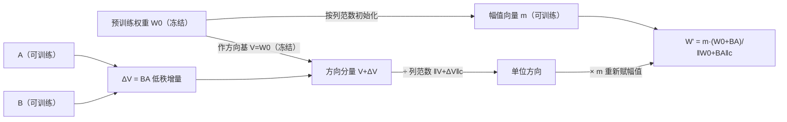

# DoRA（NVIDIA & HKUST）：把权重拆成「幅值 × 方向」，让 LoRA 学得更像全量微调

**📄 [DoRA: Weight-Decomposed Low-Rank Adaptation](https://arxiv.org/abs/2402.09353)**

2024-02 · NVIDIA & HKUST（ICML 2024 Oral） · [代码](https://github.com/NVlabs/DoRA)

**一句话**：先用「权重分解分析」揭示 LoRA 与全量微调（FT）在更新模式上的本质差异，再据此把权重显式拆成**幅值标量**与**方向向量**——幅值用一个可训练向量直接学、方向交给 LoRA 更新，使低秩适配的学习行为更贴近全量微调，且推理可合并、零额外延迟。

::: details 📖 论文原文 Abstract（英文）
Among the widely used parameter-efficient fine-tuning (PEFT) methods, LoRA and its variants have gained considerable popularity because of avoiding additional inference costs. However, there still often exists an accuracy gap between these methods and full fine-tuning (FT). In this work, we first introduce a novel **weight decomposition analysis** to investigate the inherent differences between FT and LoRA. Aiming to resemble the learning capacity of FT from the findings, we propose **Weight-Decomposed Low-Rank Adaptation (DoRA)**. DoRA decomposes the pre-trained weight into two components, *magnitude* and *direction*, for fine-tuning, specifically employing LoRA for directional updates to efficiently minimize the number of trainable parameters. By employing DoRA, we enhance both the learning capacity and training stability of LoRA while avoiding any additional inference overhead. DoRA consistently outperforms LoRA on fine-tuning LLaMA, LLaVA, and VL-BART on various downstream tasks, such as commonsense reasoning, visual instruction tuning, and image/video-text understanding. Code is available at https://github.com/NVlabs/DoRA.
:::

**相关**：[LoRA 家族总览](/lora/) · [LoRA](/lora/lora) · [QLoRA](/lora/qlora) · [LoRA+](/lora/lora-plus) · [PiSSA](/lora/pissa) · [记号表](/guide/notation)


> 图源：Liu et al., *DoRA: Weight-Decomposed Low-Rank Adaptation*（arXiv:2402.09353）Figure 1——DoRA 把权重拆成幅值与方向、只用 LoRA 更新方向分量，训练后可合并（用于学习注解，版权归原作者）。

## 动机与创新点：LoRA 与全量微调的「更新模式」不同，用幅值-方向解耦补回差距

PEFT 的核心矛盾是：LoRA 一类低秩方法不改架构、推理可合并、零额外开销，因此广受欢迎，但**与全量微调之间往往还存在一道精度鸿沟**。社区通常把这道鸿沟归因于「可训练参数太少」，作者指出这是 *without further exploration of other underlying causes*——没有进一步追问更深层的原因。

DoRA 的出发点是一项对**更新模式**的分析。借鉴 Weight Normalization（Salimans & Kingma, 2016）把权重重参数化为幅值与方向的做法，作者把任意权重矩阵的每一列分解成两个量：**幅值**（列的 L2 范数，标量）和**方向**（单位化后的列向量），再观察微调过程中这两者各自变化了多少（$\Delta M$、$\Delta D$，定义见下节）。结论很有意思：

- **全量微调**在幅值变化与方向变化之间呈**负相关**（相关系数 $-0.62$）——可以「只大幅调方向、几乎不动幅值」或反之，更新灵活、解耦；
- **LoRA** 则让幅值和方向**同向、成比例地一起变**（正相关 $+0.83$），缺乏「只做细微方向调整」的能力。

论文据此判断：

> LoRA tends to either increase or decrease the magnitude and direction updates proportionally, but it lacks the nuanced capability for more subtle adjustments ... a feature more characteristic of the FT method.

这种结构性差异被认为是 LoRA 在低秩下逊于 FT 的一个原因。DoRA 的方案直截了当——**把幅值和方向显式拆开训练**：给幅值一个独立的可训练向量，让它不再受低秩分支牵制；方向仍由 LoRA 负责。这样 LoRA 只需专注学方向的低秩增量，幅值获得了 FT 那样的自由度，整体更新模式更贴近全量微调（DoRA 自身的 $\Delta M$-$\Delta D$ 相关系数为 $-0.31$，已翻到负相关一侧、靠近 FT）。

**关键创新**：

- **权重分解分析（Weight Decomposition Analysis）**：提出一套把微调前后权重拆成幅值/方向、量化二者变化的分析工具，首次定量刻画出「FT 负相关、LoRA 正相关」的更新模式差异——是方法设计的实证依据，而非事后解释。
- **幅值-方向解耦的 DoRA**：幅值用可训练向量 $m$ 直接学、方向交给 LoRA 低秩更新；相对 LoRA 只多约 $0.01\%$ 可训练参数（一列一个标量），却把学习能力拉近 FT。
- **梯度分析 + 训练开销削减**：从梯度角度证明该分解能把梯度协方差「拉向单位阵」、利于优化；再用一个 `detach` 技巧把列范数当常数，省下约 $24.4\%$（LLaMA）/ $12.4\%$（VL-BART）训练显存而几乎不掉点。
- **推理零额外延迟**：训练后整个表达式可折叠回单一 dense 权重 $W'$，与 LoRA 一样合并即用，优于 Adapter 类方法。
- **强兼容性**：方向分量的低秩更新可换成任意 LoRA 变体——叠 VeRA 得 DVoRA、叠 QLoRA 4-bit 基座得 QDoRA，按需组合显存与效果。

## 方法：幅值 $m$ × 方向 $V/\lVert V\rVert_c$，方向用 LoRA 低秩更新

### 权重分解分析：怎么量化「幅值变化」与「方向变化」

把权重矩阵 $W \in \mathbb{R}^{d\times k}$ 做幅值-方向分解：

$$
W = m\,\frac{V}{\lVert V\rVert_c} = \lVert W\rVert_c\,\frac{W}{\lVert W\rVert_c}
$$

其中 $m \in \mathbb{R}^{1\times k}$ 是**幅值向量**，$V \in \mathbb{R}^{d\times k}$ 是**方向矩阵**，$\lVert\cdot\rVert_c$ 是**按列**（across each column vector）的 L2 范数。这样 $V/\lVert V\rVert_c$ 的每一列都是单位向量（纯方向），对应的标量 $m$ 给出每列的幅值。

为量化微调带来的变化，作者以 VL-BART（在四个图文任务上微调）为案例，把预训练权重 $W_0$、全量微调权重 $W_{\text{FT}}$、合并后的 LoRA 权重 $W_{\text{LoRA}}$ 都按上式分解，定义第 $t$ 个训练步、第 $n$ 列上的**幅值差**与**方向差**：

$$
\Delta M_{\text{FT}}^{t} = \frac{\sum_{n=1}^{k} \lvert m_{\text{FT}}^{n,t} - m_0^{n}\rvert}{k},\qquad
\Delta D_{\text{FT}}^{t} = \frac{\sum_{n=1}^{k} \bigl(1-\cos(V_{\text{FT}}^{n,t},\,W_0^{n})\bigr)}{k}
$$

$\Delta M$ 量幅值偏移、$\Delta D$ 用余弦距离量方向偏移；LoRA 同理。把若干检查点的 $(\Delta D,\Delta M)$ 散点画出来、拟合回归线，就得到下图——这是整篇论文的实证基石。


> 图源：Liu et al., *DoRA: Weight-Decomposed Low-Rank Adaptation*（arXiv:2402.09353）Figure 2——FT/LoRA/DoRA 的幅值-方向更新模式对比，不同标记为不同训练步、不同颜色为不同层（用于学习注解，版权归原作者）。

作者由此推断：FT 之所以是负斜率，是因为「预训练权重本就含大量适合下游的知识」（*pre-trained weights already possess substantial knowledge*），有足够学习能力时，**只大改幅值或只大改方向其一就够**；LoRA 同变的正斜率，恰说明它做不到这种精细的二选一调整。

> 举例：要把某列权重往下游任务拧一点点方向、但幅值基本不变——FT 能做到（点落在「$\Delta D$ 大、$\Delta M$ 小」区域），LoRA 因为 $\Delta M$、$\Delta D$ 绑定上涨，做这个动作时会被迫连幅值一起放大，反而引入多余扰动。

### DoRA 的前向：幅值向量直接学、方向交给低秩增量

把分析落成方法。回顾 LoRA：$W' = W_0 + \Delta W = W_0 + \underline{BA}$（下划线为可训练参数，$B\in\mathbb{R}^{d\times r}$、$A\in\mathbb{R}^{r\times k}$、秩 $r\ll\min(d,k)$，$B$ 零初始化、$A$ 用 Kaiming 均匀分布，使初始 $\Delta W=0$）。DoRA 则先把 $W_0$ 分解、再**只对方向分量套 LoRA**：

$$
W' = \underline{m}\,\frac{V + \Delta V}{\lVert V + \Delta V\rVert_c}
   = \underline{m}\,\frac{W_0 + \underline{BA}}{\lVert W_0 + \underline{BA}\rVert_c}
$$

逐项理解：

- $m\in\mathbb{R}^{1\times k}$ 是**可训练幅值向量**，**初始化为 $\lVert W_0\rVert_c$**；$V$ 初始化为 $W_0$ 并**冻结**，方向的增量 $\Delta V = BA$ 由 LoRA 学。初始时 $W'=W_0$，与原模型一致（延续 LoRA 的零初始化精神）。
- 分子 $W_0+\Delta W$ 是「更新后的未归一化方向」，除以列范数 $\lVert\cdot\rVert_c$ 把幅值信息剥掉、只留纯方向，再乘独立学习的 $m$ 重新赋幅值——于是**方向由低秩 $BA$ 控制、幅值由 $m$ 单独控制，两者解耦**。
- 与 Weight Normalization 的关键区别在训练方式：WN 把幅值/方向**从零训起**、对初始化敏感；DoRA 两个分量都**从预训练权重出发**，绕开了初始化难题（*DoRA avoids such initialization concerns since both components begin with pre-trained weights*）。

$m$ 引入的参数极少——按列只有一个标量，相对 LoRA 约 **$+0.01\%$** 可训练参数。训练完后整个表达式可折叠回一个 dense 权重 $W'$，**推理与 LoRA 一样零额外延迟**。



### 梯度分析与训练开销削减

作者从梯度角度解释「为什么这个分解利于优化」。对 $V' = V+\Delta V$ 与 $m$ 求 Loss $\mathcal L$ 的梯度：

$$
\nabla_{V'}\mathcal L = \frac{m}{\lVert V'\rVert_c}\Bigl(I - \frac{V'V'^{\mathsf T}}{\lVert V'\rVert_c^2}\Bigr)\nabla_{W'}\mathcal L,
\qquad
\nabla_{m}\mathcal L = \frac{\nabla_{W'}\mathcal L\cdot V'}{\lVert V'\rVert_c}
$$

第一式说明：权重梯度 $\nabla_{W'}\mathcal L$ 被缩放了 $m/\lVert V'\rVert_c$、又被投影到「远离当前权重方向」的子空间（那个 $I - V'V'^{\mathsf T}/\lVert V'\rVert_c^2$ 投影项）。这两点合起来把**梯度的协方差矩阵拉得更接近单位阵**，对优化有利——这正是 Weight Normalization 改善条件数的同款收益，而 DoRA 把它**整体转嫁给了 $\Delta V$**（因 $V'=V+\Delta V$，有 $\nabla_{V'}\mathcal L = \nabla_{\Delta V}\mathcal L$），从而提升 LoRA 的训练稳定性。

**训练开销削减（detach 技巧）**：$W'$ 里多出的列范数项 $\lVert V+\Delta V\rVert_c$ 在反传时会撑大梯度计算图、吃额外显存。作者提出把它**当常数 detach 掉**（不回传范数项的二阶梯度），梯度改写为：

$$
\nabla_{V'}\mathcal L = \frac{m}{C}\,\nabla_{W'}\mathcal L,\quad C=\lVert V'\rVert_c\ (\text{视作常量})
$$

消融显示这能省下约 **$24.4\%$（LLaMA）/ $12.4\%$（VL-BART）训练显存**，而对精度影响可忽略（VL-BART 上差异仅 $0.2$、LLaMA 上几乎不变）。后续所有实验都默认开启该优化。

### 实现要点

```python
import torch, torch.nn as nn, torch.nn.functional as F

class DoRALinear(nn.Module):
    def __init__(self, base: nn.Linear, r=8, alpha=16):
        super().__init__()
        self.base = base                       # 冻结 W0
        for p in self.base.parameters():
            p.requires_grad = False
        d_out, d_in = base.weight.shape
        self.A = nn.Parameter(torch.randn(r, d_in) * (1 / r ** 0.5))
        self.B = nn.Parameter(torch.zeros(d_out, r))
        self.scaling = alpha / r
        # m 初始化为 W0 的按列范数
        self.m = nn.Parameter(base.weight.norm(p=2, dim=0, keepdim=True))

    def forward(self, x):
        W = self.base.weight + self.scaling * (self.B @ self.A)   # W0 + ΔW
        col_norm = W.norm(p=2, dim=0, keepdim=True).detach()      # 列范数, detach 省显存
        W_dora = self.m * (W / col_norm)                          # 重新赋幅值
        return F.linear(x, W_dora)
```

- **范数沿哪一维**：按「列」（PEFT 实现里以输出维为单位）求范数并归一化，对应论文的 $\lVert\cdot\rVert_c$。
- **`detach` 列范数**：即上文的开销削减技巧，实测掉点可忽略而省显存，PEFT 实现可开启。
- **学习率**：DoRA 不强制对 $m$ 单设 lr，沿用 LoRA 的 lr 即可；也可与 [LoRA+](/lora/lora-plus) 的分组 lr 思想结合。
- **可量化**：DoRA 可叠在 [QLoRA](/lora/qlora) 的 4-bit 基座上（QDoRA），兼顾显存与效果。

### 微调粒度：只更新部分模块的方向，参数更省

Figure 2 显示「方向变化大、幅值变化相对小」，而方向分量占了绝大多数可训练参数。作者据此问：能不能**只对部分模块更新方向、其余只调幅值**？答案是可以——不必像 LoRA 那样对多头注意力与 MLP 层全都更新。Table 6 给出一个甜点配置：**对 QKV 模块同时更新方向+幅值、对其余层只更新幅值**，DoRA 就能在 **LLaMA-7B 上超 LoRA 2.8%、LLaMA-13B 上超 0.8%**，而可训练参数**不到 LoRA 的一半**。

> 举例：把一个 LoRA-7B 配置（QKV+MLP 全上低秩）换成「QKV 走完整 DoRA、MLP 只学幅值标量」，参数量近乎砍半，反而更准——方向自由度集中在最关键的注意力投影上，其余层靠廉价的幅值缩放即可。

## 实验结果：四类任务全面超 LoRA，低秩下差距尤其大

### 常识推理（Table 1，以原文为准）

8 个常识推理子任务，遵循 LoRA 原配置、仅调学习率（DoRA 比 LoRA 多 $0.01\%$ 参数）。DoRA 在四个底座上全面超过 LoRA，且 **DoRA†（把秩减半的精简版）** 往往也已超过满秩 LoRA：

| 底座 | 方法 | 可训练参数 % | 平均准确率 |
| --- | --- | --- | --- |
| LLaMA-7B | LoRA | 0.83 | 74.7 |
| LLaMA-7B | DoRA†（半秩） | 0.43 | 77.5 |
| LLaMA-7B | **DoRA** | 0.84 | **78.4**（+3.7） |
| LLaMA-13B | LoRA | 0.67 | 80.5 |
| LLaMA-13B | **DoRA** | 0.68 | **81.5**（+1.0） |
| LLaMA2-7B | LoRA | 0.83 | 77.6 |
| LLaMA2-7B | **DoRA** | 0.84 | **79.7**（+2.1） |
| LLaMA3-8B | LoRA | 0.70 | 80.8 |
| LLaMA3-8B | **DoRA** | 0.71 | **85.2**（+4.4） |

LLaMA-7B 上 DoRA（78.4）甚至超过 zero-shot CoT 的 ChatGPT（77.0）。

### 多模态与指令微调（Table 2–5）

- **图/视频-文本理解（VL-BART）**：DoRA 在图文四任务上平均 **+0.9**、视频文四任务上 **+1.9** 超 LoRA，且图文上逼近全量微调水平。
- **视觉指令微调（LLaVA-1.5-7B）**：DoRA **67.6** > LoRA 66.9 > FT 66.5——此处 FT 反而略逊（疑似过拟合），DoRA 仍稳居最优。
- **指令微调 MT-Bench（GPT-4 评分）**：LLaMA-7B DoRA **5.5** vs LoRA 5.1；叠到 VeRA 上得 **DVoRA**，用 $0.04\%$ 参数追平甚至超过 LoRA。

### 秩的鲁棒性（Figure 5）：低秩下 DoRA 优势悬殊


> 图源：Liu et al., *DoRA: Weight-Decomposed Low-Rank Adaptation*（arXiv:2402.09353）Figure 5——不同秩下 LoRA 与 DoRA 的平均准确率，DoRA 在低秩区间优势悬殊（用于学习注解，版权归原作者）。

这是 DoRA 最亮眼的结果之一：**秩越小、差距越大**。$r=8$ 时 LoRA 平均准确率跌到 $40.74$、$r=4$ 跌到 $39.49$，而 DoRA 仍有 $77.96$（$r=8$）/ $61.89$（$r=4$）——参数预算越紧，幅值-方向解耦补回的能力越关键。秩很大时两者收敛。

### QDoRA：在 QLoRA 上再下一城

把 DoRA 叠到 QLoRA 的 4-bit 基座得 **QDoRA**（配 FSDP 支持多卡）。在 Orca-Math 上微调 LLaMA2-7B / LLaMA3-8B，QDoRA 不仅显著超过 QLoRA（**+0.19 / +0.23**），还**略胜全量微调**，同时显存远低于 FT——把 LoRA 的参数效率与 DoRA 的细粒度优化结合，进一步压低了大模型微调的 GPU 门槛。

> 看榜须知：上述分数的口径、底座、数据集、超参各异（多数遵循 LoRA 原配置仅调学习率），跨设置直接比绝对值意义有限，应作为「同设置下 DoRA 相对 LoRA 的增量」来读。

## 在 LoRA 家族谱系里的位置

| 维度 | LoRA | DoRA |
| --- | --- | --- |
| 额外可训练参数 | $BA$ | $BA + m$（幅值向量，约 +0.01%） |
| 训练开销 | 低 | 略高（列范数标准化及其梯度；可用 detach 把额外显存压到近 LoRA） |
| 更新模式 | 幅值与方向成比例同变（正相关 +0.83） | 幅值、方向解耦，近似 FT（负相关 −0.31） |
| 低秩（$r$ 小）下效果 | 基线，$r=4/8$ 时明显退化 | $r=4/8$ 仍稳健，差距 +22~37% |
| 推理延迟 | 合并后无 | 合并后无 |

- **vs [LoRA](/lora/lora)**：DoRA 是 LoRA 的「即插即用增强」——$r$、$\alpha$、目标模块、学习率设法基本一致，迁移成本低；直接把现有 LoRA 配置换成 DoRA 通常即可获提升，尤其在低秩、参数预算紧（$r=4\sim16$）时收益最大，秩很大时两者趋同。
- **vs Weight Normalization**：DoRA 的分解形式借鉴自 WN，但 WN 把幅值/方向**从零训起**、对初始化敏感；DoRA 两分量都从预训练权重出发，绕开初始化问题，且只把幅值设可训练、方向交给低秩增量。
- **vs [PiSSA](/lora/pissa)**：两者都瞄准「逼近全量微调」，但路线相反——PiSSA 改**初始化**（用 $W_0$ 的主奇异分量初始化低秩分支），DoRA 改**结构**（拆幅值/方向）。二者正交，可按任务分别尝试甚至组合。
- **vs [LoRA+](/lora/lora-plus)**：LoRA+ 调的是 $A/B$ 的**学习率比例**，DoRA 调的是**参数化结构**；DoRA 的 $m$ 也可套 LoRA+ 的分组 lr 思想。
- **vs VeRA / QLoRA（兼容而非竞争）**：DoRA 对方向分量的低秩更新可换成任意 LoRA 变体——叠 VeRA 得 **DVoRA**（$0.04\%$ 参数追平 LoRA）、叠 QLoRA 得 **QDoRA**（4-bit 基座上超 QLoRA、逼近 FT）。DoRA 因此更像家族里的一层「正交增强」，而非又一个并列基线。

更多家族成员与演进脉络见 [LoRA 家族总览](/lora/)。
