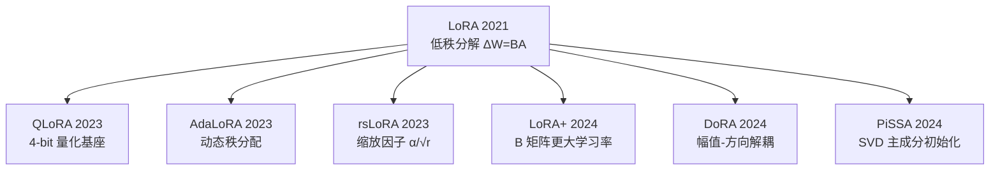

# LoRA 及变体总览

> **一句话**：LoRA 用低秩矩阵近似权重更新，把可训练参数压到 1% 以下；各变体围绕「初始化、缩放、量化、秩分配」继续改进。

::: warning 状态
🚧 本页为占位大纲，正文尚未撰写。
:::

## 家族演化图

## 变体对比

| 方法 | 核心改动 | 额外开销 | 论文 |
| --- | --- | --- | --- |
| [LoRA](/lora/lora) | $\Delta W = BA$ 低秩分解 | — | 2021 |
| [QLoRA](/lora/qlora) | 基座 NF4 量化 + LoRA | TODO | 2023 |
| [AdaLoRA](/lora/adalora) | 按重要性动态分配秩 | TODO | 2023 |
| [rsLoRA](/lora/rslora) | 缩放因子改为 $\alpha/\sqrt{r}$ | 无 | 2023 |
| [LoRA+](/lora/lora-plus) | $B$ 用更大学习率 | 无 | 2024 |
| [DoRA](/lora/dora) | 幅值与方向解耦更新 | TODO | 2024 |
| [PiSSA](/lora/pissa) | 用 $W_0$ 的主奇异成分初始化 | TODO | 2024 |

## TODO

- [ ] 选型决策树：显存受限选什么、追效果选什么
- [ ] 共同超参：rank $r$、$\alpha$、目标模块、dropout
- [ ] LoRA vs 全量微调的效果差距综述
