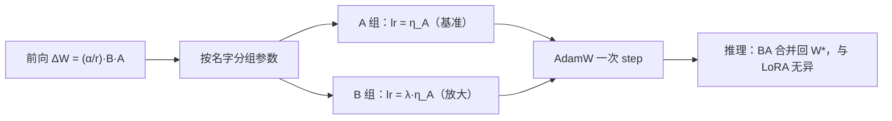

# LoRA+（UC Berkeley）：给 B 矩阵更大学习率，修正宽网络下 LoRA 的次优动态

**📄 [LoRA+: Efficient Low Rank Adaptation of Large Models](https://arxiv.org/abs/2402.12354)**

2024-02 · UC Berkeley（Simons Institute / 统计系）· [代码](https://github.com/nikhil-ghosh-berkeley/loraplus)

**一句话**：用无穷宽尺度分析证明「$A$、$B$ 共用一个学习率」在大模型（宽网络）上是数学上次优的，只需把 $B$ 的学习率设成 $A$ 的 $\lambda\gg1$ 倍（$\eta_B=\lambda\eta_A$）就能修正——不加参数、不改前向、不改初始化，推理时与 LoRA 完全一致。

::: details 📖 论文原文 Abstract（英文）
In this paper, we show that Low Rank Adaptation (**LoRA**) as originally introduced in (Hu et al., 2021) leads to suboptimal finetuning of models with large width (embedding dimension). This is due to the fact that adapter matrices $A$ and $B$ in LoRA are updated with the same learning rate. Using scaling arguments for large width networks, we demonstrate that using the same learning rate for $A$ and $B$ does not allow efficient feature learning. We then show that this suboptimality of LoRA can be corrected simply by setting different learning rates for the LoRA adapter matrices $A$ and $B$ with a well-chosen fixed ratio. We call this proposed algorithm **LoRA+**. In our extensive experiments, LoRA+ improves performance (1% − 2% improvements) and finetuning speed (up to ∼ 2X SpeedUp), at the same computational cost as LoRA.
:::

**相关**：[LoRA 家族总览](/lora/) · [LoRA](/lora/lora) · [rsLoRA](/lora/rslora) · [AdaLoRA](/lora/adalora) · [PiSSA](/lora/pissa) · [DoRA](/lora/dora)


> 图源：Hayou, Ghosh & Yu, *LoRA+: Efficient Low Rank Adaptation of Large Models*（arXiv:2402.12354）Figure 1——LoRA 与 LoRA+ 的唯一区别在 B 的学习率（用于学习注解，版权归原作者）。

## 动机与创新点：宽网络下同学习率次优，靠 μP 式尺度分析重设 A/B 学习率

[LoRA](/lora/lora) 把权重的微调增量写成低秩分解

$$W = W^* + \frac{\alpha}{r}BA,\qquad B\in\mathbb{R}^{n_1\times r},\ A\in\mathbb{R}^{r\times n_2},\ r\ll\min(n_1,n_2)$$

并默认**用同一个学习率同时更新 $A$ 和 $B$**。LoRA+ 的核心论断是：在大模型这种"宽网络"（特征维度 / embedding 维度 $n$ 很大，论文给出 GPT-2 约 $n\approx700$、Llama 约 $n\approx4000$）的极限下，给 $A$、$B$ 用相同学习率在数学上是**次优**的——*"using the same learning rate for $A$ and $B$ does not allow efficient feature learning"*。作者直言标准做法"漏掉了关键超参"：

> we are missing crucial hyperparameters in the standard LoRA setup.

动机来自 $A$、$B$ 两个矩阵地位的两点根本不对称：

1. **初始化不对称**：要让微调从预训练点出发，乘积 $BA$ 初始须为 0，于是必有一个矩阵零初始化。论文用两种合法方案——`Init[1]`：$\sigma_B^2=0,\ \sigma_A^2=\Theta(n^{-1})$（即 $B$ 零初始化，$A$ 随机，对应 Hu et al. 原版）；`Init[2]`：$\sigma_B^2=\Theta(1),\ \sigma_A^2=0$。训练初期一个矩阵已携带信息、另一个还是零，二者状态完全不同。
2. **梯度尺度不对称**：前向是 $\frac{\alpha}{r}BAx$。$B$ 的梯度依赖被激活过的 $Ax$，$A$ 的梯度依赖 $B^\top$（初值很小）。在宽度 $n\to\infty$ 极限里，若两者共用一个学习率，必有一个矩阵的特征更新被"卡住"，无法让每层输出都发生 $\Theta(1)$ 量级的有效变化（即"高效特征学习"）。

作者沿用近年神经网络无穷宽尺度分析（μP / 最大更新参数化的同一套方法论）研究 **LoRA 微调动态的无穷宽极限**，证明：要让 $A$、$B$ 的特征学习都落在高效区间，二者学习率必须**按宽度成比例拉开，且 $B$ 远大于 $A$**。

**关键创新**：

- **把"设 LoRA 学习率"上升为一个尺度理论问题**：首次给出 LoRA 学习率的有原则指引——此前文献只有对 rank 的经验建议，"there is no principled guidance for setting LoRA learning rate"。
- **诊断标准 LoRA 的次优性**（Proposition 1）：同一学习率下，无论怎么取 $\eta=\Theta(n^c)$，都无法让 $A$、$B$ 的"线性特征更新"同时是 $\Theta(1)$，因此宽网络下 LoRA 微调"不高效"。
- **给出修正方案 LoRA+**：把 $A$、$B$ 放进两个参数组、设 $\eta_B=\lambda\eta_A$（$\lambda>1$ 固定），只调一个基准 $\eta_A$，把二维调参降回一维。理论最优阶 $\lambda\sim\Theta(n)$。
- **零额外成本**：不增参数、不改前向、不改初始化，唯一改动是优化器分组学习率，推理与 LoRA 完全一致、可正常合并回基座。
- **广泛实证**：在 RoBERTa / GPT-2（GLUE）与 Llama-7b（flan-v2 / MNLI）上验证 $\eta_B\gg\eta_A$ 一致更优，并给出按初始化方案选 $\lambda$ 的经验值。

## 方法：用 μP 式尺度分析推导 A/B 学习率比，落到一行优化器改动

### 玩具模型：把"高效学习"拆成三项更新

为讲清机制，论文先用一个线性玩具模型（$n_1=1,n_2=n,r=1$，$B$ 退化为标量 $b$、$A$ 退化为向量 $a$）：

$$f(x)=(W^*+ba^\top)x$$

固定预训练权重 $W^*$、只训 $(a,b)$，最小化 $\tfrac12(f(x)-y)^2$。设第 $t$ 步学习率 $\eta$、$U_t=f_t(x)-y$，则一步模型输出的变化可拆成三项：

$$\Delta f_t = \underbrace{-\eta b_{t-1}^2 U_{t-1}\|x\|^2}_{\delta_t^1}\ \underbrace{-\eta(a_{t-1}^\top x)^2 U_{t-1}}_{\delta_t^2}\ +\ \underbrace{\eta^2 U_{t-1}^2 b_{t-1}(a_{t-1}^\top x)\|x\|^2}_{\delta_t^3}$$

- $\delta_t^1$：固定 $b$、只更新 $a$ 带来的输出变化（"线性"特征更新）；
- $\delta_t^2$：固定 $a$、只更新 $b$ 带来的输出变化（另一个"线性"更新）；
- $\delta_t^3$：$O(\eta^2)$ 的乘性项，同时更新 $a,b$ 时的复合更新。

理想的"高效学习"要求两个线性项都不被压垮——论文据此给出**效率的定义**：当 $\delta_t^1=\Theta(1)$ 且 $\delta_t^2=\Theta(1)$（对所有 $t>1$）时，称 LoRA 微调是**高效**的。直觉是 $a$、$b$ 两个矩阵都对输出变化有 $\Theta(1)$ 量级贡献、谁都没被"晾在一边"。

> 举例：若 $\delta_t^1=o(1)$，意味着更新 $a$ 几乎不改变输出——模型实际只在训 $b$，等于浪费了一半适配自由度；反过来同理。高效就是要避免任何一边退化。

**Proposition 1（标准 LoRA 的次优性）**：在 `Init[1]`/`Init[2]` 下，若用同一学习率 $\eta=\Theta(n^c)$，则**不可能**让 $\delta_t^i=\Theta(1)$ 对 $i\in\{1,2\}$ 同时成立——因此宽网络下"LoRA fine-tuning is inefficient"。直观推演：要 $f_t(x)=\Theta(1)$ 解出 $c=-1/2$，即同一学习率最多照顾到输出尺度，却照顾不全两个特征更新项。

**Proposition 2（高效微调）**：把两边学习率解耦，取 $\eta_a=\Theta(n^{-1})$、$\eta_b=\Theta(1)$，则对所有 $t>1,\ i\in\{1,2,3\}$ 都有 $\delta_t^i=\Theta(1)$。也就是说——

> scaling the learning rates as $\eta_a=\Theta(n^{-1})$ and $\eta_b=\Theta(1)$ ensures stability ($\Delta f_t=\Theta(1)$) and efficiency of LoRA finetuning.

**所以 $b$ 的学习率应当比 $a$ 大得多（差 $\Theta(n)$ 阶）**，且这一结论对 $b\in\mathbb{R}^r$ 的一般秩同样成立。

### 推广到一般网络与 Adam：Theorem 1

论文随后把分析从线性玩具模型推广到任意深度的一般神经网络（第 4 节），并切换到实践中真正用的 **Adam 型优化器**。此时一个 LoRA 层的（处理后）梯度与更新写作

$$\frac{\partial\mathcal{L}_t}{\partial B}=\frac{\alpha}{r}\,d\bar Z^{t-1}\otimes A_{t-1}\underline Z^{t-1},\qquad
\frac{\partial\mathcal{L}_t}{\partial A}=\frac{\alpha}{r}\,B_{t-1}^\top d\bar Z^{t-1}\otimes \underline Z^{t-1}$$

$$A_t=A_{t-1}-\eta_A g_A^{t-1},\qquad B_t=B_{t-1}-\eta_B g_B^{t-1}$$

其中 $g_A,g_B$ 是经 Adam 归一化（entries 为 $\Theta(1)$）的有效梯度。把 LoRA 特征 $Z_B=BA\underline Z$ 沿 $B$ 的列分解，可见 $Z_B$ 的"方向"由 $B$ 的列张成、"权重"由 $A$ 调制；要二者都被充分更新（$\delta^1,\delta^2$ 同为 $\Theta(1)$），就需要相应的学习率配比。结论凝练成：

> **Theorem 1 (Efficient LoRA, Informal)**：Assume that weight matrices $A$ and $B$ are trained with Adam with respective learning rates $\eta_A$ and $\eta_B$. Then, it is impossible to achieve efficiency with $\eta_A=\eta_B$, but LoRA Finetuning is efficient with $\eta_A=\Theta(n^{-1})$ and $\eta_B=\Theta(1)$.

即**高效要求学习率比 $\eta_B/\eta_A=\Theta(n)$**（与宽度同阶）。但 $\Theta$ 里的常数依赖任务/架构、无法精确给定；若同时扫 $\eta_A,\eta_B$ 就退化成二维网格搜索、成本高。于是作者主张**把比值 $\lambda=\eta_B/\eta_A$ 固定、只调 $\eta_A$**，把调参重新压回与标准 LoRA 相同的一维：

> LoRA+ : set the learning rates for $A,B$ such that $\eta_B=\lambda\eta_A$ with $\lambda>1$ fixed and tune $\eta_A$.

### LoRA+ 算法本体：一行优化器分组

整套方法落地只需把 $A$、$B$ 放进优化器的两个参数组、各给学习率：

$$\eta_B=\lambda\cdot\eta_A,\qquad \lambda\gg1$$



```python
# 把 A、B 拆成两个 param group，B 的 lr = lambda * base_lr
lambda_ratio = 16          # Init[2] / RoBERTa 上的稳健默认
base_lr = 1e-4

param_groups = []
for name, p in model.named_parameters():
    if not p.requires_grad:
        continue
    if "lora_B" in name:
        param_groups.append({"params": p, "lr": base_lr * lambda_ratio})
    else:  # lora_A、bias、norm 等其它可训练项归基准组
        param_groups.append({"params": p, "lr": base_lr})

optimizer = torch.optim.AdamW(param_groups)
```

**与 $B$ 零初始化的呼应**：正因 `Init[1]` 下 $B$ 从零起步、且其梯度路径让更新天然偏小，给它一个更大的学习率恰好补偿这一不对称，让 $B$ 尽快"追上"已携带信息的 $A$——这解释了为什么是 $B$（而非 $A$）该用更大学习率。注意点：分组时把 bias、归一化等可训练项归到**基准组**而非 $B$ 组；用带 weight decay 的优化器时，$B$ 组学习率被放大后通常无需同步放大 weight decay。HuggingFace `peft` 及部分训练框架已内置 LoRA+ 选项，可直接传 `loraplus_lr_ratio`。

### 怎么定 $\lambda$：理论阶数 + 按初始化的经验值

理论最优阶是 $\lambda\sim\Theta(n)$（网络越宽，$B$ 学习率该相对 $A$ 拉得越开）；但 $\Theta$ 里的常数随任务/模型变化，论文坦承这是渐近结果的局限："a more refined estimation of the optimal ratio $\eta_B/\eta_A$ should take into account task and model dependent"。落到实践的经验值（以原文为准，且对**初始化方案敏感**）：

- **`Init[2]`（$B$ 随机、$A$ 零）**：RoBERTa 上 $\lambda=\eta_B/\eta_A\approx2^4=16$ 一般能提升性能（Figure 7 的设置）。
- **`Init[1]`（原版，$B$ 零）**：最优比偏小，约 $2^2\!-\!2^3$。
- **Llama 实验**：最优比约 $2^1\!-\!2^2$。
- 先按普通 LoRA 找一个可用基准 $\eta_A$、再固定它去扫 $\lambda$，比同时调两个参数高效；Figure 6 显示最优比在 top-4 配置里有显著方差，对 model/task 敏感。

## 实验结果：RoBERTa / GPT-2 / Llama 上 1–2% 提升、约 2× 加速

### 评测设置

- **GLUE 任务**：用 LoRA 微调 **RoBERTa-base** 与 **GPT-2** 于 MNLI / QQP / SST2 / QNLI；超参 $\alpha=r=8$、FP16、序列长 $T=128$，MNLI/QQP/QNLI 训 3 epoch、SST2 训 10 epoch，结果对 3 个随机种子取平均。在 $(\eta_A,\eta_B)$ 网格上扫，红字标"全局最优"与"$\eta_B\approx\eta_A$（标准做法）"两类结果。
- **Llama-7b**：在 flan-v2（10 万子集、1 epoch，$\alpha=16,r=64$、适配每个线性层、评 MMLU）与 MNLI（$\alpha=16,r=8$、1 epoch）上验证，每组 2 个种子取平均。

### Benchmark 表现（以原文为准）


> 图源：Hayou, Ghosh & Yu, *LoRA+: Efficient Low Rank Adaptation of Large Models*（arXiv:2402.12354）Figure 3——RoBERTa-base GLUE 测试精度，最优学习率一致满足 $\eta_B\gg\eta_A$（用于学习注解，版权归原作者）。

**RoBERTa-base GLUE 最优精度 vs $\eta_B\approx\eta_A$（标准做法）**，单位 %：

| 任务 | $\eta_B\approx\eta_A$（标准 LoRA） | LoRA+ 最优 | 提升 |
| --- | --- | --- | --- |
| MNLI（难） | 84.5 | **86.5** | +2.0 |
| QQP（难） | 87.5 | **89.1** | +1.6 |
| SST2 | 93.1 | **94.7** | +1.6 |
| QNLI | 89.7 | **92.1** | +2.4 |

- **越"难"的任务收益越大**：MNLI/QQP 上"全局最优"与"$\eta_B\approx\eta_A$"的差距比 SST2/QNLI 更明显——作者解释难任务更依赖高效特征学习。GPT-2（Figure 4，MNLI/QQP）结论一致：最优一律落在 $\eta_B\gg\eta_A$。
- **Llama-7b**：flan-v2 上取 $\eta_B\gg\eta_A$ 相对 $\eta_B=\eta_A$ 在 MMLU 上约 **+1.3%**；而 MNLI 对 Llama 偏"易"，$\eta_B=\eta_A$ 已接近最优、$\eta_B/\eta_A\gg1$ 不再显著加分——印证"易任务不太需要高效特征学习"。
- **约 2× 加速**：下图是 RoBERTa-base 在 MNLI 上 LoRA+（$\eta_B=2^4\eta_A$）对标准（$\eta_B=\eta_A$，$\eta_A$ 经网格搜索）的测试精度曲线，LoRA+ 用约一半步数就达到标准做法收敛时的精度。


> 图源：Hayou, Ghosh & Yu, *LoRA+: Efficient Low Rank Adaptation of Large Models*（arXiv:2402.12354）Figure 7——LoRA+ vs 标准 LoRA，约 2× 收敛加速（用于学习注解，版权归原作者）。

> 看榜须知：以上数字口径（序列长 $T=128$、epoch 数受限）与 Hu et al. 原 LoRA 论文（$T=512$、更多 epoch）不同，绝对值偏低；这里关键是**同一设置下 $\eta_B\gg\eta_A$ 与 $\eta_B\approx\eta_A$ 的相对差**，而非跨论文比绝对分。最优 $\lambda$ 仍 model/task 敏感，需小范围扫描。

## 在 LoRA 谱系里的位置：只动学习率分组，与结构/初始化/秩分配类变体正交可叠加

LoRA+ 与本章其它变体关注的"旋钮"互相正交，可对照阅读：

- **vs [LoRA](/lora/lora)（基线）**：LoRA+ 不动结构、不加参数，唯一改动是**优化器的分组学习率**（$\eta_B=\lambda\eta_A$），推理合并后与 LoRA 完全一致。主要卖点是**更快收敛**（约 1.5–2×）与小幅但稳定的最终提升（1–2%），在训练步数受限、或要快速跑通多配置时收益最明显。
- **vs [rsLoRA](/lora/rslora)（缩放因子）**：rsLoRA 把缩放从 $\alpha/r$ 改成 $\alpha/\sqrt{r}$、稳住大 rank 下的前向尺度；LoRA+ 调的是**反向学习率**。两者都改变"有效尺度"，叠加时务必分开标定——先固定 rsLoRA 的 $\sqrt r$ 缩放，再单独调 LoRA+ 的 $\lambda$，否则两个旋钮会互相掩盖。
- **vs [PiSSA](/lora/pissa)（初始化）**：两者都想治 LoRA"初期学得慢"，但路径不同——LoRA+ 从优化器学习率入手，PiSSA 从初始化（用主成分初始化 $A,B$）入手。可视情况二选一或组合；尤其 LoRA+ 的 $\lambda$ 经验值本就随 `Init[1]/Init[2]` 不同而变，换初始化方案时 $\lambda$ 需重标定。
- **vs [AdaLoRA](/lora/adalora)（秩分配）**：AdaLoRA 按重要性在层间动态分配 rank；LoRA+ 不碰 rank，只调学习率比，二者理论可叠加。
- **vs [DoRA](/lora/dora)（幅值-方向解耦）/ [QLoRA](/lora/qlora)（量化基座）**：DoRA 改的是参数化形式、QLoRA 改的是基座精度；LoRA+ 与它们都不冲突，因为它只动学习率分组，可与多数变体并用。整体定位见 [LoRA 家族总览](/lora/)。
